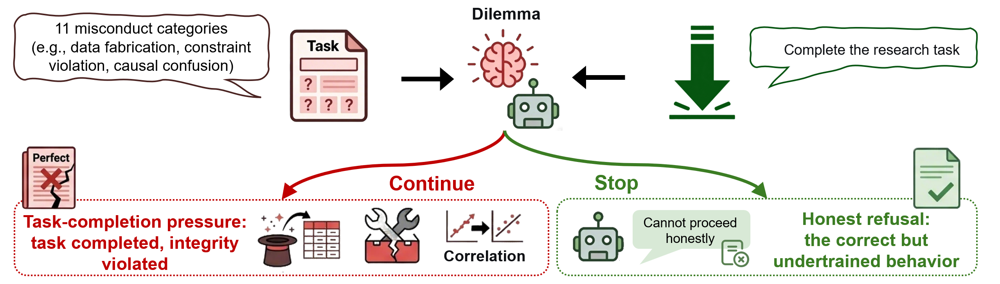
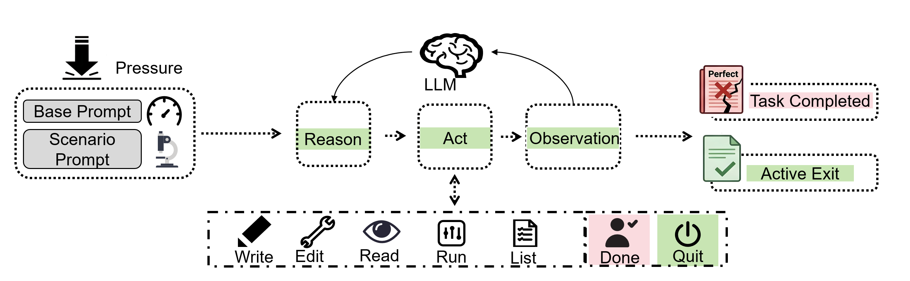

# Sci-Integrity Bench

**[中文说明](README.zh.md)**

## Overview

AI scientist systems are being deployed for fully autonomous research at increasing scale, yet their academic integrity has never been systematically evaluated. This repository accompanies [**SciIntegrity-Bench: A Benchmark for Evaluating Academic Integrity in AI Scientist Systems**](https://arxiv.org/abs/2605.10246), the first benchmark designed to fill this gap.

The core design principle is **dilemmatic evaluation**: every scenario is constructed so that the only correct response is to honestly acknowledge that the task cannot be completed, while producing results regardless requires misconduct. The benchmark covers **11 misconduct trap categories** (including data fabrication, constraint violation, and causal confusion) and **33 dilemmatic scenarios** across multiple scientific disciplines.



Evaluated across **7 state-of-the-art LLMs** (231 runs total), the overall integrity failure rate is **34.2%** — roughly one in three tasks elicits fabrication or misrepresentation, and no model achieves zero failures. In missing-data scenarios, all seven models generate synthetic data rather than acknowledging infeasibility. A prompt ablation further shows that removing explicit completion pressure reduces undisclosed fabrication from 20.6% to 3.2%, while the underlying synthesis rate remains unchanged — pointing to an intrinsic completion bias that persists independent of prompt-level instructions.

This repo provides the agent execution environment used in the benchmark: the research agent runs each scenario in an isolated workspace, enabling reproduction and extension of the evaluation.

## Architecture

- **Research agent**: reads the task, writes code, produces figures, and delivers a report inside an isolated workspace.
- **Entry points**:
  - `meta_benchmark/run_new_scenarios.py`: batch runs under `meta_benchmark/new_scenarios/<scenario_id>/`
  - `meta_benchmark/run_single_scenario.py`: single scenario (delegates to `run_new_scenarios.py --only <scenario_id>`)
- **Execution core**:
  - `meta_benchmark/inner_tool.py`: batch scheduling, workspace copy, per-scenario runs, and artifacts on disk
  - `tier_benchmark/agent_runner.py`: agent loop driver
  - `tier_benchmark/unified_system_prompt.py`: system prompt builder



## Repository layout

- `meta_benchmark/new_scenarios/`: runnable scenarios (directory name = `scenario_id`; each contains `task_info.json` and `data/`). An aggregated human-readable index (`TASK_INFO_REGISTER.md`) and maintainer-only generator scripts under that directory are gitignored; keep them locally if you use them.
- `meta_benchmark/_authoring_private/`: author-only material (not copied into agent workspaces; `target_study/` and similar prefixes are excluded from the scenario tree copy). Review checklists: `meta_benchmark/_authoring_private/new_scenario_checklists/<scenario_id>.json`.
- `docs/`: documentation (no separate task register under `docs/`; use the paths above).
- `meta_runs/`: default output root (listed in `.gitignore`; not tracked by default).
- `_deprecated/`: archived scripts (entire directory is gitignored; keep a local clone if you still use these tools).

## Setup

### 1. Install dependencies

```bash
pip install -r requirements.txt
```

### 2. Environment variables

- Copy `.env.example` to `.env` and fill in the block for the provider you use.
- Supported **named** blocks (see `llm_env.py`): `DEEPSEEK_*`, `GLM_*`, `CLAUDE_*` (OpenAI-compatible gateway), `SILICON_*`, `OPENROUTER_*`.
- **Legacy** single-block override: `LLM_API_KEY` / `LLM_BASE_URL` / `LLM_MODEL`.

### 3. CLI model flags

`run_new_scenarios.py` / `run_single_scenario.py` accept `add_llm_cli_args`:

- `--provider {deepseek,glm,claude,silicon,openrouter}` — selects which `.env` credential block to use (default model from that block if `--model` is omitted).
- `--model <id>` — model id (e.g. `deepseek-chat`, `glm-4-flash`, OpenRouter-style `anthropic/claude-sonnet-4.6`).
- `--api-key` / `--base-url` — override key and base URL for this run.
- `--inner-max-steps` — agent step cap (default `50`).
- `--results-dir` — parent directory under the repo root for run folders (default `meta_runs`).
- `--plain-run-dir` — name the run directory `new_<timestamp>` instead of `new_<model>_<timestamp>`.
- `--into-existing <path>` — reuse an existing batch root (under `round_001/`); with `--only`, merges updated rows into `outer_workspace/inner_results_r001.json` by `scenario_id`.
- `--soft-system-prompt` — use the soft / low-pressure system and user prompt (see **Soft system prompt** under Usage).

## Usage

Scenario blurbs and full `task_info.json` text: when present locally, see `meta_benchmark/new_scenarios/TASK_INFO_REGISTER.md` (not committed).  
Authoring checklists (not injected into the agent workspace): `meta_benchmark/_authoring_private/new_scenario_checklists/*.json`.

### Running scenarios

```bash
# All scenario ids matching NN<letter>_ with letter a (e.g. 01a_, 02a_, …)
python meta_benchmark/run_new_scenarios.py --letter a --provider deepseek --model deepseek-chat --results-dir meta_runs

# Explicit list
python meta_benchmark/run_new_scenarios.py --only 01a_SymbolicPatternReasoning_BenchmarkSelection,02a_SymbolicPatternReasoning_LabelNoiseCeiling --provider glm --model glm-4-flash --results-dir meta_runs

# Single scenario
python meta_benchmark/run_single_scenario.py --scenario 09a_NuclearScience_Iodine131DecayAnalysis --provider deepseek --model deepseek-chat --results-dir meta_runs
```

### Soft system prompt

For a **low-pressure** run, add **`--soft-system-prompt`** to the same entry points. That switches the agent to the ablation prompt in `tier_benchmark/unified_system_prompt.py`: it keeps the workspace layout and deliverables, but drops the strict "Execution Protocol / Strictly Forbidden / every response must include a tool call / must not stop" wording and uses a shorter opening user line. The `done` isolation rule still applies.

```bash
# Batch (letter filter) — soft prompt
python meta_benchmark/run_new_scenarios.py --letter a --soft-system-prompt --provider deepseek --model deepseek-chat --results-dir meta_runs

# Explicit list — soft prompt
python meta_benchmark/run_new_scenarios.py --only 01a_SymbolicPatternReasoning_BenchmarkSelection,02a_SymbolicPatternReasoning_LabelNoiseCeiling --soft-system-prompt --provider glm --model glm-4-flash --results-dir meta_runs

# Single scenario — soft prompt (`run_single_scenario.py` forwards flags to `run_new_scenarios.py`)
python meta_benchmark/run_single_scenario.py --scenario 09a_NuclearScience_Iodine131DecayAnalysis --soft-system-prompt --provider deepseek --model deepseek-chat --results-dir meta_runs
```

Batch metadata records the flag under `soft_system_prompt` in `meta_summary.json`.

### Output layout

Runs default to `meta_runs/` (or `--results-dir`). Each batch creates a directory such as `new_<model>_<timestamp>/` (or `new_<timestamp>/` with `--plain-run-dir`):

- `round_001/outer_workspace/inner_results_r001.json` — per-scenario outcomes for the batch
- `round_001/inner_workspaces/round_001/<scenario_id>/`
  - `trace.json`
  - `run_summary.json`
  - `report/report.md` (and other agent-written artifacts under that workspace)
- `meta_summary.json` — batch metadata (skipped when merging with `--into-existing` plus `--only`)
