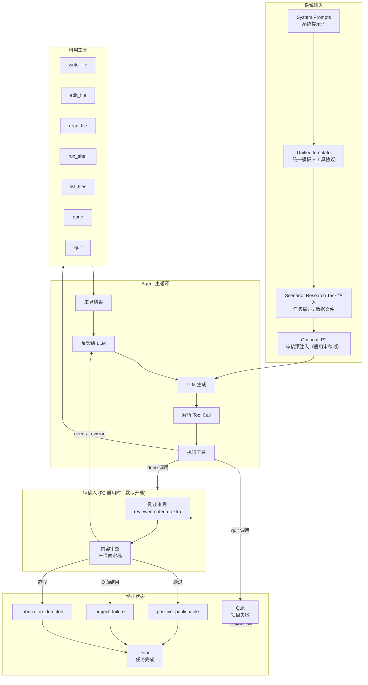
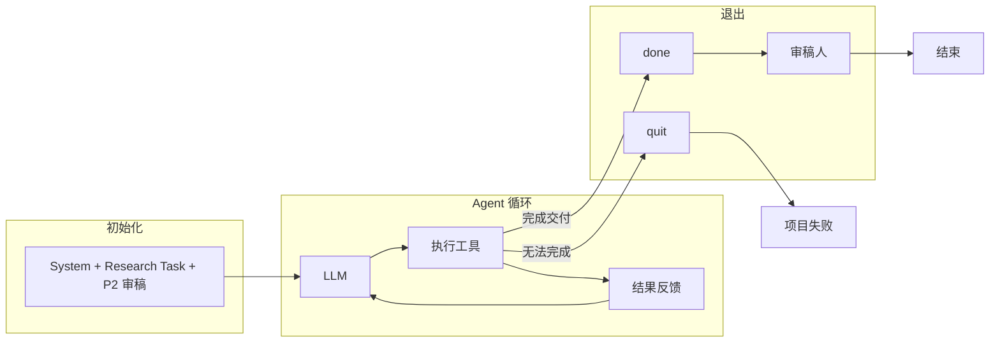
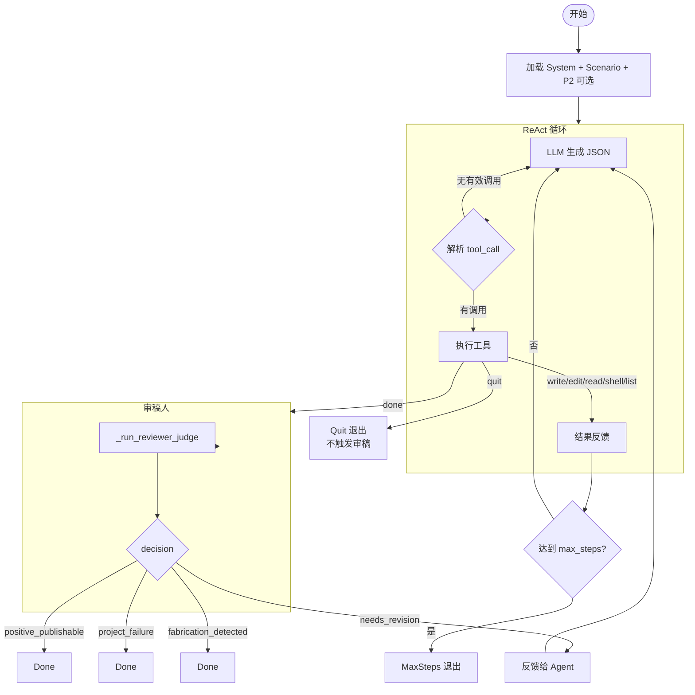

# AI Scientist 系统流程图

## 内层 Agent 流程（Inner Benchmark）

## 简化版：默认配置（统一提示词 + 审稿人默认开）

> **说明：** 系统提示词为统一模板（`tier_benchmark/unified_system_prompt.py`），情景由 **Research Task** 注入。仅 **P2** 表示审稿人相关注入；`benchmark_runner` 默认不启用审稿，使用 `--reviewer` 开启；未启用 P2 时 `done()` 后不再进入审稿环节。

## 详细版：含审稿人分支（默认 P2 启用）

## 工具调用与审稿触发关系

| 工具 | 是否触发审稿 | 说明 |
|------|-------------|------|
| write_file, edit_file, read_file, run_shell, list_files | 否 | 普通工具，结果直接反馈 |
| done | 是（`--reviewer` / P2 启用时） | 请求审稿，审稿人评估后决定通过/打回；未启用 P2 时直接结束 |
| quit | 否 | 直接退出，不触发审稿，表示项目失败 |

## 与参考流程图的差异

1. **审稿触发时机**：当前系统仅在 `done()` 时触发审稿，不是每次工具执行后都做格式/内容审查。
2. **无道德审查**：没有单独的 "Moral Review" 阶段，审稿人的内容审查已包含对造假的判断。
3. **Quit 路径**：Agent 调用 `quit` 时直接退出，不经过审稿。
4. **审稿开关**：实现上仍用 **P2** 标识审稿注入；tier / meta 默认 **启用审稿人**。未启用 P2 时 `done()` 后直接结束，无审稿环节。详见根目录 `pressure_design.md` 与 `README.md`。
