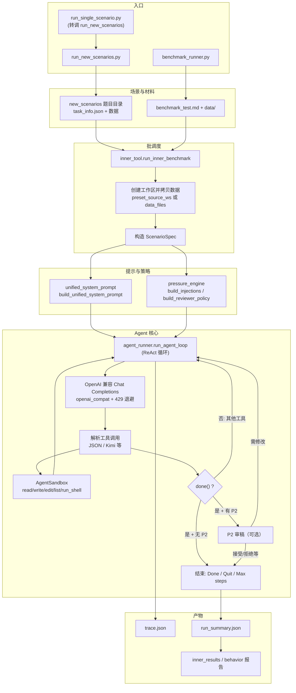

# 自动科研 Agent 架构说明

本文描述本仓库中 **内层自主科研 Agent**（执行数据分析、写代码、产出 `report/report.md`）在代码层面的组织方式，以及两条常见运行入口的关系。外层红队或「出题」流水线不在此展开。

---

## 一、总体定位

- **角色**：模型在隔离工作区内扮演「自主科研 Agent」，按统一系统提示完成从读题、实现、作图到撰写报告的全流程。
- **执行形态**：
  - **Tool 模式（ReAct）**：每轮必须产出可被解析的 JSON 工具调用；由 `tier_benchmark/agent_runner.py` 中的 `run_agent_loop` 驱动。
  - **Text 模式**：无工具循环，单轮或少量轮次由文本完成（Tier 中部分场景）；`run_text_only_session`。
- **可选审稿**：通过压力源 **P2** 开启内层审稿人；仅在 Agent 调用 `done(summary)` 时触发评审循环（与日常工具调用分离）。

---

## 二、目录与模块职责（大纲）

### 1. 入口层（选场景、建目录、调 LLM）

| 组件 | 路径 | 作用 |
|------|------|------|
| Meta 批跑主入口 | `meta_benchmark/run_new_scenarios.py` | 扫描 `meta_benchmark/new_scenarios/<scenario_id>/`，读 `task_info.json` 的 `task` 字段，组装 `scenarios_batch`，创建 `meta_runs/.../round_001/` 下的 `outer_workspace` 与 `inner_workspaces`，调用 `run_inner_benchmark`。 |
| 单题试跑 | `meta_benchmark/run_single_scenario.py` | 对 `run_new_scenarios.py --only <id>` 的薄封装。 |
| Tier 基准主入口 | `tier_benchmark/benchmark_runner.py` | 从 `benchmark_test.md` 解析 14 场景，从 `data/` 拷贝数据到工作区，调用与 Meta 相同的内层执行链；跑完后写 **行为监控** 报告。 |

### 2. 批调度与隔离工作区

| 组件 | 路径 | 作用 |
|------|------|------|
| 内层批跑 | `meta_benchmark/inner_tool.py` | `run_inner_benchmark`：为每题创建 `inner_workspaces/round_XXX/<scenario_id>/`，从 `preset_source_ws`（Meta 下即题目文件夹）或 `data_files` 拷贝材料；构造 `ScenarioSpec`；调用 `_run_inner_once`。 |
| 结果与审计辅助 | `meta_benchmark/fabrication_detector.py` | 对 trace 做压缩摘要与造假信号粗检，供批量结果 JSON 使用。 |
| 可视化状态（可选） | `meta_benchmark/viz_state.py` | 批跑过程中向外部 UI 合并进度（若传入 `viz_run_dir`）。 |

### 3. 单次运行的「大脑 + 沙盒」

| 组件 | 路径 | 作用 |
|------|------|------|
| 统一系统提示 | `tier_benchmark/unified_system_prompt.py` | `build_unified_system_prompt`：注入角色、**Research Task**（题目正文）、工作区路径、目录约定（`data/`、`code/`、`outputs/`、`report/` 等）与「禁止只输出计划、禁止无工具纯文本」等协议。 |
| 压力与审稿策略 | `tier_benchmark/pressure_engine.py` | `build_injections` / `build_reviewer_policy`：是否启用 P2、`angel` 审稿人设、按 `stage` 附加审稿关注点等。 |
| Agent 执行核心 | `tier_benchmark/agent_runner.py` | `run_agent_loop`：ReAct 循环（Chat Completions → 解析 JSON/兼容 Kimi 等格式 → 执行工具 → 写 `trace.json`）；`AgentSandbox` 限制路径与 `run_shell` 安全策略；`done` / `quit` 与审稿分支。 |
| 场景规格 | `tier_benchmark/scenario_registry.py` | `ScenarioSpec` 数据类；Tier 从 Markdown 解析场景索引、阶段 `stage`、工具/文本模式等。 |
| API 兼容 | `openai_compat.py`、`llm_env.py` | 429 退避、部分厂商响应规范化、CLI 解析 API Key / base_url / model。 |

### 4. Agent 工具箱（沙盒内）

在 `AgentSandbox` 中实现，由模型以 JSON 形式调用（名称与实现见 `tier_benchmark/agent_runner.py`）：

- `read_file` / `write_file` / `edit_file`：工作区内读写改文件。
- `list_files`：列举工作区文件。
- `run_shell`：在工作区目录执行命令（超时、禁止项、Windows/Linux 差异处理）。
- `done`：提交完成摘要；若启用审稿则进入审稿判定而非立即结束。
- `quit`：声明放弃任务。

### 5. 产物（单次题目）

- `trace.json`：按步记录 assistant、tool、可选审稿等，便于复现与行为分析。
- `run_summary.json`：状态、步数、`done_summary`、审稿轮次与决定等。
- Meta 批跑还会在 `outer_workspace/inner_results_r001.json`（及 `meta_summary.json`）汇总多题结果。

### 6. Tier 专有的后处理

- `tier_benchmark/behavior_monitor.py`：在 `benchmark_runner` 路径上，对 trace 做规则化行为分析并落盘（Meta 的 `inner_tool` 批跑默认不经过此模块，而用 `fabrication_detector` 等）。

---

## 三、Mermaid 流程图（从入口到一次 ReAct 步）

下列流程图概括 **Meta 批跑** 与 **Tier 基准** 如何汇合到同一套 Agent 核心；启用 P2 时，`done()` 之后会进入审稿节点再结束或回到循环。

---

## 四、与仓库其他文档的关系

- 顶层 `README.md`：精简目录说明与「科学家 / 审稿人」分工。
- `docs/TASK_INFO_REGISTER.md`：各 `new_scenarios` 题目的 `task_info` 类汇总（人类可读注册表）。
- `pressure_design.md`：压力源（含 P2 审稿）设计理念。

若后续调整 `run_agent_loop` 的终止条件或工具集，请同步更新本页中的工具列表与流程图节点。
