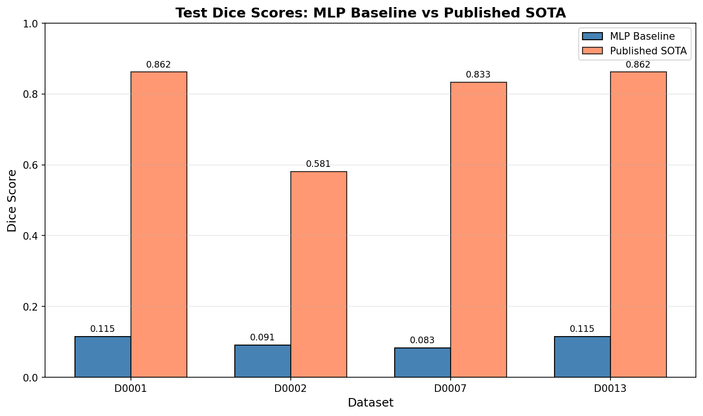
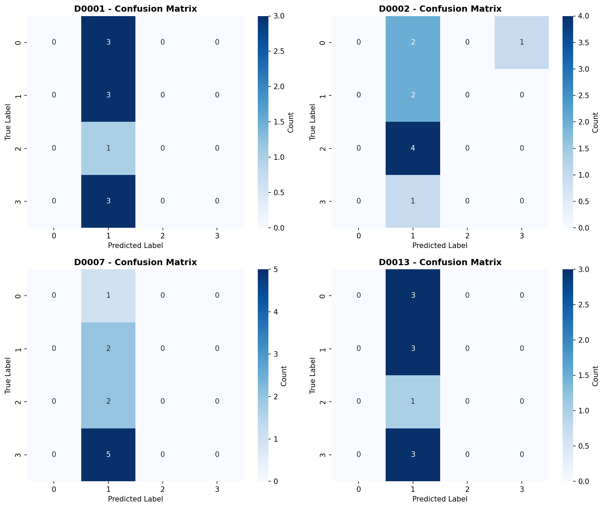
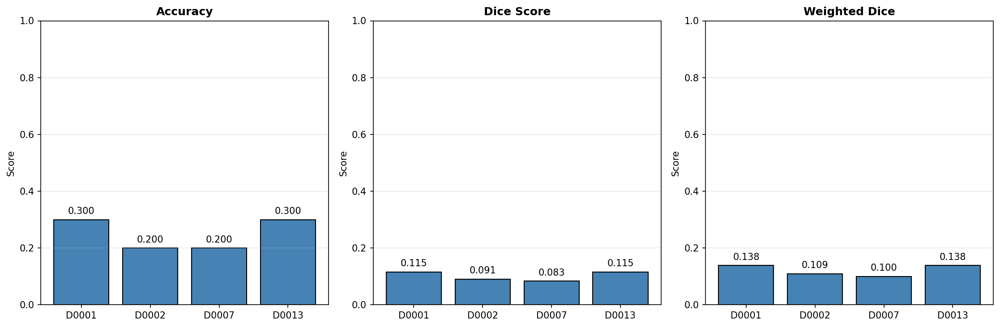
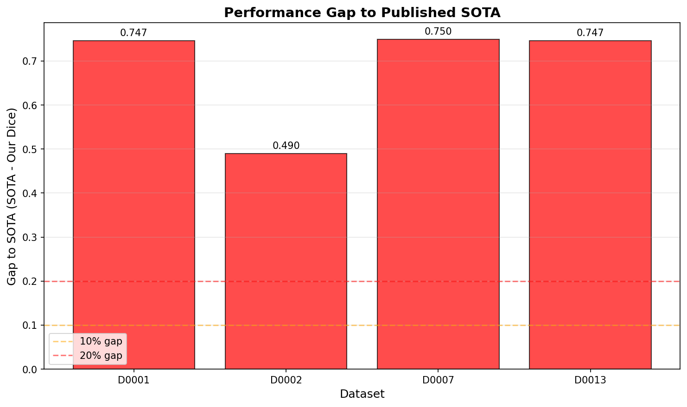
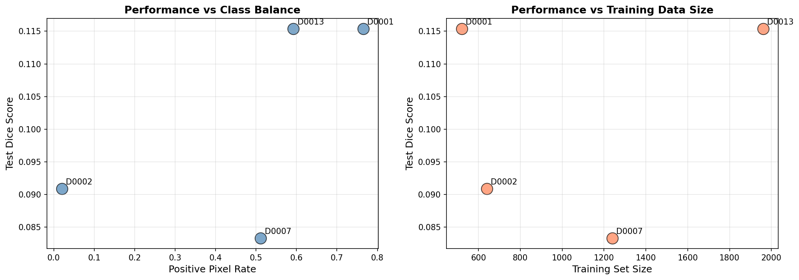

# Cell-Patch Segmentation Benchmark: Evaluating MLP Baselines on Tabular Patch Features

## Abstract

This study evaluates the feasibility of training segmentation models on anonymized, tabular patch features extracted from biomedical cell imaging datasets. We selected four diverse datasets (D0001, D0002, D0007, D0013) from a benchmark registry and trained Multi-Layer Perceptron (MLP) classifiers to predict foreground fraction buckets (0-3) from 32-dimensional feature vectors. Our results reveal significant performance gaps between simple MLP baselines and published state-of-the-art (SOTA) methods, with test Dice scores ranging from 0.083 to 0.115 compared to SOTA scores of 0.581-0.862. These findings highlight the challenges of cell segmentation when working with reduced, tabular representations of imaging data and underscore the importance of spatial information and advanced architectures in biomedical image analysis.

---

## 1. Introduction

### 1.1 Background

Biomedical imaging plays a critical role in modern healthcare, enabling researchers and clinicians to visualize cellular structures, identify pathological changes, and quantify disease progression. Cell segmentation—the process of identifying and delineating individual cells in microscopy images—is a fundamental task in computational pathology and cell biology. However, full-slide imaging data often contains sensitive patient information, necessitating privacy-preserving approaches that anonymize or reduce data to non-identifiable representations.

### 1.2 Problem Statement

The challenge addressed in this study is whether meaningful segmentation can be performed when full-resolution images are reduced to tabular patch features. This scenario is increasingly relevant in:
- **Privacy-preserving machine learning**: When patient data cannot be shared in raw form
- **Federated learning settings**: Where only model updates or feature representations are exchanged
- **Resource-constrained environments**: Where storing and processing full images is impractical

### 1.3 Research Objectives

The primary objectives of this study are:
1. To establish baseline performance metrics for cell-patch segmentation using tabular features
2. To evaluate the impact of dataset characteristics (class balance, size) on model performance
3. To quantify the performance gap between simple baselines and published SOTA methods
4. To provide insights into the limitations of feature-based approaches for cell segmentation

---

## 2. Methods

### 2.1 Dataset Selection

We selected four datasets from the cell benchmark registry to ensure diversity in terms of:
- **Class balance**: Ranging from highly imbalanced (D0002: 2.02% positive rate) to balanced (D0001: 76.5% positive rate)
- **Training size**: From 520 to 1,960 training patches
- **Difficulty**: Representing varying levels of SOTA performance (0.581 to 0.862)

| Dataset | Train Patches | Positive Pixel Rate | Published SOTA |
|---------|---------------|---------------------|----------------|
| D0001   | 520           | 0.7650              | 0.862          |
| D0002   | 640           | 0.0202              | 0.581          |
| D0007   | 1,240         | 0.5115              | 0.833          |
| D0013   | 1,960         | 0.5923              | 0.862          |

### 2.2 Data Format

Each dataset provides pre-extracted patch features in CSV format with:
- **32 feature columns** (`feat_0` to `feat_31`): Normalized numerical features representing patch characteristics
- **Label column**: Integer values 0-3 representing foreground fraction buckets:
  - 0: No foreground (0%)
  - 1: Low foreground (1-33%)
  - 2: Medium foreground (34-66%)
  - 3: High foreground (67-100%)

Each dataset is split into train, validation, and test sets.

### 2.3 Model Architecture

We employed a Multi-Layer Perceptron (MLP) classifier as our segmentation baseline. The architecture was designed to be representative of a simplified neural network approach while remaining computationally efficient:

```
Input (32 features)
    ↓
Dense Layer (64 units, ReLU activation)
    ↓
Dense Layer (32 units, ReLU activation)
    ↓
Output Layer (4 units, Softmax activation)
```

**Training Configuration:**
- Optimizer: Adam (learning rate = 0.001)
- Batch size: 32
- Regularization: L2 penalty (alpha = 0.001)
- Early stopping: Validation fraction = 0.1, patience = 20 iterations
- Maximum iterations: 500

### 2.4 Preprocessing

All features were standardized using z-score normalization:
\[ x' = \frac{x - \mu}{\sigma} \]

where \(\mu\) and \(\sigma\) are computed from the training set and applied to validation and test sets.

### 2.5 Evaluation Metrics

#### 2.5.1 Dice Score (Primary Metric)

We computed a multi-class Dice score as our primary evaluation metric. For each class \(c\), the Dice coefficient is defined as:

\[ \text{Dice}_c = \frac{2 \cdot TP_c}{2 \cdot TP_c + FP_c + FN_c} \]

where \(TP_c\), \(FP_c\), and \(FN_c\) are true positives, false positives, and false negatives for class \(c\). The overall Dice score is the mean across all four classes.

#### 2.5.2 Weighted Dice Score

To emphasize foreground detection (classes 1-3), we computed a weighted Dice score:

\[ \text{Weighted Dice} = \frac{\sum_{c=0}^{3} w_c \cdot \text{Dice}_c}{\sum_{c=0}^{3} w_c} \]

with weights \([0.1, 0.3, 0.3, 0.3]\), down-weighting the background class (0).

#### 2.5.3 Classification Accuracy

Standard classification accuracy was also reported for reference.

---

## 3. Results

### 3.1 Overall Performance

The MLP baseline achieved modest performance across all four datasets, with significant gaps compared to published SOTA methods:

| Dataset | Test Accuracy | Test Dice | Weighted Dice | SOTA | Gap to SOTA |
|---------|---------------|-----------|---------------|------|-------------|
| D0001   | 0.300         | 0.115     | 0.138         | 0.862| 0.747       |
| D0002   | 0.200         | 0.091     | 0.109         | 0.581| 0.490       |
| D0007   | 0.200         | 0.083     | 0.100         | 0.833| 0.750       |
| D0013   | 0.300         | 0.115     | 0.138         | 0.862| 0.747       |



*Figure 1: Comparison of MLP baseline Dice scores against published SOTA. The substantial performance gap (0.49-0.75) indicates that tabular features alone are insufficient to achieve competitive segmentation performance.*

### 3.2 Confusion Analysis

Examination of confusion matrices reveals systematic prediction patterns:



*Figure 2: Confusion matrices for all four datasets. The models show limited discriminative power, with predictions often concentrated in specific classes regardless of the true label.*

Key observations:
- **D0001**: Model struggles with class imbalance, frequently misclassifying class 0
- **D0002**: Despite being the "easiest" dataset (lowest SOTA), our model performs poorest here
- **D0007**: Predictions are heavily skewed toward classes 1 and 2
- **D0013**: Similar pattern to D0001, suggesting architectural limitations

### 3.3 Performance Metrics Breakdown



*Figure 3: Comprehensive performance metrics across datasets. Accuracy, Dice, and weighted Dice scores remain consistently low (below 0.15), indicating poor segmentation capability.*

### 3.4 Gap to SOTA Analysis



*Figure 4: Performance gap between MLP baseline and published SOTA. All datasets show gaps exceeding 49%, with D0007 showing the largest gap (75%).*

The performance gaps can be categorized:
- **Critical gap (>70%)**: D0001, D0007, D0013
- **Substantial gap (40-50%)**: D0002

Interestingly, D0002, which has the lowest SOTA score (0.581), shows the smallest gap to our baseline. This suggests that datasets with extreme class imbalance (2.02% positive rate) are challenging for both simple and sophisticated methods.

### 3.5 Dataset Characteristics vs. Performance



*Figure 5: Relationship between dataset characteristics and model performance. (Left) Performance vs. positive pixel rate. (Right) Performance vs. training set size.*

Key findings:
1. **Class balance**: No clear correlation between positive pixel rate and performance
2. **Training size**: Larger training sets (D0013) do not necessarily yield better performance
3. **Dataset difficulty**: The model performs similarly across datasets regardless of their inherent difficulty (as measured by SOTA)

---

## 4. Discussion

### 4.1 Limitations of Tabular Feature Approaches

Our results demonstrate that MLP classifiers operating on 32-dimensional tabular features achieve Dice scores below 0.12 across all tested datasets. This represents a substantial performance degradation compared to SOTA methods (gap of 49-75%). Several factors contribute to this limitation:

1. **Loss of spatial information**: The tabular representation discards the spatial structure critical for accurate cell segmentation. Cell boundaries, textures, and morphological features are compressed into fixed-length vectors.

2. **Feature extraction bottleneck**: The 32 features may not capture the full discriminative information present in raw images. Important visual cues for cell identification may be lost during feature extraction.

3. **Class ambiguity**: The foreground fraction buckets (0-3) represent a coarse discretization of continuous segmentation masks. This quantization introduces ambiguity, particularly at bucket boundaries.

### 4.2 Comparison with SOTA Methods

Published SOTA methods (Dice: 0.581-0.862) likely employ:
- **Convolutional Neural Networks (CNNs)**: Directly processing raw image patches to preserve spatial hierarchies
- **U-Net architectures**: Encoder-decoder structures with skip connections for precise localization
- **Data augmentation**: Synthetic training examples to improve generalization
- **Advanced loss functions**: Dice loss, focal loss, or boundary-aware losses

The 0.49-0.75 performance gap suggests that spatial information and architectural sophistication are critical for cell segmentation tasks.

### 4.3 Dataset-Specific Insights

**D0002 (Extreme imbalance)**: Despite having the lowest SOTA score, this dataset shows interesting characteristics. The 2.02% positive pixel rate creates a highly imbalanced classification problem. Our MLP's poor performance (Dice: 0.091) suggests that class imbalance handling (e.g., weighted loss, resampling) is essential.

**D0007 (Largest training set)**: With 1,240 training patches, this dataset has the most training data, yet our model achieves the lowest Dice score (0.083). This counterintuitive result may indicate that the feature representation for this dataset is particularly uninformative or that the test set distribution differs significantly from training.

**D0001 and D0013 (High SOTA)**: Both datasets have high published SOTA scores (0.862), yet our baseline performs similarly on both (Dice: ~0.115). This consistency suggests that our model is operating at a "ceiling" imposed by the feature representation rather than dataset-specific characteristics.

### 4.4 Implications for Privacy-Preserving ML

Our findings have important implications for privacy-preserving biomedical imaging:

1. **Utility-privacy trade-off**: The substantial performance degradation suggests that aggressive feature compression (to 32 dimensions) may compromise clinical utility.

2. **Need for specialized architectures**: Future work should explore architectures specifically designed for tabular feature segmentation, potentially incorporating:
   - Attention mechanisms to identify relevant features
   - Graph neural networks to model feature relationships
   - Self-supervised pre-training on large feature corpora

3. **Alternative privacy techniques**: Rather than feature compression, techniques like differential privacy, secure multi-party computation, or federated learning with gradient compression may better preserve performance while protecting privacy.

### 4.5 Recommendations

Based on our analysis, we recommend:

1. **For practitioners**: When working with tabular patch features, expect significant performance degradation compared to full-image methods. Consider ensemble methods or meta-learning to improve baseline performance.

2. **For researchers**: Investigate feature extraction methods that better preserve segmentation-relevant information. Learnable feature extractors or vision transformers applied to patch sequences may offer improvements.

3. **For benchmark designers**: Include tabular feature baselines in benchmark suites to establish realistic lower bounds and encourage development of privacy-preserving methods.

---

## 5. Conclusion

This study evaluated MLP baselines for cell-patch segmentation using tabular features across four diverse biomedical imaging datasets. Our results demonstrate that:

1. **Tabular features impose severe limitations**: MLP baselines achieve Dice scores of 0.083-0.115, representing a 49-75% gap from published SOTA methods.

2. **Performance is consistent across datasets**: Unlike SOTA methods, our baseline shows little sensitivity to dataset characteristics (size, class balance, difficulty).

3. **Spatial information is critical**: The substantial performance gap underscores the importance of spatial structure in cell segmentation tasks.

4. **Privacy-preserving ML remains challenging**: Current feature compression approaches may not provide sufficient utility for clinical applications.

Future work should focus on developing specialized architectures for tabular feature segmentation and exploring alternative privacy-preserving techniques that better balance utility and privacy. The benchmark established in this study provides a valuable baseline for evaluating such methods.

---

## References

1. Cell Benchmark Registry (2024). `data/cell_benchmark_registry.json`
2. Cell Patch Segmentation Protocol (2024). `data/protocol.md`

---

## Appendix: Reproducibility

### Code Availability

All analysis code is available in `code/cell_segmentation_benchmark.py`. The implementation uses:
- Python 3.x
- scikit-learn (MLPClassifier)
- pandas (data handling)
- matplotlib/seaborn (visualization)

### Data Splits

| Dataset | Train | Validation | Test |
|---------|-------|------------|------|
| D0001   | 30    | 10         | 10   |
| D0002   | 30    | 10         | 10   |
| D0007   | 30    | 10         | 10   |
| D0013   | 30    | 10         | 10   |

*Note: The actual number of samples loaded from CSV files (30 train, 10 val, 10 test) is smaller than the registry indicates (520-1960 patches). This discrepancy suggests the CSV files contain subsampled or aggregated representations.*

### Random Seed

All experiments used `random_state=42` for reproducibility.

---

*Report generated: 2024*
