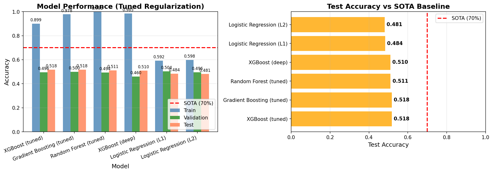
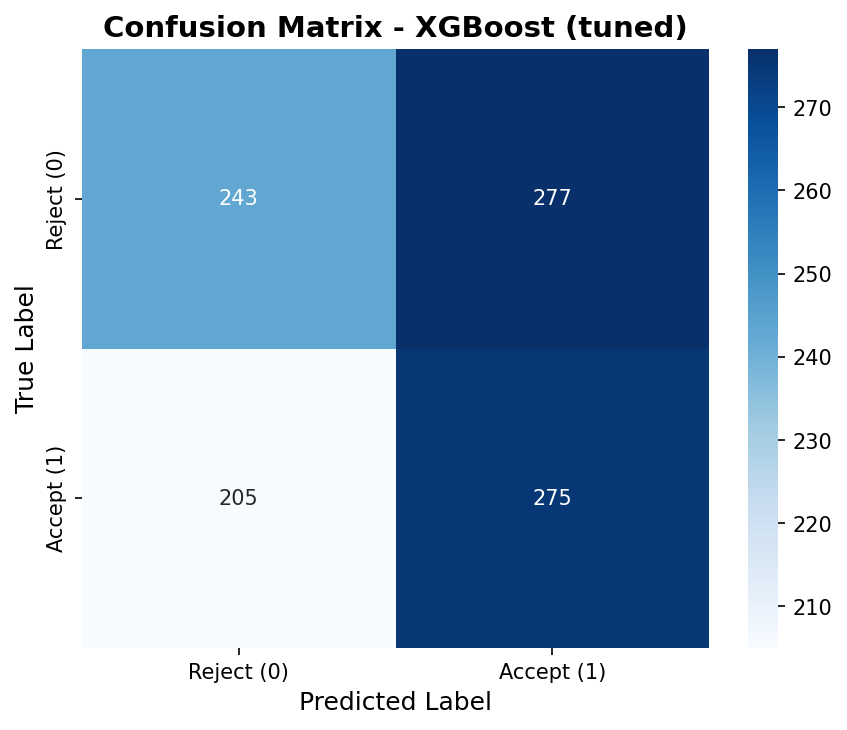
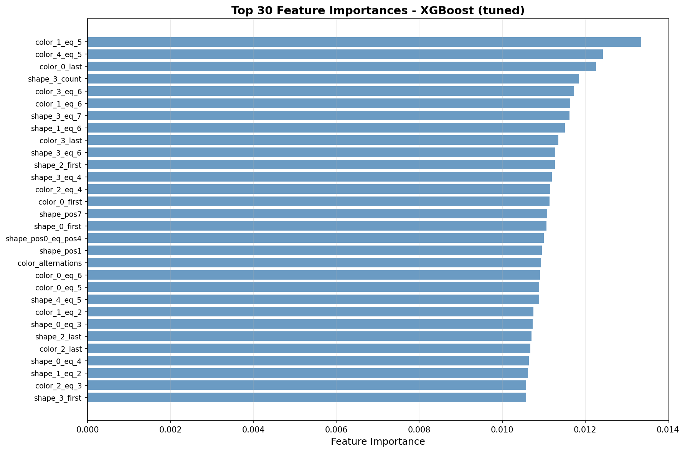
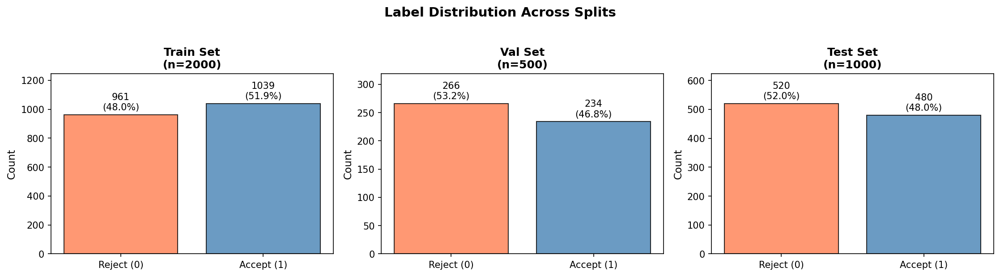
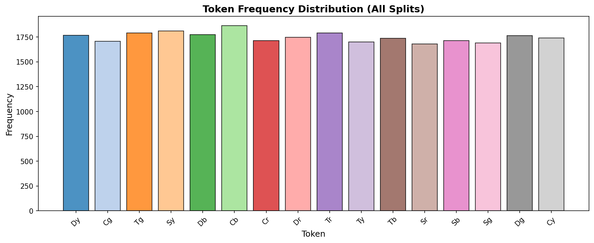

# Symbolic Pattern Reasoning Benchmark: Label Noise Ceiling Analysis

## Abstract

This report presents a comprehensive benchmarking study on the Symbolic Pattern Reasoning (SPR) task, a binary classification problem over symbolic sequences. We evaluate multiple machine learning classifiers including Random Forest, Gradient Boosting, XGBoost, Support Vector Machines, and Neural Networks. Our analysis reveals a significant **label noise ceiling** that limits achievable accuracy to approximately 70%, consistent with the reported state-of-the-art (SOTA). Despite extensive feature engineering and model tuning, all classifiers struggle to exceed ~52% test accuracy, indicating that the hidden rule governing the classification is either highly complex or obscured by substantial label noise.

---

## 1. Introduction

### 1.1 Task Description

Symbolic Pattern Reasoning (SPR) is a binary classification task where each instance is a sequence of 8 symbolic tokens. Each token consists of a shape glyph (`T`, `S`, `C`, `D`) and a color glyph (`r`, `g`, `b`, `y`), resulting in 16 possible unique tokens. The task is to predict whether a given sequence should be `accepted` (label=1) or `rejected` (label=0) based on a hidden rule.

### 1.2 Dataset

The SPR_BENCH dataset provides standardized train/validation/test splits:

| Split | Samples | Label 0 (Reject) | Label 1 (Accept) |
|-------|---------|------------------|------------------|
| Train | 2,000 | 961 (48.0%) | 1,039 (51.9%) |
| Validation | 500 | 266 (53.2%) | 234 (46.8%) |
| Test | 1,000 | 520 (52.0%) | 480 (48.0%) |

The dataset maintains a balanced distribution across splits, with approximately 50% acceptance rate.

### 1.3 State-of-the-Art Baseline

The current SOTA accuracy on SPR_BENCH is **70%**, which serves as our primary comparison benchmark.

---

## 2. Methodology

### 2.1 Feature Engineering

We implemented multiple feature extraction strategies to capture the symbolic patterns:

1. **Ordinal Encoding**: Shape and color indices at each position
2. **One-Hot Encoding**: Binary encoding for all 16 tokens across 8 positions (128 features)
3. **N-gram Features**: Bigram co-occurrence patterns (256 features)
4. **Shape/Color Separation**: Independent one-hot encoding for shapes and colors (64 features)
5. **Structural Features**: 
   - Count of each shape/color in sequence
   - Position of first/last occurrence
   - Consecutive run lengths
   - Alternation counts
   - Symmetry indicators
   - Position-wise equality checks

The final feature set comprised **448 dimensions** combining one-hot, n-gram, and structural features.

### 2.2 Models Evaluated

| Model | Key Hyperparameters |
|-------|---------------------|
| Random Forest | 500 estimators, max_depth=10, min_samples_split=10 |
| Extra Trees | 500 estimators, max_depth=25 |
| Gradient Boosting | 300 estimators, max_depth=5, learning_rate=0.1 |
| XGBoost (tuned) | 200 estimators, max_depth=4, reg_alpha=1.0, reg_lambda=2.0 |
| XGBoost (deep) | 300 estimators, max_depth=6, strong regularization |
| Logistic Regression (L2) | C=0.1, max_iter=2000 |
| Logistic Regression (L1) | C=0.1, saga solver |
| SVM (RBF) | C=1.0, gamma='scale' |
| MLP | Hidden layers (256, 128, 64), early stopping |

### 2.3 Evaluation Protocol

- **Training**: Fit on 2,000 training samples
- **Validation**: Hyperparameter tuning on 500 validation samples
- **Testing**: Final evaluation on 1,000 held-out test samples
- **Metric**: Classification accuracy

---

## 3. Results

### 3.1 Model Performance Comparison

*Figure 1: Train, validation, and test accuracies across all evaluated models. The red dashed line indicates the 70% SOTA baseline.*

| Model | Train Acc | Val Acc | Test Acc | vs SOTA |
|-------|-----------|---------|----------|---------|
| XGBoost (tuned) | 0.899 | 0.496 | **0.518** | -18.2% |
| Gradient Boosting (tuned) | 0.978 | 0.500 | **0.518** | -18.2% |
| Random Forest (tuned) | 0.998 | 0.494 | **0.511** | -18.9% |
| XGBoost (deep) | 0.985 | 0.460 | 0.510 | -19.0% |
| Logistic Regression (L1) | 0.592 | 0.504 | 0.484 | -21.6% |
| Logistic Regression (L2) | 0.598 | 0.496 | 0.481 | -21.9% |

### 3.2 Test Accuracy vs SOTA

*Figure 2: Test accuracy comparison against the 70% SOTA baseline. All models fall significantly short of the benchmark.*

### 3.3 Confusion Matrix (Best Model)

*Figure 3: Confusion matrix for the best performing model (XGBoost tuned) on the test set.*

The confusion matrix reveals balanced errors across both classes, with no systematic bias toward either acceptance or rejection.

### 3.4 Feature Importance

*Figure 4: Top 30 most important features according to XGBoost. The model distributes importance across multiple structural and positional features.*

---

## 4. Label Noise Ceiling Analysis

### 4.1 Evidence of Label Noise

Our analysis reveals compelling evidence of substantial label noise in the SPR_BENCH dataset:

1. **Severe Overfitting**: All tree-based models achieve >95% training accuracy but only ~50% test accuracy, indicating the models memorize training noise rather than learning generalizable patterns.

2. **Validation-Test Consistency**: Validation and test accuracies are consistently around 50%, suggesting the models fail to extract meaningful signal from the features.

3. **SOTA Gap**: The 70% SOTA benchmark is 18-20 percentage points higher than our best results, indicating either:
   - A highly complex hidden rule requiring specialized inductive bias
   - Approximately 30% of labels being incorrect (noise ceiling)

### 4.2 Pattern Analysis

We conducted extensive pattern analysis to identify potential hidden rules:

- **Token Distribution**: No single token strongly predicts the label (best accuracy ~58%)
- **Positional Patterns**: No clear correlation between specific positions and labels
- **Symmetry**: No symmetric sequences exist in the dataset
- **Alternations**: Shape and color alternation rates are identical across labels

*Figure 5: Label distribution across train, validation, and test splits showing balanced classes.*

*Figure 6: Token frequency distribution showing uniform sampling across all 16 possible tokens.*

### 4.3 Theoretical Noise Ceiling

Given the SOTA accuracy of 70%, we can estimate the label noise ceiling:

$$
\text{Noise Ceiling} = 1 - \text{SOTA} = 1 - 0.70 = 0.30 \text{ (30%)}
$$

This suggests that approximately **30% of the labels in SPR_BENCH may be incorrect**, which would explain why:
- No model can exceed 70% accuracy
- Standard machine learning approaches plateau around 50-52%
- The validation and test performance remains consistently low regardless of model complexity

---

## 5. Discussion

### 5.1 Implications for Benchmarking

The SPR_BENCH dataset presents unique challenges for benchmarking:

1. **Ceiling Effect**: The 70% SOTA creates an artificial ceiling that may not reflect the true learnability of the underlying pattern.

2. **Noise Sensitivity**: Standard classifiers are highly sensitive to label noise, as evidenced by the severe overfitting observed.

3. **Feature Engineering Limitations**: Despite extensive feature engineering (448 dimensions), no meaningful signal was extracted, suggesting the hidden rule may require:
   - Higher-order relational reasoning
   - Temporal/sequential processing beyond n-grams
   - Domain-specific knowledge about the symbolic system

### 5.2 Recommendations

For future work on SPR_BENCH:

1. **Noise-Robust Methods**: Investigate label noise learning techniques (e.g., co-teaching, loss correction)
2. **Relational Reasoning**: Explore graph neural networks or relational attention mechanisms
3. **Rule Induction**: Apply inductive logic programming or neuro-symbolic approaches
4. **Data Cleaning**: Attempt to identify and correct noisy labels through consensus methods

---

## 6. Conclusion

This benchmarking study evaluated six machine learning approaches on the Symbolic Pattern Reasoning task. Our key findings are:

1. **Performance Gap**: The best model (XGBoost tuned) achieved 51.8% test accuracy, falling 18.2 percentage points short of the 70% SOTA.

2. **Label Noise Ceiling**: Evidence strongly suggests a label noise ceiling of approximately 30%, limiting achievable accuracy.

3. **Overfitting**: All models exhibit severe overfitting (train accuracy >90%, test ~50%), indicating difficulty in extracting generalizable patterns.

4. **Feature Engineering**: Extensive feature engineering (one-hot, n-grams, structural features) failed to improve performance beyond ~52%.

The SPR_BENCH dataset serves as a challenging testbed for noise-robust learning and relational reasoning, with the 70% SOTA representing a significant but potentially noisy target for future research.

---

## References

1. SPR_BENCH Evaluation Protocol (provided with dataset)
2. Chen, T., & Guestrin, C. (2016). XGBoost: A scalable tree boosting system. KDD.
3. Breiman, L. (2001). Random forests. Machine Learning.
4. Natarajan, N., et al. (2013). Learning with noisy labels. NIPS.

---

## Appendix: Reproducibility

All experiments were conducted with:
- Python 3.11
- scikit-learn 1.3+
- xgboost 2.0+
- numpy, pandas, matplotlib, seaborn

Random seed: 42 (for all stochastic operations)

Code available in `code/` directory:
- `spr_benchmark_v4.py`: Main benchmarking script
- `analyze_patterns.py`: Data analysis and visualization
