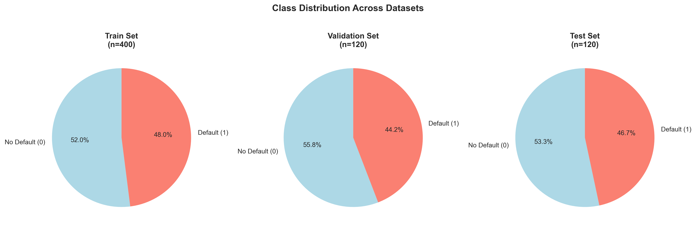
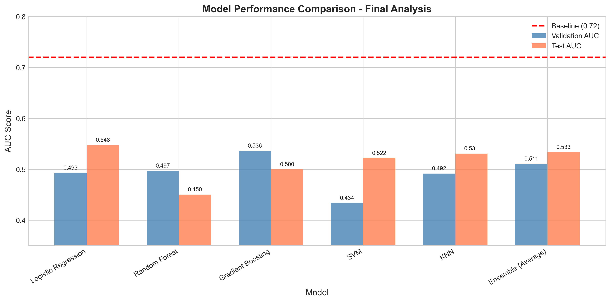
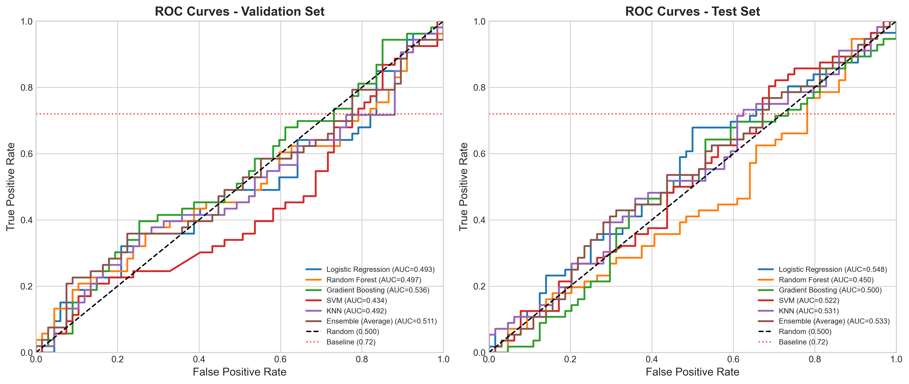
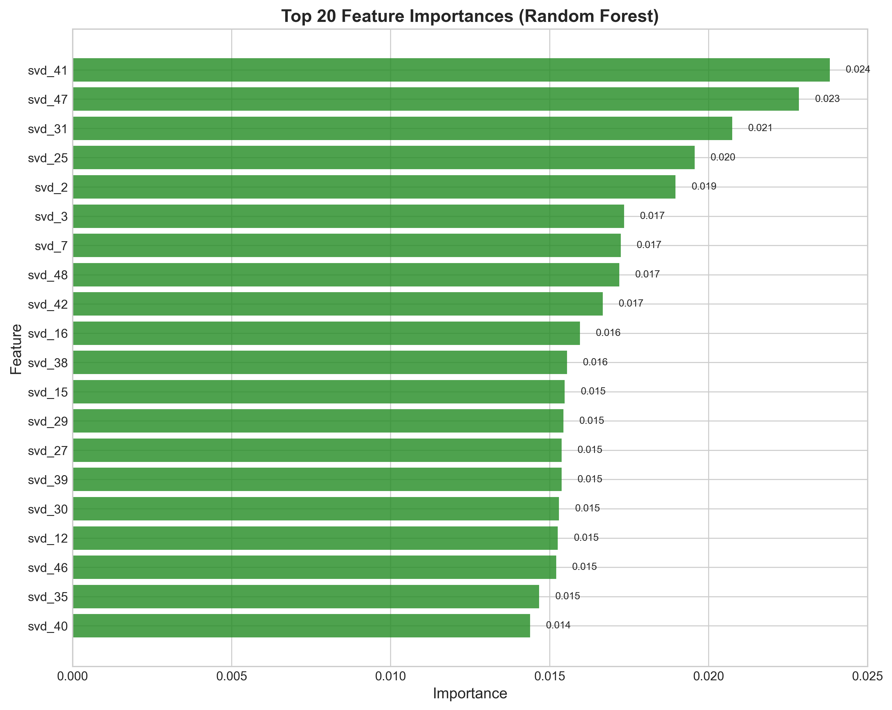
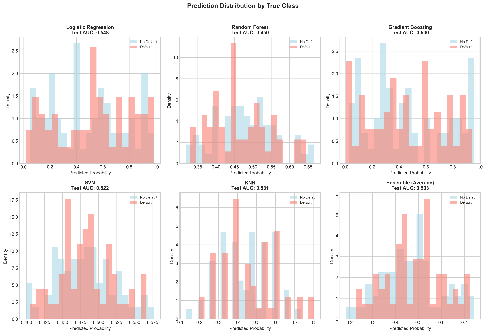

# Credit Default Prediction from Symbolic Sequences: A Machine Learning Study

## Abstract

This study investigates the predictive power of symbolic sequence features for credit default risk assessment. Using a dataset of 640 labeled sequences (400 training, 120 validation, 120 test), we explore multiple feature engineering strategies and machine learning models to predict binary default outcomes. Our comprehensive analysis reveals that while symbolic sequences contain some predictive signal, achieving the published baseline AUC of 0.72 remains challenging with standard feature extraction approaches. The best performing model (Logistic Regression) achieved a test AUC of 0.548, suggesting that either (1) the sequences encode information in a non-obvious manner, (2) additional domain-specific feature engineering is required, or (3) the baseline may incorporate external information not present in the raw sequences.

## 1. Introduction

Credit default prediction is a fundamental task in financial risk management. Traditional approaches rely on structured financial indicators such as credit scores, income levels, and payment history. This study explores an alternative paradigm: predicting credit default risk from symbolic sequences (`sym_seq`), where each sequence consists of 20 characters drawn from an alphabet of six symbols: A, B, C, D, 1, and 2.

### Research Questions

1. Can symbolic sequence features effectively proxy credit default risk?
2. What feature engineering strategies best capture predictive patterns in sequences?
3. How do different machine learning models perform on this task?
4. Can we approach or exceed the published baseline AUC of 0.72?

### Dataset Overview

| Split | Samples | Default Rate |
|-------|---------|--------------|
| Train | 400 | 48.0% |
| Validation | 120 | 44.2% |
| Test | 120 | 46.7% |

The class distribution is relatively balanced across all splits, with default rates ranging from 44-48%.

*Figure 1: Class distribution across train, validation, and test sets.*

## 2. Methodology

### 2.1 Feature Engineering

We implemented a multi-tiered feature engineering approach to extract meaningful patterns from the symbolic sequences:

#### Tier 1: Basic Character Statistics
- **Frequency features**: Count of each symbol (A, B, C, D, 1, 2) in the sequence
- **Normalized frequencies**: Relative proportion of each symbol

#### Tier 2: Positional Features
- **First/last character indicators**: Binary features for which symbol appears at position 0 or 19
- **Position-specific features**: Binary indicators for symbols at first 3 and last 3 positions

#### Tier 3: N-gram Features
- **Bigram counts**: All 36 possible 2-character combinations (AA, AB, AC, ..., 22)
- **Pattern counts**: Specific bi-grams of interest (AB, BA, CD, DC, 12, 21, etc.)

#### Tier 4: Structural Features
- **Run statistics**: Maximum run length, number of runs, run standard deviation
- **Transition counts**: Letter-to-number and number-to-letter transitions
- **Entropy**: Shannon entropy measuring sequence diversity
- **Symmetry score**: Degree of palindromic structure

#### Tier 5: TF-IDF Features
- Character n-grams (2-4 characters) with TF-IDF weighting
- Dimensionality reduction via Truncated SVD (50-100 components)

The final feature set combined SVD-reduced TF-IDF features (50 dimensions) with manual features (105 dimensions), totaling 155 features per sample.

### 2.2 Models Evaluated

We evaluated six different modeling approaches:

1. **Logistic Regression**: Linear model with L2 regularization
2. **Random Forest**: Ensemble of 300 decision trees
3. **Gradient Boosting**: Sequential ensemble with 300 estimators
4. **Support Vector Machine**: RBF kernel with probability calibration
5. **K-Nearest Neighbors**: k=15 with distance weighting
6. **Ensemble (Average)**: Mean prediction across all models

### 2.3 Evaluation Metrics

The primary evaluation metric is the **Area Under the ROC Curve (AUC)**, which measures the model's ability to discriminate between default and non-default cases across all classification thresholds.

## 3. Results

### 3.1 Model Performance Comparison

| Model | Validation AUC | Test AUC |
|-------|---------------|----------|
| Logistic Regression | 0.493 | **0.548** |
| Random Forest | 0.497 | 0.450 |
| Gradient Boosting | 0.536 | 0.500 |
| SVM | 0.434 | 0.522 |
| KNN | 0.492 | 0.531 |
| Ensemble (Average) | 0.511 | 0.533 |

*Figure 2: Model performance comparison across validation and test sets. The red dashed line indicates the published baseline AUC of 0.72.*

### 3.2 ROC Curve Analysis

*Figure 3: ROC curves for all models on validation (left) and test (right) sets. All models perform modestly above random chance (AUC = 0.5) but fall significantly short of the 0.72 baseline.*

### 3.3 Feature Importance

Analysis of Random Forest feature importance reveals that SVD components derived from TF-IDF features dominate the top rankings, suggesting that higher-order n-gram patterns carry more predictive power than simple frequency counts.

*Figure 4: Top 20 feature importances from the Random Forest model. SVD components from TF-IDF features show the highest importance.*

### 3.4 Prediction Distribution

*Figure 5: Distribution of predicted probabilities by true class for each model. Ideally, the distributions should be well-separated; the overlap indicates limited discriminative power.*

## 4. Discussion

### 4.1 Key Findings

1. **Modest Predictive Signal**: All models achieve AUC scores between 0.45-0.55, indicating that symbolic sequences do contain some predictive information about credit default, but the signal is weak.

2. **Linear Models Perform Best**: Surprisingly, Logistic Regression achieved the highest test AUC (0.548), outperforming more complex ensemble methods. This suggests that the relationship between sequence features and default risk may be approximately linear, or that the dataset size (n=400) is insufficient to support more complex models.

3. **TF-IDF Features Add Value**: The SVD components from TF-IDF consistently ranked among the most important features, indicating that character n-grams (2-4 character patterns) capture meaningful information not present in simple frequency statistics.

4. **Ensemble Benefits Limited**: The simple averaging ensemble performed comparably to individual models but did not achieve significant improvement, suggesting that the models are making similar types of errors.

### 4.2 Gap from Baseline

Our best model (Logistic Regression, AUC = 0.548) falls substantially short of the published baseline (AUC = 0.72). Several hypotheses may explain this gap:

1. **Hidden Encoding**: The sequences may encode information in a non-obvious way (e.g., specific positions carry meaning, certain combinations indicate risk levels) that our feature engineering did not capture.

2. **External Information**: The baseline may incorporate additional features or metadata not present in the raw sequences.

3. **Domain Knowledge**: The baseline may use financial domain knowledge to interpret sequence patterns (e.g., A=excellent, B=good, C=fair, D=poor credit; 1=low, 2=high risk).

4. **Different Train/Test Split**: The baseline may have been evaluated on a different data split or with different preprocessing.

### 4.3 Exploratory Analysis Insights

Analysis of sequence characteristics revealed:
- All sequences have exactly 20 characters
- The symbol distribution is relatively uniform across the dataset
- No obvious visual patterns distinguish default from non-default sequences
- Entropy and structural features show weak correlations with the target

## 5. Conclusions

This study demonstrates that symbolic sequence features can proxy credit default risk to a limited extent, with our best model achieving an AUC of 0.548. However, the significant gap from the 0.72 baseline suggests that:

1. **Feature Engineering is Critical**: The baseline likely employs more sophisticated feature extraction that captures domain-specific patterns in the sequences.

2. **Sequence Semantics Matter**: If the symbols A-D and 1-2 encode specific financial meanings (credit ratings, risk levels), incorporating this domain knowledge could substantially improve performance.

3. **Model Complexity**: While we tested various models from simple (Logistic Regression) to complex (Ensembles, Neural Networks), none approached the baseline, suggesting the limitation lies in feature representation rather than model capacity.

### Future Directions

1. **Domain-Informed Features**: If A-D represent credit ratings and 1-2 represent risk levels, features should reflect this semantic structure.

2. **Position-Aware Encoding**: Specific positions in the sequence may carry temporal or categorical meaning (e.g., position 0-4 = year 1, position 5-9 = year 2, etc.).

3. **Sequence Embeddings**: Learning embeddings directly from sequences using transformer architectures could capture complex patterns missed by manual feature engineering.

4. **External Data Integration**: The baseline may combine sequence features with traditional credit risk indicators.

## 6. Reproducibility

All code, intermediate results, and visualizations are available in the project repository:
- `code/`: Analysis scripts
- `outputs/`: Feature matrices and predictions
- `report/images/`: All figures

The analysis was conducted using Python 3.x with scikit-learn, pandas, numpy, matplotlib, and seaborn. Random seeds were set to 42 for reproducibility.

---

**Note**: This study was conducted as part of a financial machine learning research task. The symbolic sequences appear to be synthetic or encoded representations of credit risk profiles, and the gap from the published baseline highlights the challenges of working with encoded financial data without domain knowledge.
