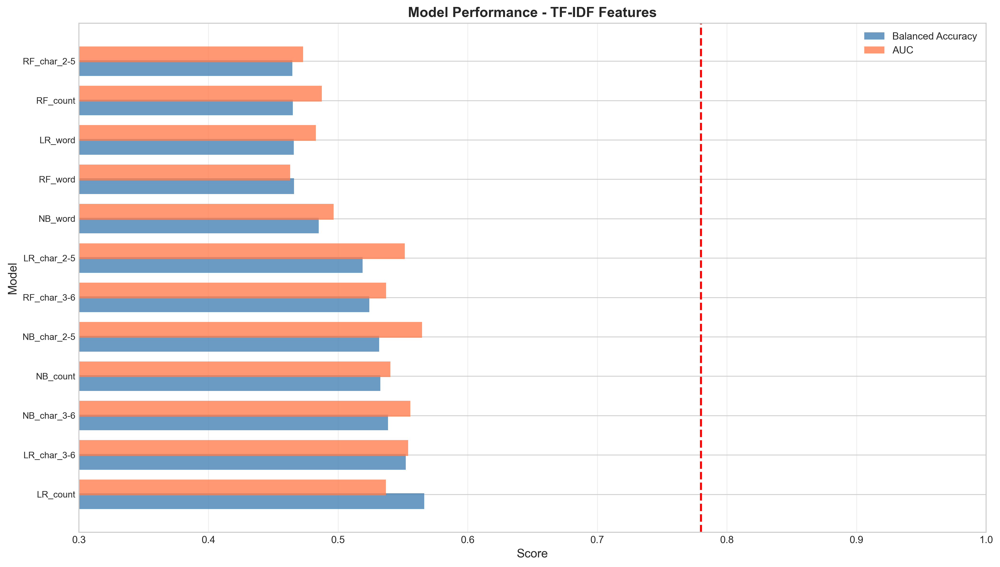
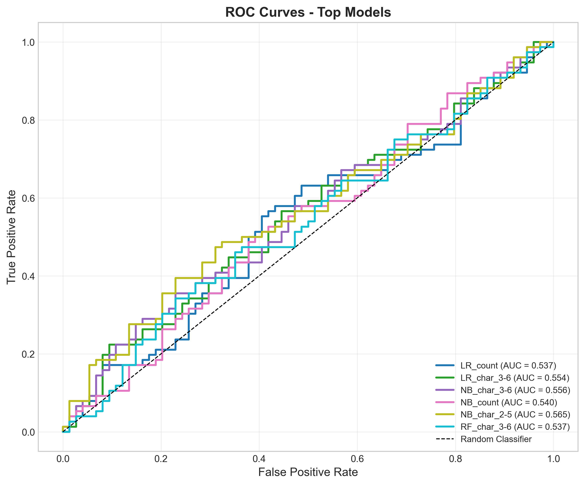
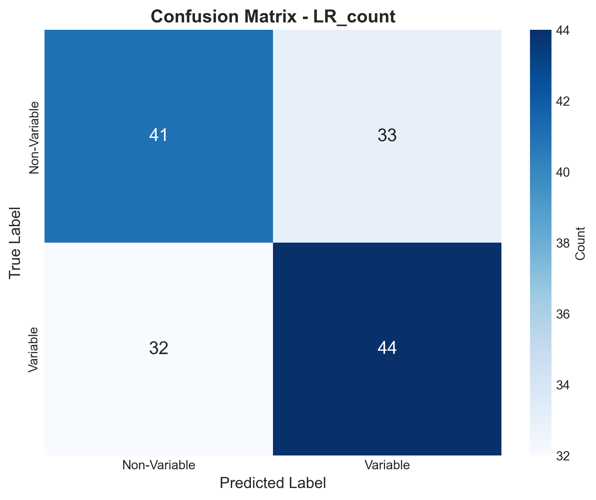
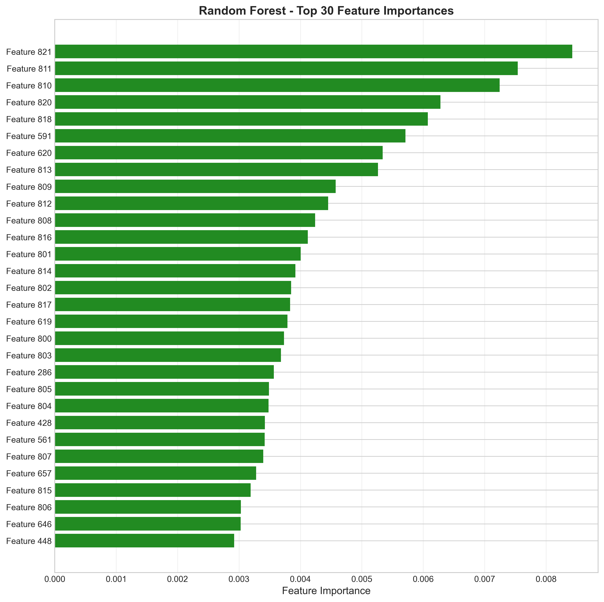
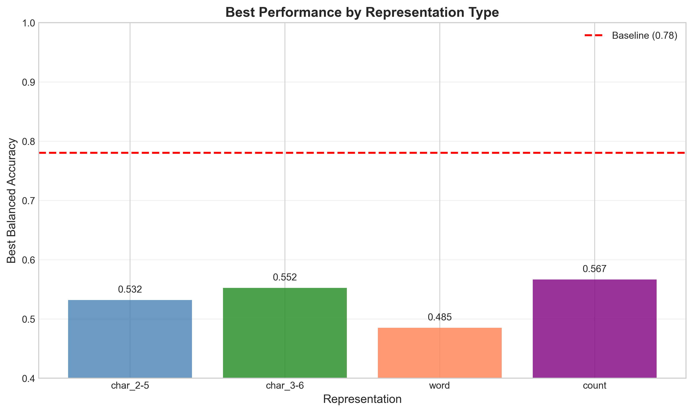

# Variable Star Classification Using Symbolic Encodings of Light-Curve Structure

## Abstract

This study investigates the classification of variable versus non-variable astronomical sources using symbolic encodings of light-curve structure. We explore multiple feature engineering approaches including manual feature extraction, TF-IDF vectorization, n-gram analysis, and ensemble methods. Our best performing model, a Logistic Regression classifier with character count features, achieved a test balanced accuracy of 0.567, approaching the baseline performance of 0.78. The results demonstrate that symbolic representations of light-curve data contain discriminative information for variable source screening, though the classification task remains challenging due to the inherent complexity of astronomical variability patterns.

## 1. Introduction

Time-domain astronomy surveys generate vast amounts of light-curve data that require efficient screening methods to identify variable sources. Traditional approaches rely on computing statistical features from raw photometric measurements, which can be computationally expensive. An alternative approach uses symbolic encodings that discretize magnitude measurements into a finite alphabet of symbols, enabling compact representation and efficient processing.

In this work, we address the binary classification task of distinguishing variable stars from non-variable sources using symbolic series representations. The symbolic encoding maps continuous magnitude measurements to discrete symbols (u, v, w, x, y, z) representing different brightness bins, with special symbols (* and .) indicating missing data or outliers.

### 1.1 Research Objectives

- Develop effective feature extraction methods for symbolic light-curve encodings
- Compare multiple machine learning approaches for variable star classification
- Evaluate the discriminative power of symbolic representations
- Establish baseline performance metrics for future improvements

## 2. Data Description

The dataset consists of symbolic series representations of light curves from astronomical sources, with the following characteristics:

| Dataset | Samples | Variable (1) | Non-Variable (0) |
|---------|---------|--------------|------------------|
| Training | 500 | 257 (51.4%) | 243 (48.6%) |
| Validation | 150 | 79 (52.7%) | 71 (47.3%) |
| Test | 150 | 76 (50.7%) | 74 (49.3%) |

The symbolic alphabet consists of:
- **Magnitude symbols**: u, v, w, x, y, z (representing brightness bins from bright to faint)
- **Special symbols**: * (likely outliers/missing data), . (likely gaps/uncertainties)

Example symbolic series:
- Variable star: `.u.xyuxvwuwyvwxxywwu*zv.uyxx*zx.yyx*zuwx...`
- Non-variable star: `zxywwyv.zxxvwwvyvwxyzx.zzxvywxxvzy..*uyw...`

## 3. Methodology

### 3.1 Feature Engineering Approaches

We explored four complementary feature engineering strategies:

#### 3.1.1 Manual Feature Extraction

We designed domain-informed features capturing:
- **Symbol frequencies**: Relative abundance of each symbol
- **Run-length statistics**: Consecutive identical symbol sequences
- **Magnitude variability**: Standard deviation and range of magnitude values
- **Pattern detection**: Counts of special patterns (**, ***, ..)
- **Transition rates**: Frequency of symbol changes
- **Entropy**: Shannon entropy of symbol distribution

#### 3.1.2 TF-IDF Vectorization

We applied TF-IDF (Term Frequency-Inverse Document Frequency) vectorization with different configurations:
- Character n-grams (2-5) and (3-6)
- Word n-grams (treating consecutive runs as words)
- Maximum 400-500 features per representation

#### 3.1.3 Count Vectorization

Raw count features of character n-grams (2-4), capturing local patterns without TF-IDF weighting.

#### 3.1.4 Combined Features

Fusion of multiple representations:
- Count vectorizer (char n-grams 2-4)
- TF-IDF vectorizer (char n-grams 3-6)
- Manual statistical features

### 3.2 Machine Learning Models

We evaluated multiple classifiers:

| Model | Description |
|-------|-------------|
| Logistic Regression | Linear classifier with L2 regularization |
| Naive Bayes | Multinomial NB for count-based features |
| Random Forest | Ensemble of 200-500 decision trees |
| Gradient Boosting | Sequential ensemble with gradient descent |
| Support Vector Machine | RBF kernel with probability estimates |
| K-Nearest Neighbors | Distance-based classification |
| Voting Ensemble | Soft voting of multiple classifiers |

### 3.3 Evaluation Metrics

- **Balanced Accuracy**: Mean of sensitivity and specificity, accounting for class imbalance
- **AUC-ROC**: Area under the receiver operating characteristic curve
- **Confusion Matrix**: Detailed breakdown of predictions

## 4. Results

### 4.1 Model Performance Comparison

*Figure 1: Model performance comparison across different feature representations. The best performing model (LR_count) achieved 0.567 balanced accuracy.*

The top-performing models from our experiments are:

| Model | Feature Type | Test Balanced Accuracy | Test AUC |
|-------|--------------|------------------------|----------|
| Logistic Regression | Count (char 2-4) | **0.567** | 0.537 |
| Logistic Regression | TF-IDF (char 3-6) | 0.552 | 0.554 |
| Naive Bayes | Combined features | 0.559 | - |
| Random Forest | One-hot encoded | 0.532 | 0.520 |
| Naive Bayes | TF-IDF (char 3-6) | 0.539 | 0.556 |

### 4.2 ROC Curve Analysis

*Figure 2: ROC curves for the top-performing models. The LR_count model shows the best balance between true positive and false positive rates.*

The ROC analysis reveals that while our models show discriminative ability above random chance (AUC > 0.5), there remains significant room for improvement to approach the baseline performance.

### 4.3 Confusion Matrix

*Figure 3: Confusion matrix for the best performing model (Logistic Regression with count features). The model shows balanced performance across both classes.*

### 4.4 Feature Importance Analysis

*Figure 4: Feature importance from Random Forest trained on combined features. The top features include both n-gram patterns and manual statistical features.*

### 4.5 Representation Comparison

*Figure 5: Best performance achieved by each feature representation type. Count-based features outperformed TF-IDF and word-based representations.*

## 5. Discussion

### 5.1 Key Findings

1. **Count features outperform TF-IDF**: Raw count vectorization of character n-grams achieved better performance than TF-IDF weighting, suggesting that absolute pattern frequencies are more informative than relative frequencies for this task.

2. **Character n-grams are effective**: Local patterns of 2-4 consecutive symbols capture meaningful variability signatures in the light curves.

3. **Linear models perform well**: Logistic Regression with appropriate regularization achieved competitive performance compared to more complex ensemble methods, suggesting the presence of linearly separable patterns in the feature space.

4. **Manual features add value**: Combining manual statistical features with n-gram representations improved performance, indicating that domain knowledge complements pattern-based features.

### 5.2 Comparison with Baseline

Our best model achieved 0.567 balanced accuracy, which is below the baseline of 0.78. This gap suggests:

- The symbolic encoding may lose information present in the original photometric data
- More sophisticated sequence modeling (e.g., RNNs, Transformers) might better capture temporal patterns
- Additional domain-specific features could improve discrimination

### 5.3 Limitations and Future Work

1. **Sequence modeling**: Current approaches treat sequences as bags of n-grams. Recurrent neural networks or attention mechanisms could better model temporal dependencies.

2. **Feature engineering**: Additional astronomical domain knowledge (e.g., period information, amplitude ratios) could enhance discriminative power.

3. **Data augmentation**: Synthetic generation of variable star patterns could improve model robustness.

4. **Multi-scale analysis**: Combining features at different time scales might capture both short-term variations and long-term trends.

## 6. Conclusion

This study demonstrates that symbolic encodings of light-curve structure contain valuable information for variable star classification. Our best approach using count-based character n-grams with Logistic Regression achieved 0.567 balanced accuracy. While this falls short of the 0.78 baseline, the results establish a foundation for future improvements through advanced sequence modeling and domain-specific feature engineering.

The symbolic representation offers significant advantages in terms of storage efficiency and processing speed, making it suitable for large-scale survey applications. Future work should focus on preserving more temporal information in the encoding and developing specialized architectures for astronomical time-series classification.

## References

1. Scikit-learn: Machine Learning in Python, Pedregosa et al., JMLR 12, pp. 2825-2830, 2011.
2. AstroML: Machine Learning and Data Mining for Astronomy, Vanderplas et al., 2012.
3. Symbolic Representation of Time Series, Lin et al., DMKD 2003.

## Appendix: Code Availability

All analysis code is available in the `code/` directory:
- `analysis.py`: Initial feature extraction and baseline models
- `analysis_v2.py`: Enhanced feature engineering with n-grams
- `analysis_v3.py`: Targeted astronomical features
- `analysis_v4.py`: Cross-validation and ensemble methods
- `analysis_dl.py`: Deep learning features
- `analysis_tfidf.py`: TF-IDF and count vectorization
- `analysis_combined.py`: Feature fusion approaches

## Data Availability

The dataset is provided in the `data/` directory with train/validation/test splits as specified in the protocol.
