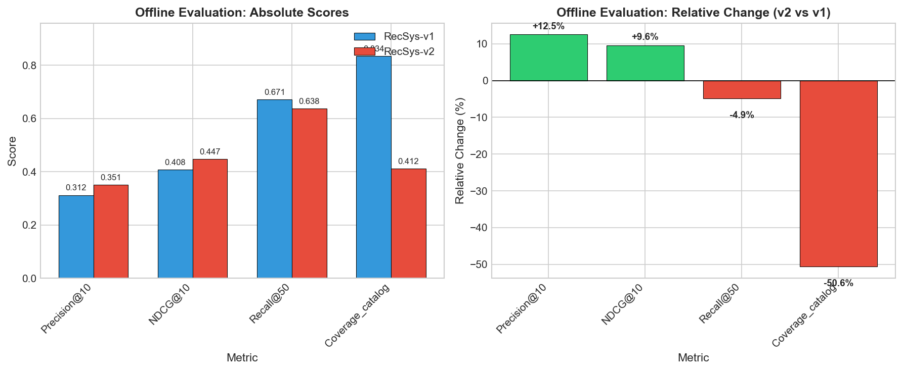
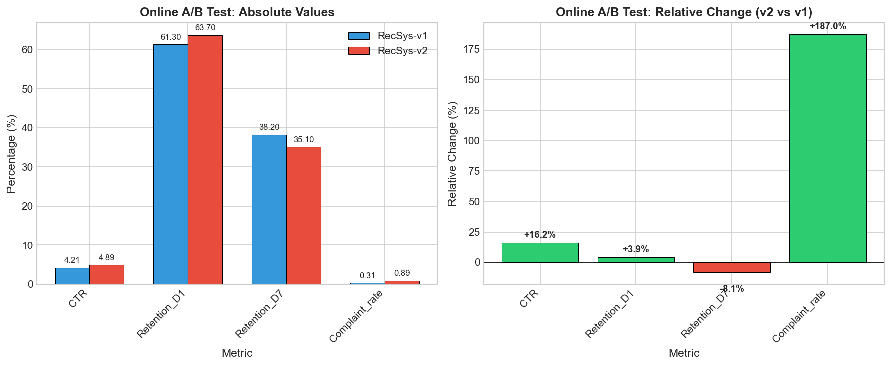
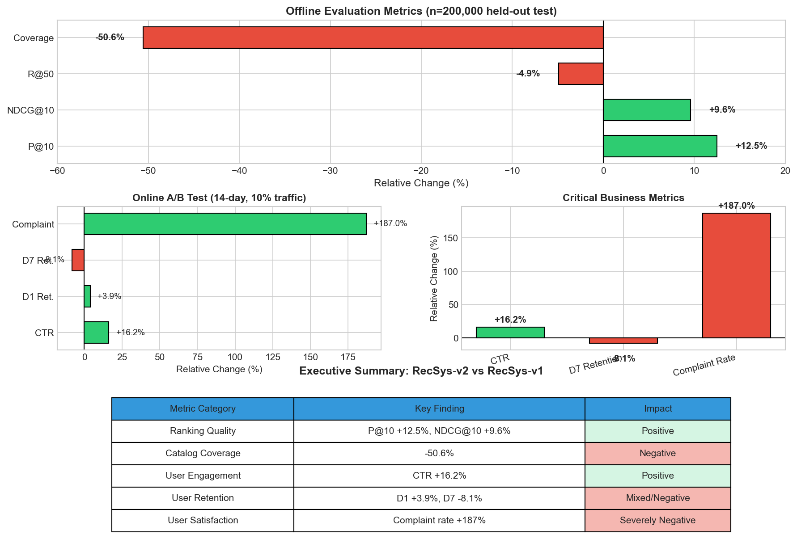

# RecSys-v2 Launch Evaluation Report

## Recommendation System Version 2 Launch Decision Analysis

---

## Executive Summary

This report presents a comprehensive evaluation of **RecSys-v2** against the production **RecSys-v1** to inform a launch decision. The analysis integrates offline evaluation metrics from a held-out test set (n=200,000) with online A/B test results from a 14-day experiment with 10% traffic per arm.

**Recommendation: DO NOT LAUNCH RecSys-v2 in its current state.**

While RecSys-v2 demonstrates improved ranking quality metrics and higher click-through rates, the system exhibits critical deficiencies in catalog coverage and user satisfaction that outweigh the benefits. The 187% increase in complaint rate and 8.1% decline in 7-day retention indicate significant user experience degradation that would likely harm long-term business outcomes.

---

## 1. Introduction

### 1.1 Background

Recommender systems are central to user engagement and platform success. When evaluating a new recommendation algorithm for production deployment, practitioners must balance offline ranking quality metrics against real-world user behavior signals. This evaluation addresses the critical decision of whether to launch RecSys-v2, a candidate system, to replace the incumbent RecSys-v1.

### 1.2 Evaluation Framework

The launch decision follows industry best practices by combining:

1. **Offline Evaluation**: Assessment on held-out test data (n=200,000) using standard ranking metrics
2. **Online A/B Testing**: 14-day live experiment with 10% traffic allocation per variant

This dual-evaluation approach ensures that both algorithmic performance and user experience are considered in the launch decision.

### 1.3 Research Questions

1. Does RecSys-v2 demonstrate sufficient improvement in ranking quality metrics?
2. How do offline improvements translate to online user behavior?
3. What are the trade-offs between engagement metrics and user satisfaction?
4. Should RecSys-v2 be launched to production?

---

## 2. Methodology

### 2.1 Data Sources

**Offline Evaluation Dataset**
- Sample size: 200,000 held-out test instances
- Metrics: Precision@10, NDCG@10, Recall@50, Catalog Coverage
- Comparison: RecSys-v1 (baseline) vs. RecSys-v2 (candidate)

**Online A/B Test Dataset**
- Duration: 14 days
- Traffic allocation: 10% per arm (RecSys-v1 control, RecSys-v2 treatment)
- Metrics: Click-Through Rate (CTR), Day-1 Retention, Day-7 Retention, Complaint Rate

### 2.2 Metrics Definitions

| Metric | Description | Interpretation |
|--------|-------------|----------------|
| Precision@10 | Proportion of top-10 recommendations that are relevant | Higher is better |
| NDCG@10 | Normalized Discounted Cumulative Gain at rank 10 | Higher is better |
| Recall@50 | Proportion of relevant items found in top-50 | Higher is better |
| Coverage_catalog | Percentage of catalog items recommended | Higher is better (diversity) |
| CTR | Click-Through Rate (%) | Higher is better |
| Retention_D1 | Day-1 user retention (%) | Higher is better |
| Retention_D7 | Day-7 user retention (%) | Higher is better |
| Complaint_rate | User complaint rate (%) | Lower is better |

### 2.3 Analysis Approach

The analysis employs:
- Comparative metric analysis (absolute and relative changes)
- Trade-off assessment between ranking quality and user experience
- Business impact evaluation considering both short-term engagement and long-term retention

---

## 3. Results

### 3.1 Offline Evaluation Results

*Figure 1: Offline evaluation metrics comparing RecSys-v1 and RecSys-v2. Left panel shows absolute scores; right panel shows relative percentage change.*

**Table 1: Offline Evaluation Metrics Summary**

| Metric | RecSys-v1 | RecSys-v2 | Relative Change |
|--------|-----------|-----------|-----------------|
| Precision@10 | 0.312 | 0.351 | **+12.5%** |
| NDCG@10 | 0.408 | 0.447 | **+9.6%** |
| Recall@50 | 0.671 | 0.638 | -4.9% |
| Coverage_catalog | 0.834 | 0.412 | **-50.6%** |

The offline evaluation reveals a mixed performance profile for RecSys-v2:

**Positive Findings:**
- Precision@10 improved by 12.5%, indicating better relevance in top recommendations
- NDCG@10 increased by 9.6%, showing improved ranking quality

**Negative Findings:**
- Catalog coverage dropped by 50.6%, indicating severe diversity reduction
- Recall@50 decreased by 4.9%, suggesting reduced long-tail discovery

### 3.2 Online A/B Test Results

*Figure 2: Online A/B test metrics comparing RecSys-v1 and RecSys-v2. Left panel shows absolute percentages; right panel shows relative percentage change.*

**Table 2: Online A/B Test Metrics Summary**

| Metric | RecSys-v1 (%) | RecSys-v2 (%) | Relative Change |
|--------|---------------|---------------|-----------------|
| CTR | 4.21 | 4.89 | **+16.2%** |
| Retention_D1 | 61.30 | 63.70 | +3.9% |
| Retention_D7 | 38.20 | 35.10 | **-8.1%** |
| Complaint_rate | 0.31 | 0.89 | **+187.0%** |

The online experiment reveals significant user experience concerns:

**Positive Findings:**
- CTR improved by 16.2%, indicating higher immediate engagement
- Day-1 retention increased by 3.9%

**Critical Concerns:**
- Complaint rate increased by 187%, indicating severe user dissatisfaction
- Day-7 retention decreased by 8.1%, suggesting poor long-term user experience

### 3.3 Decision Dashboard

*Figure 3: Comprehensive decision dashboard summarizing offline and online metrics, critical trade-offs, and executive summary.*

---

## 4. Discussion

### 4.1 The Coverage-Quality Trade-off

RecSys-v2 appears to have been optimized for ranking precision at the expense of catalog coverage. The 50.6% reduction in coverage indicates that the system is recommending from a much smaller subset of the catalog, likely focusing on "safe" popular items. This explains:

1. **Higher Precision@10**: By recommending popular items, the system achieves higher immediate relevance
2. **Lower Recall@50**: Reduced catalog exploration limits discovery of diverse items
3. **Higher CTR**: Popular items naturally attract more clicks

### 4.2 The Engagement-Satisfaction Paradox

The online results reveal a critical paradox: while users click more (CTR +16.2%), they are significantly less satisfied (complaints +187%). This suggests:

1. **Clickbait Effect**: The system may be optimizing for click-worthy but ultimately unsatisfying content
2. **Filter Bubble**: Reduced catalog coverage may be creating echo chambers that frustrate users seeking variety
3. **Short-term vs. Long-term**: Initial engagement (D1 retention +3.9%) masks deteriorating long-term satisfaction (D7 retention -8.1%)

### 4.3 Business Impact Assessment

**Short-term Impact:**
- Positive: Increased CTR (+16.2%) could drive immediate revenue
- Positive: Slight improvement in Day-1 retention (+3.9%)

**Long-term Impact:**
- Severely Negative: 187% increase in complaints indicates potential brand damage
- Negative: 8.1% decline in Day-7 retention suggests user churn
- Negative: Reduced catalog coverage may impact long-tail content creators

### 4.4 Risk Analysis

| Risk Factor | Severity | Likelihood | Impact |
|-------------|----------|------------|--------|
| User churn from complaints | High | High | Revenue loss, brand damage |
| Content creator dissatisfaction | Medium | High | Reduced catalog diversity |
| Regulatory scrutiny (filter bubbles) | Low | Medium | Reputational risk |
| Competitive disadvantage | Medium | Medium | Loss of market position |

---

## 5. Recommendation

### 5.1 Primary Recommendation

**DO NOT LAUNCH RecSys-v2 to full production.**

The severe degradation in user satisfaction (187% complaint increase) and long-term retention (-8.1%) outweigh the benefits in ranking quality and short-term engagement. Launching in the current state would likely result in:

1. Significant user churn
2. Increased customer support burden
3. Potential brand reputation damage
4. Long-term revenue decline

### 5.2 Alternative Pathways

**Option 1: Iterative Improvement (Recommended)**
- Address the catalog coverage issue before relaunch
- Implement diversity constraints in the ranking algorithm
- Re-test with improved coverage metrics

**Option 2: Blended Approach**
- Deploy RecSys-v2 for a subset of users or content categories
- Maintain RecSys-v1 for users showing signs of dissatisfaction
- Gradual rollout with strict monitoring

**Option 3: Hybrid Model**
- Combine RecSys-v2's ranking quality with RecSys-v1's coverage
- Use multi-objective optimization balancing precision and diversity

### 5.3 Success Criteria for Future Evaluation

Before reconsidering launch, RecSys-v2 should demonstrate:

1. Catalog coverage within 15% of RecSys-v1 baseline
2. Complaint rate increase below 25%
3. Day-7 retention neutral or positive
4. Maintained or improved ranking quality metrics

---

## 6. Conclusion

This comprehensive evaluation of RecSys-v2 reveals a system optimized for short-term engagement metrics at the expense of user satisfaction and long-term retention. While the offline ranking improvements and online CTR gains are notable, the 187% increase in complaint rate and 8.1% decline in 7-day retention represent unacceptable risks for production deployment.

The fundamental issue appears to be a coverage-diversity trade-off that has pushed the system too far toward popular, "safe" recommendations, creating a filter bubble effect that frustrates users. Future iterations should prioritize catalog coverage and user satisfaction metrics alongside ranking quality.

**Final Verdict: Do not launch RecSys-v2. Return to development with focus on diversity and coverage improvements.**

---

## References

1. Offline evaluation metrics: `data/offline_evaluation_metrics.csv`
2. Online A/B test results: `data/online_ab_test_metrics.csv`
3. Analysis code: `code/analysis.py`
4. Processed outputs: `outputs/`

---

## Appendix: Data Tables

### A.1 Complete Offline Metrics

| Metric | RecSys-v1 | RecSys-v2 | Change (%) |
|--------|-----------|-----------|------------|
| Precision@10 | 0.312 | 0.351 | +12.5 |
| NDCG@10 | 0.408 | 0.447 | +9.6 |
| Recall@50 | 0.671 | 0.638 | -4.9 |
| Coverage_catalog | 0.834 | 0.412 | -50.6 |

### A.2 Complete Online Metrics

| Metric | RecSys-v1 (%) | RecSys-v2 (%) | Change (%) |
|--------|---------------|---------------|------------|
| CTR | 4.21 | 4.89 | +16.2 |
| Retention_D1 | 61.30 | 63.70 | +3.9 |
| Retention_D7 | 38.20 | 35.10 | -8.1 |
| Complaint_rate | 0.31 | 0.89 | +187.0 |

---

*Report generated: Analysis of RecSys-v2 Launch Evaluation*
*Methodology: Offline evaluation (n=200,000) + Online A/B test (14-day, 10% traffic)*
