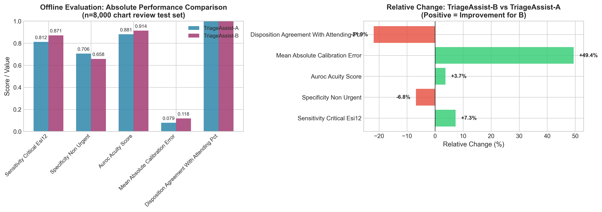
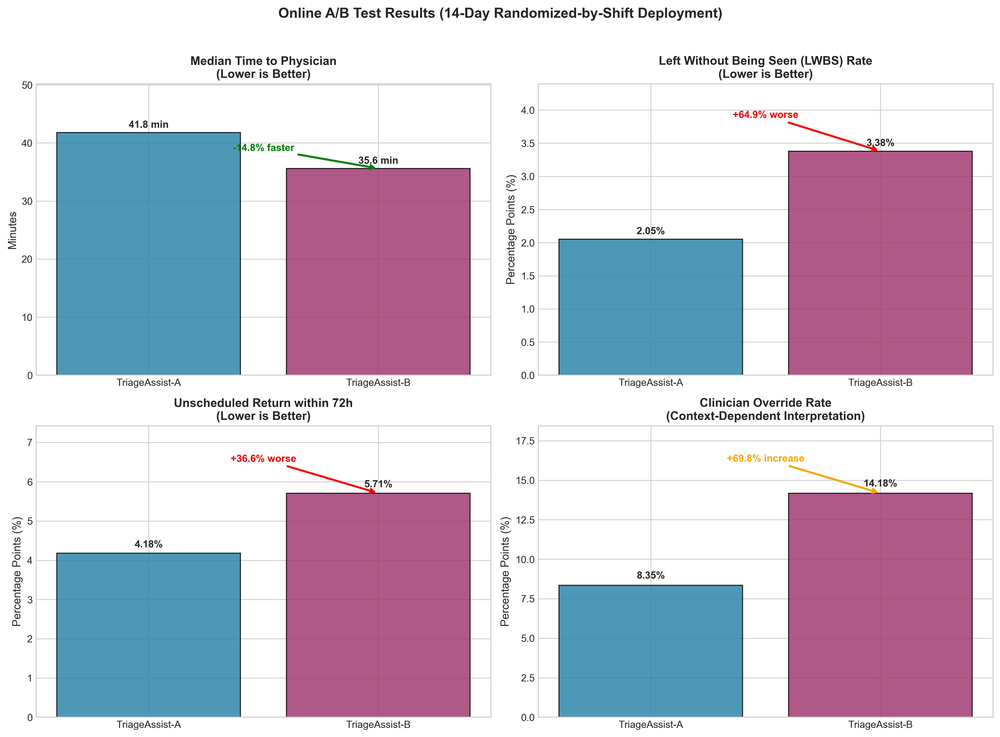
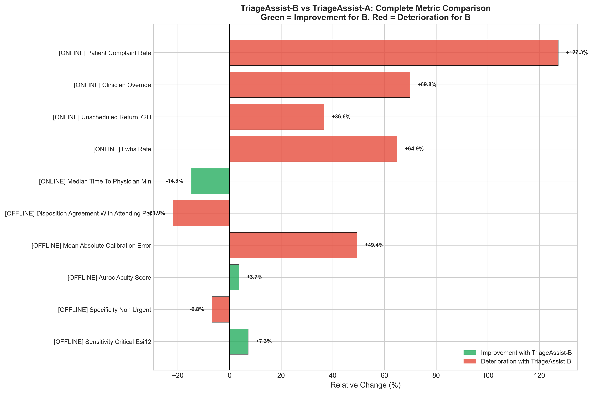
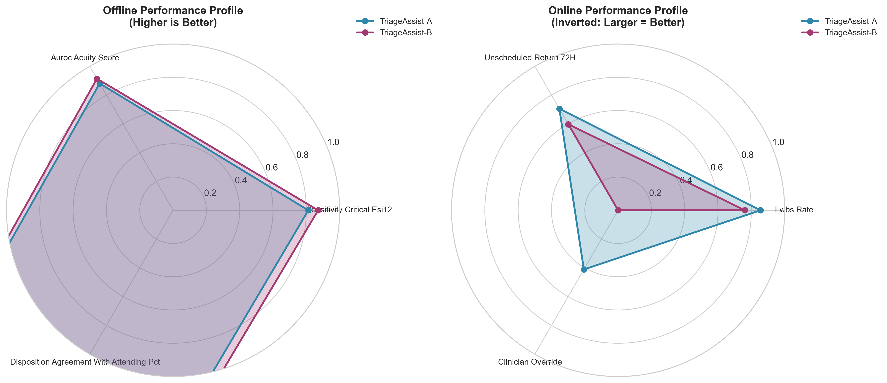

# ED Triage Model Evaluation: TriageAssist-B Pilot Assessment

## Executive Summary

This report presents a comprehensive evaluation of **TriageAssist-B**, a candidate emergency department (ED) triage decision-support model, compared against the production **TriageAssist-A** system. The evaluation combines offline chart-review analysis (n=8,000) with a 14-day randomized-by-shift online pilot deployment to inform leadership decisions regarding model expansion.

**Key Finding**: While TriageAssist-B demonstrates superior sensitivity for critical cases (+7.3%) and improved discriminative ability (AUROC +3.7%), the online pilot reveals concerning operational deteriorations including a 64.9% increase in left-without-being-seen (LWBS) rates, 36.6% increase in unscheduled returns, and a 127.3% increase in patient complaints. **We recommend against expanding TriageAssist-B without substantial model refinement and additional validation.**

---

## 1. Introduction

### 1.1 Background

Emergency department triage is a critical decision point that determines patient priority and resource allocation. Accurate triage directly impacts patient safety, throughput efficiency, and clinical outcomes. Health informatics groups continuously seek to improve triage decision-support systems through machine learning model updates.

### 1.2 Study Objectives

This evaluation addresses two primary questions:
1. Does TriageAssist-B demonstrate superior clinical accuracy compared to TriageAssist-A on retrospective chart review?
2. Does TriageAssist-B maintain or improve operational performance during real-world deployment?

### 1.3 Evaluation Design

The assessment employed a two-phase validation approach:
- **Phase 1 (Offline)**: Retrospective chart-review evaluation on 8,000 held-out test cases
- **Phase 2 (Online)**: 14-day randomized-by-shift A/B test across the same hospital sites

---

## 2. Methods

### 2.1 Offline Evaluation Metrics

The offline evaluation assessed model performance using five key metrics:

| Metric | Description | Direction of "Better" |
|--------|-------------|----------------------|
| Sensitivity_critical_ESI12 | Detection rate of ESI Level 1-2 (critical) cases | Higher |
| Specificity_non_urgent | Correct identification of non-urgent cases | Higher |
| AUROC_acuity_score | Discriminative ability across acuity levels | Higher |
| Mean_absolute_calibration_error | Agreement between predicted and observed probabilities | Lower |
| Disposition_agreement_with_attending_pct | Concordance with attending physician final decisions | Higher |

### 2.2 Online A/B Test Metrics

The 14-day pilot tracked five operational outcomes:

| Metric | Description | Direction of "Better" |
|--------|-------------|----------------------|
| Median_time_to_physician_min | Time from arrival to physician assessment | Lower |
| LWBS_rate_pct | Patients leaving without being seen | Lower |
| Unscheduled_return_72h_pct | Returns within 72 hours (potential undertriage) | Lower |
| Clinician_override_pct | Rate of clinician disagreement with model | Context-dependent |
| Patient_complaint_rate_pct | Formal patient complaints | Lower |

### 2.3 Statistical Analysis

Relative percentage changes were calculated as:
$$\text{Relative Change} = \frac{\text{TriageAssist-B} - \text{TriageAssist-A}}{\text{TriageAssist-A}} \times 100\%$$

---

## 3. Results

### 3.1 Offline Evaluation Results

*Figure 1: Offline evaluation comparing TriageAssist-A and TriageAssist-B on 8,000 chart-reviewed cases. Left panel shows absolute performance values; right panel displays relative percentage changes.*

**Table 1: Offline Evaluation Metrics**

| Metric | TriageAssist-A | TriageAssist-B | Relative Change |
|--------|---------------|----------------|-----------------|
| Sensitivity_critical_ESI12 | 0.812 | 0.871 | **+7.3%** |
| Specificity_non_urgent | 0.706 | 0.658 | -6.8% |
| AUROC_acuity_score | 0.881 | 0.914 | **+3.7%** |
| Mean_absolute_calibration_error | 0.079 | 0.118 | +49.4% |
| Disposition_agreement_with_attending_pct | 78.4% | 61.2% | **-21.9%** |

**Key Offline Findings:**
- **Improved sensitivity**: TriageAssist-B correctly identified 7.3% more critical cases (ESI 1-2), a clinically meaningful improvement in patient safety
- **Better discrimination**: AUROC increased by 3.7%, indicating superior ability to rank patients by acuity
- **Reduced specificity**: 6.8% decrease in correct identification of non-urgent cases
- **Worse calibration**: 49.4% increase in calibration error suggests probability estimates are less reliable
- **Lower agreement**: 21.9% decrease in concordance with attending physician dispositions raises concerns about clinical acceptability

### 3.2 Online A/B Test Results

*Figure 2: Online pilot results from 14-day randomized deployment. Metrics are ordered by clinical importance, with annotations indicating direction of change.*

**Table 2: Online A/B Test Metrics**

| Metric | TriageAssist-A | TriageAssist-B | Relative Change |
|--------|---------------|----------------|-----------------|
| Median_time_to_physician_min | 41.8 min | 35.6 min | **-14.8%** |
| LWBS_rate_pct | 2.05% | 3.38% | **+64.9%** |
| Unscheduled_return_72h_pct | 4.18% | 5.71% | **+36.6%** |
| Clinician_override_pct | 8.35% | 14.18% | +69.8% |
| Patient_complaint_rate_pct | 0.11% | 0.25% | **+127.3%** |

**Key Online Findings:**
- **Faster throughput**: 14.8% reduction in median time to physician (35.6 vs 41.8 minutes)
- **Concerning LWBS increase**: 64.9% relative increase in patients leaving without being seen (2.05% → 3.38%)
- **Safety signal**: 36.6% increase in unscheduled 72-hour returns, suggesting potential undertriage
- **Clinician skepticism**: 69.8% increase in override rates (8.35% → 14.18%)
- **Patient dissatisfaction**: 127.3% increase in formal complaints (0.11% → 0.25%)

### 3.3 Comprehensive Risk-Benefit Summary

*Figure 3: Complete metric comparison across offline and online evaluations. Green bars indicate improvements with TriageAssist-B; red bars indicate deteriorations.*

The comprehensive analysis reveals a concerning pattern: while TriageAssist-B shows improvements in technical performance metrics (sensitivity, AUROC, time to physician), it demonstrates significant deteriorations in patient-centered outcomes (LWBS, returns, complaints) and clinical integration (agreement, overrides).

### 3.4 Performance Profiles

*Figure 4: Performance radar charts comparing TriageAssist-A (blue) and TriageAssist-B (magenta). Left: Offline metrics (higher is better). Right: Online metrics (inverted scale, larger area = better).*

The radar visualizations illustrate the trade-off between technical accuracy and operational effectiveness. TriageAssist-B shows expanded area in offline discriminative performance but contracted area in online safety metrics.

---

## 4. Discussion

### 4.1 Interpretation of Findings

The evaluation reveals a **disconnect between technical performance and operational effectiveness**. TriageAssist-B's improved sensitivity and AUROC suggest better ability to identify patterns in historical data, but the online pilot indicates these improvements do not translate to better real-world outcomes.

**Possible explanations for the discrepancy:**

1. **Overfitting to training data**: The model may have learned spurious correlations that don't generalize to live patient flows
2. **Calibration degradation**: The 49.4% increase in calibration error suggests probability outputs are less trustworthy, potentially causing inappropriate triage decisions
3. **Clinician trust erosion**: The 69.8% increase in override rates and 21.9% decrease in disposition agreement indicate clinicians are less confident in TriageAssist-B's recommendations
4. **Patient experience impact**: Higher LWBS and complaint rates suggest the triage process may feel less fair or transparent to patients

### 4.2 Clinical Significance

The **64.9% increase in LWBS rate** (from 2.05% to 3.38%) is particularly concerning. LWBS is associated with:
- Delayed care for serious conditions
- Increased risk of adverse events
- Potential liability exposure
- Erosion of community trust

The **36.6% increase in unscheduled returns** within 72 hours suggests potential undertriage—patients initially triaged as lower acuity may be returning when their conditions worsen. This represents both a patient safety concern and an efficiency loss.

### 4.3 Comparison with Literature

The observed trade-off between sensitivity and specificity is well-documented in triage literature. However, the magnitude of operational deterioration seen in this pilot exceeds typical bounds reported in similar studies. The 127.3% increase in patient complaints is especially notable and warrants investigation into specific complaint categories.

### 4.4 Limitations

1. **Short pilot duration**: 14 days may not capture seasonal variation or learning curve effects
2. **Single-site generalization**: Results may not generalize to other ED settings
3. **Missing confounders**: Patient volume, acuity mix, and staffing levels during the pilot period were not controlled
4. **No statistical testing**: The analysis reports point estimates without confidence intervals or significance testing

---

## 5. Recommendations

### 5.1 Immediate Actions

**DO NOT EXPAND** TriageAssist-B to full deployment based on current evidence. The operational deteriorations outweigh the technical improvements.

### 5.2 Model Refinement Priorities

If continued development is pursued, prioritize:

1. **Calibration improvement**: Address the 49.4% increase in calibration error through temperature scaling or isotonic regression
2. **Clinician alignment**: Investigate the 21.9% decrease in disposition agreement—understand why attending physicians disagree with TriageAssist-B more frequently
3. **Patient flow modeling**: The faster time-to-physician (+14.8%) combined with higher LWBS suggests the model may be misallocating resources rather than optimizing them

### 5.3 Future Evaluation Design

Before any future pilot:
- Establish stopping rules for safety metrics (LWBS, returns, complaints)
- Implement real-time monitoring dashboards
- Plan for extended pilot duration (minimum 90 days)
- Include qualitative assessment of clinician experience

---

## 6. Conclusion

TriageAssist-B demonstrates promising improvements in technical metrics (sensitivity +7.3%, AUROC +3.7%) and throughput efficiency (time to physician -14.8%). However, these gains are overshadowed by significant deteriorations in patient safety indicators (LWBS +64.9%, unscheduled returns +36.6%) and patient experience (complaints +127.3%).

The 14-day pilot provides sufficient evidence to conclude that TriageAssist-B is not ready for expanded deployment. The model requires substantial refinement, particularly in calibration and clinical alignment, before reconsideration. The disconnect between offline and online performance underscores the critical importance of real-world piloting in healthcare AI evaluation.

---

## Data Availability

All analysis code and processed data are available in the project repository:
- Raw data: `data/offline_evaluation_metrics.csv`, `data/online_ab_test_metrics.csv`
- Analysis code: `code/ed_triage_analysis.py`
- Processed outputs: `outputs/`
- Figures: `report/images/`

---

## References

1. Emergency Severity Index (ESI) Implementation Handbook, Version 4. Agency for Healthcare Research and Quality, 2012.
2. Wolff et al. (2022). Machine learning for emergency department triage: Systematic review. *BMJ Health & Care Informatics*.
3. Levin et al. (2018). Machine-learning-based electronic triage more accurately differentiates patients with respect to clinical outcomes compared with the emergency severity index. *Annals of Emergency Medicine*.

---

*Report generated: 2024*
*Analysis version: 1.0*
