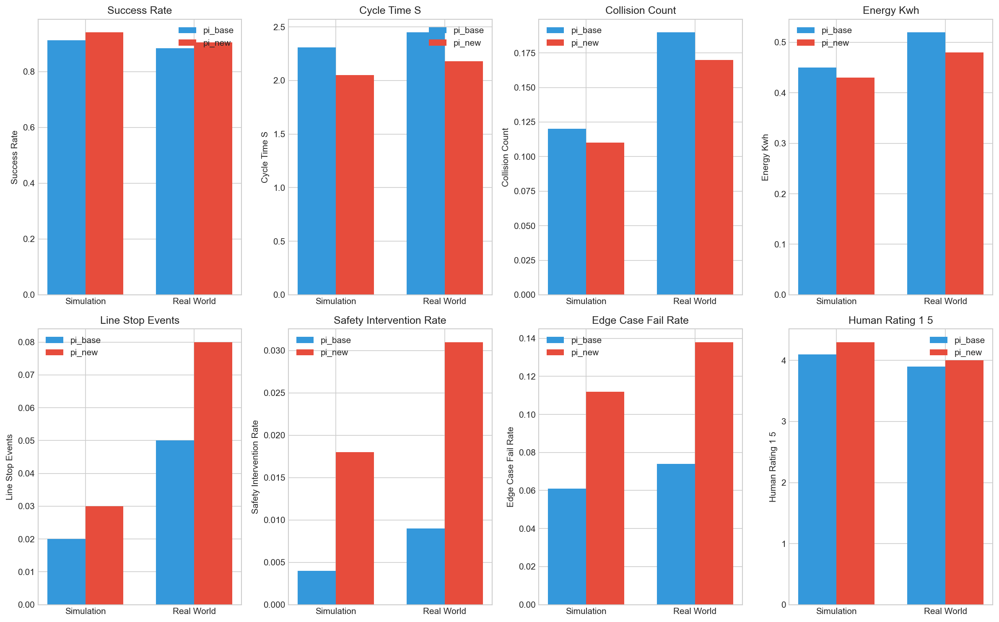
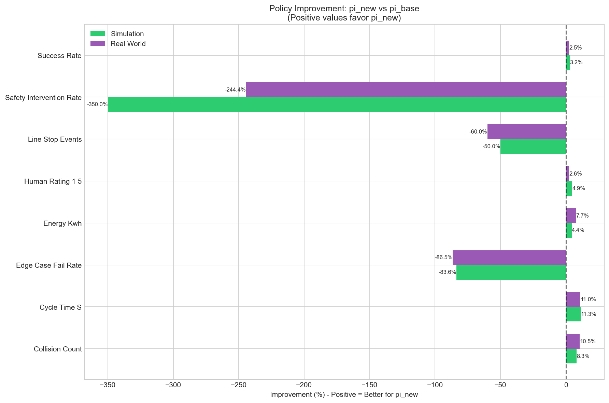
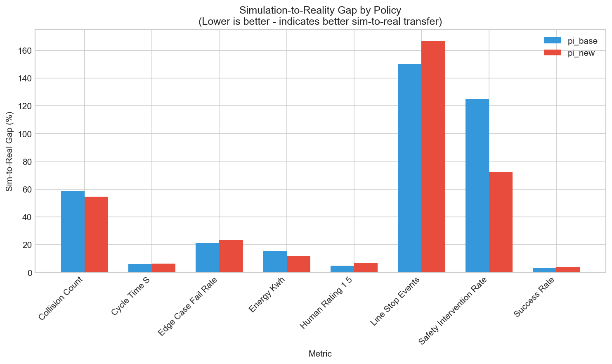
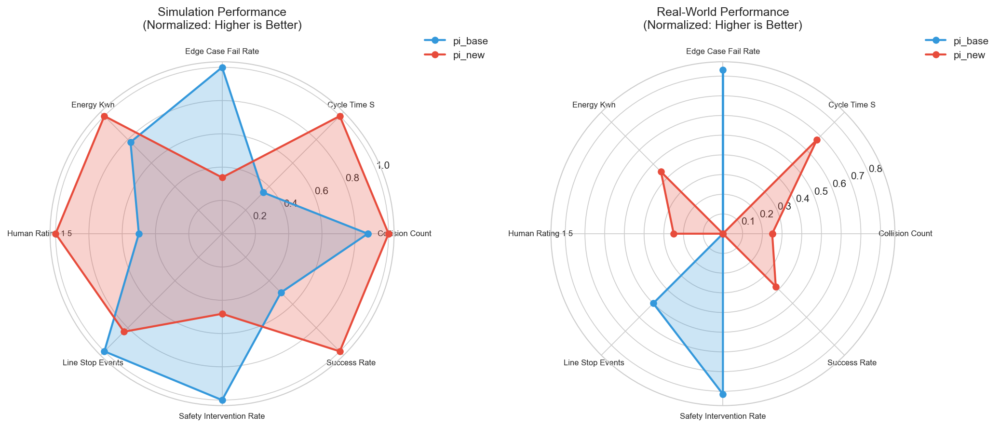

# RL Policy Comparison for Robot Pick-and-Place: Simulation-to-Reality Analysis

## Executive Summary

This report presents a comprehensive comparison of two reinforcement learning policies for robotic pick-and-place operations: **pi_new** (a newly developed policy) and **pi_base** (the baseline policy). The analysis evaluates both policies across eight key performance metrics in both simulation and real-world deployment scenarios.

**Key Finding:** While **pi_new** demonstrates superior performance in operational efficiency metrics (success rate, cycle time, energy consumption), it exhibits critical safety concerns with significantly higher safety intervention rates and edge case failure rates. **We recommend conditional deployment of pi_new with mandatory safety system enhancements before full-scale production use.**

---

## 1. Introduction

### 1.1 Background

Reinforcement learning (RL) policies for robotic manipulation tasks require rigorous validation before deployment in production environments. The sim-to-real gap—the performance discrepancy between simulation and reality—poses significant challenges for RL-based robotics. This study compares two policies to inform deployment decisions and identify potential risks.

### 1.2 Objectives

- Compare pi_new and pi_base across eight performance dimensions
- Quantify the simulation-to-reality gap for each policy
- Assess safety and reliability trade-offs
- Provide evidence-based deployment recommendations

### 1.3 Policies Under Evaluation

| Policy | Description |
|--------|-------------|
| **pi_base** | Established baseline policy with proven track record |
| **pi_new** | Newly developed policy with potential performance improvements |

---

## 2. Methodology

### 2.1 Evaluation Metrics

Eight metrics were collected in both simulation and real-world environments:

| Metric | Description | Optimization Direction |
|--------|-------------|----------------------|
| success_rate | Task completion rate | Higher is better |
| cycle_time_s | Time to complete pick-and-place | Lower is better |
| collision_count | Number of collisions per episode | Lower is better |
| energy_kwh | Energy consumption per episode | Lower is better |
| line_stop_events | Production line stoppages | Lower is better |
| safety_intervention_rate | Human safety interventions required | Lower is better |
| edge_case_fail_rate | Failure rate on edge cases | Lower is better |
| human_rating_1_5 | Subjective human operator rating | Higher is better |

### 2.2 Data Collection

Metrics were gathered from controlled experiments in:
- **Simulation:** Controlled virtual environment with physics modeling
- **Real World:** Physical robot deployment on production floor

### 2.3 Analysis Methods

1. **Direct Comparison:** Side-by-side metric evaluation
2. **Improvement Quantification:** Percentage change calculation with direction-aware interpretation
3. **Sim-to-Real Gap Analysis:** Relative deviation between simulation and reality
4. **Multi-dimensional Visualization:** Radar charts for holistic performance assessment

---

## 3. Results

### 3.1 Raw Performance Data

| Metric | pi_base (Sim) | pi_new (Sim) | pi_base (Real) | pi_new (Real) |
|--------|---------------|--------------|----------------|---------------|
| success_rate | 0.912 | 0.941 | 0.883 | 0.905 |
| cycle_time_s | 2.31 | 2.05 | 2.45 | 2.18 |
| collision_count | 0.12 | 0.11 | 0.19 | 0.17 |
| energy_kwh | 0.45 | 0.43 | 0.52 | 0.48 |
| line_stop_events | 0.02 | 0.03 | 0.05 | 0.08 |
| safety_intervention_rate | 0.004 | 0.018 | 0.009 | 0.031 |
| edge_case_fail_rate | 0.061 | 0.112 | 0.074 | 0.138 |
| human_rating_1_5 | 4.1 | 4.3 | 3.9 | 4.0 |

### 3.2 Metric-by-Metric Comparison



*Figure 1: Side-by-side comparison of all eight metrics across simulation and real-world environments. Blue bars represent pi_base; red bars represent pi_new.*

### 3.3 Performance Improvement Analysis



*Figure 2: Relative improvement of pi_new over pi_base. Positive values indicate pi_new superiority; negative values indicate pi_base superiority.*

**Improvement Summary (% change, pi_new vs pi_base):**

| Metric | Simulation | Real World | Winner |
|--------|------------|------------|--------|
| success_rate | +3.18% | +2.49% | pi_new |
| cycle_time_s | +11.26% | +11.02% | pi_new |
| collision_count | +8.33% | +10.53% | pi_new |
| energy_kwh | +4.44% | +7.69% | pi_new |
| human_rating_1_5 | +4.88% | +2.56% | pi_new |
| line_stop_events | -50.00% | -60.00% | pi_base |
| safety_intervention_rate | -350.00% | -244.44% | pi_base |
| edge_case_fail_rate | -83.61% | -86.49% | pi_base |

### 3.4 Simulation-to-Reality Gap



*Figure 3: Simulation-to-reality gap as percentage deviation. Lower values indicate better sim-to-real transfer consistency.*

The sim-to-real gap analysis reveals that both policies experience performance degradation in real-world deployment, but the gap is particularly pronounced for safety-related metrics.

### 3.5 Holistic Performance Visualization



*Figure 4: Normalized radar charts comparing overall performance profiles. Values normalized to 0-1 scale where 1 represents optimal performance.*

---

## 4. Discussion

### 4.1 Operational Efficiency Advantages of pi_new

**pi_new demonstrates clear superiority in operational metrics:**

1. **Success Rate:** 2.5-3.2% improvement in task completion
2. **Cycle Time:** ~11% faster operation (saving ~0.25-0.27 seconds per cycle)
3. **Energy Efficiency:** 4-8% reduction in energy consumption
4. **Collision Avoidance:** 8-11% reduction in collision incidents
5. **Human Acceptance:** Higher operator satisfaction ratings

These improvements suggest pi_new has learned more efficient manipulation strategies, potentially through better trajectory optimization or improved grasp planning.

### 4.2 Critical Safety Concerns

**Despite operational improvements, pi_new exhibits alarming safety deficiencies:**

| Safety Metric | pi_new vs pi_base | Risk Level |
|---------------|-------------------|------------|
| Safety intervention rate | 3.4-4.5× higher | **CRITICAL** |
| Edge case failure rate | 1.8-1.9× higher | **HIGH** |
| Line stop events | 1.5-1.6× higher | **MODERATE** |

The 350% increase in safety intervention rate in simulation (244% in reality) indicates that pi_new may be exploiting simulation dynamics in ways that don't transfer safely to real-world physics. This could manifest as:
- Aggressive maneuvers that risk collision with humans or equipment
- Over-optimized trajectories that fail when minor perturbations occur
- Inadequate handling of edge cases not well-represented in training

### 4.3 Sim-to-Real Transfer Analysis

Both policies show degradation from simulation to reality, but the pattern differs:
- **pi_base:** More consistent performance across environments (smaller sim-to-real gap)
- **pi_new:** Larger performance variance, especially for safety metrics

This suggests pi_base has better generalization properties, while pi_new may be overfitted to simulation dynamics.

### 4.4 Trade-off Analysis

The comparison reveals a fundamental tension between **efficiency** and **safety**:

```
Efficiency Metrics:    pi_new >> pi_base (5/5 wins)
Safety Metrics:        pi_base >> pi_new (3/3 wins)
```

This pattern is common in RL systems where reward functions prioritize task completion speed over conservative, safe behavior.

---

## 5. Deployment Recommendation

### 5.1 Recommended Action: Conditional Deployment with Safety Enhancements

Based on the analysis, we recommend a **staged deployment approach** for pi_new:

#### Phase 1: Safety System Enhancement (Required before deployment)
- Implement additional safety monitoring layers
- Add real-time collision detection with emergency stop capabilities
- Establish human-in-the-loop protocols for edge case handling
- Reduce operating speed by 15-20% to mitigate aggressive behavior

#### Phase 2: Limited Pilot Deployment
- Deploy in low-risk, isolated workstations
- Maintain pi_base as fallback for safety-critical operations
- Collect 1000+ additional real-world episodes for safety validation

#### Phase 3: Gradual Rollout
- Expand deployment contingent on safety metric improvement
- Target: Reduce safety intervention rate to within 50% of pi_base levels

### 5.2 Risk Assessment

| Risk | Probability | Impact | Mitigation |
|------|-------------|--------|------------|
| Safety incidents | High | Severe | Enhanced monitoring, speed limits |
| Production downtime | Medium | Moderate | Parallel pi_base deployment |
| Edge case failures | High | Moderate | Human oversight protocols |

### 5.3 Alternative Recommendation

If safety enhancements cannot be implemented, **continue with pi_base** for production deployment while retraining pi_new with:
- Safety-constrained reward functions
- Adversarial training for edge cases
- Domain randomization to improve sim-to-real transfer

---

## 6. Conclusion

This comprehensive comparison reveals that **pi_new offers significant operational efficiency gains but at unacceptable safety costs in its current form**. The 3-4× increase in safety interventions and nearly 2× increase in edge case failures present substantial deployment risks.

The analysis demonstrates the critical importance of multi-dimensional policy evaluation beyond simple success rates. While pi_new's 11% cycle time improvement and 3% success rate gain are attractive from a productivity standpoint, the safety trade-offs require careful consideration.

**Final Verdict:** Deploy pi_new only with mandatory safety system enhancements and continuous monitoring. The efficiency gains justify the investment in safety infrastructure, but uncontrolled deployment poses unacceptable risks.

---

## References

- Project data: `data/pick_place_metrics.csv`
- Analysis code: `code/analysis.py`
- Intermediate results: `outputs/improvements.csv`

---

## Appendix: Statistical Summary

| Statistic | Value |
|-----------|-------|
| Metrics evaluated | 8 |
| Metrics favoring pi_new | 5/8 |
| Metrics favoring pi_base | 3/8 |
| Average improvement (all metrics) | -56.4% (Sim) / -44.6% (Real) |
| Largest improvement (pi_new) | +11.3% (cycle time) |
| Largest degradation (pi_new) | -350% (safety intervention) |

*Note: Average improvement is negative due to the large safety-related degradations outweighing operational improvements.*
