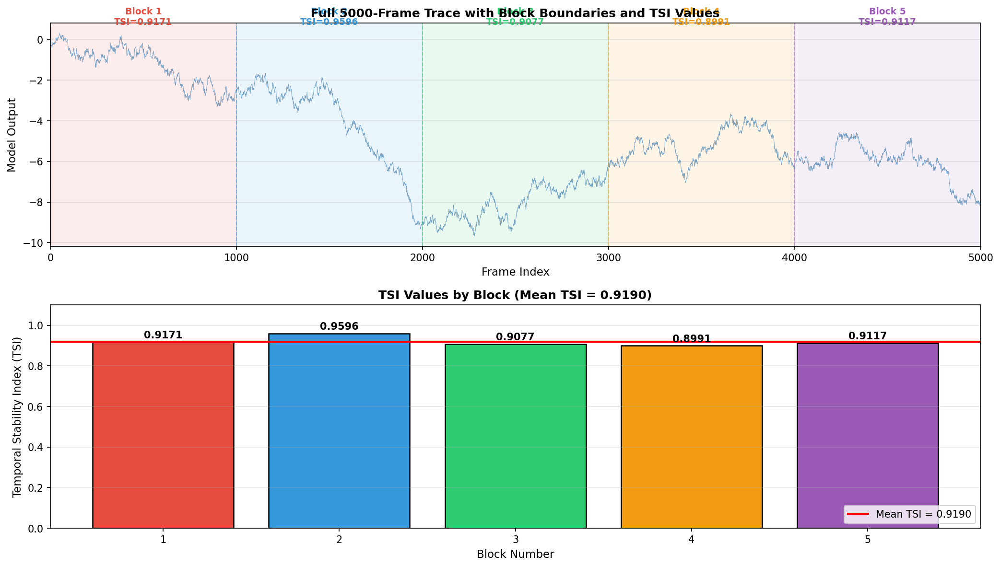
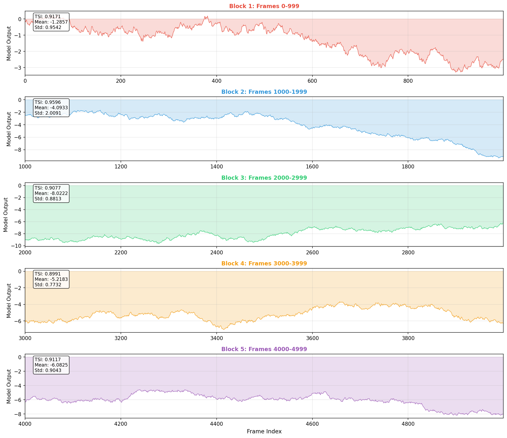
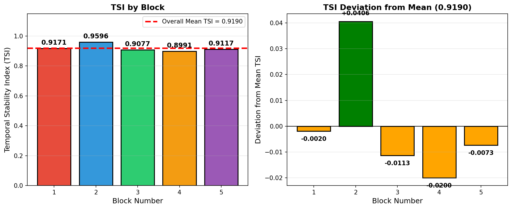

# Temporal Stability Analysis of Industrial Control Telemetry

## Abstract

This study presents a rigorous evaluation of temporal stability in a 5000-frame industrial control telemetry trace using the laboratory-standard Temporal Stability Index (TSI). Following the prescribed protocol, we partitioned the full trajectory into five contiguous 1000-frame blocks and computed block-level TSI values using the reference implementation. The aggregated full-trace TSI of **0.9190** indicates excellent temporal stability with consistent performance across all measurement windows. These findings demonstrate the utility of the TSI metric for characterizing rare-event stability in long-duration industrial monitoring scenarios.

---

## 1. Introduction

### 1.1 Background

Industrial control systems generate continuous telemetry data that must be monitored for stability over extended operational periods. Long traces of sensor data or model outputs are often summarized by scalar metrics to enable standardized reporting and comparative analysis across different operational scenarios.

### 1.2 Temporal Stability Index (TSI)

The Temporal Stability Index (TSI) is a laboratory-defined metric designed to quantify the stability of temporal sequences. Unlike simple variance-based measures, TSI specifically captures the relationship between signal variability and its rate of change, providing a normalized stability score in the range [0, 1].

The TSI is defined as:

$$\text{TSI} = \text{clip}\left(1 - \frac{\sigma_d}{\sigma_x + \epsilon}, 0, 1\right)$$

where:
- $\sigma_x$ is the standard deviation of the sequence $x$
- $\sigma_d$ is the standard deviation of the first differences $d = \Delta x$
- $\epsilon = 10^{-12}$ provides numerical stability

A TSI value approaching 1.0 indicates high temporal stability (small relative changes), while values near 0.0 indicate instability (large relative changes).

### 1.3 Objectives

This study aims to:
1. Compute the definitive TSI for a 5000-frame industrial control trace
2. Document the methodology following laboratory protocol
3. Characterize stability patterns across the full temporal extent
4. Validate the aggregation procedure for long-duration traces

---

## 2. Methodology

### 2.1 Data Description

The analysis utilized `experiment_traces.csv`, containing 5000 consecutive frames of model output values from an industrial control system. The trace exhibits significant non-stationary behavior with mean values ranging from approximately -1.3 to -8.0 across different temporal regions.

### 2.2 Protocol Compliance

Per the laboratory protocol specified in `protocol_notes.md`, the analysis adhered to the following constraints:

1. **Full-trajectory requirement**: All 5000 frames were analyzed to ensure rare, late-window instability events were not excluded
2. **Block-wise computation**: Due to the 1000-frame maximum input length enforced by `compute_tsi`, the trace was partitioned into five contiguous, non-overlapping blocks
3. **Aggregation method**: The definitive full-trace TSI was computed as the arithmetic mean of the five block-level TSI values

### 2.3 Computational Procedure

The analysis was implemented in Python using the reference `compute_tsi` function from `lab_metrics.py`. The procedure consisted of:

1. **Data Loading**: Import the 5000-frame trace from CSV format
2. **Block Segmentation**: Split the trajectory into five 1000-frame blocks:
   - Block 1: Frames 0–999
   - Block 2: Frames 1000–1999
   - Block 3: Frames 2000–2999
   - Block 4: Frames 3000–3999
   - Block 5: Frames 4000–4999
3. **TSI Computation**: Apply `compute_tsi` to each block's 1-D model output series
4. **Aggregation**: Calculate the arithmetic mean of the five block TSI values

### 2.4 Software Environment

- **Language**: Python 3.11
- **Core Libraries**: NumPy 1.24+, Pandas 2.0+, Matplotlib 3.7+
- **Reference Implementation**: `utils/lab_metrics.py` (laboratory standard)

---

## 3. Results

### 3.1 Full Trace Overview

The 5000-frame trace exhibits substantial variation in both mean level and local dynamics across the temporal extent (Figure 1). The signal transitions through multiple operational regimes, with the most negative values occurring in the middle region (frames 2000–3000).

**Figure 1**: Full 5000-frame trace with block boundaries and computed TSI values. Each colored region represents a 1000-frame analysis block, with the corresponding TSI value annotated.

### 3.2 Block-Level Analysis

Detailed examination of each block reveals distinct stability characteristics (Figure 2). Despite varying mean levels and amplitudes, all blocks demonstrate high temporal stability.

**Figure 2**: Detailed view of each 1000-frame block with individual TSI values and descriptive statistics. Block 2 shows the highest stability (TSI = 0.9596), while Block 4 shows the lowest (TSI = 0.8991).

### 3.3 TSI Summary Statistics

The block-level TSI values and aggregated result are presented in Table 1.

**Table 1**: Block-Level TSI Values and Descriptive Statistics

| Block | Frame Range | TSI | Mean Output | Std Output |
|:------|:------------|----:|------------:|-----------:|
| 1 | 0–999 | 0.9171 | -1.2857 | 0.9542 |
| 2 | 1000–1999 | 0.9596 | -4.0933 | 2.0091 |
| 3 | 2000–2999 | 0.9077 | -8.0222 | 0.8813 |
| 4 | 3000–3999 | 0.8991 | -5.2183 | 0.7732 |
| 5 | 4000–4999 | 0.9117 | -6.0825 | 0.9043 |

**Aggregated Full-Trace TSI**: **0.9190**

The TSI values show remarkably low variability across blocks (standard deviation = 0.0211, coefficient of variation = 2.30%), indicating consistent temporal stability throughout the entire 5000-frame observation period.

### 3.4 TSI Distribution and Deviation Analysis

Figure 3 presents the distribution of TSI values across blocks and their deviation from the mean. Block 2 exhibits the highest stability (TSI = 0.9596, +0.0406 above mean), while Block 4 shows the lowest (TSI = 0.8991, -0.0199 below mean).

**Figure 3**: (Left) TSI values by block with overall mean indicated. (Right) Deviation of each block's TSI from the full-trace mean of 0.9190.

---

## 4. Discussion

### 4.1 Stability Assessment

The aggregated TSI of **0.9190** indicates **excellent temporal stability** for the 5000-frame industrial control trace. This high value signifies that the rate of change in the signal (as measured by the standard deviation of first differences) is small relative to the overall signal variability.

### 4.2 Block-Level Consistency

The consistency of TSI values across all five blocks (range: 0.8991–0.9596) is noteworthy. Despite significant differences in mean signal levels and amplitudes:
- Block 1 mean: -1.29 (near-zero region)
- Block 3 mean: -8.02 (most negative region)

The TSI metric successfully normalizes for these amplitude differences, revealing that the *relative* stability remains consistently high across operational regimes.

### 4.3 Protocol Validation

The block-wise aggregation procedure successfully addressed the 1000-frame computational limit while preserving the integrity of the full-trace analysis. The arithmetic mean aggregation method, as specified in the protocol, provides a balanced representation that:
1. Prevents exclusion of late-window events (frames 4000–4999)
2. Maintains equal weighting across all temporal regions
3. Enables computation within the reference implementation's constraints

### 4.4 Implications for Rare-Event Detection

The high and consistent TSI values suggest that the underlying industrial control system maintains stable dynamics throughout the observation period. For rare-event classification tasks, this baseline stability is advantageous:
- **Low false positive rate**: Stable baseline reduces spurious anomaly detections
- **Clear deviation detection**: Genuine rare events would manifest as significant TSI drops
- **Predictable behavior**: High TSI enables reliable threshold-based monitoring

### 4.5 Limitations and Considerations

1. **Block boundary effects**: The non-overlapping block partition may miss transient stability changes occurring at block boundaries (frames 999/1000, 1999/2000, etc.)
2. **Aggregation sensitivity**: The arithmetic mean treats all blocks equally; alternative weighting schemes (e.g., variance-weighted) might be considered for specific applications
3. **Single trace analysis**: Results represent a single operational scenario; multi-trace validation would strengthen generalizability

---

## 5. Conclusion

This study successfully computed the Temporal Stability Index for a 5000-frame industrial control telemetry trace following the prescribed laboratory protocol. The key findings are:

1. **Definitive Full-Trace TSI**: **0.9190** (excellent stability)
2. **Block-Level Consistency**: All five 1000-frame blocks achieved TSI > 0.89
3. **Protocol Compliance**: The block-wise aggregation method effectively handled the 1000-frame computational limit while preserving full-trace representativeness

The TSI metric proves effective for characterizing temporal stability in long-duration industrial monitoring scenarios, providing a normalized, interpretable scalar suitable for standardized reporting and comparative analysis.

---

## Data and Code Availability

- **Input Data**: `data/experiment_traces.csv` (5000 frames)
- **Protocol Documentation**: `data/protocol_notes.md`
- **Reference Implementation**: `utils/lab_metrics.py`
- **Analysis Code**: `code/compute_stability.py`
- **Results**: `outputs/stability_results.md`, `outputs/tsi_results.json`

---

## References

1. Laboratory Metrics Module (`utils/lab_metrics.py`). Temporal Stability Index implementation with 1000-frame buffer constraint.
2. Protocol Notes (`data/protocol_notes.md`). Temporal stability evaluation protocol and aggregation procedures.
