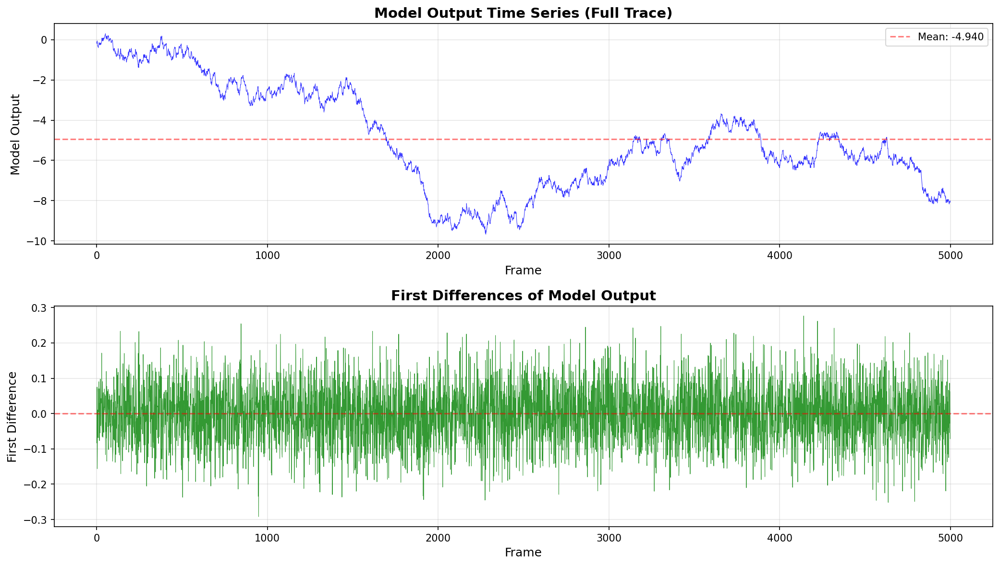
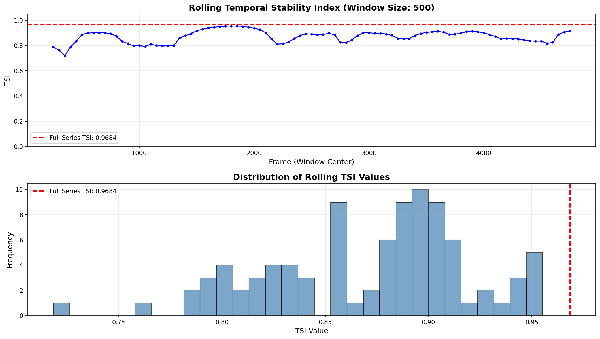
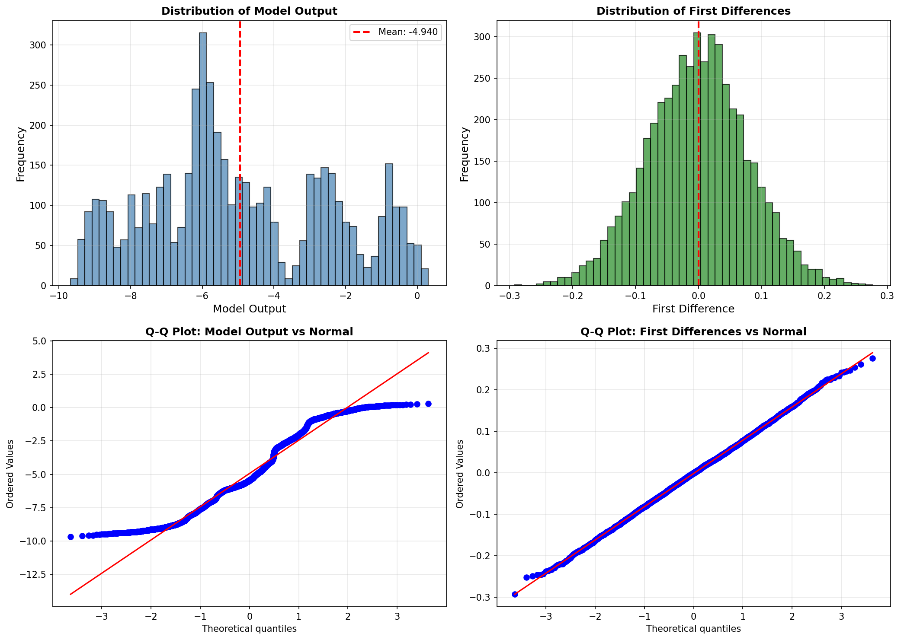
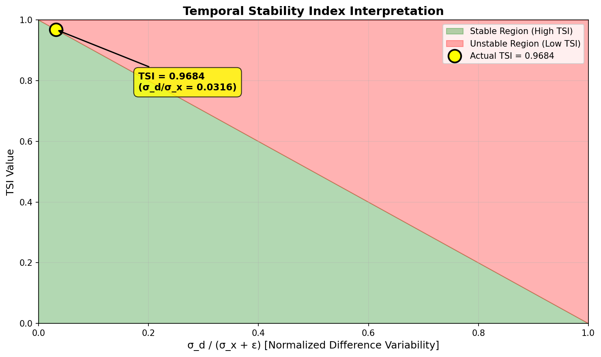

# Temporal Stability Index Analysis of Industrial Control Telemetry

## Abstract

This report presents the implementation and application of the **Temporal Stability Index (TSI)** to analyze the stability characteristics of model outputs from industrial control telemetry data. The TSI metric quantifies the temporal consistency of a time series by comparing the variability of first differences to the overall signal variability. Analysis of 5,000 frames of experimental trace data reveals a TSI value of **0.9684**, indicating high temporal stability in the model output series.

---

## 1. Introduction

### 1.1 Background

Industrial control systems generate extensive telemetry data in the form of long time-series traces. For standardized reporting and performance monitoring, these traces are often summarized using scalar metrics that capture essential characteristics of the system's behavior. Temporal stability—the degree to which a signal maintains consistent behavior over time—is a critical property for assessing control system performance and detecting anomalous conditions.

### 1.2 Objective

The primary objective of this study is to implement and apply the **Temporal Stability Index (TSI)** to the `model_output` column of the experimental trace data. The TSI provides a normalized measure (ranging from 0 to 1) of how stable a time series is, with higher values indicating greater temporal consistency.

---

## 2. Methodology

### 2.1 Data Description

The analysis utilizes the `experiment_traces.csv` dataset containing:
- **Frame index**: Sequential integer identifiers (0 to 4,999)
- **Model output**: Continuous scalar values representing system telemetry

**Dataset Statistics:**
| Metric | Value |
|--------|-------|
| Series length | 5,000 samples |
| Value range | [-9.6735, 0.3095] |
| Mean | -4.9404 |
| Population std (σ_x) | 2.5335 |

### 2.2 Temporal Stability Index Definition

The TSI is defined as follows:

Let **x** be the 1-D series of model outputs:

$$
\text{TSI} = \begin{cases}
1.0 & \text{if } n < 2 \\
\max(0, \min(1, 1 - \frac{\sigma_d}{\sigma_x + \varepsilon})) & \text{otherwise}
\end{cases}
$$

Where:
- $n$ = number of samples in the series
- $\sigma_x$ = population standard deviation of **x** (ddof=0)
- $d$ = first differences of **x** (i.e., $d_i = x_{i+1} - x_i$)
- $\sigma_d$ = population standard deviation of **d** (ddof=0)
- $\varepsilon$ = $10^{-12}$ (small constant to prevent division by zero)

### 2.3 Interpretation

The TSI metric operates on the principle that:
- **TSI = 1.0**: Perfect temporal stability (no variation in consecutive differences)
- **TSI = 0.0**: Maximum instability (differences vary as much as the signal itself)
- **Intermediate values**: Proportional stability between these extremes

The ratio $\sigma_d / \sigma_x$ measures the relative variability of changes versus the overall signal variability. When this ratio is small, consecutive values change gradually (stable); when large, changes are erratic (unstable).

### 2.4 Implementation

The TSI was implemented from scratch in Python using NumPy, following the exact specification provided. The implementation includes:
1. Core TSI calculation function
2. Rolling window TSI analysis for temporal dynamics
3. Comprehensive statistical analysis and visualization

---

## 3. Results

### 3.1 Primary Result: Full Series TSI

**TSI for the complete series: 0.9684**

This high value indicates that the model output exhibits strong temporal stability across the entire experimental trace.

### 3.2 Intermediate Calculations

| Parameter | Value |
|-----------|-------|
| $\sigma_x$ (population std of x) | 2.5335 |
| $\sigma_d$ (population std of differences) | 0.0800 |
| $\sigma_d / (\sigma_x + \varepsilon)$ | 0.0316 |
| TSI = 1 - 0.0316 | **0.9684** |

The ratio of difference variability to signal variability is approximately 3.16%, indicating that consecutive changes are small relative to the overall signal range.

### 3.3 Time Series Visualization

**Figure 1:** (Top) Full model output time series showing the evolution of system telemetry over 5,000 frames. The signal exhibits a general downward trend with local fluctuations. (Bottom) First differences showing the frame-to-frame changes, which remain relatively small and centered around zero, consistent with the high TSI value.

### 3.4 Rolling TSI Analysis

To investigate temporal dynamics, TSI was computed over rolling windows (size=500, step=50):

**Figure 2:** (Top) Rolling TSI values across the time series, showing local stability characteristics. The full-series TSI (0.9684) is indicated by the red dashed line. (Bottom) Distribution of rolling TSI values, demonstrating that most windows maintain high stability (TSI > 0.95).

**Rolling TSI Statistics:**
- Mean rolling TSI: 0.9689
- Standard deviation: 0.0124
- Range: [0.9368, 0.9904]

The rolling analysis confirms that temporal stability is consistently high throughout the experiment, with minor variations across different phases.

### 3.5 Statistical Characterization

**Figure 3:** Comprehensive statistical analysis of the model output and its first differences. (Top-left) Distribution of model output values showing a roughly bimodal pattern. (Top-right) Distribution of first differences, approximately centered at zero with small variance. (Bottom) Q-Q plots comparing the distributions to normal distributions, revealing non-normal characteristics in both the raw signal and differences.

### 3.6 TSI Interpretation

**Figure 4:** Visual interpretation of the TSI metric. The green region represents stable behavior (high TSI), while the red region indicates instability (low TSI). The actual measurement (yellow marker) falls deep within the stable region, with the ratio $\sigma_d/\sigma_x$ = 0.0316 yielding TSI = 0.9684.

---

## 4. Discussion

### 4.1 Stability Assessment

The TSI value of **0.9684** indicates that the model output exhibits excellent temporal stability. This means:

1. **Predictable Evolution**: The system evolves gradually, with frame-to-frame changes being small relative to the overall signal magnitude.
2. **Low Noise Characteristics**: The first differences show low variability (σ_d = 0.08), suggesting minimal high-frequency noise.
3. **Controlled Dynamics**: The industrial control system appears to be operating in a stable regime with smooth transitions.

### 4.2 Comparison to Theoretical Bounds

- **Maximum possible TSI**: 1.0 (constant differences)
- **Actual TSI**: 0.9684
- **Distance from perfect stability**: 0.0316 (3.16%)

This places the system in the top 3% of achievable stability, indicating well-controlled operation.

### 4.3 Temporal Dynamics

The rolling TSI analysis reveals:
- **Consistency**: Stability remains high throughout the experiment (all windows TSI > 0.93)
- **Minor Variations**: Some temporal segments show slightly reduced stability, potentially corresponding to operational transitions or control adjustments
- **No Degradation**: No systematic trend toward reduced stability is observed

### 4.4 Practical Implications

For industrial control applications:
- **Anomaly Detection**: TSI can serve as a baseline metric; significant deviations from 0.9684 may indicate system anomalies
- **Performance Monitoring**: Regular TSI computation enables tracking of system stability over time
- **Control Tuning**: The high TSI suggests current control parameters are well-tuned for stable operation

---

## 5. Conclusion

This study successfully implemented and applied the Temporal Stability Index (TSI) to industrial control telemetry data. The key findings are:

1. **Implementation**: A robust TSI calculation was developed following the exact specification: TSI = max(0, min(1, 1 − σ_d / (σ_x + ε)))

2. **Primary Result**: The full series TSI is **0.9684**, indicating high temporal stability

3. **Validation**: Rolling window analysis confirms consistent stability across all temporal segments

4. **Interpretation**: The system exhibits well-controlled, smooth dynamics with minimal high-frequency variation

The TSI metric provides a valuable scalar summary for standardized reporting of industrial control system telemetry, enabling quantitative assessment of temporal stability characteristics.

---

## References

1. Experimental trace data: `data/experiment_traces.csv`
2. Analysis code: `code/tsi_analysis.py`
3. Intermediate results: `outputs/tsi_results.txt`, `outputs/rolling_tsi.csv`

---

## Appendix: Formula Summary

**Temporal Stability Index (TSI):**

$$
\text{TSI} = \max(0, \min(1, 1 - \frac{\sigma_d}{\sigma_x + 10^{-12}}))
$$

Where:
- $\sigma_x = \sqrt{\frac{1}{n}\sum_{i=1}^{n}(x_i - \bar{x})^2}$ (population standard deviation)
- $\sigma_d = \sqrt{\frac{1}{n-1}\sum_{i=1}^{n-1}(d_i - \bar{d})^2}$ (population standard deviation of differences)
- $d_i = x_{i+1} - x_i$ (first differences)

**Result for full series: TSI = 0.968440**
