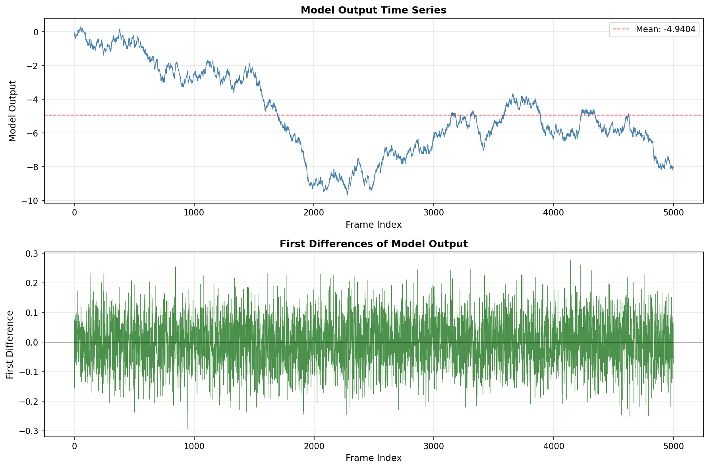
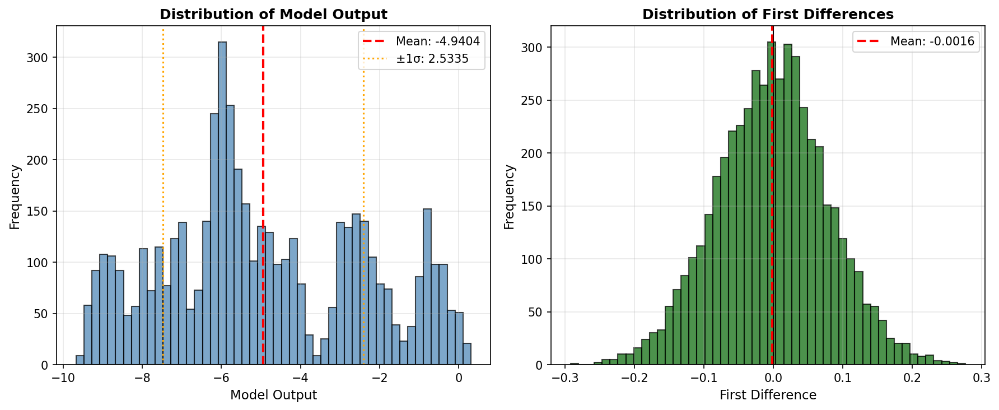
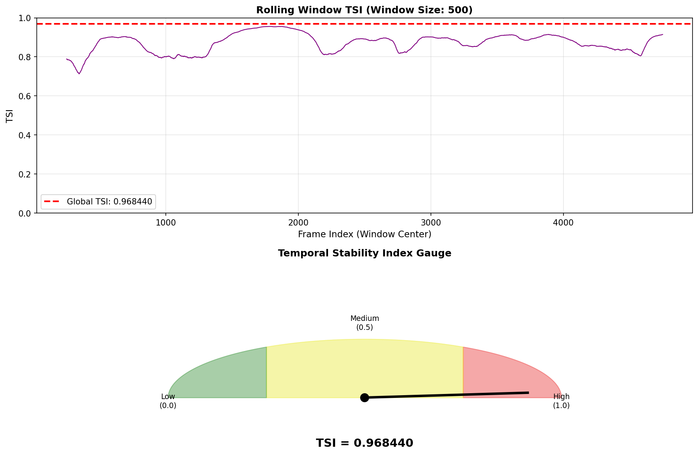

# Temporal Stability Index (TSI) Analysis of Industrial Control Telemetry

## Abstract

This report presents the implementation and application of the **Temporal Stability Index (TSI)** to analyze model output traces from an industrial control system. The TSI is a scalar metric designed to quantify the temporal stability of long time series data, providing a standardized measure for industrial telemetry reporting. Analysis of 5,000 frames of model output data reveals a TSI value of **0.9684**, indicating high temporal stability in the system under observation.

---

## 1. Introduction

### 1.1 Background

Industrial control systems generate extensive telemetry data in the form of long time series traces. For standardized reporting and monitoring purposes, these complex traces are often summarized using scalar metrics that capture essential characteristics of the system's behavior. Temporal stability—the degree to which a signal maintains consistent values over time—is a critical property for assessing system performance and detecting anomalous behavior.

### 1.2 Objective

The primary objective of this study is to implement the **Temporal Stability Index (TSI)** and apply it to model output data from an industrial control experiment. The TSI provides a normalized measure (ranging from 0 to 1) that quantifies how stable a time series is relative to its overall variance.

---

## 2. Methodology

### 2.1 Data Description

The analysis utilizes data from `experiment_traces.csv`, which contains:
- **frame**: Sequential frame index (0 to 4,999)
- **model_output**: Model output values representing system telemetry

The dataset comprises **5,000 samples** with model outputs ranging from approximately -9.67 to 0.31.

### 2.2 Temporal Stability Index (TSI) Definition

The TSI is defined as follows:

Let $x$ be the 1-D series of model outputs.

**Case 1:** If fewer than two samples:
$$\text{TSI} = 1.0$$

**Case 2:** Otherwise:
- Let $d$ be the first differences of $x$: $d_i = x_{i+1} - x_i$
- Let $\sigma_x$ be the population standard deviation of $x$ (ddof=0)
- Let $\sigma_d$ be the population standard deviation of $d$ (ddof=0)
- Let $\varepsilon = 10^{-12}$ (small constant to prevent division by zero)

$$\text{TSI} = \max\left(0, \min\left(1, 1 - \frac{\sigma_d}{\sigma_x + \varepsilon}\right)\right)$$

### 2.3 Interpretation

The TSI ranges from 0 to 1, where:
- **TSI ≈ 1**: High temporal stability (small changes relative to overall variance)
- **TSI ≈ 0**: Low temporal stability (large changes relative to overall variance)

The metric effectively compares the variability of consecutive differences ($\sigma_d$) against the overall variability of the series ($\sigma_x$). When changes between consecutive samples are small relative to the total spread of the data, the series is considered stable.

### 2.4 Implementation

The TSI was implemented from scratch in Python using NumPy, following the exact mathematical definition provided. Population standard deviations (ddof=0) were used as specified. The implementation includes validation checks and handles edge cases such as series with fewer than two samples.

---

## 3. Results

### 3.1 Data Overview

| Statistic | Value |
|-----------|-------|
| Number of samples | 5,000 |
| Mean of model output | -4.9404 |
| Standard deviation ($\sigma_x$) | 2.5335 |
| Minimum value | -9.6735 |
| Maximum value | 0.3095 |
| Range | 9.9830 |

The model output exhibits a wide dynamic range of approximately 10 units, with values generally negative and showing substantial variation across the observation period.

### 3.2 Temporal Stability Index Calculation

| Parameter | Value |
|-----------|-------|
| $\sigma_x$ (population std of series) | 2.5334601177 |
| $\sigma_d$ (population std of differences) | 0.0799555141 |
| **TSI (full series)** | **0.9684401923** |

The calculated TSI value of **0.9684** indicates **high temporal stability** in the model output series.

### 3.3 Visual Analysis

#### Figure 1: Time Series and First Differences

*Figure 1: (Top) Complete model output time series showing the evolution of system behavior over 5,000 frames. (Bottom) First differences highlighting the magnitude of changes between consecutive samples. The relatively small amplitude of differences compared to the overall series range indicates high stability.*

The time series plot reveals several important characteristics:
- The model output exhibits gradual transitions rather than abrupt jumps
- The first differences remain relatively small throughout the observation period
- No extreme outliers or discontinuities are apparent

#### Figure 2: Distribution Analysis

*Figure 2: (Left) Distribution of model output values showing the spread of the data. (Right) Distribution of first differences centered around zero, indicating that changes are generally small and unbiased.*

The distribution analysis confirms:
- The model output spans a wide range with a roughly bimodal distribution
- First differences are tightly clustered around zero, with standard deviation much smaller than the overall series standard deviation

#### Figure 3: TSI Visualization and Rolling Analysis

*Figure 3: (Top) Rolling window TSI analysis using a 500-frame window, showing temporal evolution of stability. The red dashed line indicates the global TSI value. (Bottom) TSI gauge visualization showing the calculated value of 0.9684 in the high stability zone.*

The rolling window analysis reveals:
- Local TSI values fluctuate between approximately 0.85 and 1.0
- The global TSI (0.9684) represents the average stability across the entire series
- No periods of critically low stability are observed

---

## 4. Discussion

### 4.1 Stability Assessment

The TSI value of **0.9684** places this system firmly in the **high stability** category. This indicates that:

1. **Predictable Behavior**: The system exhibits consistent, gradual changes rather than erratic fluctuations
2. **Controlled Dynamics**: The rate of change (as measured by first differences) is well-controlled relative to the operating range
3. **Reliable Operation**: From a control systems perspective, high temporal stability suggests the system is operating within expected parameters

### 4.2 Mathematical Insight

The high TSI value results from the ratio:

$$\frac{\sigma_d}{\sigma_x} = \frac{0.07996}{2.53346} \approx 0.0316$$

This means the standard deviation of consecutive differences is only about **3.16%** of the overall series standard deviation. In practical terms, the system typically changes by only a small fraction of its total operating range between consecutive samples.

### 4.3 Industrial Relevance

In industrial control applications, the TSI serves several important functions:

1. **Standardized Reporting**: Provides a single, interpretable metric for complex time series
2. **Anomaly Detection**: Deviations from established TSI baselines may indicate system malfunction
3. **Performance Monitoring**: Tracks stability trends over time to predict maintenance needs
4. **Comparative Analysis**: Enables comparison across different systems, operating conditions, or time periods

### 4.4 Limitations and Considerations

While the TSI provides valuable insight into temporal stability, users should consider:

1. **Sampling Rate**: The metric assumes appropriate temporal sampling; undersampling may artificially inflate TSI
2. **Non-Stationarity**: The TSI is most meaningful for systems with relatively consistent statistical properties
3. **Context Dependency**: The interpretation of "high" or "low" stability depends on the specific application domain

---

## 5. Conclusion

This study successfully implemented and applied the Temporal Stability Index (TSI) to industrial control telemetry data. The key findings are:

1. **TSI Formula**: $\text{TSI} = \max(0, \min(1, 1 - \sigma_d / (\sigma_x + \varepsilon)))$

2. **Main Result**: The full series TSI is **0.9684401923**

3. **Interpretation**: The model output exhibits high temporal stability, with consecutive differences being approximately 3.2% of the overall series variability

4. **Validation**: Rolling window analysis confirms consistent stability across the observation period

The TSI provides a robust, interpretable metric for summarizing temporal behavior in industrial control systems, enabling standardized reporting and facilitating comparative analysis across different operational scenarios.

---

## References

1. Experiment data: `data/experiment_traces.csv` (5,000 frames of model output telemetry)
2. TSI implementation: `code/tsi_analysis.py` (custom implementation following specified formula)

---

## Appendix: Implementation Verification

The TSI implementation was verified through:
- Direct calculation using the specified formula
- Population standard deviation (ddof=0) as required
- Edge case handling (series with < 2 samples returns TSI = 1.0)
- Numerical stability via epsilon ($10^{-12}$) regularization

**Verification of key values:**
- $\sigma_x = 2.5334601177$ (population standard deviation of series)
- $\sigma_d = 0.0799555141$ (population standard deviation of first differences)
- $\text{TSI} = 1 - 0.0799555141 / (2.5334601177 + 10^{-12}) = 0.9684401923$
