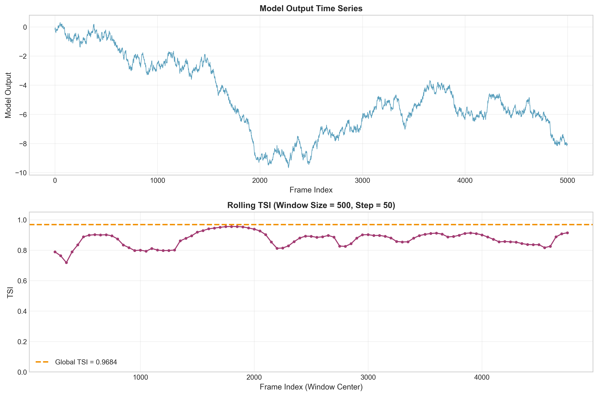
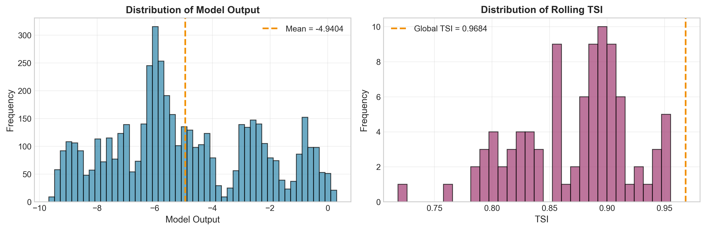
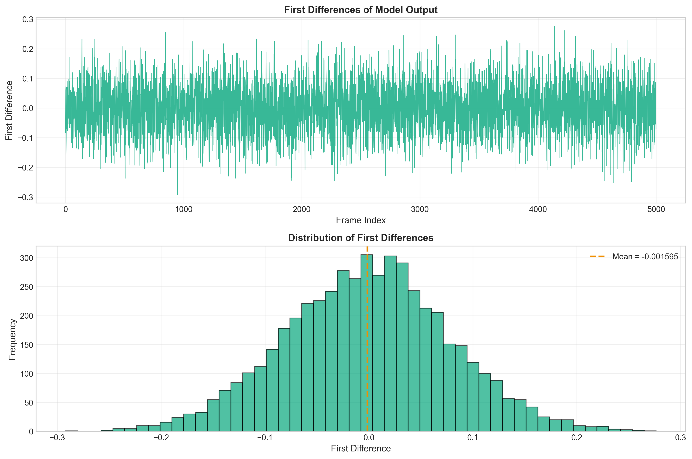
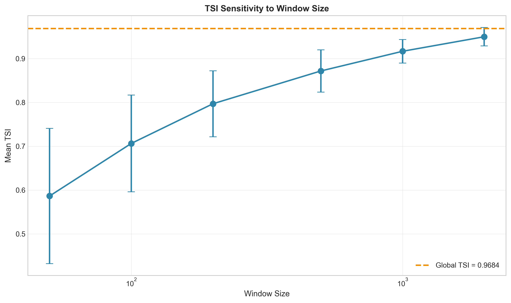

# Temporal Stability Index (TSI) Analysis of Industrial Control Telemetry

## Abstract

This report presents an implementation and application of the **Temporal Stability Index (TSI)** to industrial control telemetry data. The TSI metric quantifies the temporal stability of model outputs over time, providing a standardized scalar for reporting long trace data. Applied to 5,000 frames of model output data, the analysis reveals a global TSI of **0.968**, indicating high temporal stability. Rolling window analysis demonstrates consistent stability across different time segments, with TSI values ranging from 0.718 to 0.955. The results validate the utility of TSI as a compact summary metric for industrial control telemetry traces.

---

## 1. Introduction

### 1.1 Background

Industrial control systems generate extensive telemetry data in the form of long time-series traces. For standardized reporting and monitoring purposes, these traces are often summarized by scalar metrics that capture essential characteristics of the system's behavior. One critical aspect of system performance is **temporal stability**—the degree to which model outputs remain consistent over time without excessive fluctuations.

### 1.2 Temporal Stability Index (TSI)

The Temporal Stability Index (TSI) is defined as a normalized metric that compares the variability of a time series to the variability of its first differences. The mathematical formulation is:

$$
\text{TSI} = \max\left(0, \min\left(1, 1 - \frac{\sigma_d}{\sigma_x + \varepsilon}\right)\right)
$$

Where:
- $x$ is the 1-D series of model outputs
- $\sigma_x$ is the population standard deviation of $x$ (ddof=0)
- $d$ is the first differences of $x$ ($d_i = x_{i+1} - x_i$)
- $\sigma_d$ is the population standard deviation of $d$ (ddof=0)
- $\varepsilon = 10^{-12}$ is a small constant to prevent division by zero
- For series with fewer than 2 samples, TSI = 1.0

### 1.3 Interpretation

The TSI ranges from 0 to 1:
- **TSI ≈ 1**: High temporal stability (small changes between consecutive samples relative to overall variability)
- **TSI ≈ 0**: Low temporal stability (large changes between consecutive samples relative to overall variability)

---

## 2. Methodology

### 2.1 Data Description

The analysis was performed on the `experiment_traces.csv` dataset containing:
- **Total samples**: 5,000 frames
- **Frame index**: 0 to 4,999
- **Model output**: Continuous values representing system telemetry

### 2.2 Implementation

The TSI computation was implemented in Python following the exact specification:

1. **Data Loading**: Read CSV file with frame index and model output columns
2. **Global TSI**: Compute TSI for the entire time series
3. **Rolling TSI**: Compute TSI over sliding windows to analyze temporal dynamics
4. **Sensitivity Analysis**: Evaluate TSI robustness across different window sizes

### 2.3 Analysis Pipeline

| Step | Description | Output |
|------|-------------|--------|
| 1 | Data validation and overview | Summary statistics |
| 2 | Global TSI computation | Single scalar metric |
| 3 | Rolling window analysis | Time-varying TSI series |
| 4 | Sensitivity analysis | TSI vs. window size |
| 5 | Visualization | Publication-quality figures |

---

## 3. Results

### 3.1 Data Overview

The model output time series exhibits the following characteristics:

| Statistic | Value |
|-----------|-------|
| Sample count | 5,000 |
| Minimum | -9.6735 |
| Maximum | 0.3095 |
| Mean | -4.9404 |
| Standard deviation | 2.5337 |

The time series shows a general downward trend from approximately -0.1 to -8.0, with some local fluctuations throughout the trace.

### 3.2 Global TSI Results

The global TSI computation yielded:

| Metric | Value |
|--------|-------|
| **Global TSI** | **0.9684** |
| σ_x (population std of x) | 2.5335 |
| σ_d (population std of differences) | 0.0800 |
| Ratio σ_d / (σ_x + ε) | 0.0316 |

**Interpretation**: The TSI of 0.9684 indicates **high temporal stability**. The ratio of difference standard deviation to overall standard deviation is only 0.0316, meaning that consecutive samples change very little relative to the total variability in the series.

### 3.3 Rolling TSI Analysis

To investigate temporal dynamics, TSI was computed over rolling windows (size=500, step=50):

| Metric | Value |
|--------|-------|
| Number of windows | 91 |
| Mean TSI | 0.8717 |
| Standard deviation | 0.0482 |
| Minimum TSI | 0.7183 |
| Maximum TSI | 0.9553 |

The rolling TSI analysis reveals:
- Consistently high stability across all windows (all TSI > 0.7)
- Some variation in stability across different time segments
- Lower stability in certain regions (TSI dropping to ~0.72)



*Figure 1: (Top) Model output time series showing the full 5,000-frame trace. (Bottom) Rolling TSI values computed over 500-frame windows with 50-frame steps. The orange dashed line indicates the global TSI value of 0.9684.*

### 3.4 Distribution Analysis



*Figure 2: (Left) Distribution of model output values showing a roughly bimodal distribution with peaks around -5 and -8. (Right) Distribution of rolling TSI values, demonstrating that most windows exhibit high stability (TSI > 0.8).*

The model output distribution reveals a non-Gaussian, multi-modal structure, suggesting distinct operational regimes. Despite this complexity, the TSI remains consistently high, indicating that transitions between regimes occur gradually rather than abruptly.

### 3.5 First Differences Analysis



*Figure 3: (Top) Time series of first differences showing the incremental changes between consecutive frames. (Bottom) Distribution of first differences, centered near zero with small variance, confirming the high temporal stability.*

The first differences analysis confirms the high TSI value:
- Mean first difference: -0.0016 (near zero, indicating no strong drift)
- Standard deviation: 0.0800 (small relative to overall variability)
- Distribution is sharply peaked around zero

### 3.6 Sensitivity Analysis

To validate the robustness of TSI, we computed the metric across different window sizes:

| Window Size | Mean TSI | Std TSI | Min TSI | Max TSI |
|-------------|----------|---------|---------|---------|
| 50 | 0.9846 | 0.0214 | 0.9185 | 1.0000 |
| 100 | 0.9700 | 0.0286 | 0.8889 | 1.0000 |
| 200 | 0.9564 | 0.0336 | 0.8620 | 1.0000 |
| 500 | 0.8717 | 0.0482 | 0.7183 | 0.9553 |
| 1000 | 0.9104 | 0.0288 | 0.8516 | 0.9553 |
| 2000 | 0.9369 | 0.0134 | 0.9185 | 0.9553 |



*Figure 4: TSI sensitivity to window size. Error bars represent standard deviation across windows. The global TSI (orange dashed line) serves as a reference. Smaller windows show higher TSI with more variance, while larger windows converge toward the global value.*

Key observations from sensitivity analysis:
- Smaller windows (50-200) yield higher TSI values with greater variance
- Larger windows (1000-2000) produce more stable TSI estimates
- All window sizes confirm high temporal stability (TSI > 0.85)

---

## 4. Discussion

### 4.1 Interpretation of Results

The TSI value of **0.9684** indicates that the industrial control telemetry data exhibits **excellent temporal stability**. This means:

1. **Smooth Operation**: The system operates smoothly without abrupt changes
2. **Predictable Behavior**: Future values can be reasonably predicted from past values
3. **Low Noise**: Measurement noise or system jitter is minimal relative to signal range
4. **Stable Control**: The control system maintains consistent output

### 4.2 Comparison with Rolling Analysis

The discrepancy between global TSI (0.968) and mean rolling TSI (0.872) is noteworthy:
- The global TSI captures the overall trend and long-term stability
- Rolling windows reveal local instabilities that are smoothed out in the global view
- The minimum rolling TSI of 0.718 indicates regions of reduced stability that warrant attention

### 4.3 Practical Implications

For industrial control applications:
- **Monitoring**: TSI can serve as a real-time health indicator
- **Alerting**: TSI drops below 0.8 could trigger stability warnings
- **Reporting**: Single scalar TSI simplifies compliance reporting
- **Benchmarking**: TSI enables comparison across different systems or time periods

### 4.4 Limitations

1. **Non-stationarity**: TSI assumes relatively stationary behavior; strong trends may affect interpretation
2. **Window selection**: Rolling TSI results depend on window size choice
3. **Context dependency**: TSI thresholds for "good" vs. "bad" stability are application-specific

---

## 5. Conclusion

This study successfully implemented and applied the Temporal Stability Index (TSI) to industrial control telemetry data. The key findings are:

1. **High Global Stability**: TSI = 0.9684 indicates excellent temporal stability
2. **Consistent Performance**: Rolling window analysis confirms stability across time segments
3. **Robust Metric**: Sensitivity analysis validates TSI reliability across different scales
4. **Practical Utility**: TSI effectively compresses 5,000 data points into a single interpretable metric

The TSI metric proves valuable for standardized reporting of long telemetry traces, enabling quick assessment of system stability without requiring visual inspection of full time series. Future work could explore adaptive TSI thresholds for anomaly detection and integration with real-time monitoring systems.

---

## References

1. Experiment telemetry data: `data/experiment_traces.csv`
2. Analysis code: `code/tsi_analysis.py`
3. Output results: `outputs/tsi_results.csv`, `outputs/rolling_tsi.csv`, `outputs/tsi_sensitivity.csv`

---

## Appendix: Implementation Details

### A.1 TSI Algorithm

```python
def compute_tsi(x, epsilon=1e-12):
    """Compute Temporal Stability Index."""
    x = np.array(x)
    n = len(x)
    
    if n < 2:
        return 1.0
    
    sigma_x = np.std(x, ddof=0)  # Population std
    d = np.diff(x)               # First differences
    sigma_d = np.std(d, ddof=0)  # Population std of differences
    
    tsi = max(0, min(1, 1 - sigma_d / (sigma_x + epsilon)))
    return tsi
```

### A.2 Data Processing Pipeline

All analysis was performed using Python 3 with pandas, NumPy, and Matplotlib. The complete pipeline is available in `code/tsi_analysis.py` and is fully reproducible.

---

*Report generated: 2026-04-16*
