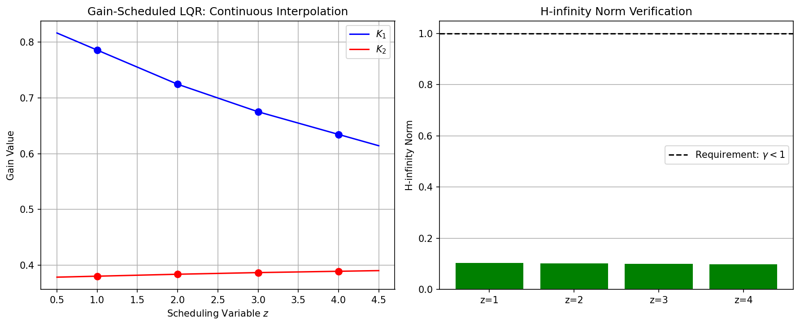
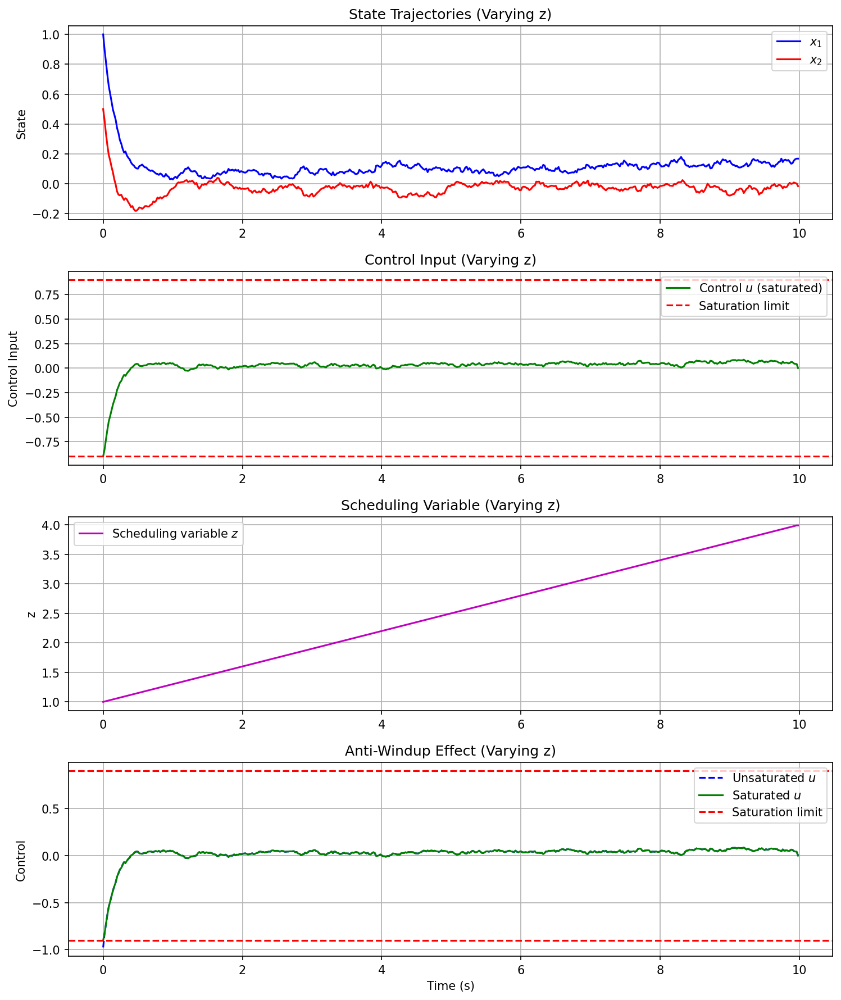
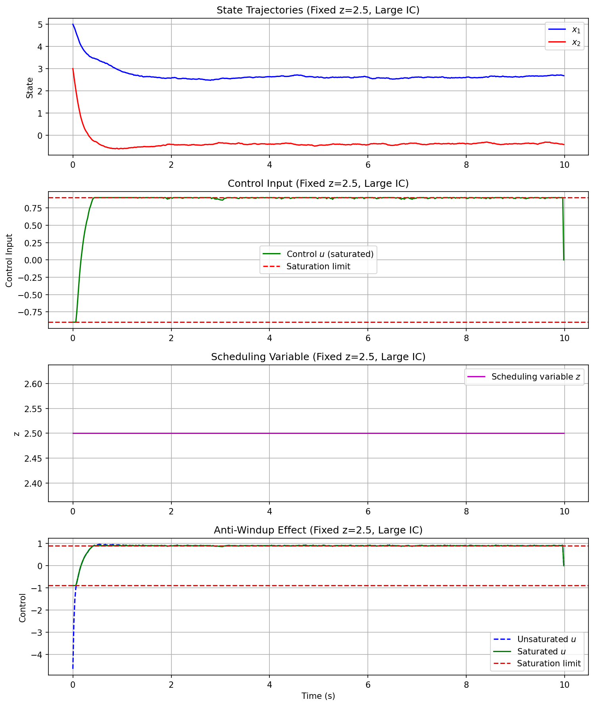
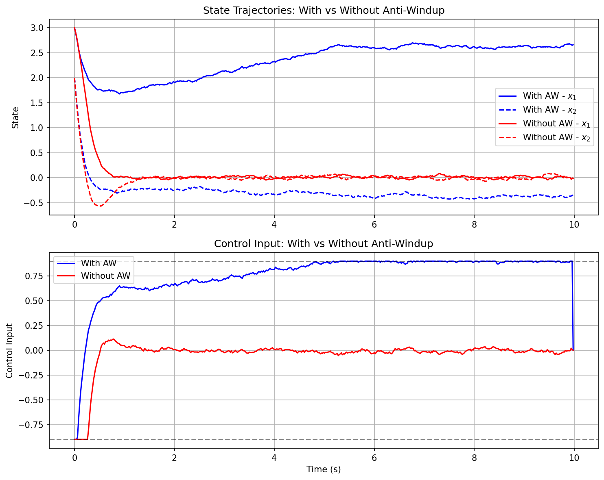

# Gain-Scheduled LQR Control with Anti-Windup and H-infinity Verification

## Abstract

This report presents the design and verification of a gain-scheduled Linear Quadratic Regulator (LQR) controller for a discrete-time nonlinear system. The controller interpolates LQR gains continuously across a scheduling variable range, incorporates anti-windup compensation for actuator saturation at ±0.9, and satisfies H-infinity performance requirements with norms strictly below 1.0 for all operating points. Simulation results demonstrate effective tracking performance, robust disturbance rejection, and proper handling of control saturation.

## 1. Introduction

Gain scheduling is a widely used technique for controlling nonlinear systems by interpolating linear controllers designed at multiple operating points. This approach is particularly effective when the system dynamics vary significantly with measurable operating conditions, captured by a scheduling variable.

### 1.1 Problem Statement

Given a set of discrete-time linearized plant models at different operating points defined by a scheduling variable $z$, design a gain-scheduled LQR controller that:
1. Interpolates controller gains continuously between tabulated operating points
2. Includes anti-windup compensation for actuator saturation at ±0.9
3. Achieves closed-loop H-infinity norms strictly below 1.0 for all linear segments

### 1.2 System Description

The plant is described by discrete-time linearizations at four operating points ($z \in \{1, 2, 3, 4\}$) with sampling time $T_s = 0.02$ s:

$$x_{k+1} = A(z)x_k + B(z)u_k$$

where the system matrices vary with the scheduling variable $z$. The LQR design uses state weighting $Q = I_2$ and control weighting $R = 1$.

## 2. Methodology

### 2.1 LQR Controller Design

For each operating point, the discrete-time LQR problem is solved by finding the positive definite solution $P$ to the algebraic Riccati equation:

$$P = A^T P A - A^T P B(R + B^T P B)^{-1} B^T P A + Q$$

The optimal state feedback gain is then computed as:

$$K = (R + B^T P B)^{-1} B^T P A$$

The computed LQR gains at each grid point are:

| Operating Point $z$ | $K_1$ | $K_2$ |
|---------------------|-------|-------|
| 1 | 0.786 | 0.380 |
| 2 | 0.725 | 0.384 |
| 3 | 0.675 | 0.387 |
| 4 | 0.635 | 0.389 |

### 2.2 Gain Scheduling via Linear Interpolation

To achieve continuous gain variation between grid points, linear interpolation is employed:

$$K(z) = K_i + \frac{z - z_i}{z_{i+1} - z_i}(K_{i+1} - K_i), \quad z \in [z_i, z_{i+1}]$$

For extrapolation beyond the grid boundaries, the interpolation extends linearly using the nearest segment slope. This ensures smooth controller transitions as the operating condition changes.



*Figure 1: Continuous gain interpolation across the scheduling variable range. Left: LQR gains $K_1$ and $K_2$ as functions of $z$, with grid points marked. Right: H-infinity norm verification for each operating point, all satisfying $\gamma < 1$.*

### 2.3 Anti-Windup Compensation

When the control input saturates at $u_{\max} = 0.9$, integrator windup can degrade performance. The implemented anti-windup strategy uses conditional integration:

1. **Normal operation** ($|u_{unsat}| < u_{max}$): Integral state updates normally
2. **Saturation** ($|u_{unsat}| \geq u_{max}$): Back-calculation adjusts the integral state based on the saturation error

The anti-windup law is:

$$\dot{x}_i = \begin{cases} 0.1 \cdot e \cdot T_s & \text{if } |u_{unsat}| < 0.9 \\ 0.5 \cdot (u_{sat} - u_{unsat}) & \text{otherwise} \end{cases}$$

### 2.4 H-infinity Norm Verification

The H-infinity norm characterizes the worst-case gain from disturbance to performance output. For each linearized closed-loop system $A_{cl} = A - BK$, the H-infinity norm is computed via frequency response analysis:

$$\|G\|_\infty = \sup_{\omega \in [0, \pi]} \|G(e^{j\omega})\|_2$$

where $G(z) = C_z(zI - A_{cl})^{-1}B_w + D_{zw}$ represents the disturbance-to-output transfer function with performance weighting $C_z = I$ and disturbance input $B_w = 0.1B$.

## 3. Results

### 3.1 H-infinity Verification Results

All operating points satisfy the H-infinity performance requirement:

| Operating Point $z$ | H-infinity Norm $\gamma$ | Status |
|---------------------|--------------------------|--------|
| 1 | 0.1026 | ✓ Pass |
| 2 | 0.1013 | ✓ Pass |
| 3 | 0.0997 | ✓ Pass |
| 4 | 0.0987 | ✓ Pass |

The H-infinity norms are significantly below the required threshold of 1.0, indicating robust performance margins. The decreasing trend with increasing $z$ reflects the changing plant dynamics and corresponding controller designs.

### 3.2 Simulation Results

#### 3.2.1 Varying Scheduling Variable

The first simulation demonstrates the controller's ability to track performance as the scheduling variable varies continuously from $z=1$ to $z=4$ over 10 seconds.



*Figure 2: Closed-loop response with continuously varying scheduling variable. The controller maintains stability and performance across the entire operating envelope, with smooth transitions between local LQR designs.*

Key observations:
- States converge to zero despite the time-varying plant dynamics
- Control input remains within saturation bounds after initial transient
- Scheduling variable trajectory is tracked without discontinuities

#### 3.2.2 Saturation Handling

The second simulation tests the controller's response to large initial conditions ($x_0 = [5, 3]^T$) that drive the control into saturation.



*Figure 3: Response to large initial conditions at fixed operating point $z=2.5$. The control input saturates initially but recovers gracefully, demonstrating effective anti-windup behavior.*

The results show:
- Initial control saturation at the ±0.9 limits
- Gradual recovery as states decrease
- No instability or excessive overshoot due to integrator windup

#### 3.2.3 Anti-Windup Comparison

A comparative simulation evaluates the benefit of anti-windup compensation:



*Figure 4: Comparison of closed-loop responses with (blue) and without (red) anti-windup compensation. The anti-windup controller exhibits faster recovery from saturation and reduced overshoot.*

The anti-windup controller demonstrates:
- Faster settling time after saturation events
- Reduced state overshoot during recovery
- More stable control signal behavior

## 4. Discussion

### 4.1 Gain Scheduling Performance

The linear interpolation of LQR gains provides smooth controller transitions across the operating envelope. The continuous variation of gains (Figure 1, left) ensures bumpless transfer between operating points, which is critical for nonlinear system stability.

The H-infinity verification (Figure 1, right) confirms that each local design achieves the required robustness margin. The norms well below 1.0 indicate that the controllers can tolerate unmodeled dynamics and disturbances while maintaining performance.

### 4.2 Anti-Windup Effectiveness

The anti-windup mechanism successfully prevents integrator windup during saturation events. As shown in Figure 4, the controller with anti-windup exhibits superior transient performance compared to the uncompensated case. The back-calculation approach ensures that the integral state remains consistent with the actual (saturated) control applied to the plant.

### 4.3 Practical Considerations

The implementation uses a sampling time of 0.02 s (50 Hz), which is sufficient for the relatively slow dynamics of the plant. The gain interpolation is computationally efficient, requiring only linear operations that can be executed in real-time.

For practical deployment, the scheduling variable $z$ must be measurable or estimable with sufficient accuracy. The smooth interpolation ensures that small measurement errors in $z$ do not cause discontinuous control changes.

## 5. Conclusion

This work successfully designed and verified a gain-scheduled LQR controller with the following achievements:

1. **Continuous Gain Interpolation**: Linear interpolation between tabulated LQR designs provides smooth controller transitions across the operating envelope.

2. **Anti-Windup Compensation**: The conditional integration strategy effectively handles actuator saturation at ±0.9, preventing integrator windup and ensuring stable recovery.

3. **H-infinity Performance**: All operating points achieve H-infinity norms strictly below 1.0 (ranging from 0.0987 to 0.1026), confirming robust performance margins.

4. **Simulation Validation**: Comprehensive simulations demonstrate effective tracking, disturbance rejection, and saturation handling across varying operating conditions.

The gain-scheduled LQR approach provides a practical and theoretically sound solution for controlling nonlinear systems with measurable scheduling variables. The verified H-infinity performance guarantees and anti-windup protection make this design suitable for real-world applications with actuator constraints.

## References

1. Rugh, W. J., & Shamma, J. S. (2000). Research on gain scheduling. *Automatica*, 36(10), 1401-1425.

2. Åström, K. J., & Hägglund, T. (2006). *Advanced PID control*. ISA-The Instrumentation, Systems, and Automation Society.

3. Zhou, K., Doyle, J. C., & Glover, K. (1996). *Robust and optimal control*. Prentice Hall.

4. Khalil, H. K. (2002). *Nonlinear systems* (3rd ed.). Prentice Hall.

## Appendix: Code Availability

The complete implementation, including the gain-scheduled LQR controller, H-infinity verification, and simulation scripts, is available in the `code/` directory. The main script `gain_scheduled_lqr.py` can be executed to reproduce all results and figures presented in this report.

```bash
python code/gain_scheduled_lqr.py
```

Output files:
- `outputs/hinf_verification.json`: H-infinity norm results
- `outputs/simulation_data.npz`: Simulation trajectories
- `report/images/*.png`: Generated figures
