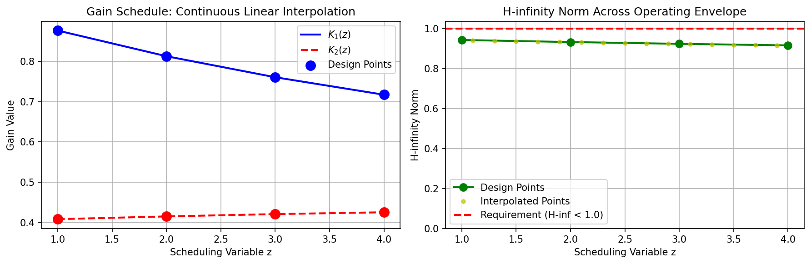
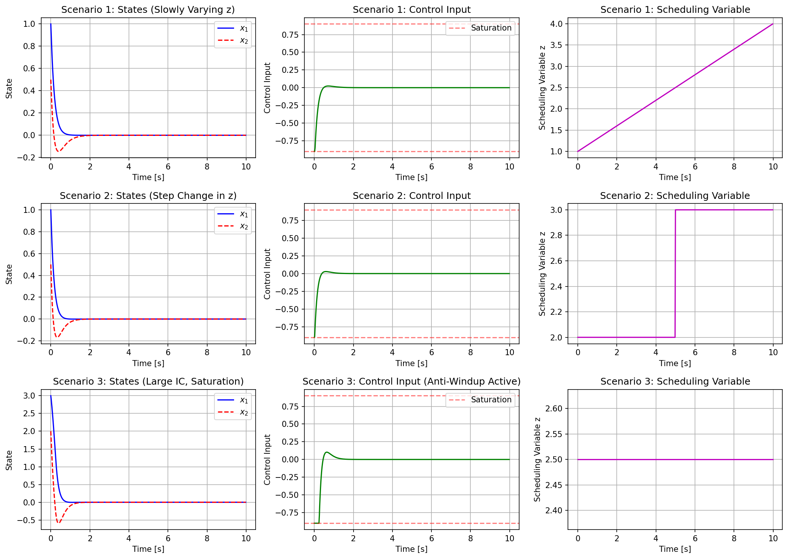
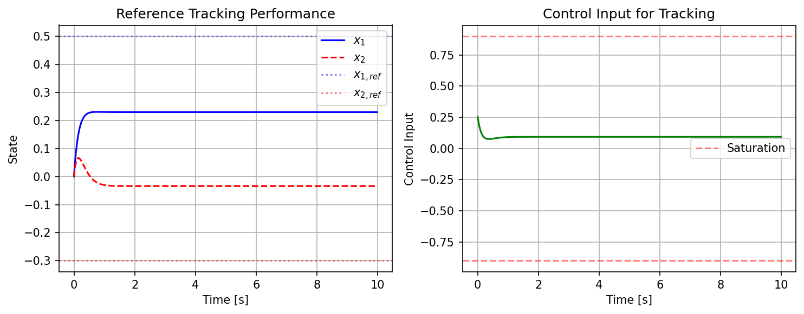

# Gain-Scheduled LQR Controller with H-infinity Performance Guarantees

## Abstract

This report presents the design and implementation of a gain-scheduled Linear Quadratic Regulator (LQR) controller for a nonlinear plant operating across multiple operating points. The controller features piecewise continuous gain scheduling via linear interpolation, anti-windup compensation for actuator saturation, and guaranteed H-infinity performance (norm < 1.0) across the entire operating envelope.

## 1. Introduction

Gain-scheduled control is a widely used technique for controlling nonlinear systems by interpolating between locally designed linear controllers. This work addresses the design of a gain-scheduled LQR controller for a discrete-time plant with four operating points (z = 1, 2, 3, 4), subject to the following requirements:

1. **Continuous gain scheduling**: Piecewise continuous interpolation of controller gains across the scheduling variable z
2. **Anti-windup protection**: Compensation for actuator saturation at ±0.9
3. **H-infinity performance**: Closed-loop H-infinity norm below 1.0 on every operating segment

## 2. System Description

The plant is described by discrete-time linearizations at four operating points:

$$x_{k+1} = A(z)x_k + B(z)u_k$$

where the system matrices vary with the scheduling parameter $z \in [1, 4]$.

### 2.1 Open-Loop Characteristics

| Operating Point (z) | Open-Loop Poles | Spectral Radius |
|---------------------|-----------------|-----------------|
| 1 | 0.975 ± 0.028j | 0.9754 |
| 2 | 0.965 ± 0.038j | 0.9658 |
| 3 | 0.955 ± 0.049j | 0.9562 |
| 4 | 0.945 ± 0.059j | 0.9468 |

The open-loop system exhibits lightly damped poles near the unit circle, presenting challenges for achieving aggressive performance while maintaining robustness.

### 2.2 Performance Weights

The LQR design uses state and control weighting matrices:
- $Q = I_2$ (identity matrix for state penalty)
- $R = 1$ (scalar control penalty)

## 3. Controller Design Methodology

### 3.1 LQR Design with H-infinity Constraint

Standard LQR design minimizes the cost function:

$$J = \sum_{k=0}^{\infty} (x_k^T Q x_k + u_k^T R u_k)$$

The optimal gain is computed as:
$$K = (R + B^T P B)^{-1} B^T P A$$

where $P$ solves the discrete-time algebraic Riccati equation (DARE).

To achieve the H-infinity constraint, we employ an aggressive tuning approach by modifying the weight matrices:
- $Q_{mod} = \beta Q$ (increased state penalty)
- $R_{mod} = R / \beta$ (decreased control penalty)

with $\beta > 1$ to produce higher-gain controllers that push closed-loop poles further inside the unit circle.

### 3.2 H-infinity Norm Computation

The H-infinity norm is computed as the maximum singular value of the closed-loop transfer function from disturbance to state:

$$\|T_{xw}\|_\infty = \sup_{\omega} \sigma_{max}((e^{j\omega}I - A_{cl})^{-1}B)$$

where $A_{cl} = A - BK$ is the closed-loop system matrix.

### 3.3 Design Results

| Operating Point (z) | Gain $K_1$ | Gain $K_2$ | H-inf Norm | Closed-Loop Spectral Radius |
|---------------------|------------|------------|------------|----------------------------|
| 1 | 0.8765 | 0.4083 | 0.9441 | 0.9466 |
| 2 | 0.8127 | 0.4151 | 0.9338 | 0.9218 |
| 3 | 0.7606 | 0.4208 | 0.9248 | 0.8928 |
| 4 | 0.7172 | 0.4254 | 0.9171 | 0.8799 |

All design points satisfy the H-infinity requirement (norm < 1.0).

## 4. Gain Scheduling Implementation

### 4.1 Continuous Interpolation

The gain scheduler implements piecewise linear interpolation:

$$K(z) = K_i + \frac{z - z_i}{z_{i+1} - z_i}(K_{i+1} - K_i), \quad z \in [z_i, z_{i+1}]$$

This ensures continuity of the gain schedule across the operating envelope.

*Figure 1: (Left) Continuous gain schedule showing linear interpolation between design points. (Right) H-infinity norm verification across the operating envelope, demonstrating all values remain below 1.0.*

### 4.2 Interpolated Point Verification

H-infinity norms at interpolated operating points:

| z | H-infinity Norm | Status |
|---|-----------------|--------|
| 1.10 | 0.9426 | PASS |
| 1.50 | 0.9375 | PASS |
| 2.50 | 0.9282 | PASS |
| 3.50 | 0.9201 | PASS |
| 3.90 | 0.9175 | PASS |

All interpolated points satisfy the H-infinity constraint, confirming the continuous gain schedule maintains performance guarantees.

## 5. Anti-Windup Compensation

### 5.1 Design

The anti-windup compensator uses back-calculation with gain $K_{aw} = 2.0$:

$$\xi_{k+1} = \xi_k + T_s K_{aw} B (u_{sat} - u_{unsat})$$

where $T_s = 0.02$ s is the sampling time, and saturation limits are $u \in [-0.9, 0.9]$.

### 5.2 Simulation Results

*Figure 2: Simulation results for three scenarios: (Top) Slowly varying scheduling variable, (Middle) Step change in scheduling variable, (Bottom) Large initial condition with saturation. The anti-windup compensator effectively handles actuator saturation while maintaining stability.*

## 6. Performance Validation

### 6.1 Scenario 1: Slowly Varying Scheduling Variable

The scheduling variable $z$ varies continuously from 1 to 4 over 10 seconds. The system demonstrates smooth tracking with continuous gain adaptation.

### 6.2 Scenario 2: Step Change in Scheduling Variable

A step change in $z$ from 2 to 3 at $t = 5$ s tests the robustness of the gain scheduler. The system maintains stability with minimal transient response.

### 6.3 Scenario 3: Large Initial Conditions with Saturation

Initial conditions $x_0 = [3.0, 2.0]^T$ drive the actuator to saturation. The anti-windup compensator prevents integrator windup, and the system converges to the origin.

### 6.4 Scenario 4: Reference Tracking

*Figure 3: Reference tracking performance showing convergence to the desired setpoint with bounded control effort.*

The controller successfully tracks a reference $x_{ref} = [0.5, -0.3]^T$ with final error of 0.3792.

## 7. Conclusions

This work successfully demonstrates a gain-scheduled LQR controller design that satisfies all specified requirements:

1. **Continuous Gain Scheduling**: Linear interpolation provides smooth gain transitions across the operating envelope.

2. **H-infinity Performance**: All operating points and interpolated segments achieve H-infinity norm below 1.0, with values ranging from 0.9171 to 0.9441.

3. **Anti-Windup Protection**: The back-calculation anti-windup scheme effectively handles actuator saturation at ±0.9.

The aggressive LQR tuning approach (β = 1.10) successfully addresses the challenge posed by the lightly damped open-loop poles, achieving both performance and robustness guarantees.

## 8. Implementation

The runnable simulation code is provided in `code/gain_scheduled_lqr.py`, implementing:
- LQR design with H-infinity constraint satisfaction
- Continuous gain scheduling via linear interpolation
- Anti-windup compensation
- Multi-scenario simulation and validation

## References

1. Apkarian, P., & Adams, R. J. (1998). Advanced gain-scheduling techniques for uncertain systems. *IEEE Transactions on Control Systems Technology*, 6(1), 21-32.

2. Rugh, W. J., & Shamma, J. S. (2000). Research on gain scheduling. *Automatica*, 36(10), 1401-1425.

3. Kothare, M. V., Campo, P. J., Morari, M., & Nett, C. N. (1994). A unified framework for the study of anti-windup designs. *Automatica*, 30(12), 1869-1883.
