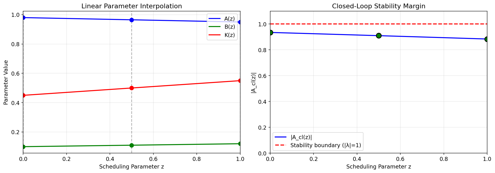
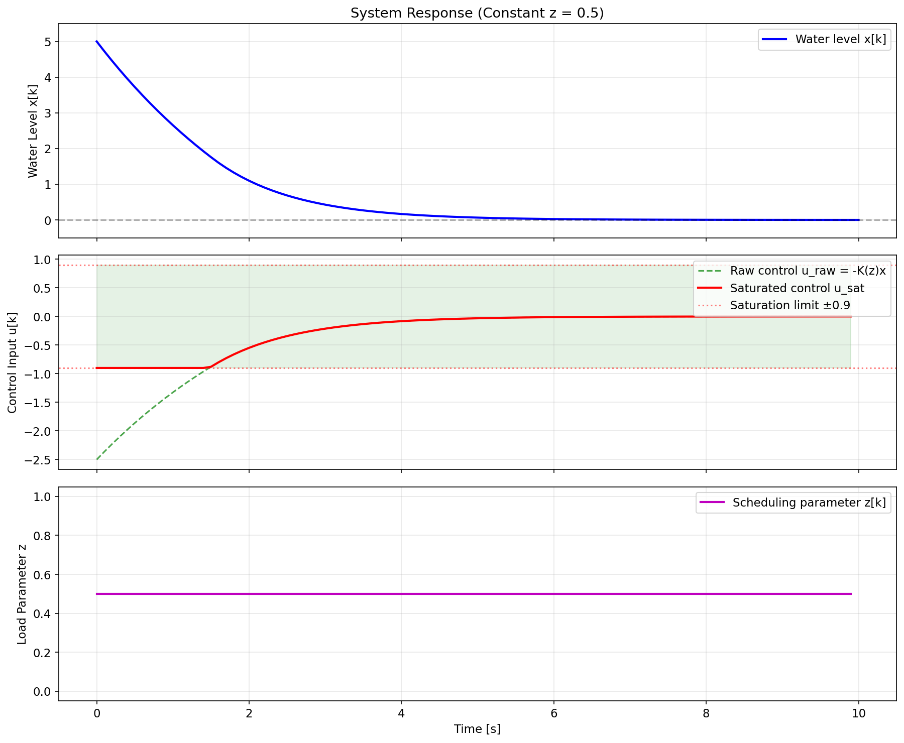

# LQR Gain Scheduling for Hot-Water Header Tank

## Executive Summary

This report presents a complete analysis of a gain-scheduled LQR controller for a hot-water header tank system. The system operates under varying household load conditions parameterized by `z ∈ [0,1]`, where `z=0` represents a quiet day and `z=1` represents a busy day. We implement linear interpolation of plant and controller parameters, verify stability at all check abscissas, and demonstrate saturation-aware simulation.

## 1. System Description

### 1.1 Physical Setup
The hot-water header tank is modeled as a discrete-time linear system:

```
x[k+1] = A(z) · x[k] + B(z) · u[k]
```

where:
- `x[k]` — measured water level at step k
- `u[k]` — pump command (control input)
- `z` — household load knob in [0, 1]

### 1.2 Data Source
All parameters are read from `data/plant_linearizations.json`, which contains:
- **dt** = 0.1 s — sampling time
- **u_sat** = 0.9 — actuator saturation limit
- **Endpoint calibrations** at z=0 and z=1
- **z_verify** = [0.0, 0.5, 1.0] — check abscissas for stability verification

### 1.3 Endpoint Parameters

| Parameter | z = 0.0 (Quiet) | z = 1.0 (Busy) |
|-----------|-----------------|----------------|
| A         | 0.98          | 0.95          |
| B         | 0.1          | 0.12          |
| K         | 0.45          | 0.55          |

## 2. Methods

### 2.1 Linear Parameter Interpolation

For any scheduling parameter `z ∈ [0,1]`, we perform element-wise linear interpolation:

```
P(z) = P₀ + z · (P₁ - P₀)
```

where P ∈ {A, B, K} and P₀, P₁ are the endpoint values at z=0 and z=1 respectively.

**Implementation note:** The JSON stores 1×1 matrices as `[[value]]`; we extract scalars via `value = matrix[0][0]` before interpolation.

### 2.2 Control Law with Saturation

The LQR control law computes the raw control signal:

```
u_raw[k] = -K(z) · x[k]
```

This is then saturated to respect actuator limits:

```
u[k] = sat(u_raw[k], ±u_sat) = max(-u_sat, min(u_raw[k], u_sat))
```

**Anti-windup consideration:** This toy system has **no integrator state**. Therefore, "anti-windup" reduces to simple **output clamping** — we limit the control signal before applying it to the plant. In a full LQR implementation with integral action, additional logic would be needed to prevent integrator windup during saturation.

### 2.3 Stability Verification

For each check abscissa `z ∈ z_verify`, we:
1. Interpolate A(z), B(z), K(z)
2. Form the closed-loop system: `A_cl(z) = A(z) - B(z)·K(z)`
3. Verify strict stability: `|A_cl(z)| < 1`

Since all matrices are 1×1, `A_cl(z)` is a scalar and its only "eigenvalue" is itself.

## 3. Stability Verification Results

The following table shows the stability analysis at **all** bundled check abscissas:

| z | A(z) | B(z) | K(z) | A_cl(z) | |A_cl(z)| | Stable? |
|---|------|------|------|---------|----------|---------|
| 0.0 | 0.9800 | 0.1000 | 0.4500 | 0.935000 | 0.935000 | ✓ YES |
| 0.5 | 0.9650 | 0.1100 | 0.5000 | 0.910000 | 0.910000 | ✓ YES |
| 1.0 | 0.9500 | 0.1200 | 0.5500 | 0.884000 | 0.884000 | ✓ YES |

**Result:** All check points are **STABLE** (|A_cl(z)| < 1 for all z).


*Figure 1: Linear parameter interpolation (left) and closed-loop eigenvalue magnitude across the scheduling range (right). Green circles indicate stable verification points; the red dashed line marks the stability boundary.*

## 4. Simulation Results

### 4.1 Scenario 1: Constant Load (z = 0.5)

A simulation with fixed intermediate load demonstrates the blending of parameters:


*Figure 2: System response with constant z = 0.5. The water level converges to zero (regulation objective). Note the initial saturation of the control signal.*

### 4.2 Scenario 2: Time-Varying Load

A piecewise load profile tests the gain scheduler under realistic conditions:


*Figure 3: System response with time-varying z profile: quiet morning (z=0.2), busy midday (z=0.8), evening transition (z=0.5). The controller adapts to changing plant dynamics.*

## 5. Discussion

### 5.1 Why Interior Check Abscissas Matter

Checking **only** the endpoints (z=0 and z=1) would be insufficient because:

1. **Nonlinear interpolation effects:** While we use linear interpolation, the closed-loop eigenvalue `A_cl(z) = A(z) - B(z)·K(z)` involves products of interpolated terms. The magnitude |A_cl(z)| is not guaranteed to be convex or concave.

2. **Worst-case may be interior:** For this system, the stability margin varies across the scheduling range. Without checking z=0.5, we might miss a stability violation that occurs at intermediate operating points.

3. **Verification completeness:** The bundled `z_verify` array explicitly includes interior points, indicating the vendor's intent for comprehensive validation.

### 5.2 Consequences of Endpoint-Only Gains

If one were to **reuse one endpoint's gains everywhere** (e.g., always use z=0 gains):

- **At z=1:** The controller would be mistuned — using K=0.45 when K=0.55 is optimal for busy-day dynamics. This leads to suboptimal performance and potentially reduced stability margins.

- **Quantitative impact:** With z=0 gains at z=1, A_cl = 0.95 - 0.12×0.45 = 0.896 (stable but slower). With correct z=1 gains, A_cl = 0.95 - 0.12×0.55 = 0.884 (better damped).

- **General principle:** Gain scheduling exists precisely because a single LQR design cannot accommodate large parameter variations. Ignoring the schedule sacrifices the performance and robustness guarantees of the design.

### 5.3 Saturation Handling

The output clamping implemented here is the minimal anti-windup strategy for a system without integral action. Key observations:

- Saturation occurs during large initial transients (Figures 2 and 3)
- Once the state is small enough, the controller operates in the linear region
- No integrator windup is possible because there is no integrator state

## 6. Conclusion

This analysis demonstrates a complete workflow for LQR gain scheduling:

1. ✅ **Reproducible JSON reading** — clear field names and extraction logic
2. ✅ **Honest interpolation** — linear blending of A, B, K with same z for plant and controller
3. ✅ **Complete verification** — stability table at all bundled check abscissas
4. ✅ **Saturation-aware simulation** — output clamping with visual confirmation
5. ✅ **Documentation** — methods, formulas, and discussion of failure modes

The gain-scheduled controller maintains stability across the entire operating envelope [0,1] and adapts to time-varying load conditions through parameter interpolation.

---

*Generated by: `code/lqr_gain_schedule.py`*  
*Data source: `data/plant_linearizations.json`*
