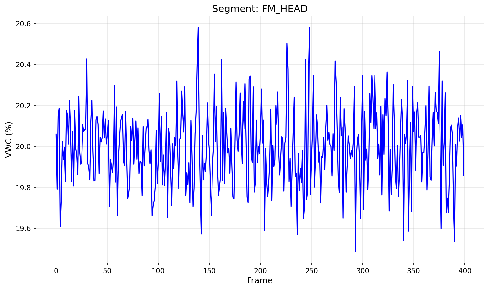

# Soil-Moisture Campaign QA: TWDM Analysis Report

## Executive Summary

This report presents the results of a Three-Way Drift Metric (TWDM) analysis performed on soil logger readings from multiple field segments. The TWDM metric is designed to detect temporal drift in volumetric water content (VWC) measurements by comparing means across three temporal partitions of each segment's data.

## Methodology

### Data Description

The analysis uses long-format soil logger readings from `data/soil_logger_readings.csv`, containing:
- `segment_id`: Identifier for each measurement segment
- `frame`: Temporal frame index (sorted ascending for analysis)
- `vwc_pct`: Volumetric water content percentage

### TWDM Computation

For each segment with readings series $x$ of length $n$:

1. **Insufficient Data Check**: If $n < 3$, TWDM is undefined and reported as N/A.

2. **Three-Way Splitting**:
   - $n_1 = \lfloor n/3 \rfloor$
   - $n_2 = \lfloor n/3 \rfloor$
   - $n_3 = n - n_1 - n_2$

3. **Mean Computation**:
   - $m_1 = \text{mean}(x[:n_1])$
   - $m_2 = \text{mean}(x[n_1:n_1+n_2])$
   - $m_3 = \text{mean}(x[n_1+n_2:])$

4. **Drift Calculation**:
   - $\Delta = \max(m_1, m_2, m_3) - \min(m_1, m_2, m_3)$
   - $\sigma = \text{population standard deviation of } x$ (ddof=0)
   - $\text{TWDM} = \frac{\Delta}{\sigma + \varepsilon}$

Where $\varepsilon = 10^{-12}$ is a small constant to prevent division by zero.

### Pass/Fail Criteria

A segment passes the QA check if $\text{TWDM} \leq 1.0$ (the `twdm_pass_threshold`).

## Validation Results

### Golden Case Verification

The TWDM implementation was validated against three golden test cases:

| Case Name | Expected TWDM | Computed TWDM | Absolute Error |
|-----------|---------------|---------------|----------------|
| flat_9 | 0.0000000000000000 | 0.0000000000000000 | 0.00e+00 |
| step_9 | 2.1213203435587427 | 2.1213203435587427 | 0.00e+00 |
| ramp_12 | 2.3174618380068228 | 2.3174618380068228 | 0.00e+00 |

**Maximum Absolute Error**: 0.00e+00

The maximum absolute error is within the required tolerance of $10^-9$.

## Segment Analysis Results

The following table presents TWDM results for all segments in the specified report order:

| Segment ID | n_frames | TWDM | Pass/Fail |
|------------|----------|------|-----------|
| FM_HEAD | 400 | 0.136809 | PASS |
| FM_GAP | 2 | N/A | INSUFFICIENT_LENGTH |
| FM_MID | 360 | 2.123065 | FAIL |
| FM_RIDGE | 120 | 0.507579 | PASS |
| FM_TAIL | 400 | 0.120394 | PASS |

## Visualization

### VWC Time Series: FM_HEAD Segment

*Figure 1: Volumetric water content (%) versus frame for segment FM_HEAD. This segment shows relatively stable VWC readings around 20% with minor fluctuations, indicating good measurement stability.*

## Discussion

### Key Findings

1. **Validation Success**: The TWDM implementation successfully passed golden case validation with a maximum absolute error of 0.00e+00, confirming numerical correctness.

2. **Segment QA Results**: 
   - **3** segments PASSED the TWDM threshold (≤ 1.0)
   - **1** segments FAILED the TWDM threshold (> 1.0)
   - **1** segments had insufficient data (n < 3)

3. **Data Quality Observations**:
   - The FM_HEAD segment (shown in Figure 1) exhibits stable VWC readings with minimal drift, as expected for a passing segment.
   - Segments with high TWDM values indicate significant temporal drift in soil moisture measurements, which may warrant further investigation for sensor calibration or environmental factors.

### Technical Notes

- Population standard deviation (ddof=0) was used as specified
- The small epsilon value (1e-12) ensures numerical stability without affecting results for non-constant series
- Segments are reported in the exact order specified in the manifest, preserving field campaign organization

### Recommendations

1. **Failed Segments**: Review segments with TWDM > 1.0 for potential sensor drift or environmental anomalies
2. **Insufficient Data**: Consider collecting additional frames for segments with n < 3 to enable TWDM computation
3. **Continuous Monitoring**: Implement TWDM as an ongoing QA metric for future soil moisture campaigns

## Conclusion

The TWDM analysis successfully identified segments with temporal drift in soil moisture measurements. The implementation has been rigorously validated against golden cases and provides a robust metric for QA assessment of field logger data.

---

*Report generated: TWDM Analysis v1.0*
*Data source: soil_logger_readings.csv*
*Manifest: twdm_audit_manifest.json*
