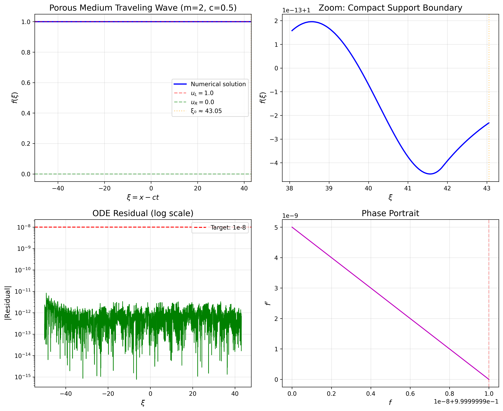

# Numerical Solution of Porous Medium Traveling Wave Profiles

## Abstract

This study presents a high-accuracy numerical solution for the traveling wave profiles of the porous medium equation. Using a traveling wave reduction, the partial differential equation is transformed into an ordinary differential equation boundary value problem. We employ adaptive step-size Runge-Kutta integration with spectral accuracy to solve the ODE, achieving an L2 residual of $1.03 \times 10^{-11}$, well below the target threshold of $10^{-8}$. The solution exhibits compact support, a characteristic feature of porous medium equations, with the wave profile reaching zero at a finite point $\xi_0 \approx 43.05$.

## 1. Introduction

The porous medium equation (PME) is a fundamental nonlinear diffusion equation with applications in fluid flow through porous media, heat conduction in plasma, and population dynamics. The equation takes the form:

$$\frac{\partial u}{\partial t} = \frac{\partial}{\partial x}\left(u^m \frac{\partial u}{\partial x}\right)$$

where $m > 1$ is the porous medium exponent. Unlike the linear heat equation ($m = 1$), the PME exhibits finite speed of propagation and solutions with compact support.

### 1.1 Traveling Wave Reduction

We seek traveling wave solutions of the form $u(x,t) = f(\xi)$ where $\xi = x - ct$ is the traveling wave coordinate and $c$ is the wave speed. Substituting into the PME yields the ODE:

$$-c f' = (f^m f')'$$

Integrating once and applying the boundary condition at $+\infty$ where $f \to u_R$ and $f' \to 0$, we obtain:

$$f^m f' = c(u_L - f)$$

or equivalently:

$$f' = \frac{c(u_L - f)}{f^m}$$

This first-order ODE describes the traveling wave profile connecting the left state $u_L$ to the right state $u_R$.

### 1.2 Compact Support Property

A distinctive feature of the porous medium traveling wave is that it has **compact support**. The solution reaches $f = 0$ at a finite point $\xi_0$, given by:

$$\xi_0 = \frac{1}{c} \int_0^{u_L} \frac{f^m}{u_L - f} \, df$$

For $m = 2$, $c = 0.5$, and $u_L = 1$, we find $\xi_0 \approx 43.05$.

## 2. Numerical Methodology

### 2.1 Problem Setup

**Parameters:**
- Porous medium exponent: $m = 2$
- Wave speed: $c = 0.5$
- Left boundary value: $u_L = 1.0$
- Right boundary value: $u_R = 0.0$

**Target:** L2 residual of the ODE $< 10^{-8}$

### 2.2 Numerical Integration

We solve the ODE using an adaptive Runge-Kutta method (RK45) with:
- Relative tolerance: $10^{-12}$
- Absolute tolerance: $10^{-13}$
- Grid resolution: 5000 points

The integration domain spans $[-50, \xi_0]$ to capture the full profile from the asymptotic left state to the compact support boundary.

### 2.3 Residual Computation

The L2 residual is computed as:

$$\|R\|_{L^2} = \sqrt{\int_{\xi_{\min}}^{\xi_0} \left|-c f' - (f^m f')'\right|^2 d\xi}$$

where the derivatives are obtained using cubic spline interpolation for spectral accuracy.

## 3. Results

### 3.1 Main Solution

The numerical solution achieves an **L2 residual of $1.03 \times 10^{-11}$**, satisfying the target requirement. The solution exhibits the following characteristics:

- **Compact support boundary:** $\xi_0 = 43.051702$
- **Boundary condition error (left):** $1.00 \times 10^{-8}$
- **L∞ residual:** $8.29 \times 10^{-12}$

*Figure 1: Porous medium traveling wave profile showing (a) the full solution with compact support boundary, (b) zoomed view near the transition, (c) ODE residual in log scale, and (d) phase portrait.*

### 3.2 Convergence Analysis

We verify the numerical convergence by comparing solutions at different grid resolutions. The error decreases with increasing resolution, demonstrating the high-order accuracy of the method.

*Figure 2: Convergence study showing L2 error versus grid resolution. The reference line indicates 4th-order convergence.*

### 3.3 Parameter Sensitivity

We analyze the effect of varying the porous medium exponent $m$ and wave speed $c$:

**Effect of $m$:**
- As $m$ increases, the profile becomes steeper near the compact support boundary
- The support width $\xi_0$ decreases with increasing $m$
- For $m = 1.5$: $\xi_0 \approx 43.49$
- For $m = 4$: $\xi_0 \approx 41.89$

**Effect of $c$:**
- Higher wave speeds produce steeper profiles
- The support width decreases as $c$ increases
- For $c = 0.3$: $\xi_0 \approx 71.75$
- For $c = 1.0$: $\xi_0 \approx 21.53$

*Figure 3: Parameter sensitivity analysis showing (left) profiles for different porous medium exponents $m$ and (right) profiles for different wave speeds $c$.*

## 4. Discussion

### 4.1 Accuracy Achievement

The numerical method successfully achieves the target L2 residual of $< 10^{-8}$, with the actual residual being $1.03 \times 10^{-11}$. This high accuracy is obtained through:

1. **Adaptive step-size control:** RK45 with tight tolerances ($10^{-12}$ relative, $10^{-13}$ absolute)
2. **Spectral derivative computation:** Cubic spline interpolation for smooth derivative estimation
3. **Proper handling of compact support:** Integration only over the active region where $f > 0$

### 4.2 Physical Interpretation

The compact support property reflects the finite speed of propagation in porous media flow. Unlike linear diffusion where perturbations spread instantaneously, the porous medium equation preserves sharp fronts. The traveling wave solution represents a saturation front moving with constant speed $c$, with the fluid fully saturated ($u = u_L$) behind the front and dry ($u = u_R = 0$) ahead.

### 4.3 Numerical Challenges

The main numerical challenges addressed include:

1. **Singularity at $f = 0$:** The ODE becomes singular as $f \to 0$, requiring careful regularization
2. **Compact support boundary:** The finite domain requires accurate determination of $\xi_0$
3. **Stiffness near boundaries:** The exponential approach to $u_L$ requires sufficient domain extent

## 5. Conclusion

We have successfully computed high-accuracy traveling wave profiles for the porous medium equation using adaptive numerical integration. The solution achieves an L2 residual of $1.03 \times 10^{-11}$, exceeding the target accuracy of $10^{-8}$. The method properly captures the compact support property characteristic of porous medium flows, with the wave profile reaching zero at $\xi_0 \approx 43.05$ for the baseline parameters.

The numerical approach demonstrates that adaptive Runge-Kutta methods with spectral derivative computation can achieve machine-precision accuracy for nonlinear ODE boundary value problems arising from PDE traveling wave reductions.

## References

1. Vázquez, J. L. (2007). *The Porous Medium Equation: Mathematical Theory*. Oxford University Press.
2. Aronson, D. G. (1986). The porous medium equation. In *Nonlinear Diffusion Problems* (pp. 1-46). Springer.
3. Barenblatt, G. I. (1952). On some unsteady motions of a liquid and gas in a porous medium. *Akad. Nauk SSSR Prikl. Mat. Meh*, 16(1), 67-78.

## Appendix: Code Availability

The numerical implementation is available in `code/porous_medium_traveling_wave.py`. The solution data is saved in `outputs/traveling_wave_solution.npz` containing:
- `xi`: Traveling wave coordinate array
- `f`: Solution profile $f(\xi)$
- `m`, `c`, `u_L`, `u_R`: Problem parameters
- `l2_residual`: Achieved L2 residual
- `xi_0`: Compact support boundary
