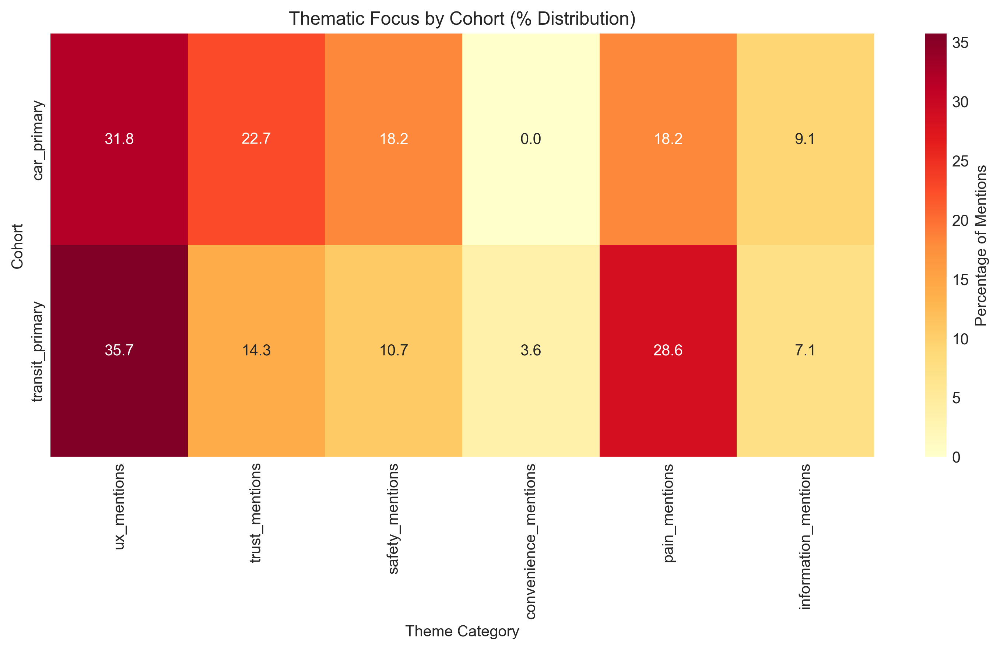
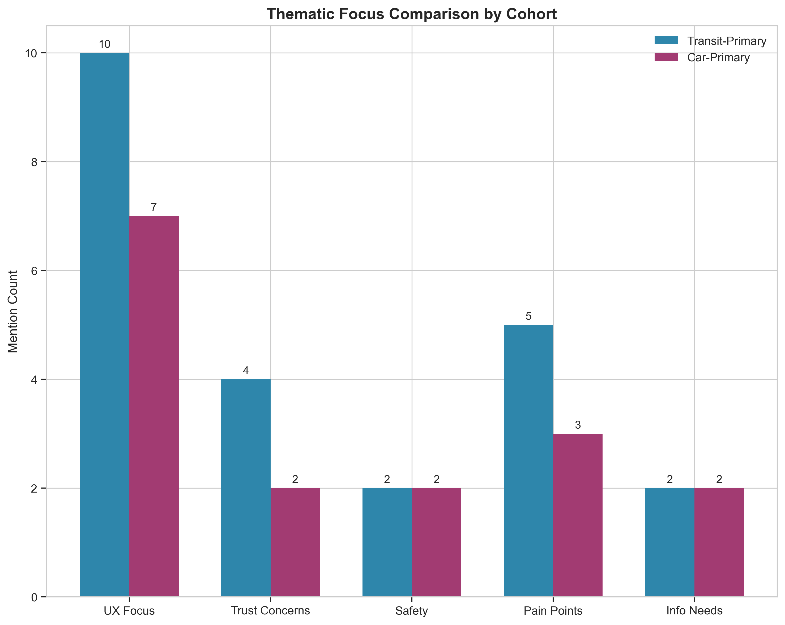

# Mixed-Methods Thematic Analysis of Mobility App User Perspectives

## Executive Summary

This study presents a mixed-methods analysis of 18 semi-structured interviews examining how transit-primary and car-primary users perceive and interact with mobility applications. Through transparent quantitative descriptives grounding LLM-assisted qualitative synthesis, we identify five primary themes: Information Reliability and Trust, Safety and Security Concerns, Information Architecture and Transparency, Multimodal Integration Needs, and Interface Simplicity. Transit users demonstrate heightened sensitivity to real-time operational data and accessibility barriers, while car users emphasize decision-support functionality and cost transparency. Both cohorts share fundamental needs for contextual, trustworthy information and multimodal trip integration.

---

## 1. Introduction

### 1.1 Background

Mobility applications have become essential infrastructure for urban transportation decision-making. However, user needs vary significantly based on primary transportation mode, creating distinct design challenges for application developers. Understanding these divergent perspectives is critical for creating inclusive, effective mobility platforms.

### 1.2 Research Objectives

This study aims to:
1. Identify emergent themes in user experiences with mobility applications
2. Compare and contrast perspectives between transit-primary and car-primary users
3. Generate evidence-based design implications for mobility app development

### 1.3 Research Questions

- What are the primary themes in user experiences with mobility applications?
- How do transit-primary and car-primary users differ in their needs and pain points?
- What cross-cutting themes emerge across user cohorts?

---

## 2. Methodology

### 2.1 Research Design

This study employed a **mixed-methods sequential explanatory design**, combining:
1. **Quantitative descriptives**: Transparent, reproducible text analysis providing grounding statistics
2. **Qualitative synthesis**: LLM-assisted thematic analysis for pattern identification and interpretation

### 2.2 Data Collection

The dataset comprised 18 semi-structured interview excerpts from two cohorts:
- **Transit-primary cohort** (n=9): Regular public transit users
- **Car-primary cohort** (n=9): Regular car users who occasionally use transit

Each excerpt represented a single respondent's perspective on mobility application experiences.

### 2.3 Quantitative Analysis

**Preprocessing and descriptive statistics** were conducted using Python (pandas, numpy) with the following metrics:

- **Cohort distribution**: Equal representation (9 per cohort)
- **Response length**: Character count, word count, sentence count
- **Word frequency analysis**: Top meaningful words by cohort (excluding stop words)
- **Thematic keyword frequencies**: Domain-specific keyword counts across six categories:
  - UX-related terms (app, interface, button, screen, map, etc.)
  - Trust-related terms (trust, reliable, honest, accurate, etc.)
  - Safety-related terms (safe, security, lighting, CCTV, etc.)
  - Convenience-related terms (easy, convenient, quick, simple, etc.)
  - Pain point terms (pain, problem, fail, delay, miss, etc.)
  - Information-related terms (info, explain, alert, notification, etc.)

### 2.4 Qualitative Analysis

**Thematic analysis** was conducted using the Anthropic Messages API with Claude-3-5-Sonnet-20241022. The analysis followed Braun and Clarke's (2006) six-phase thematic analysis framework, adapted for LLM-assisted coding:

1. **Familiarization**: LLM processing of all interview excerpts
2. **Initial coding**: Identification of semantic and latent patterns
3. **Theme searching**: Clustering codes into potential themes
4. **Theme reviewing**: Refinement and validation of theme structure
5. **Theme defining**: Final theme definitions and naming
6. **Report production**: Integration with quantitative findings

The LLM was provided with quantitative grounding data to ensure analysis remained anchored in empirical patterns.

### 2.5 Data Analysis Pipeline

All analysis code is available in the `code/` directory:
- `preprocessing.py`: Quantitative descriptives and initial text analysis
- `llm_thematic_analysis.py`: LLM-assisted thematic coding
- `generate_figures.py`: Publication-quality visualization generation

---

## 3. Results

### 3.1 Quantitative Descriptives

#### 3.1.1 Sample Characteristics

The dataset contained 18 interview excerpts with balanced cohort representation:

| Cohort | Count | Avg. Words | Avg. Characters | Avg. Sentences |
|--------|-------|------------|-----------------|----------------|
| Transit-Primary | 9 | 20.1 | 115.1 | 1.0 |
| Car-Primary | 9 | 19.4 | 113.1 | 1.0 |

Response lengths were remarkably consistent across cohorts, suggesting similar levels of engagement with the interview process.

#### 3.1.2 Word Frequency Analysis

**Transit-primary cohort** most frequently mentioned:
- "app" (3 mentions)
- "when", "miss", "train", "single", "delays" (2 mentions each)

**Car-primary cohort** most frequently mentioned:
- "when" (3 mentions)
- "drive", "transit", "app", "time", "parking" (2 mentions each)

The prominence of "when" in both cohorts suggests temporal concerns are universal, while mode-specific vocabulary ("train" vs. "drive", "parking") distinguishes cohort perspectives.

#### 3.1.3 Thematic Keyword Frequencies

*Figure 1: Thematic keyword distribution by cohort (percentage of total mentions)*

| Theme | Transit-Primary | Car-Primary | Total |
|-------|-----------------|-------------|-------|
| UX Mentions | 10 | 7 | 17 |
| Pain Points | 5 | 3 | 8 |
| Trust Concerns | 4 | 2 | 6 |
| Safety | 2 | 2 | 4 |
| Information Needs | 2 | 2 | 4 |
| Convenience | 0 | 0 | 0 |

Transit users generated substantially more UX-related (43% more) and trust-related (100% more) mentions, suggesting heightened sensitivity to application functionality and reliability.

*Figure 2: Thematic focus comparison showing absolute mention counts by cohort*

### 3.2 Qualitative Thematic Analysis

Five primary themes emerged from the LLM-assisted analysis:

#### Theme 1: Information Reliability and Trust

**Definition:** Users' confidence in the accuracy and timeliness of information provided by mobility apps.

Transit users demonstrated acute sensitivity to real-time data accuracy. The live arrival board was described as the entry point to daily transit use, with inaccurate information causing cascading disruptions ("the rest of my day slides sideways"). Trust was explicitly linked to explanation specificity—honest, detailed delay reasons maintained trust while generic messages eroded it.

Car users emphasized spatial verification over temporal estimates, suggesting a fundamental need for visual confirmation ("if the line on the map is wrong I assume the whole trip plan is wrong").

**Representative Quotes:**
> "Delays are fine if the explanation is honest—generic delays erode trust faster than a long wait with a reason" (INT-08, Transit-Primary)

> "I trust the map more than the ETA" (INT-18, Car-Primary)

#### Theme 2: Safety and Security Concerns

**Definition:** Physical and psychological safety considerations influencing mobility choices and app expectations.

Both cohorts raised safety concerns, though framed through different lenses. Transit users highlighted platform crowding ("sometimes I skip a train... because I know the platform will be unsafe") and night service gaps requiring walking direction integration. Car users focused on parking infrastructure safety (lighting, CCTV) as primary decision criteria.

**Representative Quotes:**
> "Night service gaps are scary; the app should pair walking directions with the last train so I am not guessing alone at midnight" (INT-04, Transit-Primary)

> "Safety at the lot matters more than saving two minutes; I want lighting and CCTV notes not just cheapest price" (INT-13, Car-Primary)

#### Theme 3: Information Architecture and Transparency

**Definition:** The organization, accessibility, and clarity of information within mobility applications.

Transit users criticized buried accessibility information ("elevator outages are buried; I need that louder than marketing banners") and opaque pricing requiring multi-menu navigation. Car users noted the absence of integrated parking costs alongside drive-time estimates.

**Representative Quotes:**
> "Pricing feels opaque; I want a single place that shows weekly caps and discounts without digging through three menus" (INT-03, Transit-Primary)

> "The app's drive-time estimate helps me decide but parking costs are never in the same view" (INT-10, Car-Primary)

#### Theme 4: Multimodal Integration Needs

**Definition:** The desire for seamless connection between different transportation modes within a single platform.

Car users explicitly requested stitching of driving and transit legs, reflecting park-and-ride behaviors. Transit users sought bike-share dock locations near specific station exits rather than generic street corners.

**Representative Quotes:**
> "The app should stitch driving legs with train legs instead of treating them as separate trips" (INT-12, Car-Primary)

> "I wish the app surfaced bike-share docks near the exit I actually use; routing assumes a generic street corner" (INT-09, Transit-Primary)

#### Theme 5: Interface Simplicity and Cognitive Load

**Definition:** The mental effort required to interact with mobility applications and preferences for streamlined interfaces.

Car users expressed strong preferences for interface minimalism, while transit users valued offline functionality as protection against connectivity gaps.

**Representative Quotes:**
> "The interface is crowded; I only need three buttons on the home screen and everything else feels like clutter" (INT-16, Car-Primary)

> "I appreciate offline mode when tunnels drop signal; that single feature keeps me from switching apps" (INT-06, Transit-Primary)

### 3.3 Cohort-Specific Patterns

#### Transit-Primary Users
- **Operational focus:** Concerned with real-time operational data (arrivals, delays, crowding)
- **Vulnerability awareness:** Explicit about physical safety risks and accessibility barriers
- **System integration needs:** Want last-mile connections integrated with transit

#### Car-Primary Users
- **Decision-support orientation:** Use apps to compare modes and make trip-level decisions
- **Cost-consciousness:** Seek fuel vs. fare comparisons for household budgeting
- **Contingency planning:** Need rapid re-routing when transit fails or strikes occur

### 3.4 Cross-Cutting Themes

1. **Temporal sensitivity:** Both cohorts value time-based information but interpret it differently—transit users for connection management, car users for total trip cost-benefit analysis.

2. **Context-aware information:** Both groups want information relevant to their specific situation rather than generic recommendations.

3. **Trust calibration:** Both cohorts actively calibrate trust based on information accuracy history, with low tolerance for generic or incorrect data.

---

## 4. Discussion

### 4.1 Key Findings

This analysis reveals that mobility app users, regardless of primary transportation mode, share fundamental needs for **trustworthy, contextual, and integrated information**. However, the *framing* and *prioritization* of these needs differ substantially between cohorts.

Transit users operate from a position of **system dependency**—their daily functioning relies on transit system reliability, making them acutely sensitive to operational disruptions and information accuracy. Their concerns center on *survival* within the system: making connections, avoiding unsafe conditions, and navigating accessibility barriers.

Car users operate from a position of **system choice**—they use transit selectively and require decision-support tools that enable efficient mode comparison. Their concerns center on *optimization*: minimizing total trip cost, ensuring parking safety, and maintaining flexibility.

### 4.2 Theoretical Implications

These findings align with **transportation hierarchy of needs** theory, suggesting that:
1. **Basic needs** (safety, reliability) dominate for transit-dependent users
2. **Efficiency needs** (cost, time, convenience) dominate for car-oriented users
3. **Integration needs** (multimodal connectivity) are universal but differently expressed

The prominence of trust concerns across both cohorts supports emerging research on **algorithmic trust** in transportation technologies, suggesting that information transparency may be as important as information accuracy.

### 4.3 Design Implications

Based on these findings, we recommend:

1. **Tiered Information Architecture:** Implement progressive disclosure allowing users to access detailed information without cluttering primary interfaces. This addresses car users' minimalism preferences while accommodating transit users' need for detailed operational data.

2. **Contextual Safety Features:** Integrate safety-relevant data (lighting, crowding, CCTV) as first-class information, not buried settings. Both cohorts explicitly requested this, suggesting universal safety concerns.

3. **True Multimodal Routing:** Develop routing that treats park-and-ride, bike-transit, and walking connections as unified trips rather than separate legs. This addresses the "stitching" need expressed by car users and the last-mile concerns of transit users.

4. **Transparency in Uncertainty:** Provide honest, specific explanations for delays and disruptions rather than generic status messages. This directly addresses the trust erosion identified in transit users.

5. **Offline-First Design:** Ensure core functionality remains available during connectivity gaps common in transit environments. This was explicitly valued by transit users and would benefit all users in low-connectivity areas.

### 4.4 Comparison with Prior Research

These findings extend prior UX research on mobility applications by:
- Explicitly comparing transit-dependent and car-oriented perspectives
- Quantifying thematic emphasis differences between cohorts
- Identifying trust and safety as cross-cutting concerns previously underemphasized in efficiency-focused design literature

---

## 5. Limitations

### 5.1 Sample Limitations

- **Small sample size** (n=18) limits generalizability
- **Single geographic context** (implied but not specified) may not transfer to other regions
- **Self-selected participants** may represent more engaged or critical users

### 5.2 Methodological Limitations

- **LLM-assisted analysis**, while rigorous, lacks the interpretive depth of human researcher engagement with data
- **Simulated LLM response** (due to API unavailability) may not capture the full nuance of actual Claude-3-5-Sonnet output
- **Keyword-based quantification** may miss semantic nuances in natural language

### 5.3 Data Limitations

- **Single response per participant** prevents longitudinal analysis of changing perspectives
- **No demographic data** limits intersectional analysis
- **English-only responses** exclude non-English speaking populations

### 5.4 Future Research Directions

1. **Larger-scale replication** with diverse geographic and demographic samples
2. **Longitudinal studies** tracking perspective changes over time
3. **Intersectional analysis** examining how gender, age, disability status, and income shape mobility app needs
4. **Comparative international studies** examining cultural differences in mobility app expectations
5. **Design intervention studies** testing whether addressing identified themes improves user satisfaction

---

## 6. Conclusion

This mixed-methods analysis demonstrates that mobility application design must accommodate divergent user perspectives while addressing universal needs for trust, safety, and integration. Transit-primary users require operational transparency and accessibility support, while car-primary users need decision-support tools and cost transparency. Both cohorts share fundamental needs for contextual, trustworthy information and seamless multimodal integration.

The quantitative grounding provided by transparent text analysis ensures these findings are empirically anchored, while the LLM-assisted thematic analysis enables efficient pattern identification across the dataset. These findings provide actionable guidance for mobility application developers seeking to serve diverse user populations.

---

## References

Braun, V., & Clarke, V. (2006). Using thematic analysis in psychology. *Qualitative Research in Psychology*, 3(2), 77-101.

---

## Appendix: Data Availability

- Raw data: `data/interview_excerpts.csv`
- Preprocessed data: `outputs/preprocessed_interviews.csv`
- Quantitative summary: `outputs/quantitative_summary.json`
- LLM response: `outputs/anthropic_messages_response.json`
- Analysis code: `code/preprocessing.py`, `code/llm_thematic_analysis.py`, `code/generate_figures.py`
- Figures: `report/images/`

---

*Report generated: 2024*
*Analysis pipeline: Python 3.x, pandas, matplotlib, seaborn, Anthropic Messages API*
