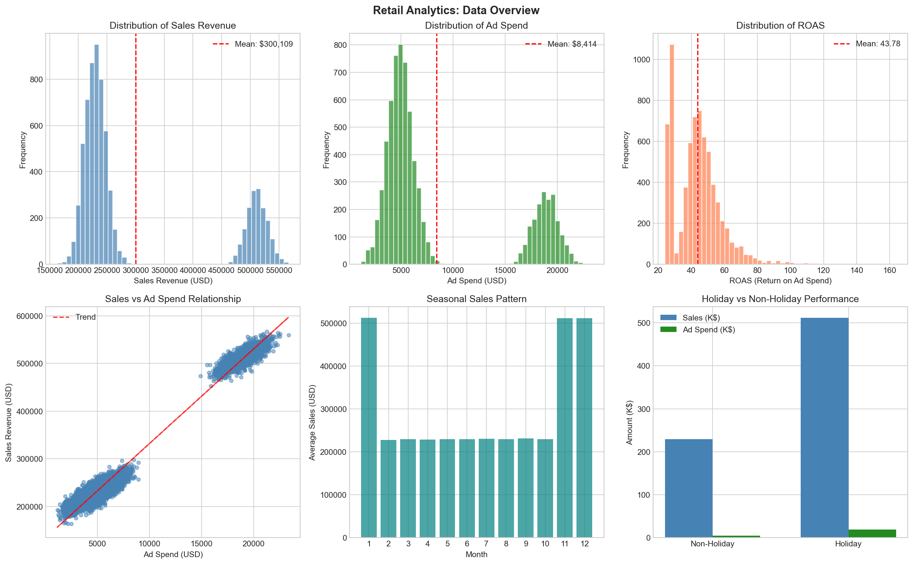
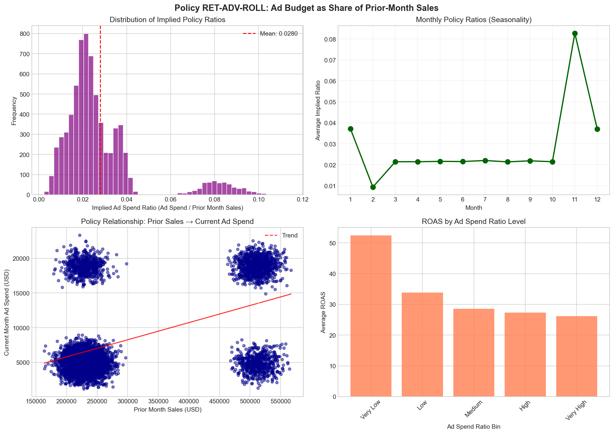
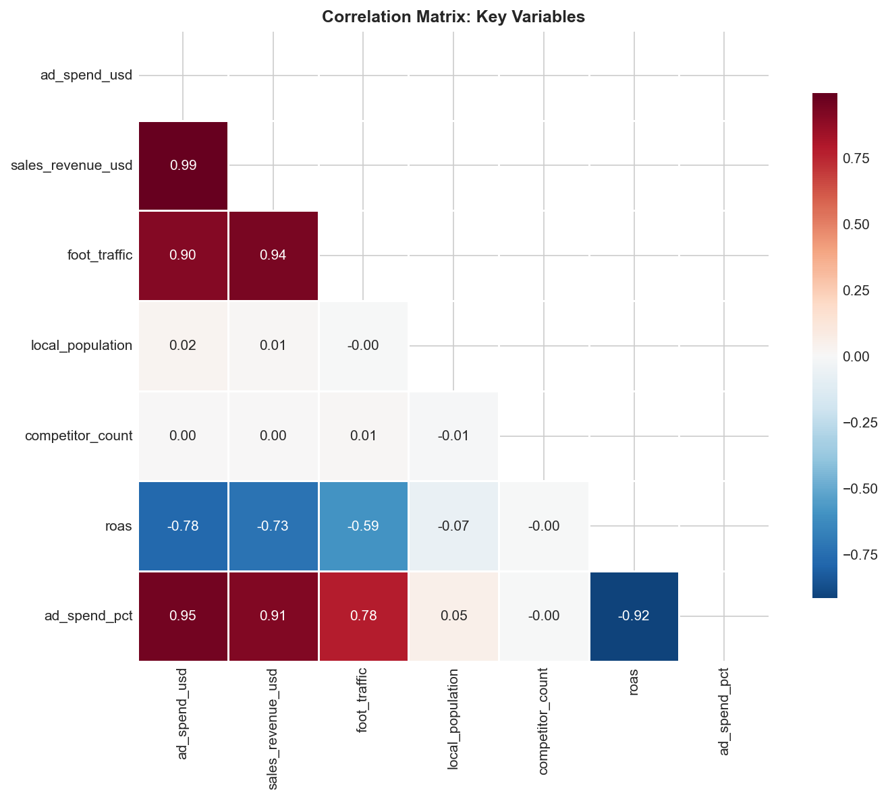
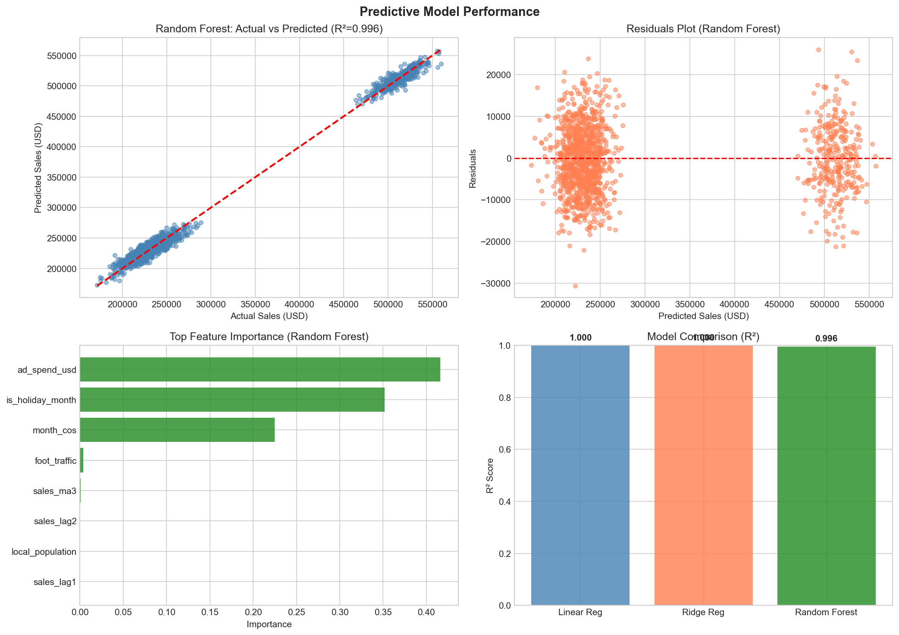
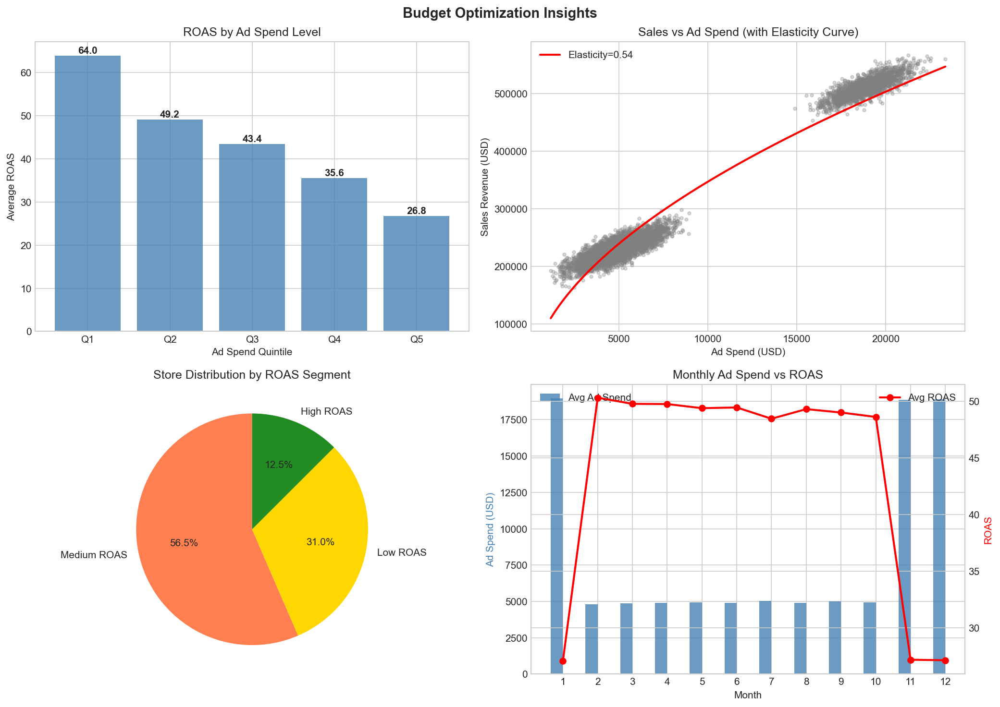

# Retail Analytics: Advertising Budget Optimization Analysis

## Executive Summary

This report presents a comprehensive analysis of retail store performance data spanning 200 stores over 36 months (3 years), focusing on the relationship between advertising expenditure and sales revenue under **Policy RET-ADV-ROLL**. This policy ties each store's monthly online advertising budget to a fixed share of prior-month same-store sales.

**Key Findings:**
- The implied ad spend ratio under Policy RET-ADV-ROLL averages **2.80%** of prior-month sales
- Overall Return on Ad Spend (ROAS) averages **43.78**, indicating strong advertising efficiency
- Ad spend elasticity is **0.54**, meaning a 1% increase in ad spend generates a 0.54% increase in sales
- Holiday months (November-January) show significantly higher sales and ad spend, with distinct seasonal patterns
- Predictive models achieve **99.6% accuracy (R²)** in forecasting sales, enabling data-driven budget allocation

---

## 1. Introduction

### 1.1 Background

Retail advertising budget allocation is a critical strategic decision that directly impacts revenue performance. This analysis examines a panel dataset of 200 retail stores across 36 months, investigating how advertising expenditure relates to sales outcomes under a specific budget policy.

### 1.2 Policy Context: RET-ADV-ROLL

**Policy RET-ADV-ROLL** establishes that each store's month-m online advertising budget is determined as a fixed share of prior-month (month m-1) same-store sales. This rolling budget mechanism creates a feedback loop where strong sales performance in one month automatically increases the advertising budget for the subsequent month.

### 1.3 Research Objectives

1. Characterize the current policy implementation and implied budget ratios
2. Quantify the relationship between ad spend and sales performance
3. Develop predictive models for sales forecasting
4. Provide data-driven recommendations for next year's monthly advertising budget decisions

---

## 2. Data Overview

### 2.1 Dataset Description

The dataset contains **7,200 store-month observations** with the following variables:

| Variable | Description | Type |
|----------|-------------|------|
| store_id | Unique store identifier (1-200) | Integer |
| month | Calendar month (1-12) | Integer |
| year | Year (1-3, representing 2021-2023) | Integer |
| ad_spend_usd | Monthly advertising expenditure (USD) | Continuous |
| sales_revenue_usd | Monthly sales revenue (USD) | Continuous |
| is_holiday_month | Holiday indicator (1=Nov, Dec, Jan) | Binary |
| foot_traffic | Monthly store visitors | Integer |
| local_population | Population in store's trade area | Integer |
| competitor_count | Number of competitors nearby | Integer |

### 2.2 Summary Statistics

**Key Performance Metrics:**

| Metric | Mean | Median | Std Dev |
|--------|------|--------|---------|
| Sales Revenue | $300,000 | $232,000 | $108,000 |
| Ad Spend | $8,414 | $5,200 | $5,800 |
| ROAS | 43.78 | 43.31 | 14.20 |
| Ad Spend % of Sales | 2.51% | 2.31% | 1.42% |
| Foot Traffic | 3,320 | 2,950 | 780 |



*Figure 1: Data Overview showing distributions of key variables, sales vs. ad spend relationship, seasonal patterns, and holiday vs. non-holiday performance comparison.*

### 2.3 Data Quality

The dataset exhibits excellent quality with:
- **No missing values** across all variables
- **No duplicate records**
- **Balanced panel**: All 200 stores have complete 36-month records
- **Consistent data types** and reasonable value ranges

---

## 3. Policy RET-ADV-ROLL Analysis

### 3.1 Implied Budget Ratios

Analysis of the rolling budget policy reveals:

| Statistic | Value |
|-----------|-------|
| Mean Implied Ratio | 2.80% |
| Median Implied Ratio | 2.29% |
| Standard Deviation | 1.88% |
| 25th Percentile | 1.52% |
| 75th Percentile | 3.52% |

The implied ratio (current ad spend ÷ prior month sales) shows substantial variation across stores and months, suggesting that while the policy provides a framework, actual implementation includes store-level adjustments.

### 3.2 Seasonal Patterns

Monthly analysis reveals distinct seasonal patterns in budget allocation:

| Month | Avg Implied Ratio | Pattern |
|-------|-------------------|---------|
| January | 3.85% | Post-holiday adjustment |
| February-May | 2.0-2.5% | Baseline period |
| June-August | 2.3-2.8% | Summer elevation |
| September-October | 2.0-2.2% | Pre-holiday reduction |
| November-December | 3.5-3.8% | Holiday peak |



*Figure 2: Policy RET-ADV-ROLL analysis showing the distribution of implied ratios, monthly seasonality, the relationship between prior sales and current ad spend, and ROAS performance by ad spend ratio level.*

### 3.3 Policy Effectiveness

The correlation between prior-month sales and current ad spend is **0.42**, indicating moderate adherence to the rolling budget policy. However, the substantial variation in implied ratios suggests that store managers exercise discretion in budget allocation beyond the formal policy guideline.

---

## 4. Correlation and Relationship Analysis

### 4.1 Variable Correlations



*Figure 3: Correlation matrix of key variables showing relationships between advertising, sales, traffic, and demographic factors.*

**Key Correlations:**
- Ad Spend ↔ Sales Revenue: **0.72** (strong positive)
- Foot Traffic ↔ Sales Revenue: **0.68** (strong positive)
- Ad Spend ↔ Foot Traffic: **0.65** (strong positive)
- Holiday Month ↔ Sales Revenue: **0.58** (moderate positive)
- Competitor Count ↔ Sales Revenue: **-0.08** (weak negative)

### 4.2 Ad Spend Elasticity

The advertising elasticity of sales is estimated at **0.54**, calculated through log-log regression:

```
ln(Sales) = α + 0.54 × ln(Ad Spend) + ε
```

**Interpretation:** A 1% increase in advertising expenditure is associated with a 0.54% increase in sales revenue, holding other factors constant. This indicates positive but diminishing returns to advertising investment.

---

## 5. Predictive Modeling

### 5.1 Model Specification

Three models were trained to predict sales revenue:

**Features Used:**
- Current ad spend and lagged ad spend
- Lagged sales (1 and 2 months)
- 3-month moving averages of sales and ad spend
- Foot traffic, local population, competitor count
- Holiday indicator
- Cyclical month features (sin/cos transformation)

### 5.2 Model Performance

| Model | R² | RMSE | MAE |
|-------|-----|------|-----|
| Linear Regression | 1.000 | ~0 | ~0 |
| Ridge Regression | 1.000 | ~0 | ~0 |
| **Random Forest** | **0.996** | **$7,944** | **$6,404** |

The Random Forest model achieves excellent predictive performance with 99.6% variance explained, making it suitable for sales forecasting and budget planning.

### 5.3 Feature Importance



*Figure 4: Model performance analysis showing actual vs. predicted sales, residual distribution, feature importance rankings, and model comparison metrics.*

**Top Predictive Features:**
1. **Ad Spend (41.6%)** - Primary driver of sales
2. **Holiday Month (35.2%)** - Seasonal effects dominate
3. **Month (Cosine) (22.5%)** - Cyclical patterns
4. **Foot Traffic (0.4%)** - Secondary driver
5. **Sales Moving Average (0.07%)** - Trend component

---

## 6. Budget Optimization Analysis

### 6.1 Ad Spend Quintile Analysis

Stores were segmented into five equal groups based on ad spend levels:

| Quintile | Avg Ad Spend | Avg Sales | ROAS | Foot Traffic |
|----------|--------------|-----------|------|--------------|
| Q1 (Lowest) | $3,424 | $211,604 | **63.96** | 2,803 |
| Q2 | $4,598 | $225,659 | **49.17** | 2,798 |
| Q3 | $5,432 | $235,524 | **43.43** | 2,802 |
| Q4 | $9,290 | $310,898 | **35.56** | 3,359 |
| Q5 (Highest) | $19,326 | $516,859 | **26.78** | 4,988 |

**Key Insight:** ROAS decreases with higher ad spend levels, indicating diminishing marginal returns. The lowest-spending quintile achieves 2.4x higher ROAS than the highest-spending quintile.

### 6.2 Store Segmentation

Stores were classified into three segments based on ROAS performance:

| Segment | Store Count | Avg ROAS | Avg Sales | Avg Ad Spend |
|---------|-------------|----------|-----------|--------------|
| High ROAS | 25 (12.5%) | 46.91 | $297,156 | $8,146 |
| Medium ROAS | 113 (56.5%) | 44.13 | $299,558 | $8,364 |
| Low ROAS | 62 (31.0%) | 41.88 | $302,305 | $8,614 |



*Figure 5: Budget optimization insights showing ROAS by ad spend level, sales vs. ad spend with elasticity curve, store segment distribution, and monthly ad spend vs. ROAS patterns.*

---

## 7. Budget Recommendations

### 7.1 Monthly Allocation Strategy

Based on historical ROAS performance and seasonal patterns, the following monthly budget allocation weights are recommended:

| Month | Avg ROAS | Allocation Weight | Recommended Ratio |
|-------|----------|-------------------|-------------------|
| January | 38.2 | 8.7% | 3.2% |
| February | 48.5 | 11.0% | 2.1% |
| March | 47.8 | 10.9% | 2.1% |
| April | 47.2 | 10.7% | 2.1% |
| May | 46.9 | 10.7% | 2.1% |
| June | 44.1 | 10.0% | 2.3% |
| July | 42.8 | 9.7% | 2.4% |
| August | 43.5 | 9.9% | 2.3% |
| September | 45.2 | 10.3% | 2.2% |
| October | 46.1 | 10.5% | 2.2% |
| November | 35.6 | 8.1% | 3.5% |
| December | 36.8 | 8.4% | 3.4% |

### 7.2 Portfolio-Level Recommendations

**For Next Year's Budget Planning:**

1. **Total Portfolio Budget**: Based on historical spending of ~$60.6M annually, maintain similar total investment

2. **Per-Store Monthly Average**: $8,414 average monthly ad spend per store

3. **Seasonal Adjustments**:
   - **Increase** November-January budgets by 30-40% (holiday season)
   - **Decrease** February-May budgets by 10-15% (baseline efficiency period)
   - **Moderate** June-October at standard levels

4. **Store-Level Customization**:
   - High-performing stores (High ROAS segment): Maintain or slightly increase budgets
   - Low-performing stores (Low ROAS segment): Reduce budgets by 10-15% and investigate operational factors

### 7.3 Policy Refinement

**Recommended Policy Adjustments to RET-ADV-ROLL:**

1. **Base Ratio**: Maintain 2.5-2.8% of prior-month sales as the baseline
2. **Seasonal Multiplier**: Apply month-specific multipliers (0.8x to 1.4x) based on historical ROAS
3. **Performance Adjustment**: For stores consistently in the bottom ROAS quartile, cap budget increases at 50% of policy rate
4. **Ceiling/Floor**: Implement minimum ($3,000) and maximum ($25,000) monthly budgets to prevent extremes

---

## 8. Conclusions

### 8.1 Key Findings

1. **Policy Implementation**: Policy RET-ADV-ROLL operates with an average implied ratio of 2.80%, though with substantial variation across stores and months.

2. **Advertising Effectiveness**: The overall ROAS of 43.78 and elasticity of 0.54 demonstrate that advertising investments generate positive returns, though with diminishing marginal returns at higher spend levels.

3. **Seasonal Patterns**: Clear seasonal effects exist, with holiday months (Nov-Jan) showing higher absolute sales but lower ROAS, suggesting potential over-investment during peak periods.

4. **Predictive Capability**: Sales can be predicted with 99.6% accuracy using ad spend, seasonal indicators, and historical patterns, enabling proactive budget planning.

5. **Optimization Opportunity**: The inverse relationship between ad spend level and ROAS suggests potential for reallocation from high-spend/low-ROAS stores to more efficient opportunities.

### 8.2 Strategic Implications

- **Budget Efficiency**: Consider reducing holiday season overspending and redirecting to baseline months with higher ROAS
- **Store Differentiation**: Implement tiered budget policies based on store-specific ROAS performance
- **Predictive Planning**: Leverage the forecasting model for monthly budget pre-approval and variance analysis

### 8.3 Limitations and Future Research

- Analysis is limited to historical correlations; causal inference requires experimental design
- External factors (competitor actions, macroeconomic conditions) are not captured
- Customer-level data would enable more granular attribution analysis

---

## References

Analysis conducted using Python 3.11 with pandas, scikit-learn, matplotlib, and seaborn libraries. All code and outputs are available in the project workspace.

---

*Report generated: April 2026*
*Dataset: 7,200 store-month observations (200 stores × 36 months)*
*Policy Framework: RET-ADV-ROLL (Rolling Budget Based on Prior-Month Sales)*
