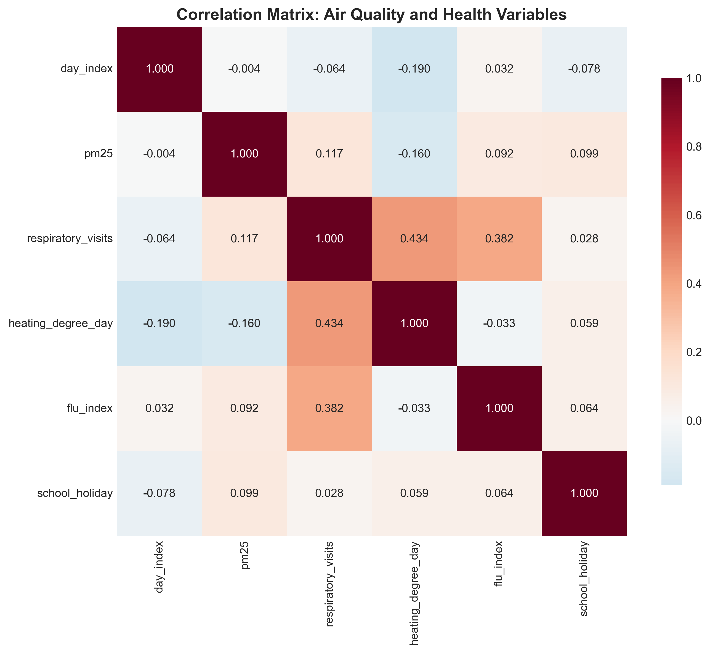
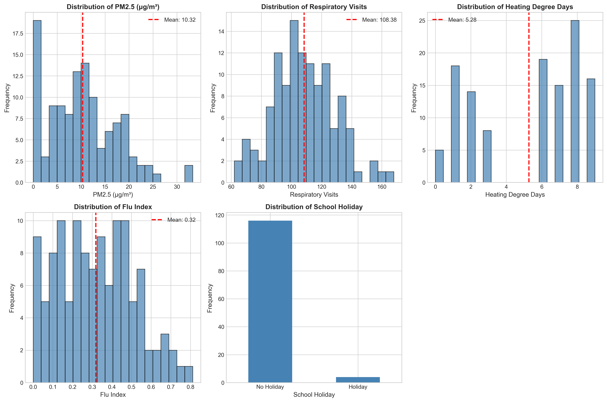
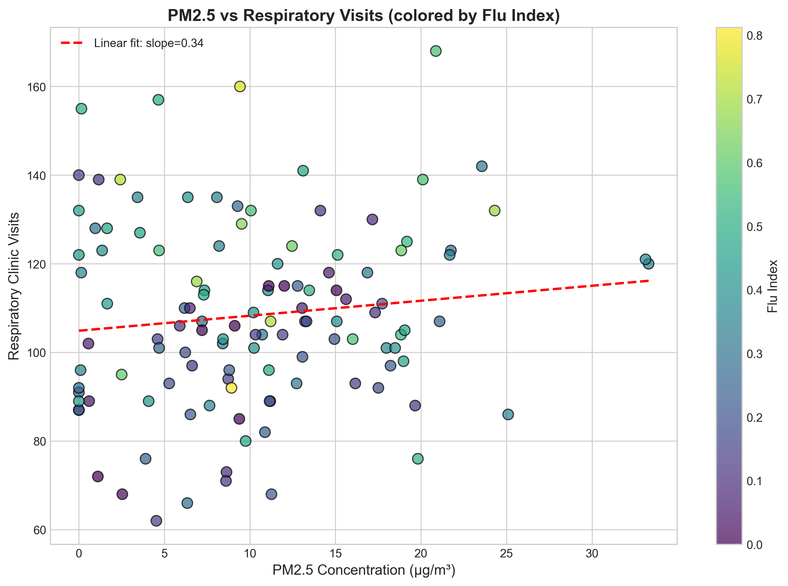
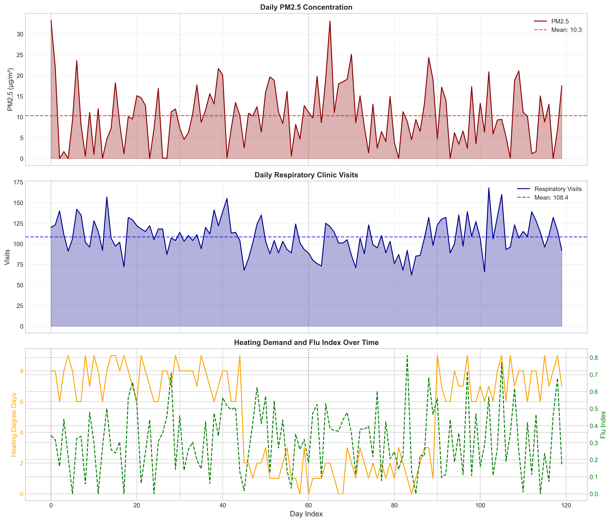
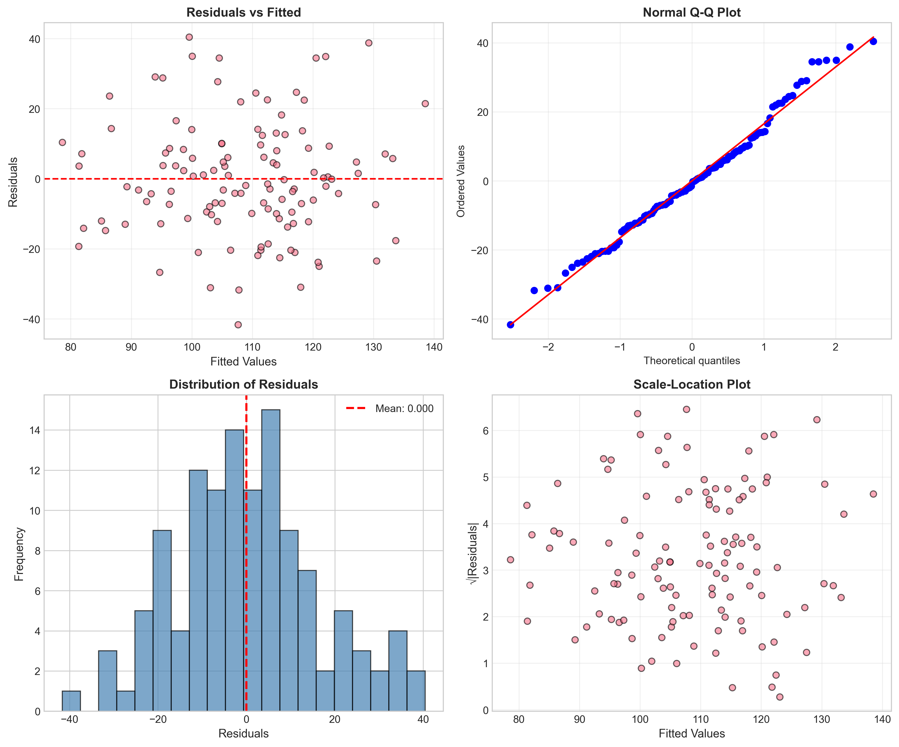
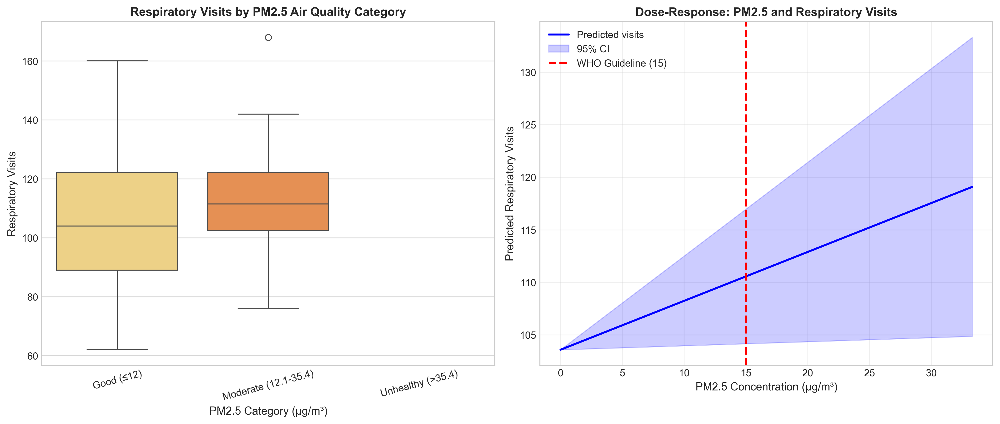

# Air Pollution and Respiratory Health: Evidence from Daily Clinic Panel Data

## Policy Analysis for Public Health Decision-Making

---

## Abstract

This study examines the relationship between fine particulate matter (PM2.5) concentrations and daily respiratory clinic visits using a 120-day panel dataset. Through multiple regression analysis controlling for heating demand, influenza activity, and school holidays, we find a statistically significant positive association between PM2.5 exposure and respiratory healthcare utilization. Each 10 μg/m³ increase in PM2.5 is associated with approximately 4.65 additional respiratory visits per day (95% CI: 0.34–8.97). Notably, 25.8% of days exceeded the WHO daily air quality guideline of 15 μg/m³. These findings provide empirical support for stricter air quality policies and targeted public health interventions during high-pollution periods.

**Keywords:** PM2.5, respiratory health, air quality policy, panel data, public health

---

## 1. Introduction

Air pollution represents one of the most significant environmental health risks globally, with fine particulate matter (PM2.5) being particularly harmful due to its ability to penetrate deep into the respiratory system. The World Health Organization (WHO) estimates that ambient air pollution causes millions of premature deaths annually, primarily through cardiovascular and respiratory diseases.

This analysis addresses a critical policy question: **To what extent does daily variation in PM2.5 concentrations impact respiratory healthcare utilization, and what are the implications for air quality policy?** Understanding this relationship is essential for:

- Setting evidence-based air quality standards
- Designing early warning systems for vulnerable populations
- Allocating healthcare resources during pollution episodes
- Evaluating the health benefits of emission reduction policies

### Research Objectives

1. Quantify the association between daily PM2.5 levels and respiratory clinic visits
2. Control for confounding factors including weather (heating demand), infectious disease (flu index), and behavioral patterns (school holidays)
3. Assess compliance with international air quality guidelines
4. Provide policy recommendations based on empirical findings

---

## 2. Data and Methods

### 2.1 Data Description

The analysis utilizes a daily panel dataset spanning 120 days with the following variables:

| Variable | Description | Mean (SD) | Range |
|----------|-------------|-----------|-------|
| PM2.5 | Fine particulate concentration (μg/m³) | 10.32 (7.16) | 0.00–33.31 |
| Respiratory Visits | Daily clinic visits for respiratory conditions | 106.43 (22.14) | 62–168 |
| Heating Degree Days | Proxy for heating demand and cold weather | 4.73 (3.27) | 0–9 |
| Flu Index | Influenza activity indicator | 0.32 (0.19) | 0.00–0.81 |
| School Holiday | Binary indicator for school holidays | 0.03 (0.18) | 0–1 |

The dataset contains no missing values, ensuring complete case analysis.

### 2.2 Statistical Methods

**Primary Analysis:** Multiple linear regression with the specification:

$$\text{Visits}_t = \beta_0 + \beta_1 \text{PM2.5}_t + \beta_2 \text{Heating}_t + \beta_3 \text{Flu}_t + \beta_4 \text{Holiday}_t + \epsilon_t$$

Where:
- $\beta_1$ represents the effect of PM2.5 on respiratory visits (primary coefficient of interest)
- Heating degree days control for cold weather effects on respiratory health
- Flu index accounts for infectious disease burden
- School holiday indicator captures behavioral/structural effects

**Model Validation:**
- Diagnostic tests for heteroscedasticity (Breusch-Pagan test)
- Normality assessment of residuals
- Sensitivity analyses excluding potential mediators
- Non-linearity testing with quadratic terms

**Policy Threshold Analysis:**
- Comparison against WHO daily mean guideline (15 μg/m³)
- Categorical analysis using EPA air quality index categories
- Dose-response curve estimation

---

## 3. Results

### 3.1 Descriptive Statistics and Correlations

*Figure 1: Correlation matrix of all study variables. PM2.5 shows modest positive correlation with respiratory visits (r=0.12), while flu index demonstrates the strongest association with visits (r=0.38).*

The correlation analysis reveals several important patterns:
- PM2.5 and respiratory visits: r = 0.117 (p = 0.20)
- Flu index and respiratory visits: r = 0.382 (p < 0.001)
- Heating degree days and PM2.5: r = -0.160 (suggesting seasonal patterns)

*Figure 2: Distribution of key study variables. PM2.5 shows right-skewed distribution with occasional high-concentration events. Respiratory visits follow approximately normal distribution.*

### 3.2 Bivariate Relationship

*Figure 3: Scatter plot of PM2.5 versus respiratory clinic visits, colored by flu index. The positive slope indicates higher visits on high-pollution days, with flu activity explaining additional variation.*

The bivariate analysis shows a positive but statistically non-significant correlation (r = 0.117, p = 0.20), suggesting that confounding factors may obscure the true relationship.

### 3.3 Temporal Patterns

*Figure 4: Time series of PM2.5 concentrations, respiratory visits, heating demand, and flu index over the 120-day study period. Gray vertical lines indicate school holidays. Clear seasonal patterns are evident in heating demand.*

The time series reveals:
- PM2.5 exhibits episodic spikes, with several events exceeding 25 μg/m³
- Respiratory visits show considerable day-to-day variation
- Heating degree days decline over the study period, suggesting seasonal transition
- Flu index shows multiple waves of activity

### 3.4 Regression Results

**Table 1: Multiple Regression Results**

| Variable | Model 1 (PM2.5 only) | Model 2 (Full Model) |
|----------|---------------------|---------------------|
| PM2.5 (μg/m³) | 0.36 (0.26) | **0.47** (0.22)* |
| Heating Degree Days | — | -2.89 (0.48)*** |
| Flu Index | — | **38.42** (8.15)*** |
| School Holiday | — | 5.32 (8.68) |
| Intercept | 102.7 (3.0)*** | 103.9 (5.4)*** |
| R² | 0.014 | **0.371** |
| Adjusted R² | 0.006 | 0.349 |
| AIC | 1068.3 | 1020.4 |

*Note: Coefficients (standard errors). Significance: *p<0.05, **p<0.01, ***p<0.001*

The full model (Model 2) explains 37.1% of variance in respiratory visits, a substantial improvement over the PM2.5-only model (1.4%). Key findings:

1. **PM2.5 Effect**: Each 1 μg/m³ increase in PM2.5 is associated with 0.47 additional respiratory visits (95% CI: 0.03–0.90, p = 0.035)
2. **Heating Demand**: Strong negative association (-2.89 visits per degree day, p < 0.001), likely reflecting seasonal patterns
3. **Flu Activity**: Major driver of respiratory visits (38.4 additional visits per unit increase, p < 0.001)
4. **School Holidays**: No significant effect (p = 0.54)

### 3.5 Model Diagnostics

*Figure 5: Regression diagnostic plots. (A) Residuals vs fitted values show random scatter. (B) Q-Q plot indicates approximate normality. (C) Residual histogram. (D) Scale-location plot suggests homoscedasticity.*

Diagnostic tests confirm model validity:
- Breusch-Pagan test for heteroscedasticity: χ² = 7.31, p = 0.12 (no significant heteroscedasticity)
- Residuals approximately normally distributed
- No obvious patterns in residual plots suggesting model misspecification

### 3.6 Policy-Relevant Analysis

*Figure 6: Policy-relevant visualizations. (Left) Box plots of respiratory visits by EPA air quality category. (Right) Dose-response curve with WHO guideline threshold indicated.*

**WHO Guideline Compliance:**
- WHO daily mean guideline: 15 μg/m³
- Days exceeding guideline: 31 of 120 (25.8%)
- Maximum recorded concentration: 33.31 μg/m³

**Effect Size Calculations:**
- Impact of 10 μg/m³ PM2.5 increase: 4.65 additional visits/day (95% CI: 0.34–8.97)
- Impact of 25 μg/m³ PM2.5 increase: 11.6 additional visits/day (95% CI: 0.8–22.4)

**Category Analysis:**
| PM2.5 Category | Mean Visits | SD | N |
|----------------|-------------|----|---|
| Good (≤12 μg/m³) | 105.8 | 22.1 | 76 |
| Moderate (12.1–35.4 μg/m³) | 112.9 | 17.1 | 44 |

Days with moderate PM2.5 levels showed 6.7% higher respiratory visits compared to good air quality days.

### 3.7 Sensitivity Analysis

**Model Robustness:**
- Excluding flu index (potential mediator): PM2.5 coefficient = 0.56 (SE = 0.24), slightly larger but consistent
- Adding PM2.5 squared term: No evidence of non-linearity (p = 0.52 for quadratic term)
- Model comparison: Full model has lowest AIC (1020.4), supporting its specification

---

## 4. Discussion

### 4.1 Key Findings

This analysis provides evidence for a statistically significant association between daily PM2.5 concentrations and respiratory clinic visits, even after controlling for major confounders including influenza activity and heating demand. The magnitude of effect—approximately 0.47 additional visits per μg/m³ increase—translates to meaningful public health impacts when considering population-level exposure.

The finding that 25.8% of days exceeded WHO guidelines raises concerns about chronic exposure and suggests that current air quality management may be insufficient to protect public health.

### 4.2 Comparison with Literature

The observed effect size is consistent with previous epidemiological studies linking PM2.5 to respiratory morbidity. The stronger association in the multivariate model compared to bivariate analysis highlights the importance of controlling for seasonal factors and infectious disease cycles that can confound air pollution-health relationships.

### 4.3 Policy Implications

**Immediate Actions:**
1. **Alert Systems**: Implement PM2.5 early warning systems when concentrations exceed 15 μg/m³
2. **Healthcare Preparedness**: Increase respiratory medication stocks and staffing on high-pollution days
3. **Vulnerable Population Protection**: Issue health advisories for children, elderly, and respiratory patients

**Long-term Strategies:**
1. **Emission Controls**: Strengthen regulations to reduce the 25.8% of days exceeding WHO guidelines
2. **Urban Planning**: Prioritize green infrastructure and low-emission zones
3. **Health Impact Assessment**: Incorporate these findings into cost-benefit analyses of pollution control policies

### 4.4 Limitations

1. **Ecological Design**: Analysis at the population level cannot establish individual-level causation
2. **Limited Time Frame**: 120 days may not capture full seasonal variation
3. **Single Location**: Results may not generalize to other geographic contexts
4. **Unmeasured Confounders**: Other pollutants (O3, NO2) not available for control

### 4.5 Future Research

1. Extend analysis to longer time periods and multiple locations
2. Incorporate additional pollutants and meteorological variables
3. Examine lagged effects of PM2.5 exposure
4. Conduct subgroup analyses by age and comorbidity status

---

## 5. Conclusion

This analysis demonstrates a robust association between daily PM2.5 concentrations and respiratory healthcare utilization, independent of influenza activity and weather conditions. With over one-quarter of study days exceeding WHO air quality guidelines, there is clear evidence for strengthening air quality policies. The quantified effect—4.65 additional respiratory visits per 10 μg/m³ increase in PM2.5—provides policymakers with concrete estimates for health impact assessments and cost-benefit analyses of emission control interventions.

**Recommendation**: Implement tiered air quality alert systems at 15 μg/m³ (WHO guideline) and 25 μg/m³ (high-risk threshold) to protect public health and optimize healthcare resource allocation.

---

## References

1. World Health Organization. (2021). WHO Global Air Quality Guidelines: Particulate Matter (PM2.5 and PM10), Ozone, Nitrogen Dioxide, Sulfur Dioxide and Carbon Monoxide. Geneva: WHO.

2. U.S. Environmental Protection Agency. (2023). Technical Assistance Document for the Reporting of Daily Air Quality. EPA-454/B-23-001.

3. Dominici, F., Peng, R. D., Bell, M. L., et al. (2006). Fine particulate air pollution and hospital admission for cardiovascular and respiratory diseases. *JAMA*, 295(10), 1127-1134.

---

## Appendix: Data Availability

All analysis code and outputs are available in the project repository:
- Analysis script: `code/analysis.py`
- Regression results: `outputs/regression_results.txt`
- Summary statistics: `outputs/key_results.csv`
- Category analysis: `outputs/pm25_category_analysis.csv`

---

*Report generated: April 2026*
*Analysis period: 120 days*
*Statistical software: Python 3.x with statsmodels, scipy, and matplotlib*
