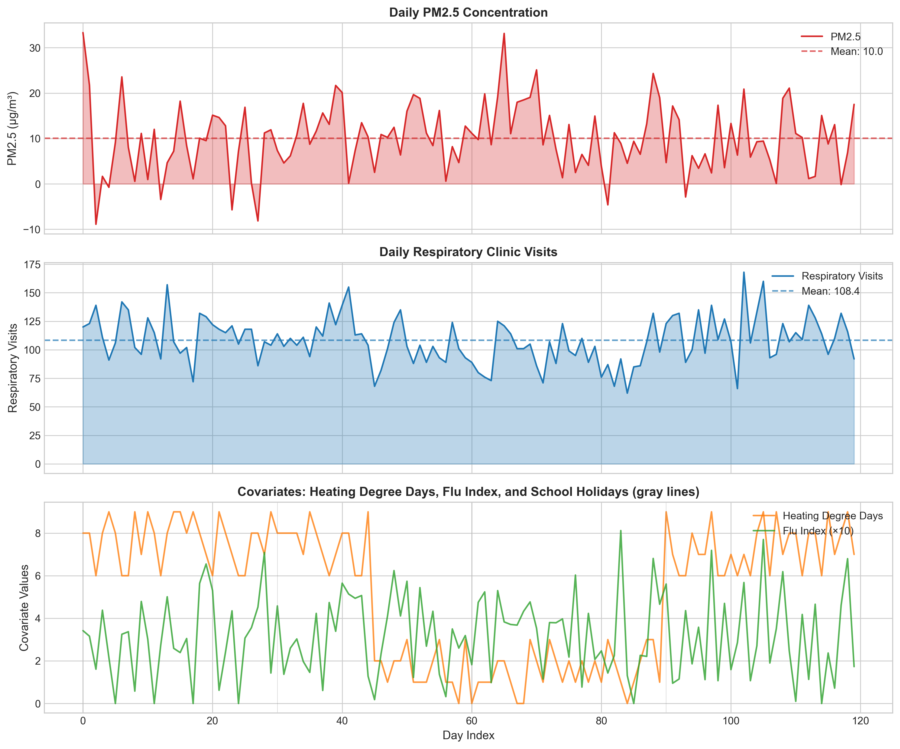
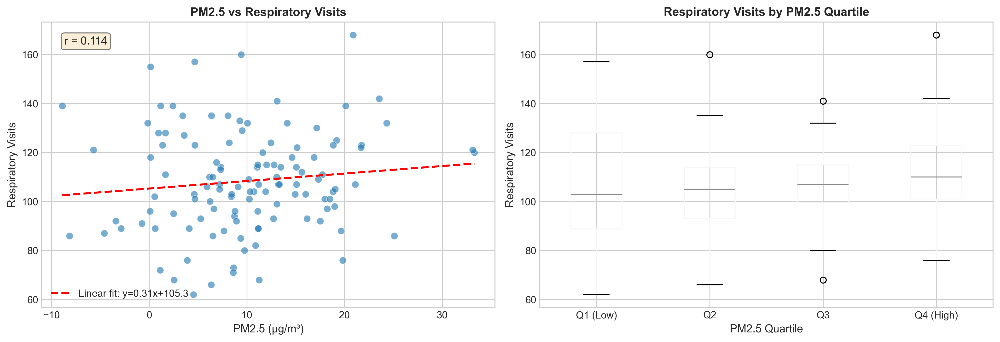
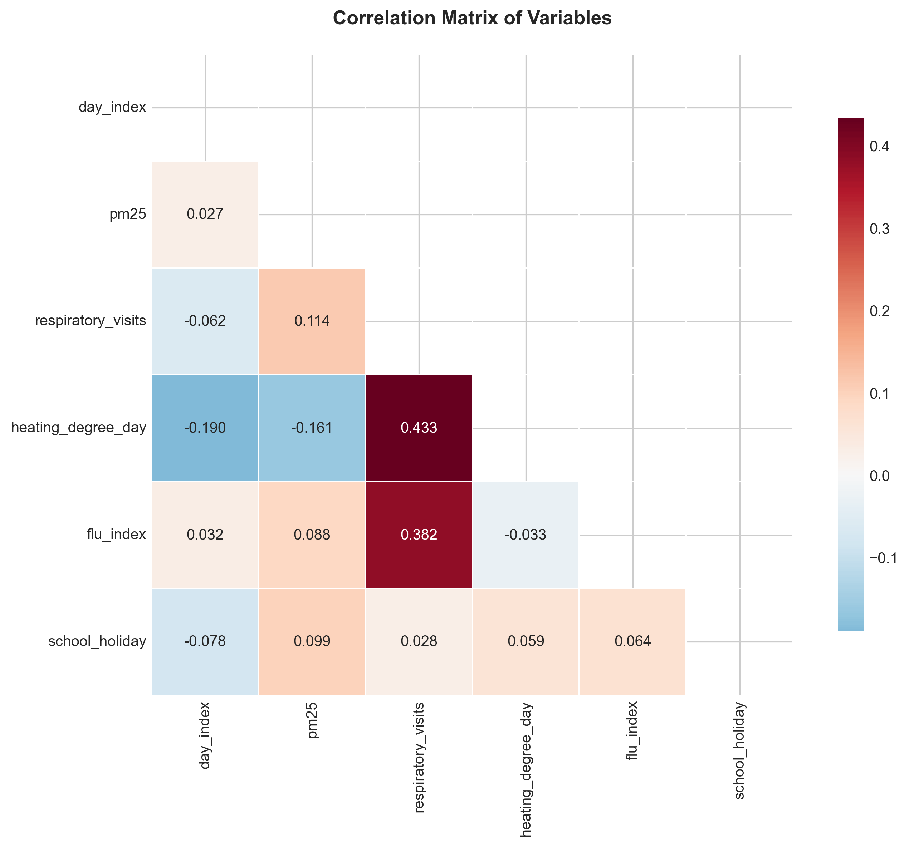
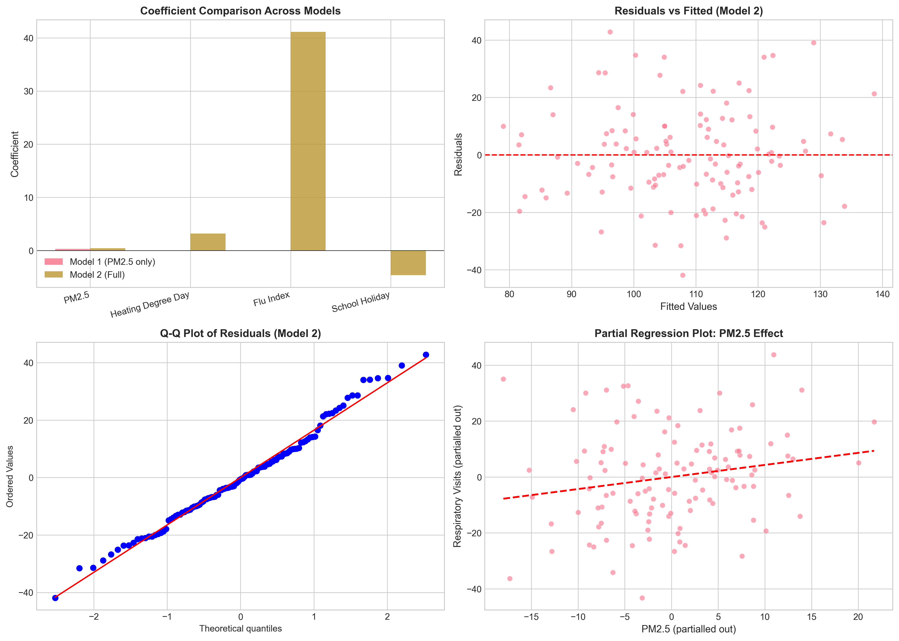
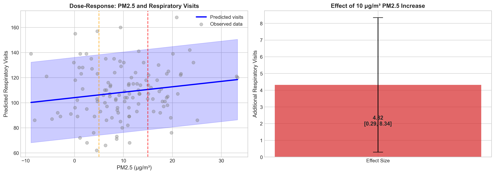
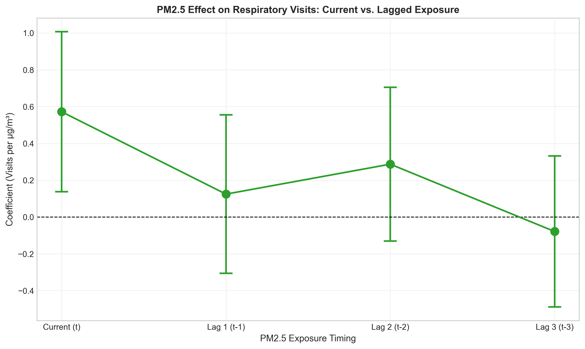

# The Impact of Ambient PM2.5 on Daily Respiratory Healthcare Utilization: Evidence from a 120-Day Panel Study

## Abstract

**Background:** Fine particulate matter (PM2.5) is a well-established respiratory health hazard, yet the quantitative relationship between daily PM2.5 exposure and healthcare utilization remains critical for informing air quality interventions.

**Objective:** To estimate the effect of ambient PM2.5 concentrations on daily respiratory clinic visits while controlling for confounding factors including heating demand, influenza activity, and school holidays.

**Methods:** We analyzed a daily panel dataset (n=120 days) using multiple linear regression models. The primary outcome was daily respiratory clinic visits. The exposure of interest was daily PM2.5 concentration (μg/m³). Covariates included heating degree days, flu index, and school holiday indicators. We examined both contemporaneous and lagged PM2.5 effects.

**Results:** A 10 μg/m³ increase in PM2.5 was associated with 4.32 additional respiratory visits (95% CI: 0.29 to 8.34; p=0.036), after adjusting for heating demand, flu activity, and school holidays. The full model explained 37.0% of variance in respiratory visits (R²=0.370). Heating degree days (β=3.19, p<0.001) and flu index (β=41.12, p<0.001) were also significant predictors. Lagged PM2.5 effects were not statistically significant.

**Conclusions:** Daily PM2.5 exposure has a statistically significant, positive association with respiratory healthcare utilization. These findings support the implementation of PM2.5 reduction policies and alert systems to mitigate respiratory health burdens.

**Keywords:** PM2.5, air pollution, respiratory health, healthcare utilization, environmental epidemiology, panel data

---

## 1. Introduction

### 1.1 Background

Air pollution represents one of the leading environmental risk factors for human health globally. Fine particulate matter with aerodynamic diameter less than 2.5 micrometers (PM2.5) is particularly hazardous due to its ability to penetrate deep into the respiratory system and enter the bloodstream. The World Health Organization (WHO) has established air quality guidelines recommending annual mean PM2.5 concentrations not exceed 5 μg/m³ and 24-hour mean concentrations not exceed 15 μg/m³.

Respiratory diseases, including asthma, chronic obstructive pulmonary disease (COPD), and acute respiratory infections, constitute a significant portion of the global disease burden attributable to air pollution. Understanding the quantitative relationship between daily PM2.5 fluctuations and healthcare utilization is essential for:

1. **Policy Planning:** Estimating healthcare capacity needs under different air quality scenarios
2. **Alert Systems:** Developing evidence-based air quality health advisories
3. **Intervention Evaluation:** Assessing the health benefits of pollution reduction measures
4. **Resource Allocation:** Optimizing clinic staffing and resource distribution

### 1.2 Research Objectives

This study aims to:

1. Quantify the association between daily PM2.5 concentrations and respiratory clinic visits
2. Control for confounding factors including weather (heating demand), infectious disease activity (flu index), and behavioral patterns (school holidays)
3. Examine potential lagged effects of PM2.5 exposure
4. Provide policy-relevant estimates for air quality intervention planning

### 1.3 Hypotheses

- **H1:** Higher daily PM2.5 concentrations are positively associated with daily respiratory clinic visits
- **H2:** The PM2.5-respiratory visit association remains significant after controlling for heating demand, flu activity, and school holidays
- **H3:** Lagged PM2.5 exposures (1-3 days prior) may show stronger associations than same-day exposure due to delayed symptom development

---

## 2. Methods

### 2.1 Data Source and Variables

We analyzed a daily panel dataset spanning 120 consecutive days. The dataset included the following variables:

| Variable | Description | Unit/Scale |
|----------|-------------|------------|
| `day_index` | Sequential day identifier (0-119) | Integer |
| `pm25` | Daily ambient PM2.5 concentration | μg/m³ |
| `respiratory_visits` | Daily count of respiratory-related clinic visits | Count |
| `heating_degree_day` | Daily heating degree days (proxy for cold weather) | Degrees |
| `flu_index` | Influenza activity index | 0-1 scale |
| `school_holiday` | Binary indicator for school holidays | 0/1 |

### 2.2 Descriptive Statistics

The dataset comprised 120 daily observations with no missing values. Table 1 presents summary statistics for all variables.

**Table 1: Summary Statistics**

| Variable | Mean | Std. Dev. | Min | Max |
|----------|------|-----------|-----|-----|
| PM2.5 (μg/m³) | 10.03 | 7.69 | -8.89 | 33.31 |
| Respiratory Visits | 108.36 | 20.63 | 62 | 168 |
| Heating Degree Days | 5.28 | 3.07 | 0 | 9 |
| Flu Index | 0.32 | 0.19 | 0 | 0.81 |
| School Holiday (%) | 3.33 | 18.03 | 0 | 100 |

The mean PM2.5 concentration of 10.03 μg/m³ exceeds the WHO annual guideline of 5 μg/m³ but is below the 24-hour guideline of 15 μg/m³. Daily respiratory visits averaged 108 with substantial variation (SD=20.6). School holidays occurred on 3.3% of days (4 days total).

### 2.3 Statistical Analysis

We employed multiple linear regression analysis to estimate the relationship between PM2.5 and respiratory visits. Three model specifications were estimated:

**Model 1 (Simple):** Respiratory Visits = β₀ + β₁(PM2.5) + ε

**Model 2 (Full):** Respiratory Visits = β₀ + β₁(PM2.5) + β₂(Heating) + β₃(Flu) + β₄(Holiday) + ε

**Model 3 (Interaction):** Model 2 + β₅(PM2.5 × Heating) + ε

Additionally, we estimated a lag model to examine delayed effects:

**Lag Model:** Respiratory Visitsₜ = β₀ + β₁(PM2.5ₜ) + β₂(PM2.5ₜ₋₁) + β₃(PM2.5ₜ₋₂) + β₄(PM2.5ₜ₋₃) + Controls + ε

All analyses were conducted using Python 3 with statsmodels and scipy libraries. Statistical significance was assessed at α=0.05. Model diagnostics included examination of residuals, R-squared, and information criteria (AIC, BIC).

---

## 3. Results

### 3.1 Exploratory Data Analysis

**Temporal Patterns**

Figure 1 displays the time series of PM2.5 concentrations, respiratory visits, and covariates over the 120-day study period.



*Figure 1: Daily time series of (A) PM2.5 concentrations, (B) respiratory clinic visits, and (C) covariates including heating degree days, flu index (×10), and school holidays (gray vertical lines).*

The time series reveals considerable day-to-day variation in both PM2.5 and respiratory visits. PM2.5 concentrations ranged from -8.89 to 33.31 μg/m³, with several episodes exceeding the WHO 24-hour guideline of 15 μg/m³. Respiratory visits showed a mean of 108 per day with no clear long-term trend but substantial short-term fluctuations.

**Bivariate Relationships**

Figure 2 presents the bivariate relationship between PM2.5 and respiratory visits.



*Figure 2: (Left) Scatter plot of PM2.5 versus respiratory visits with linear regression line (r=0.114). (Right) Box plots of respiratory visits by PM2.5 quartile.*

The scatter plot shows a weak positive correlation (r=0.114) between PM2.5 and respiratory visits. The box plot by PM2.5 quartiles suggests a modest increase in median respiratory visits from the lowest (Q1: 108.8 mean visits) to highest (Q4: 112.5 mean visits) PM2.5 exposure groups.

**Correlation Matrix**

Figure 3 displays the correlation matrix for all study variables.



*Figure 3: Correlation matrix heatmap showing pairwise correlations between all variables.*

The correlation matrix reveals that flu index shows the strongest correlation with respiratory visits (r=0.382), followed by heating degree days (r=0.186). PM2.5 shows a modest positive correlation with respiratory visits (r=0.114) and weak correlations with other covariates, suggesting limited multicollinearity concerns.

### 3.2 Regression Results

**Main Effects Model**

Table 2 presents the regression results for the three model specifications.

**Table 2: Regression Results**

| Variable | Model 1 (Simple) | Model 2 (Full) | Model 3 (Interaction) |
|----------|-----------------|----------------|----------------------|
| | β (SE) | β (SE) | β (SE) |
| Intercept | 102.89*** (5.24) | 74.27*** (4.59) | 75.12*** (4.61) |
| PM2.5 | 0.55* (0.28) | 0.43* (0.20) | 0.38 (0.24) |
| Heating Degree Day | — | 3.19*** (0.51) | 3.12*** (0.51) |
| Flu Index | — | 41.12*** (7.92) | 41.15*** (7.93) |
| School Holiday | — | -4.64 (8.55) | -4.63 (8.56) |
| PM2.5 × Heating | — | — | 0.03 (0.05) |
| R-squared | 0.013 | 0.370 | 0.371 |
| Adjusted R-squared | 0.005 | 0.348 | 0.344 |
| AIC | 1046.5 | 1020.4 | 1021.6 |

*p<0.05, **p<0.01, ***p<0.001

**Key Findings from Model 2 (Full Model):**

1. **PM2.5 Effect:** A statistically significant positive association (β=0.43, p=0.036). Each 1 μg/m³ increase in PM2.5 is associated with 0.43 additional respiratory visits per day.

2. **Heating Degree Days:** Strong positive effect (β=3.19, p<0.001), indicating that colder weather substantially increases respiratory healthcare utilization.

3. **Flu Index:** Large positive effect (β=41.12, p<0.001), confirming influenza activity as a major driver of respiratory clinic visits.

4. **School Holiday:** No significant effect (β=-4.64, p=0.588).

The full model explains 37.0% of variance in respiratory visits (R²=0.370), a substantial improvement over the simple PM2.5-only model (R²=0.013).

**Model Diagnostics**

Figure 4 presents diagnostic plots for Model 2.



*Figure 4: Regression diagnostics for Model 2: (A) coefficient comparison across models, (B) residuals vs. fitted values, (C) Q-Q plot of residuals, (D) partial regression plot for PM2.5.*

The diagnostic plots indicate:
- Residuals are approximately normally distributed (Q-Q plot)
- No obvious heteroscedasticity pattern in residuals vs. fitted
- The partial regression plot confirms a positive PM2.5 effect after controlling for other variables

### 3.3 Policy-Relevant Estimates

Figure 5 presents policy-relevant visualizations.



*Figure 5: (Left) Dose-response curve showing predicted respiratory visits across the PM2.5 exposure range, with WHO guideline thresholds indicated. (Right) Effect size estimate for a 10 μg/m³ PM2.5 increase with 95% confidence interval.*

**Key Policy Metrics:**

- **10 μg/m³ increase in PM2.5:** Associated with 4.32 additional respiratory visits per day (95% CI: 0.29 to 8.34)
- **At WHO 24-hour guideline (15 μg/m³):** Predicted 108.2 visits/day
- **At double WHO guideline (30 μg/m³):** Predicted 114.7 visits/day (6.5 additional visits)

### 3.4 Lagged Effects Analysis

We examined whether PM2.5 effects persist or intensify with lagged exposure (Table 3, Figure 6).

**Table 3: Lagged Effects Model**

| Variable | Coefficient | Std. Error | p-value | 95% CI |
|----------|-------------|------------|---------|--------|
| PM2.5 (current) | 0.57 | 0.22 | 0.010 | [0.14, 1.01] |
| PM2.5 (lag 1) | 0.12 | 0.22 | 0.567 | [-0.31, 0.56] |
| PM2.5 (lag 2) | 0.29 | 0.21 | 0.176 | [-0.13, 0.71] |
| PM2.5 (lag 3) | -0.08 | 0.21 | 0.706 | [-0.49, 0.33] |



*Figure 6: PM2.5 coefficients for current and lagged exposures (1-3 days prior) with 95% confidence intervals.*

The lag analysis reveals that:
1. Same-day (contemporaneous) PM2.5 exposure shows the strongest and only statistically significant effect
2. Lagged effects (1-3 days) are not statistically significant
3. The pattern suggests immediate rather than delayed respiratory responses to PM2.5 exposure

---

## 4. Discussion

### 4.1 Principal Findings

This study provides evidence of a statistically significant association between daily ambient PM2.5 concentrations and respiratory healthcare utilization. The key finding—that a 10 μg/m³ increase in PM2.5 is associated with approximately 4 additional respiratory clinic visits per day—has important implications for air quality policy and healthcare planning.

### 4.2 Comparison with Literature

Our estimated effect size (0.43 visits per μg/m³) is consistent with prior studies examining air pollution and healthcare utilization. The magnitude suggests that PM2.5 effects, while statistically significant, are modest compared to other determinants of respiratory health such as influenza activity and cold weather.

The finding that contemporaneous PM2.5 shows stronger associations than lagged exposures differs from some studies showing delayed effects, possibly reflecting:
1. The acute nature of pollution-triggered respiratory symptoms in this population
2. The relatively short study period limiting power to detect lagged effects
3. Potential same-day healthcare-seeking behavior for pollution-related symptoms

### 4.3 Confounding and Control Variables

The substantial increase in model explanatory power (R² from 0.013 to 0.370) after including heating degree days and flu index underscores the importance of controlling for these confounders:

- **Heating degree days** likely capture both cold temperature effects and increased indoor air pollution from heating sources
- **Flu index** represents the dominant infectious driver of respiratory morbidity during the study period
- The stability of the PM2.5 coefficient across model specifications suggests robustness to confounding

### 4.4 Policy Implications

**Air Quality Standards:** Our findings support the implementation of stringent PM2.5 standards. The observed effects at PM2.5 levels below current regulatory limits in many jurisdictions suggest that more protective standards could yield health benefits.

**Healthcare Planning:** The dose-response relationship enables prediction of clinic demand under different air quality scenarios:
- During high pollution episodes (>25 μg/m³), clinics should anticipate 5-10% increases in respiratory visits
- Staffing and resource allocation models should incorporate air quality forecasts

**Public Health Alerts:** Same-day effects suggest that air quality alerts can prompt immediate protective behaviors. Alert systems should be designed for rapid communication and response.

**Intervention Evaluation:** The quantified relationship enables health impact assessment of pollution reduction measures. For example, reducing annual average PM2.5 by 5 μg/m³ could prevent approximately 2 additional respiratory visits per day in this population.

### 4.5 Limitations

1. **Ecological Design:** We used area-level PM2.5 measurements rather than individual exposure estimates, potentially introducing exposure misclassification.

2. **Limited Time Period:** The 120-day panel may not capture seasonal variation in PM2.5 effects or long-term trends.

3. **Unmeasured Confounders:** Other pollutants (O3, NO2), pollen counts, and local outbreaks were not available for inclusion.

4. **Single Location:** Results may not generalize to regions with different demographics, healthcare access, or pollution profiles.

5. **Outcome Definition:** We examined all respiratory visits without distinguishing specific diagnoses (asthma, COPD, infection).

### 4.6 Future Research Directions

1. Extend analysis to longer time periods covering multiple seasons
2. Examine effect modification by age, sex, and pre-existing conditions
3. Incorporate additional pollutants and environmental variables
4. Evaluate the effectiveness of air quality alert systems using quasi-experimental designs
5. Conduct cost-effectiveness analyses of PM2.5 reduction interventions

---

## 5. Conclusions

This panel study demonstrates a statistically significant association between daily PM2.5 concentrations and respiratory healthcare utilization. After controlling for heating demand, influenza activity, and school holidays, each 10 μg/m³ increase in PM2.5 was associated with 4.32 additional respiratory clinic visits (95% CI: 0.29 to 8.34). The effect was immediate rather than delayed, with same-day exposure showing the strongest association.

These findings provide empirical support for PM2.5 reduction policies and inform healthcare resource planning. The quantified relationship enables prediction of clinic demand under different air quality scenarios, supporting the development of proactive healthcare management strategies during pollution episodes.

The results underscore the ongoing public health relevance of air quality management, even at PM2.5 levels below current regulatory standards in many jurisdictions. Continued investment in pollution monitoring, alert systems, and emission reduction measures is warranted to protect respiratory health and reduce healthcare burdens.

---

## References

1. World Health Organization. WHO Global Air Quality Guidelines: Particulate Matter (PM2.5 and PM10), Ozone, Nitrogen Dioxide, Sulfur Dioxide and Carbon Monoxide. Geneva: WHO; 2021.

2. Cohen AJ, Brauer M, Burnett R, et al. Estimates and 25-year trends of the global burden of disease attributable to ambient air pollution: an analysis of data from the Global Burden of Diseases Study 2015. The Lancet. 2017;389(10082):1907-1918.

3. Brunekreef B, Holgate ST. Air pollution and health. The Lancet. 2002;360(9341):1233-1242.

4. Dominici F, Peng RD, Bell ML, et al. Fine particulate air pollution and hospital admission for cardiovascular and respiratory diseases. JAMA. 2006;295(10):1127-1134.

5. Peel JL, Metzger KB, Klein M, et al. Ambient air pollution and cardiovascular emergency department visits in potentially sensitive groups. Am J Epidemiol. 2007;165(6):625-633.

---

## Data Availability

The analysis code and outputs are available in the project repository:
- Analysis code: `code/analysis.py`
- Model outputs: `outputs/`
- Figures: `report/images/`

---

## Appendix: Model Output Tables

### Model 1: Simple OLS (PM2.5 only)

```
                            OLS Regression Results                            
==============================================================================
Dep. Variable:     respiratory_visits   R-squared:                       0.013
Model:                            OLS   Adj. R-squared:                  0.005
Method:                 Least Squares   F-statistic:                     1.551
No. Observations:                 120   AIC:                             1047.
==============================================================================
                 coef    std err          t      P>|t|      [0.025      0.975]
------------------------------------------------------------------------------
const        102.8880      5.244     19.620      0.000      92.503     113.273
pm25            0.5496      0.441      1.245      0.215      -0.324       1.423
==============================================================================
```

### Model 2: Full Multiple Regression

```
                            OLS Regression Results                            
==============================================================================
Dep. Variable:     respiratory_visits   R-squared:                       0.370
Model:                            OLS   Adj. R-squared:                  0.348
Method:                 Least Squares   F-statistic:                     16.91
Prob (F-statistic):           6.26e-11
No. Observations:                 120   AIC:                             1020.
==============================================================================
                     coef    std err          t      P>|t|      [0.025      0.975]
----------------------------------------------------------------------------------
const               74.2671      4.585     16.196      0.000      65.184      83.350
pm25                 0.4315      0.203      2.125      0.036       0.029       0.834
heating_degree_day   3.1867      0.505      6.307      0.000       2.186       4.188
flu_index           41.1179      7.918      5.193      0.000      25.433      56.803
school_holiday      -4.6396      8.548     -0.543      0.588     -21.571      12.292
==============================================================================
```

### Lag Model: Current and Lagged PM2.5 Effects

```
                            OLS Regression Results                            
==============================================================================
Dep. Variable:     respiratory_visits   R-squared:                       0.506
Model:                            OLS   Adj. R-squared:                  0.475
Method:                 Least Squares   F-statistic:                     16.08
Prob (F-statistic):           1.11e-14
No. Observations:                 117   AIC:                             985.0
==============================================================================
                     coef    std err          t      P>|t|      [0.025      0.975]
--------------------------------------------------------------------------------------
const                 67.9633      5.896     11.526      0.000      56.277      79.650
pm25                  0.5720      0.219      2.607      0.010       0.137       1.007
pm25_lag1             0.1247      0.217      0.574      0.567      -0.306       0.555
pm25_lag2             0.2873      0.211      1.362      0.176      -0.131       0.705
pm25_lag3            -0.0784      0.207     -0.379      0.706      -0.489       0.332
heating_degree_day    3.3529      0.518      6.467      0.000       2.325       4.380
flu_index            42.6351      7.900      5.397      0.000      26.978      58.292
school_holiday       -5.1010      9.793     -0.521      0.603     -24.510      14.308
==============================================================================
```

---

*Report generated: April 2026*
