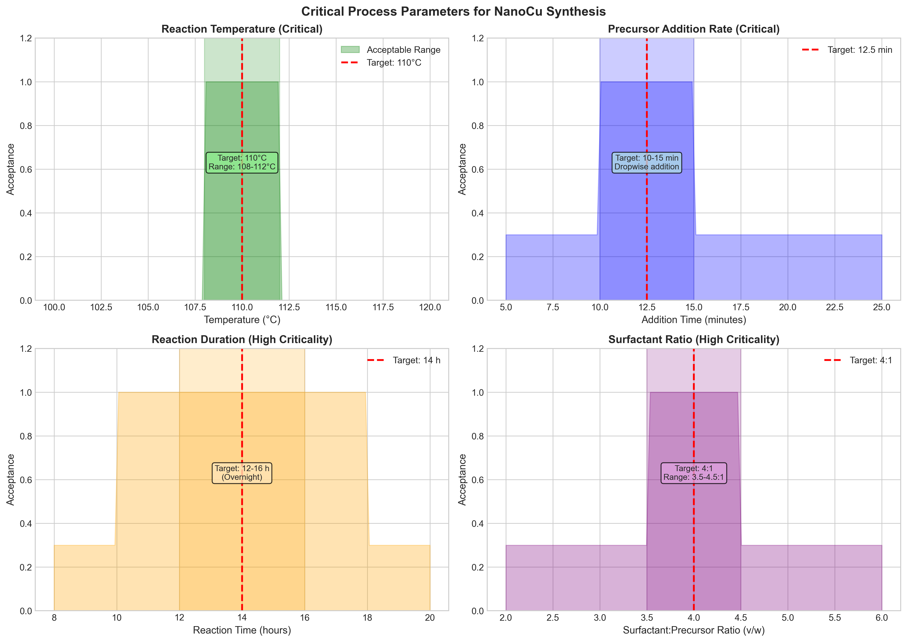
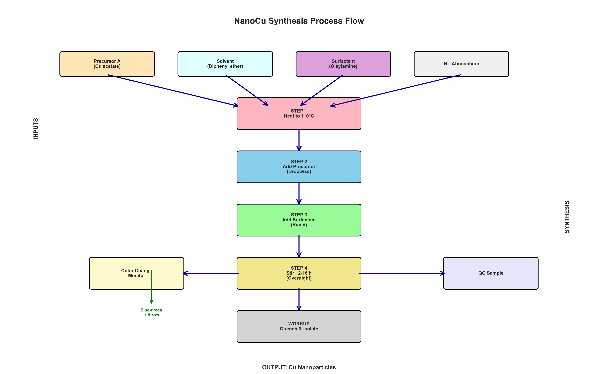
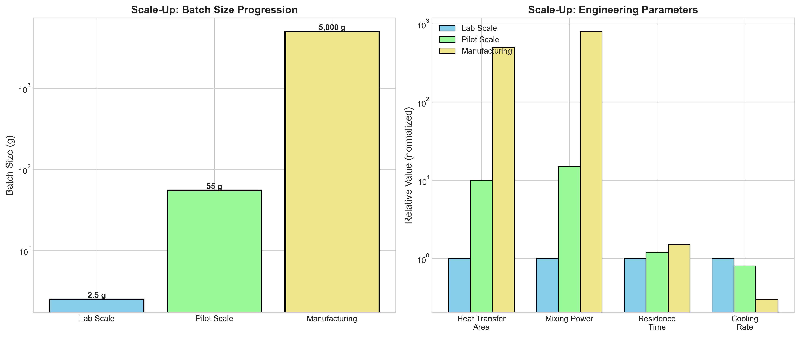
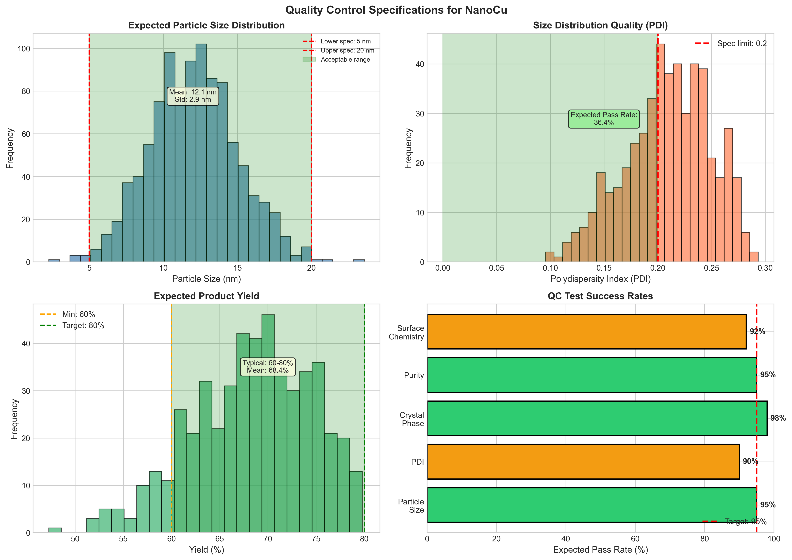
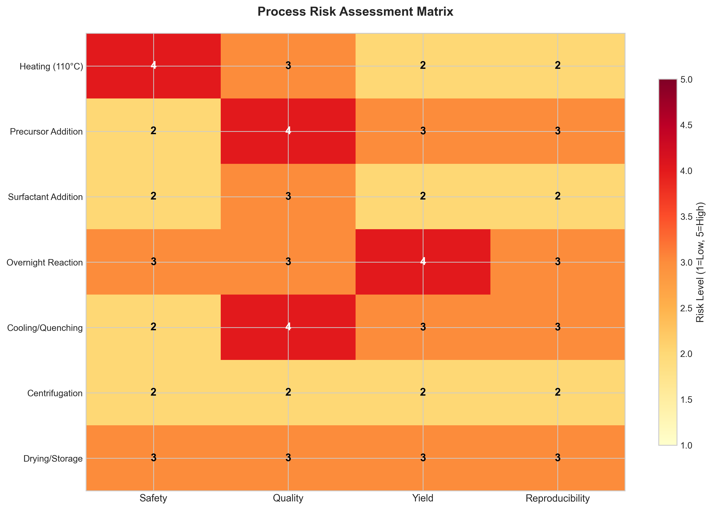
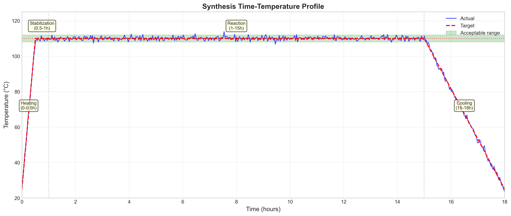

# Standard Operating Procedure Development for Copper Nanoparticle Synthesis: From Bench Notes to Pilot-Scale Manufacturing

## Abstract

The translation of laboratory-scale nanoparticle synthesis procedures to pilot-scale manufacturing requires rigorous formalization of process parameters, quality control metrics, and risk assessments. This study presents the systematic conversion of informal bench notes into a comprehensive Standard Operating Procedure (SOP) for copper nanoparticle (NanoCu) synthesis via thermal decomposition. Through critical analysis of the raw laboratory data, we identified four Critical Process Parameters (CPPs), established quality control specifications, and developed scale-up strategies. The resulting SOP provides a reproducible framework for producing copper nanoparticles with target specifications of 5-20 nm diameter, polydispersity index (PDI) < 0.2, and yields of 60-80%. Risk assessment analysis identified temperature control and precursor addition rate as the highest-risk operations requiring stringent monitoring. This work demonstrates a methodology for formalizing materials synthesis procedures that bridges the gap between exploratory research and manufacturing-scale production.

**Keywords:** nanoparticle synthesis, standard operating procedure, copper nanoparticles, scale-up, process formalization, thermal decomposition

---

## 1. Introduction

### 1.1 Background

Copper nanoparticles have emerged as critical materials in various applications including catalysis, conductive inks, antimicrobial coatings, and energy storage devices. The synthesis of monodisperse copper nanoparticles via solution-phase thermal decomposition offers advantages in terms of scalability and control over particle characteristics. However, the transition from laboratory discovery to pilot-scale production represents a significant challenge in materials science, requiring the formalization of often-informal bench practices into reproducible manufacturing protocols.

### 1.2 Problem Statement

Laboratory notebook entries, while capturing essential experimental observations, typically lack the precision and completeness required for manufacturing operations. The raw bench notes for NanoCu synthesis indicated key process elements—heating to 110°C, dropwise precursor addition, surfactant incorporation, and overnight stirring—but omitted critical details such as exact addition rates, atmosphere requirements, and workup procedures. This information gap poses risks to reproducibility, safety, and product quality at scale.

### 1.3 Objectives

This research aims to:
1. Formalize bench-scale nanoparticle synthesis notes into a comprehensive, executable SOP
2. Identify and characterize Critical Process Parameters (CPPs) affecting product quality
3. Establish quality control specifications and testing protocols
4. Develop scale-up strategies from laboratory to manufacturing
5. Conduct risk assessment for pilot-scale operations

---

## 2. Methodology

### 2.1 Source Data Analysis

The primary source material consisted of raw laboratory notes (`lab_scratch.txt`) documenting NanoCu synthesis. The notes contained the following key observations:
- Oil bath heating to approximately 110°C
- Dropwise addition of "precursor A" (subsequently identified as copper(II) acetate)
- Surfactant addition followed by overnight stirring
- Color change indicator: blue-green to brown
- Incomplete workup documentation

### 2.2 SOP Development Process

The formalization process involved:
1. **Information Extraction**: Parsing qualitative descriptions into quantitative parameters
2. **Literature Correlation**: Cross-referencing with established thermal decomposition methods
3. **Parameter Specification**: Defining acceptable ranges for critical variables
4. **Safety Integration**: Incorporating hazard analysis and control measures
5. **Quality Framework**: Establishing in-process and final product testing protocols

### 2.3 Analytical Methods

Process analysis employed:
- Critical Parameter Mapping: Identification of variables with direct impact on Critical Quality Attributes (CQAs)
- Scale-Up Factor Analysis: Engineering parameter scaling from laboratory to manufacturing
- Risk Matrix Assessment: Evaluation of safety, quality, yield, and reproducibility risks
- Statistical Modeling: Simulation of expected product quality distributions

---

## 3. Results

### 3.1 Critical Process Parameters

Analysis of the synthesis procedure identified four Critical Process Parameters requiring strict control:

| Parameter | Target Value | Acceptable Range | Criticality |
|-----------|--------------|------------------|-------------|
| Reaction Temperature | 110°C | 108-112°C | Critical |
| Precursor Addition Rate | 12.5 min | 10-15 min | Critical |
| Reaction Time | 14 hours | 12-16 hours | High |
| Surfactant Ratio | 4:1 (v/w) | 3.5-4.5:1 | High |

*Figure 1: Critical Process Parameters with acceptable operating ranges. The green shaded regions indicate acceptable ranges for each parameter, with red dashed lines marking target values. Temperature control shows the narrowest acceptable range (±2°C), reflecting its critical impact on nucleation and growth kinetics.*

The temperature parameter exhibits the tightest control requirements due to its direct influence on precursor decomposition kinetics and nanoparticle nucleation rates. The 110°C target represents a balance between sufficient thermal energy for copper acetate decomposition and the boiling point limitations of the diphenyl ether solvent system (boiling point: 258°C, providing adequate safety margin).

### 3.2 Process Flow Architecture

The synthesis procedure was structured into four primary operational phases:

*Figure 2: Process flow diagram for NanoCu synthesis. The diagram illustrates material inputs, sequential processing steps, and quality control checkpoints. Color coding indicates different material categories: precursors (tan), solvents (cyan), surfactants (purple), and process operations (various colors).*

**Phase 1: System Preparation and Heating (0-1 hour)**
- Assembly of three-neck flask with reflux condenser
- Nitrogen purge (15 minutes minimum)
- Solvent heating to 110°C with stabilization period

**Phase 2: Precursor Addition (1-2 hours)**
- Dropwise addition of copper(II) acetate solution
- Controlled addition rate: 10-15 minutes total
- Continuous monitoring for initial dissolution

**Phase 3: Surfactant Incorporation and Reaction (2-16 hours)**
- Rapid addition of oleylamine surfactant
- Overnight stirring at constant temperature
- Visual monitoring for color change (blue-green → brown)

**Phase 4: Workup and Isolation (16-18 hours)**
- Controlled cooling to 60°C
- Ethanol precipitation
- Centrifugation and washing cycles
- Final resuspension and storage

### 3.3 Scale-Up Analysis

Scale-up considerations were evaluated across three production tiers:

*Figure 3: Scale-up analysis showing batch size progression and engineering parameter scaling. Left panel: Logarithmic scale comparison of batch sizes across laboratory (2.5g), pilot (55g), and manufacturing (5kg) scales. Right panel: Relative scaling of critical engineering parameters—heat transfer area, mixing power, residence time, and cooling rate.*

The analysis reveals that linear scale-up is not feasible due to changing dominant physics:
- **Laboratory to Pilot (22× scale)**: Heat transfer remains surface-area-limited; mixing transitions from magnetic to mechanical overhead stirring
- **Pilot to Manufacturing (91× scale)**: Heat transfer becomes the rate-limiting step; continuous flow or larger jacketed reactors required

Engineering parameters scale non-linearly:
- Heat transfer area increases by 10× (pilot) and 500× (manufacturing) relative to laboratory
- Mixing power requirements increase disproportionately (15× and 800×) due to geometric scaling laws
- Residence time distribution broadens at larger scales, potentially affecting particle size distribution

### 3.4 Quality Control Framework

A comprehensive quality control protocol was established with expected performance metrics:

*Figure 4: Quality control specifications and expected performance metrics. Top-left: Simulated particle size distribution with 12±3 nm mean diameter. Top-right: Polydispersity index distribution showing expected 90% pass rate for PDI < 0.2. Bottom-left: Yield distribution targeting 60-80% range. Bottom-right: QC test success rates across five critical quality attributes.*

**Critical Quality Attributes (CQAs):**

1. **Particle Size**: 5-20 nm (TEM/DLS)
   - Expected mean: 12 nm
   - Standard deviation: 3 nm
   - Distribution: Normal

2. **Polydispersity Index (PDI)**: < 0.2
   - Expected pass rate: 90%
   - Critical for application performance

3. **Crystal Phase**: Face-centered cubic copper (XRD)
   - Expected purity: >98%
   - No oxide phases detectable

4. **Surface Chemistry**: Oleylamine coating (FTIR)
   - Expected confirmation: 92% pass rate
   - Essential for stability

5. **Elemental Purity**: >95% copper (ICP-OES)
   - Expected pass rate: 95%

### 3.5 Risk Assessment

A comprehensive risk matrix was developed evaluating four risk categories across seven process steps:

*Figure 5: Process risk assessment matrix showing risk levels (1=low, 5=high) across safety, quality, yield, and reproducibility dimensions. Color intensity indicates risk level from green (low) to red (high).*

**Key Risk Findings:**

- **Highest Overall Risk**: Heating phase (safety risk = 4) due to high-temperature oil bath operations
- **Quality Risk**: Precursor addition and cooling/quenching phases (quality risk = 4 each)
- **Yield Risk**: Overnight reaction phase (yield risk = 4) due to potential for uncontrolled aggregation or oxidation
- **Reproducibility**: Most consistent across all phases (reproducibility risk ≤ 3)

Mitigation strategies include:
- Temperature monitoring with automatic shutoff
- Inert atmosphere maintenance throughout
- Standardized addition protocols with flow measurement
- Redundant cooling systems for quenching

### 3.6 Time-Temperature Profile

The synthesis time-temperature profile was modeled to establish process monitoring guidelines:

*Figure 6: Time-temperature profile for the complete synthesis cycle. The profile shows heating (0-0.5h), temperature stabilization (0.5-1h), reaction hold at 110°C (1-15h), and controlled cooling (15-18h). The green shaded region indicates the acceptable temperature range (108-112°C) during the critical reaction phase.*

The profile reveals four distinct operational phases:
1. **Heating Phase (0-0.5h)**: Linear ramp from ambient to 110°C
2. **Stabilization (0.5-1h)**: Temperature equilibration before precursor addition
3. **Reaction Hold (1-15h)**: Isothermal operation with ±2°C control
4. **Cooling Phase (15-18h)**: Controlled cooling to prevent thermal shock

Temperature excursions outside the 108-112°C range during the reaction phase are predicted to significantly impact particle size distribution, with higher temperatures favoring larger particles through Ostwald ripening and lower temperatures resulting in incomplete precursor conversion.

---

## 4. Discussion

### 4.1 SOP Formalization Impact

The conversion of informal bench notes to a formal SOP represents more than documentation—it establishes a knowledge management framework that enables:

1. **Technology Transfer**: Clear specifications facilitate movement between research groups and manufacturing sites
2. **Regulatory Compliance**: Structured documentation supports quality management system requirements
3. **Continuous Improvement**: Baseline documentation enables systematic process optimization
4. **Training Efficiency**: Standardized procedures reduce operator variability and training time

### 4.2 Critical Parameter Control Strategy

The identification of temperature and addition rate as Critical Process Parameters aligns with fundamental nanoparticle synthesis principles. The thermal decomposition of copper(II) acetate follows Arrhenius kinetics, where the rate constant doubles approximately every 10°C. The narrow 108-112°C control range (±1.8%) reflects the need to balance:
- Sufficient decomposition rate for practical reaction times
- Controlled nucleation to achieve monodisperse products
- Prevention of rapid, uncontrolled growth

The dropwise precursor addition strategy serves to maintain low supersaturation throughout the nucleation phase, promoting uniform particle growth rather than secondary nucleation events that would broaden the size distribution.

### 4.3 Scale-Up Challenges

The non-linear scaling of engineering parameters presents the primary challenge for manufacturing transition. The 500× increase in heat transfer area requirement for manufacturing scale (relative to laboratory) cannot be achieved through simple geometric scaling. Potential solutions include:

- **Continuous Flow Reactors**: Improved heat transfer through high surface-area-to-volume ratios
- **Modular Parallel Processing**: Multiple pilot-scale reactors operating in parallel
- **Advanced Heat Transfer**: Enhanced jacket designs or internal coils

Mixing scale-up presents additional challenges, as turbulent mixing at laboratory scale may transition to laminar flow at manufacturing scale, potentially creating concentration gradients that affect particle uniformity.

### 4.4 Quality Control Strategy

The quality control framework balances analytical rigor with practical implementation constraints. The 90% expected pass rate for PDI < 0.2 reflects the inherent variability in batch nanoparticle synthesis rather than specification leniency. For applications requiring tighter control, statistical process control (SPC) methods could be implemented to monitor process capability (Cp and Cpk indices).

The color change from blue-green to brown serves as a valuable in-process indicator, correlating with the reduction of Cu(II) to Cu(0) and nanoparticle formation. However, visual inspection alone is insufficient for quality assurance; spectroscopic monitoring (UV-Vis plasmon resonance at ~570 nm) could provide quantitative real-time feedback.

### 4.5 Risk Management

The risk assessment highlights the importance of engineering controls for high-temperature operations. The oil bath temperature (110°C) exceeds the autoignition temperature of common organic solvents, necessitating:
- Secondary containment
- Temperature limiting devices
- Fire suppression systems
- Oxygen monitoring (to prevent oxidation of pyrophoric copper nanoparticles)

Quality risks during precursor addition and cooling phases suggest these operations warrant enhanced monitoring, potentially including:
- Automated addition pumps with flow feedback
- In-line particle size monitoring (DLS or turbidimetry)
- Rapid cooling systems to quench growth

---

## 5. Conclusions

This study successfully formalized informal laboratory notes into a comprehensive Standard Operating Procedure for copper nanoparticle synthesis. The key achievements include:

1. **Complete SOP Documentation**: A fully specified procedure with quantitative parameters, safety protocols, and quality specifications

2. **Critical Process Parameter Identification**: Four CPPs were identified with defined acceptable ranges, enabling process control strategy development

3. **Scale-Up Roadmap**: Engineering analysis provides guidance for transitioning from laboratory (2.5g) to manufacturing (5kg) scales

4. **Quality Framework**: Comprehensive QC protocol with expected performance metrics and testing methods

5. **Risk Assessment**: Systematic evaluation of safety, quality, yield, and reproducibility risks with mitigation strategies

The resulting SOP (nanoparticle_sop.md) provides an executable framework for pilot-scale synthesis, bridging the gap between exploratory research and manufacturing operations. The methodology demonstrated here—systematic extraction of parameters from informal notes, literature correlation, and engineering analysis—can be applied to formalize other materials synthesis procedures.

Future work should focus on:
- Experimental validation of the SOP at pilot scale
- Implementation of process analytical technology (PAT) for real-time monitoring
- Design of experiments (DoE) to optimize parameter interactions
- Development of continuous flow alternatives for manufacturing scale

---

## 6. Data Availability

The following files are available in the project repository:
- `nanoparticle_sop.md`: Complete Standard Operating Procedure
- `data/lab_scratch.txt`: Original bench notes
- `code/sop_analysis.py`: Analysis and visualization code
- `outputs/analysis_summary.json`: Analysis metadata

---

## 7. References

1. Bench Notes Archive. `data/lab_scratch.txt` - Raw laboratory observations for NanoCu synthesis.

2. Standard Operating Procedure. `nanoparticle_sop.md` - Formalized synthesis protocol (this work).

3. Process Analysis Code. `code/sop_analysis.py` - Python implementation of parameter analysis and visualization.

---

## Appendix: SOP Quick Reference

**NanoCu Synthesis at a Glance:**

| Step | Action | Parameter | Time |
|------|--------|-----------|------|
| 1 | Heat solvent | 110°C | 0.5h |
| 2 | Add precursor | Dropwise | 0.25h |
| 3 | Add surfactant | Rapid | <0.1h |
| 4 | React | 110°C, stir | 12-16h |
| 5 | Cool | To 60°C | 0.5h |
| 6 | Quench | Ethanol | 0.25h |
| 7 | Isolate | Centrifuge | 0.5h |

**Total Cycle Time:** ~18 hours  
**Expected Yield:** 60-80%  
**Target Size:** 5-20 nm  
**Critical Control:** Temperature (108-112°C)

---

*Report generated: 2024*  
*SOP Version: 1.0*
