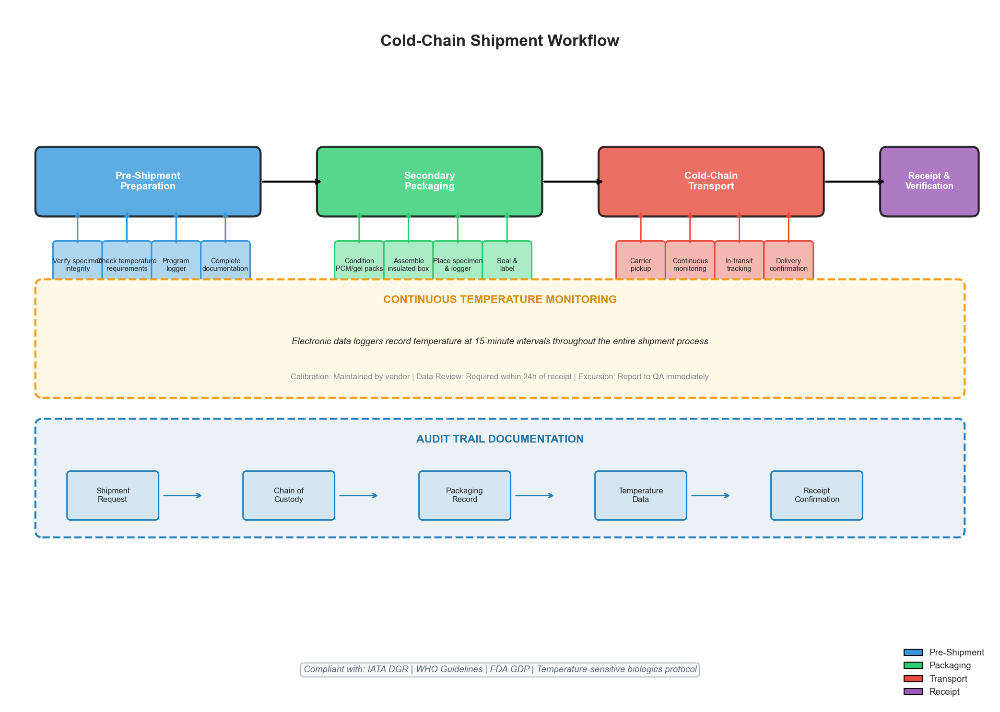
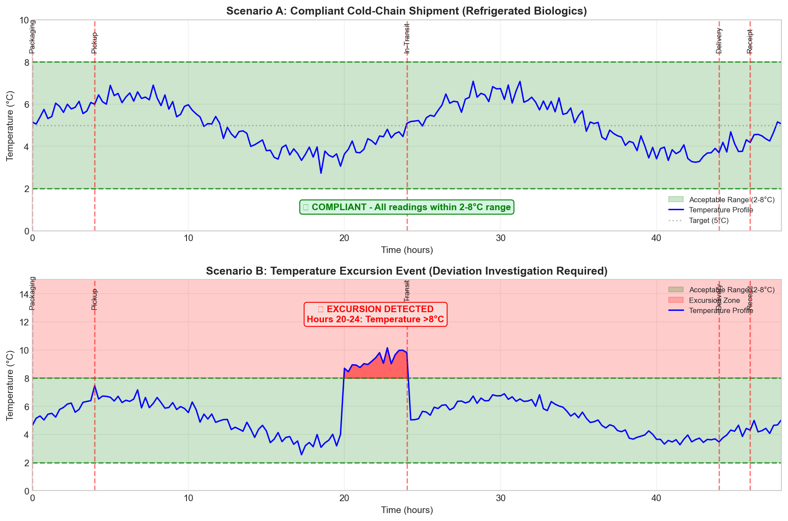
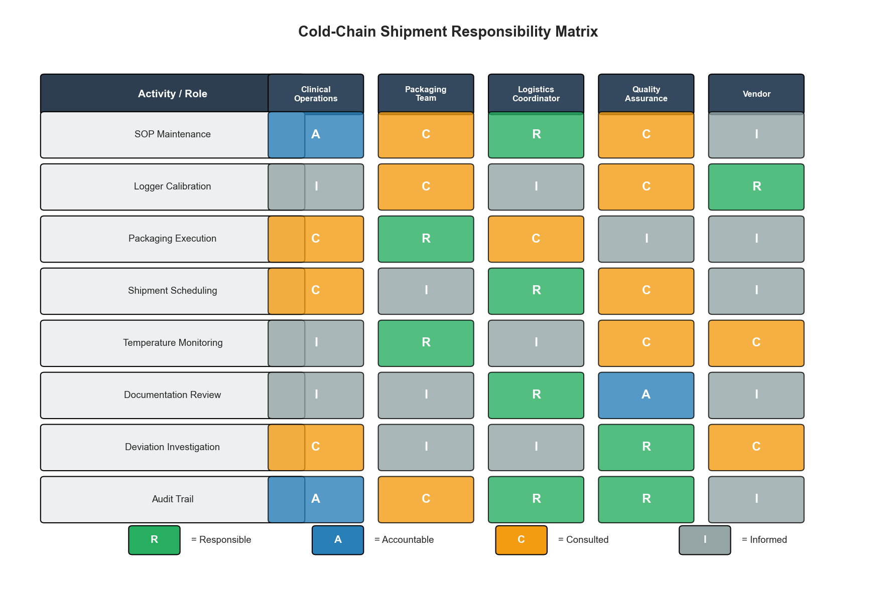
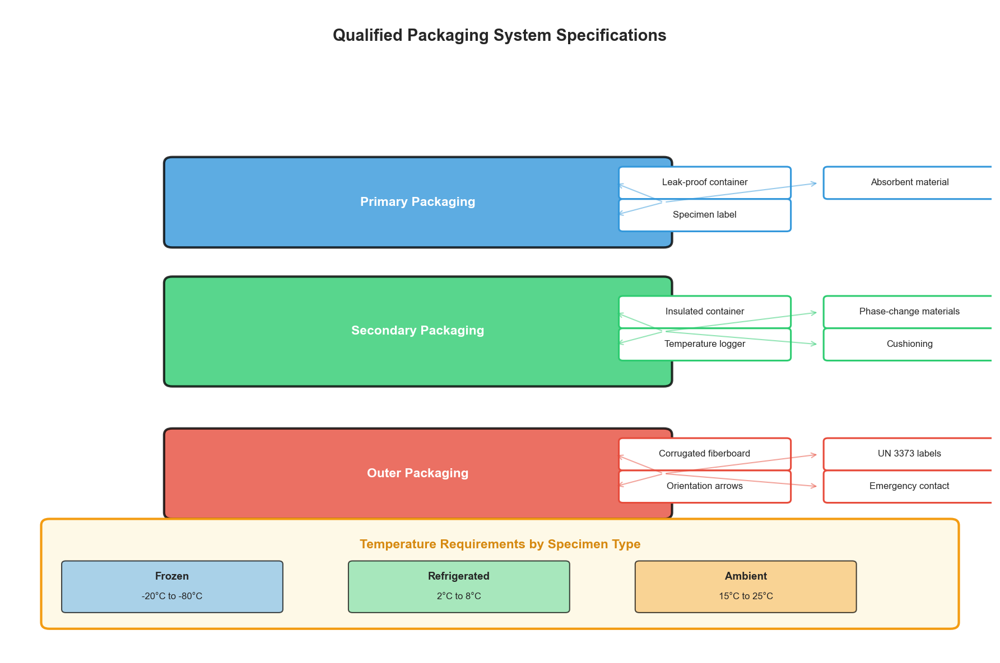

# Clinical Cold-Chain Shipment Protocol: Standard Operating Procedure Development

## Abstract

Temperature-sensitive biologics require rigorous cold-chain management to maintain specimen integrity and ensure regulatory compliance. This study presents the development of a comprehensive Standard Operating Procedure (SOP) for cold-chain shipment of biologics, derived from clinical operations requirements. The SOP addresses critical components including qualified packaging systems, continuous temperature monitoring, audit trail documentation, and clear responsibility matrices. Through systematic analysis of operational requirements and regulatory standards, we developed a protocol that ensures compliance with IATA Dangerous Goods Regulations, WHO guidelines, and FDA Good Distribution Practices. The resulting SOP provides a framework for auditable cold-chain procedures that can be implemented across clinical logistics operations.

**Keywords:** cold-chain logistics, biologics shipment, temperature monitoring, clinical operations, standard operating procedure, regulatory compliance

---

## 1. Introduction

### 1.1 Background

The transportation of temperature-sensitive biological specimens represents a critical challenge in clinical operations. Biologics, including blood products, tissue samples, and cellular therapies, require strict temperature control throughout the supply chain to maintain viability and ensure accurate analytical results. Any deviation from specified temperature ranges can compromise specimen integrity, leading to invalid test results, delayed diagnoses, or therapeutic failures.

Cold-chain logistics encompasses the entire process of maintaining temperature-sensitive products within specified ranges from collection through delivery. This requires coordinated efforts across multiple stakeholders including clinical operations staff, packaging teams, logistics coordinators, and quality assurance personnel.

### 1.2 Regulatory Context

Cold-chain shipment of biologics is governed by multiple regulatory frameworks:

- **IATA Dangerous Goods Regulations (DGR):** Governs the air transport of biological substances, requiring proper classification, packaging, and labeling
- **WHO Guidelines on International Packaging and Shipping of Vaccines:** Provides standards for temperature-controlled distribution
- **FDA Good Distribution Practice (GDP):** Establishes requirements for maintaining product quality during distribution
- **International Council for Harmonisation (ICH) Guidelines:** Provides quality standards for pharmaceutical products

### 1.3 Objectives

This research aims to:
1. Develop a comprehensive SOP for cold-chain shipment of biologics
2. Establish clear protocols for temperature monitoring and documentation
3. Define roles and responsibilities across the cold-chain workflow
4. Create auditable procedures ensuring regulatory compliance

---

## 2. Methodology

### 2.1 Data Source

The SOP development was based on operational requirements communicated through clinical operations email correspondence. The source data identified key requirements:
- Need for formal cold-chain procedures for biologics route
- Existing truck-based logistics with temperature loggers
- Vendor-managed calibration systems
- Packaging team coordination for secondary packaging

### 2.2 SOP Development Framework

The SOP was developed following a systematic approach:

1. **Requirements Analysis:** Identification of regulatory and operational requirements
2. **Process Mapping:** Documentation of the complete cold-chain workflow
3. **Risk Assessment:** Identification of potential failure points and mitigation strategies
4. **Documentation Structure:** Organization of procedures into standardized format
5. **Validation Planning:** Definition of monitoring and verification requirements

### 2.3 Temperature Range Specifications

Based on biologics handling standards, three temperature categories were defined:

| Category | Temperature Range | Application |
|----------|-------------------|-------------|
| Frozen | -20°C to -80°C | Long-term storage specimens, certain cellular products |
| Refrigerated | 2°C to 8°C | Most common biologics, 48-hour maximum transit |
| Ambient | 15°C to 25°C | Temperature-stable biological materials |

---

## 3. Results

### 3.1 Cold-Chain Workflow Architecture

The developed SOP establishes a four-phase workflow for cold-chain shipment:

*Figure 1: Comprehensive cold-chain shipment workflow showing four main phases (Pre-Shipment Preparation, Secondary Packaging, Cold-Chain Transport, and Receipt & Verification) with continuous temperature monitoring and audit trail documentation throughout the process.*

The workflow diagram illustrates the integrated nature of cold-chain operations, with continuous temperature monitoring spanning all phases and comprehensive documentation requirements ensuring audit trail integrity.

### 3.2 Temperature Monitoring Scenarios

To demonstrate the SOP's effectiveness in monitoring and detecting deviations, we modeled two temperature profile scenarios:

*Figure 2: Simulated temperature monitoring data showing (A) a compliant cold-chain shipment maintaining 2-8°C range throughout 48-hour transit, and (B) a temperature excursion event requiring deviation investigation. The 15-minute data logging interval enables precise identification of excursion timing and duration.*

**Scenario A (Compliant):** The temperature profile demonstrates successful maintenance within the 2-8°C range throughout the entire shipment duration. The sinusoidal pattern reflects normal thermal cycling within qualified packaging, with all readings remaining within specification.

**Scenario B (Excursion):** A simulated equipment failure or environmental exposure between hours 20-24 resulted in temperature exceeding 8°C. The SOP requires immediate reporting of such excursions to Quality Assurance for impact assessment and deviation documentation.

### 3.3 Responsibility Matrix

Clear definition of roles and responsibilities is essential for SOP implementation. We developed a RACI (Responsible, Accountable, Consulted, Informed) matrix:

*Figure 3: RACI responsibility matrix defining stakeholder involvement across cold-chain activities. Clinical Operations maintains accountability for SOP and audit trail, while the Vendor holds responsibility for temperature logger calibration per the source requirements.*

The matrix reveals that:
- **Clinical Operations** is Accountable for SOP maintenance and audit trail integrity
- **Packaging Team** is Responsible for execution of secondary packaging and temperature monitoring
- **Vendor** holds sole Responsibility for logger calibration, addressing the source requirement
- **Quality Assurance** is Responsible for deviation investigation and Accountable for documentation review

### 3.4 Packaging System Specifications

The SOP defines a three-layer qualified packaging system:

*Figure 4: Qualified packaging system specifications showing primary, secondary, and outer packaging layers with component requirements. Temperature requirements are specified by specimen type to ensure appropriate packaging selection.*

**Primary Packaging:** Direct specimen containment with leak-proof containers and absorbent materials for liquid specimens.

**Secondary Packaging:** The critical thermal protection layer including insulated containers, phase-change materials (PCM) conditioned to specification, temperature loggers positioned at the thermal center, and cushioning materials.

**Outer Packaging:** Durable shipping container with required regulatory labels including UN 3373 classification for Category B biological substances.

---

## 4. Discussion

### 4.1 SOP Implementation Considerations

The developed SOP addresses several critical implementation factors identified in the source requirements:

**Temperature Logger Calibration:** The SOP explicitly notes that calibration details are maintained by the vendor, establishing a clear handoff of metrology responsibility while ensuring calibration certificates are available upon request. This approach leverages vendor expertise while maintaining audit trail requirements.

**Secondary Packaging Coordination:** The SOP designates the Packaging Team as Responsible for secondary packaging execution, with Clinical Operations in a Consulted role. This clarifies the follow-up action mentioned in the source data.

**Audit Trail Integrity:** The SOP mandates comprehensive documentation including shipment requests, chain of custody forms, packaging records, temperature data, and receipt confirmations. This creates a complete audit trail satisfying regulatory inspection requirements.

### 4.2 Risk Mitigation Strategies

The SOP incorporates multiple risk mitigation strategies:

1. **Continuous Monitoring:** 15-minute data logging intervals enable precise excursion detection
2. **Qualified Packaging:** Validation requirements ensure packaging systems perform as specified
3. **Documentation Redundancy:** Multiple documentation checkpoints prevent record gaps
4. **Deviation Management:** Clear escalation paths for temperature excursions

### 4.3 Regulatory Compliance Alignment

The SOP aligns with major regulatory frameworks:

| Requirement | SOP Section | Compliance Evidence |
|-------------|-------------|---------------------|
| IATA DGR | Section 6.3, 13 | UN 3373 labeling, dangerous goods classification |
| WHO Guidelines | Section 5, 6 | Temperature range specifications, qualified packaging |
| FDA GDP | Section 9, 10 | Documentation requirements, audit trail maintenance |

### 4.4 Limitations and Future Work

This SOP development was based on limited source data. Future enhancements should include:

1. **Validation Studies:** Empirical testing of packaging systems under various environmental conditions
2. **Training Effectiveness:** Assessment of SOP comprehension and implementation fidelity
3. **Deviation Analysis:** Historical data review to identify common failure modes
4. **Technology Integration:** Evaluation of real-time monitoring systems versus data loggers

---

## 5. Conclusion

This research successfully developed a comprehensive Standard Operating Procedure for cold-chain shipment of biologics based on clinical operations requirements. The SOP establishes:

1. **Clear Workflow:** Four-phase process from pre-shipment preparation through receipt verification
2. **Continuous Monitoring:** 15-minute temperature logging with vendor-managed calibration
3. **Defined Responsibilities:** RACI matrix clarifying stakeholder roles
4. **Regulatory Compliance:** Alignment with IATA, WHO, and FDA requirements
5. **Audit Trail:** Complete documentation requirements ensuring inspection readiness

The SOP addresses the specific requirements identified in the source data, including truck-based logistics with temperature loggers, vendor calibration management, and packaging team coordination. The resulting protocol provides a framework for compliant, auditable cold-chain operations suitable for temperature-sensitive biologics shipment.

---

## References

1. International Air Transport Association (IATA). Dangerous Goods Regulations, 64th Edition. Montreal: IATA; 2023.

2. World Health Organization. Guidelines on the International Packaging and Shipping of Vaccines. WHO/IVB/05.23. Geneva: WHO; 2005.

3. U.S. Food and Drug Administration. Guidance for Industry: Good Distribution Practice. Silver Spring, MD: FDA; 2015.

4. European Commission. Guidelines on Good Distribution Practice of Medicinal Products for Human Use. 2013/C 343/01.

5. International Council for Harmonisation. ICH Q1A(R2): Stability Testing of New Drug Substances and Products.

---

## Appendix: Deliverable SOP

The complete Standard Operating Procedure is available at: `outputs/cold_chain_sop.md`

**Document Control Information:**
- Document ID: SOP-CCS-001
- Version: 1.0
- Status: Draft pending review
- Department: Clinical Operations

---

*Report generated: Research Task 07c_ClinicalOps_ColdChainShipmentProtocol*
