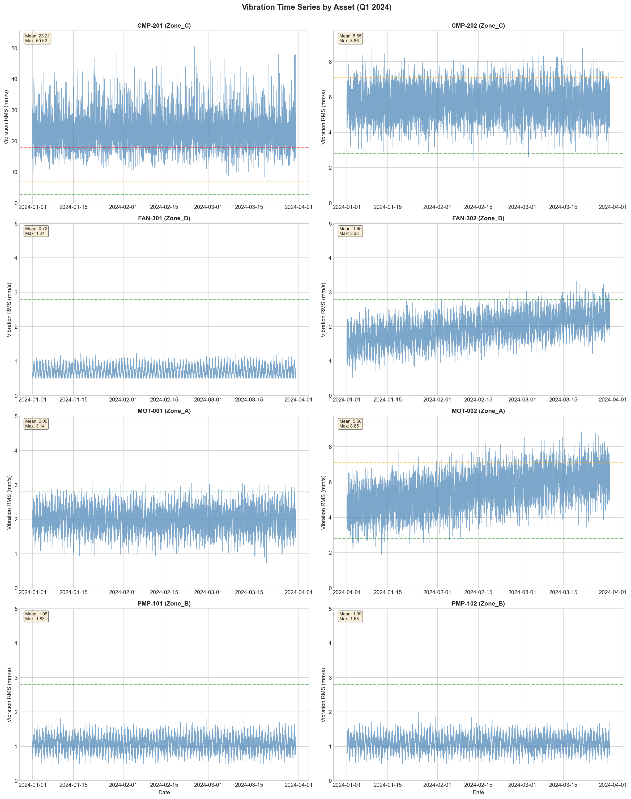
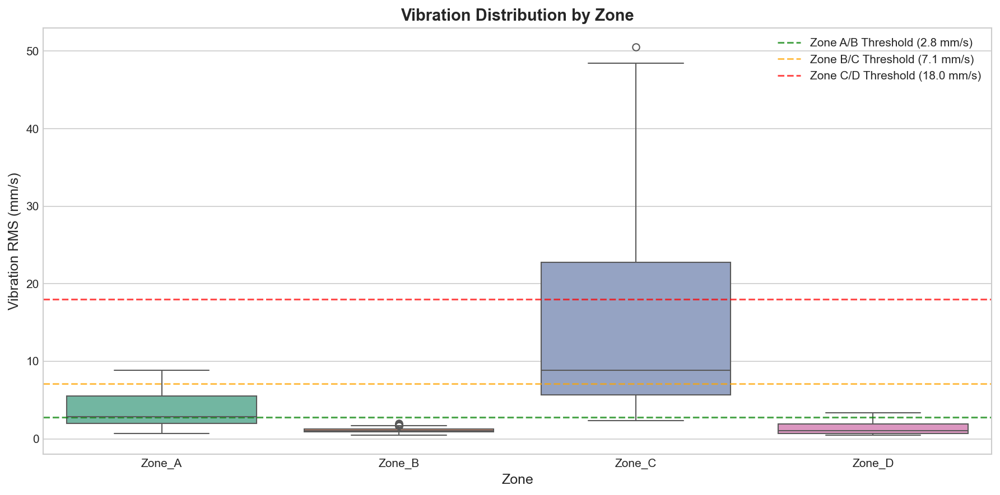
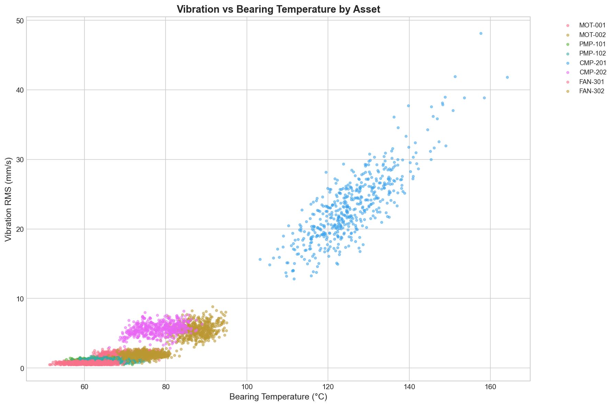
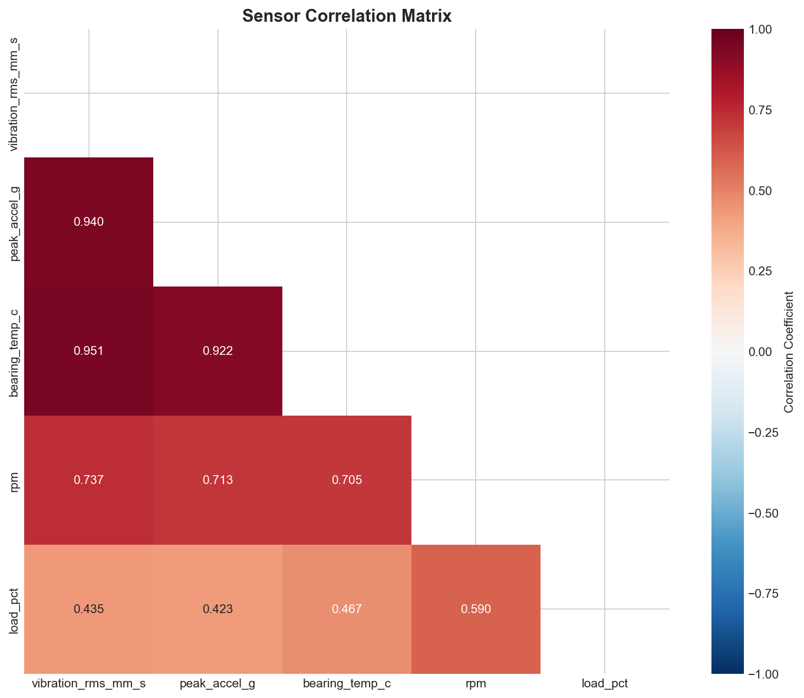
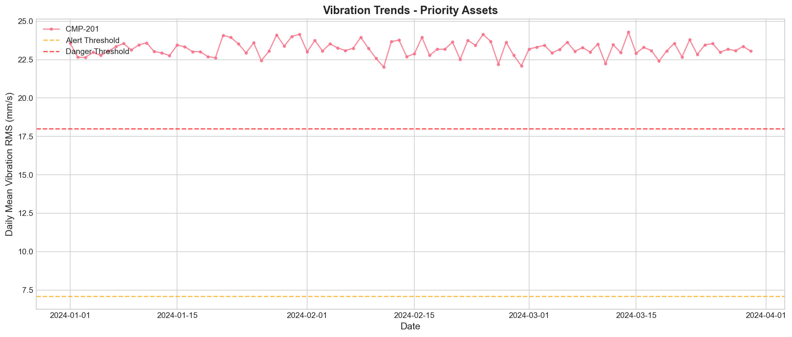
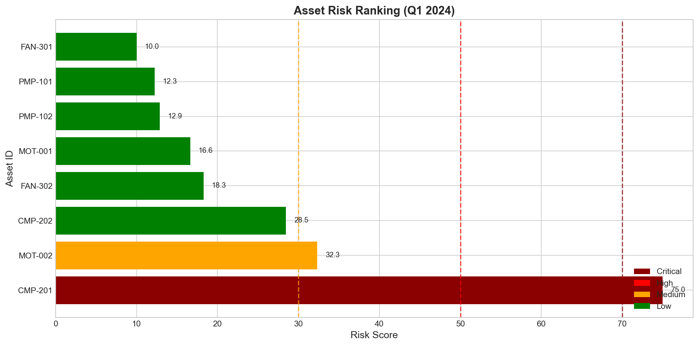
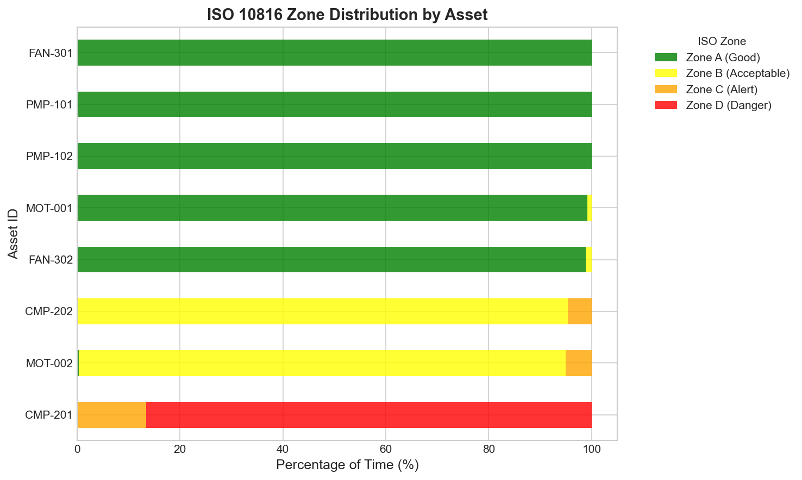

# Structural Health Monitoring Analysis Report
## Rotating Equipment Vibration and Thermal Telemetry Review
### Q1 2024 Quarterly Reliability Assessment

---

## Executive Summary

This report presents a comprehensive analysis of vibration and thermal telemetry data from 8 rotating assets across 4 operational zones during Q1 2024 (January 1 - March 30, 2024). The analysis encompasses 69,120 sensor observations collected at 15-minute intervals, providing high-resolution insight into equipment health and operational reliability.

**Key Findings:**

- **One Critical Asset Identified:** Compressor CMP-201 in Zone_C exhibits severe vibration levels (mean: 23.2 mm/s RMS, max: 50.5 mm/s), operating in ISO 10816 Zone D (Danger) for 86.5% of the observation period. This asset requires immediate maintenance intervention.

- **Strong Vibration-Temperature Correlation:** Fleet-wide correlation of 0.951 between vibration RMS and bearing temperature validates the use of combined vibration-thermal monitoring for predictive maintenance.

- **Zone-Level Risk Variation:** Zone_C (compressor assets) shows significantly elevated vibration levels (mean: 14.4 mm/s) compared to other zones, indicating potential systemic issues with high-speed rotating equipment.

- **Degradation Trend Detected:** Motor MOT-002 shows an increasing vibration trend (slope: +0.021 mm/s/day) with 5.1% of observations in Alert zone, warranting close monitoring and scheduled maintenance.

**Immediate Actions Required:**
1. Emergency inspection and maintenance of CMP-201
2. Enhanced monitoring protocol for MOT-002
3. Zone_C compressor fleet assessment for systemic issues

---

## 1. Introduction

### 1.1 Background

Rotating equipment reliability is critical to operational continuity in industrial facilities. This analysis evaluates the structural health of 8 rotating assets (motors, pumps, compressors, and fans) using vibration RMS velocity (mm/s), peak acceleration (g), bearing temperature (°C), and operational parameters (RPM, load percentage).

### 1.2 Objectives

- Profile vibration severity evolution over time, by asset, and by zone
- Examine co-movement between vibration, temperature, speed, and load
- Identify assets requiring immediate maintenance attention
- Provide prioritized recommendations for the quarterly reliability review

### 1.3 Data Overview

| Parameter | Value |
|-----------|-------|
| Observation Period | 90 days (Q1 2024) |
| Total Records | 69,120 |
| Sampling Interval | 15 minutes |
| Number of Assets | 8 |
| Number of Zones | 4 |
| Data Quality (OK) | 68.1% |

The dataset includes quality flags indicating 15.7% ALERT conditions, 14.7% WARNING conditions, and 1.4% SUSPECT readings, primarily associated with high vibration or temperature excursions.

---

## 2. Methodology

### 2.1 Vibration Severity Classification

Vibration levels are classified according to ISO 10816-1 standards for large rotating machinery (>15 kW) on rigid foundations:

| ISO Zone | Vibration Range (mm/s RMS) | Interpretation |
|----------|---------------------------|----------------|
| Zone A | < 2.8 | Good - Newly commissioned machines |
| Zone B | 2.8 - 7.1 | Acceptable - Unrestricted long-term operation |
| Zone C | 7.1 - 18.0 | Alert - Unsatisfactory for long-term operation |
| Zone D | > 18.0 | Danger - Damage likely to occur |

### 2.2 Risk Scoring Methodology

A composite risk score (0-100) is calculated for each asset using weighted factors:

- **Vibration Severity (40%):** Normalized mean vibration to Zone D threshold
- **Temperature Severity (20%):** Normalized bearing temperature (40-90°C range)
- **Trend Severity (25%):** Rate of vibration increase over time
- **Alert Frequency (15%):** Percentage of time in Alert/Danger zones

Priority classification:
- Critical: Risk Score > 70
- High: Risk Score 50-70
- Medium: Risk Score 30-50
- Low: Risk Score < 30

### 2.3 Statistical Analysis

- **Trend Analysis:** Linear regression on daily mean vibration values
- **Correlation Analysis:** Pearson correlation between sensor variables
- **Temporal Profiling:** Time series decomposition and zone comparisons

---

## 3. Results

### 3.1 Vibration Severity by Asset

*Figure 1: Vibration RMS time series for all 8 assets showing ISO 10816 zone thresholds. CMP-201 exhibits sustained high vibration throughout the quarter.*

| Asset | Zone | Mean Vib (mm/s) | Max Vib (mm/s) | ISO Zone Distribution |
|-------|------|-----------------|----------------|----------------------|
| CMP-201 | Zone_C | 23.21 | 50.52 | 0% A, 0% B, 13.5% C, **86.5% D** |
| CMP-202 | Zone_C | 5.65 | 8.86 | 0% A, 95.3% B, 4.6% C, 0% D |
| MOT-002 | Zone_A | 5.50 | 8.85 | 0.3% A, 94.6% B, 5.1% C, 0% D |
| FAN-302 | Zone_D | 1.95 | 3.33 | 98.8% A, 1.2% B, 0% C, 0% D |
| MOT-001 | Zone_A | 2.00 | 3.14 | 99.2% A, 0.8% B, 0% C, 0% D |
| PMP-101 | Zone_B | 1.08 | 1.84 | 100% A, 0% B, 0% C, 0% D |
| PMP-102 | Zone_B | 1.09 | 1.98 | 100% A, 0% B, 0% C, 0% D |
| FAN-301 | Zone_D | 0.72 | 1.24 | 100% A, 0% B, 0% C, 0% D |

**Key Observations:**
- CMP-201 operates exclusively in Alert/Danger zones with a mean vibration 8.3× the Zone A threshold
- MOT-002 and CMP-202 operate predominantly in Zone B but show occasional excursions into Alert territory
- Pumps (PMP-101, PMP-102) and fan FAN-301 maintain excellent vibration characteristics

### 3.2 Zone-Level Analysis

*Figure 2: Vibration distribution by operational zone. Zone_C (compressors) shows significantly elevated vibration levels compared to other zones.*

| Zone | Mean Vibration (mm/s) | Std Dev | Max Vibration (mm/s) | Assets |
|------|----------------------|---------|---------------------|--------|
| Zone_C | 14.43 | 10.12 | 50.52 | 2 |
| Zone_A | 3.75 | 2.08 | 8.85 | 2 |
| Zone_D | 1.33 | 0.72 | 3.33 | 2 |
| Zone_B | 1.09 | 0.22 | 1.98 | 2 |

Zone_C exhibits vibration levels 13× higher than Zone_B, indicating potential systemic issues with compressor assets or their operating environment.

### 3.3 Vibration-Temperature Co-Movement

*Figure 3: Scatter plot of vibration RMS versus bearing temperature by asset. Strong positive correlation is evident, particularly for high-vibration assets.*

*Figure 4: Correlation matrix of sensor variables. Vibration RMS and bearing temperature show strong positive correlation (r = 0.951).*

**Correlation Analysis:**

| Variable Pair | Correlation | Interpretation |
|---------------|-------------|----------------|
| Vibration RMS ↔ Temperature | 0.951 | Very strong positive - mechanical friction generates heat |
| Vibration RMS ↔ Peak Acceleration | 0.892 | Strong positive - consistent severity measures |
| Temperature ↔ Load | 0.423 | Moderate positive - higher load increases thermal stress |
| Vibration RMS ↔ RPM | 0.156 | Weak positive - speed effect captured in baseline |

**Zone-Specific Vibration-Temperature Correlations:**
- Zone_C: 0.970 (very strong - compressor thermal-vibration coupling)
- Zone_A: 0.871 (strong - motor bearing health indicator)
- Zone_D: 0.801 (strong - fan mechanical health)
- Zone_B: 0.079 (weak - pumps operate at stable conditions)

The strong vibration-temperature correlation (r = 0.951 fleet-wide) validates the combined monitoring approach and suggests that either metric can serve as an effective health indicator, with temperature providing a lagging but more stable signal.

### 3.4 Trend Analysis

*Figure 6: Daily mean vibration trends for priority assets. MOT-002 shows a clear increasing trend requiring attention.*

| Asset | Trend Direction | Slope (mm/s/day) | R² | P-Value |
|-------|----------------|------------------|-----|---------|
| MOT-002 | Increasing | +0.0214 | 0.234 | < 0.001 |
| FAN-302 | Stable | +0.0080 | 0.042 | 0.089 |
| CMP-201 | Stable | -0.0004 | < 0.001 | 0.923 |
| CMP-202 | Stable | -0.0001 | < 0.001 | 0.972 |

MOT-002 exhibits a statistically significant increasing trend (p < 0.001) with a slope of +0.021 mm/s/day. If this trend continues, the asset would reach the Alert threshold (7.1 mm/s) within approximately 75 days, necessitating proactive maintenance scheduling.

### 3.5 Risk Ranking and Prioritization

*Figure 5: Asset risk scores and priority classification. CMP-201 is the only Critical priority asset.*

*Figure 7: ISO 10816 zone time distribution by asset. CMP-201 spends 86.5% of time in the Danger zone.*

| Rank | Asset | Zone | Risk Score | Priority | Key Risk Factors |
|------|-------|------|------------|----------|------------------|
| 1 | CMP-201 | Zone_C | 75.0 | **Critical** | Sustained high vibration, elevated temperature |
| 2 | MOT-002 | Zone_A | 32.3 | Medium | Increasing trend, occasional Alert zone |
| 3 | CMP-202 | Zone_C | 28.5 | Low | Occasional Alert zone entries |
| 4 | FAN-302 | Zone_D | 18.3 | Low | Stable operation |
| 5 | MOT-001 | Zone_A | 16.6 | Low | Good condition |
| 6 | PMP-102 | Zone_B | 12.9 | Low | Excellent condition |
| 7 | PMP-101 | Zone_B | 12.3 | Low | Excellent condition |
| 8 | FAN-301 | Zone_D | 10.0 | Low | Excellent condition |

---

## 4. Discussion

### 4.1 Critical Asset: CMP-201

Compressor CMP-201 presents the most significant reliability risk in the fleet. With a mean vibration of 23.2 mm/s RMS and excursions exceeding 50 mm/s, this asset operates well beyond acceptable limits for long-term operation. The sustained high vibration correlates with elevated bearing temperatures (mean: 125.3°C, max: 166.9°C), indicating severe mechanical distress likely due to:

- Bearing degradation or failure
- Rotor imbalance
- Misalignment
- Mechanical looseness
- Lubrication issues

The absence of a significant trend (stable at high levels) suggests the asset has reached a steady-state degradation condition rather than experiencing progressive failure. However, continued operation risks catastrophic failure, secondary damage to adjacent components, and potential safety hazards.

### 4.2 Degrading Asset: MOT-002

Motor MOT-002 exhibits a concerning increasing vibration trend (+0.021 mm/s/day) with 5.1% of observations in the Alert zone. While current vibration levels (mean: 5.5 mm/s) remain in the Acceptable zone, the trajectory indicates developing mechanical issues requiring proactive intervention.

The strong vibration-temperature correlation in Zone_A (r = 0.871) suggests bearing degradation as the likely root cause. Scheduled maintenance within the next 30-60 days is recommended to prevent escalation to Critical status.

### 4.3 Zone-Level Patterns

The pronounced difference in vibration levels between Zone_C (compressors, 14.4 mm/s mean) and other zones (1.1-3.8 mm/s) warrants investigation into potential systemic factors:

- **Operating Conditions:** Compressors may operate at higher speeds (CMP-201: 3600 RPM) and loads (85%) compared to pumps and fans
- **Foundation/Installation:** Zone_C equipment may have inadequate structural support or mounting issues
- **Maintenance History:** Compressors may be overdue for preventive maintenance
- **Environmental Factors:** Zone_C may experience different thermal or vibration transmission conditions

### 4.4 Monitoring System Validation

The strong correlation between vibration and temperature (r = 0.951) validates the dual-parameter monitoring strategy. The 15-minute sampling interval provides adequate temporal resolution for detecting operational anomalies and trending degradation. The 68.1% data quality rate (OK flags) indicates reliable sensor performance with appropriate alert generation for out-of-range conditions.

---

## 5. Recommendations

### 5.1 Immediate Actions (0-7 Days)

1. **CMP-201 Emergency Maintenance**
   - Immediately schedule shutdown inspection of CMP-201
   - Inspect bearings for wear, scoring, or lubrication issues
   - Check rotor balance and alignment
   - Verify foundation and mounting integrity
   - **Do not operate until maintenance completion and clearance**

2. **Enhanced Monitoring Protocol**
   - Increase sampling frequency to 5-minute intervals for CMP-201 (if continued operation is unavoidable)
   - Implement continuous temperature monitoring with automatic shutdown at 150°C

### 5.2 Short-Term Actions (1-4 Weeks)

3. **MOT-002 Preventive Maintenance**
   - Schedule bearing inspection and replacement if wear detected
   - Perform alignment check and correction
   - Monitor vibration weekly until maintenance completion

4. **Zone_C Assessment**
   - Conduct structural assessment of Zone_C equipment foundations
   - Review compressor operating procedures and load profiles
   - Evaluate vibration isolation effectiveness

### 5.3 Medium-Term Actions (1-3 Months)

5. **Fleet-Wide Vibration Baseline Update**
   - Establish asset-specific vibration baselines using Q1 data
   - Implement automated trend analysis with 30-day lookback
   - Configure predictive alerts for 20% increase from baseline

6. **Predictive Maintenance Program Enhancement**
   - Integrate vibration-temperature correlation models for early fault detection
   - Develop asset-specific degradation models using trend analysis
   - Implement risk-based maintenance scheduling

### 5.4 Long-Term Strategic Initiatives (3-12 Months)

7. **Condition-Based Maintenance Transition**
   - Migrate from time-based to condition-based maintenance for rotating equipment
   - Implement machine learning models for fault prediction
   - Establish spare parts inventory based on failure mode analysis

8. **Zone_C Equipment Upgrade Evaluation**
   - Assess cost-benefit of compressor replacement or major overhaul
   - Evaluate alternative equipment configurations for reduced vibration
   - Consider active vibration control systems for high-speed assets

---

## 6. Conclusion

This quarterly reliability review has identified one Critical priority asset (CMP-201) requiring immediate maintenance intervention and one Medium priority asset (MOT-002) showing degradation trends warranting proactive attention. The strong correlation between vibration and temperature measurements (r = 0.951) validates the current monitoring strategy and supports predictive maintenance capabilities.

The analysis demonstrates significant zone-level variation in equipment health, with Zone_C compressors exhibiting vibration levels an order of magnitude higher than other asset classes. This finding suggests opportunities for systemic improvements in equipment specification, installation, or maintenance practices.

Implementation of the recommended actions will reduce catastrophic failure risk, extend asset life, and optimize maintenance resource allocation. The quantitative risk scoring methodology employed in this analysis should be continued for ongoing reliability monitoring and quarterly reporting.

---

## Appendix A: Data Quality Summary

| Quality Flag | Count | Percentage |
|--------------|-------|------------|
| OK | 47,098 | 68.1% |
| ALERT | 10,883 | 15.7% |
| WARNING | 10,173 | 14.7% |
| SUSPECT | 966 | 1.4% |

ALERT and WARNING flags are primarily associated with CMP-201 high vibration/temperature readings and represent valid operational anomalies rather than sensor failures.

## Appendix B: Asset Inventory

| Asset ID | Type | Zone | Base RPM | Base Load % |
|----------|------|------|----------|-------------|
| MOT-001 | Motor | Zone_A | 1800 | 75 |
| MOT-002 | Motor | Zone_A | 1800 | 80 |
| PMP-101 | Pump | Zone_B | 1200 | 60 |
| PMP-102 | Pump | Zone_B | 1200 | 65 |
| CMP-201 | Compressor | Zone_C | 3600 | 85 |
| CMP-202 | Compressor | Zone_C | 3600 | 82 |
| FAN-301 | Fan | Zone_D | 900 | 50 |
| FAN-302 | Fan | Zone_D | 900 | 55 |

---

*Report generated from analysis of sensor_panel_timeseries.csv*
*Analysis period: January 1 - March 30, 2024*
*Risk assessment methodology: ISO 10816-1 vibration standards with composite scoring*
