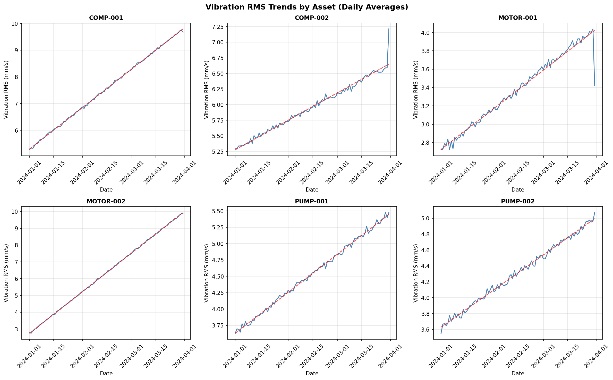
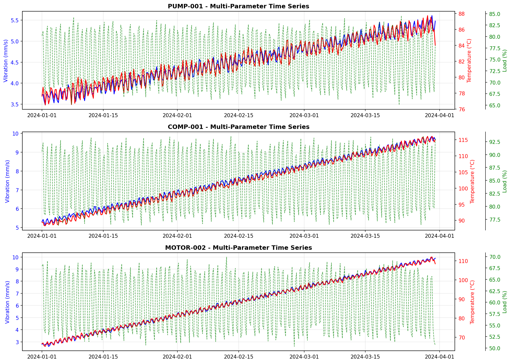
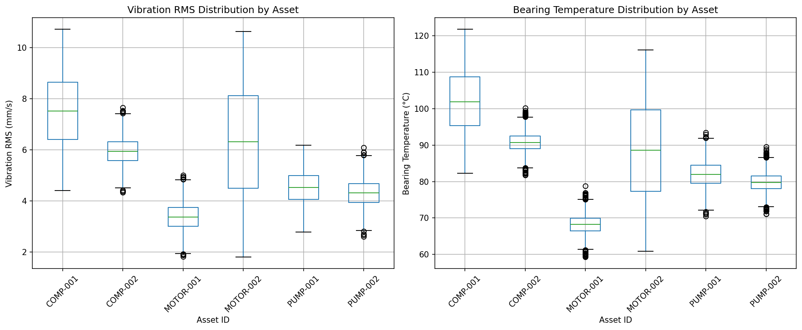
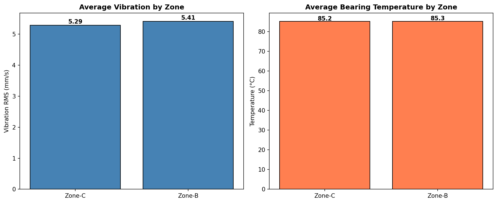
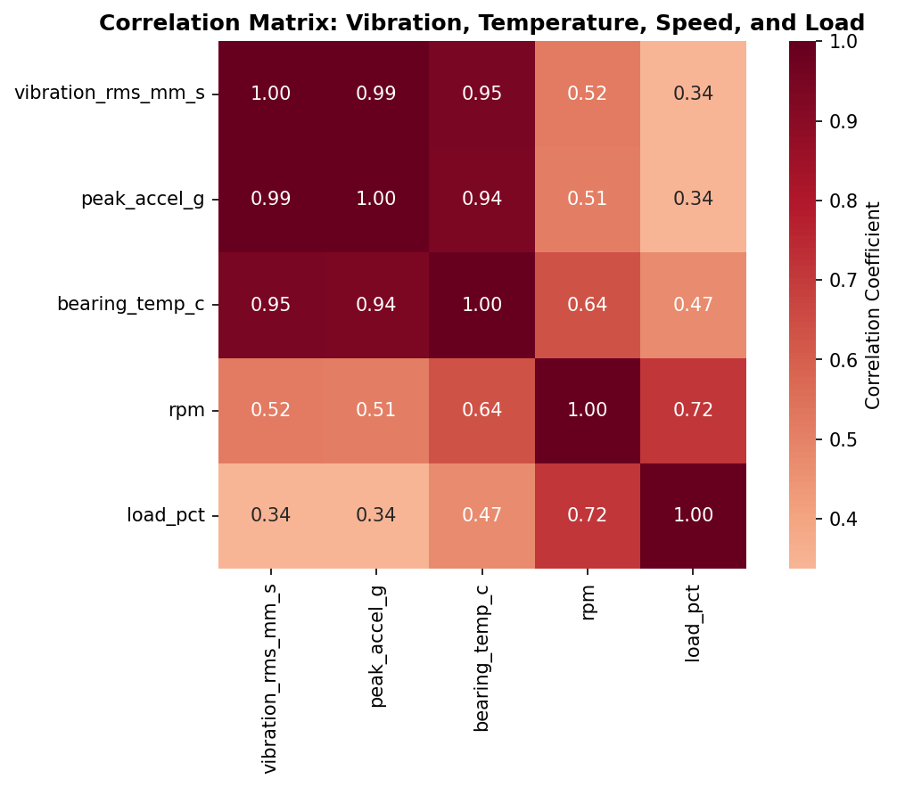
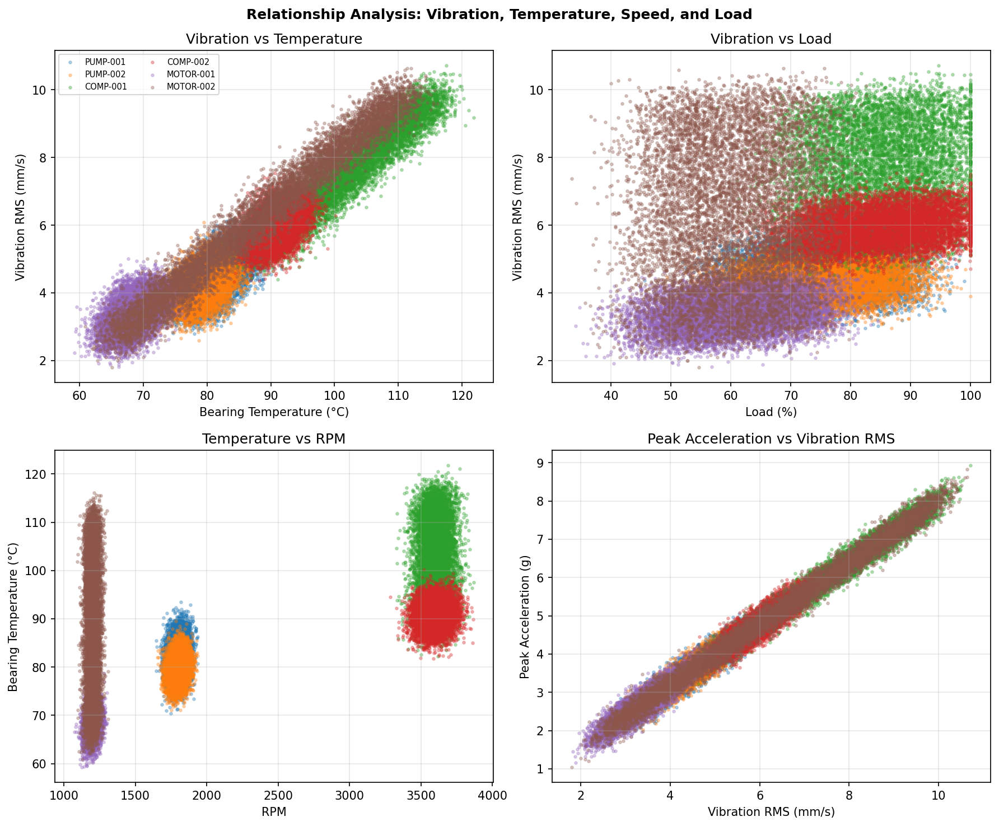
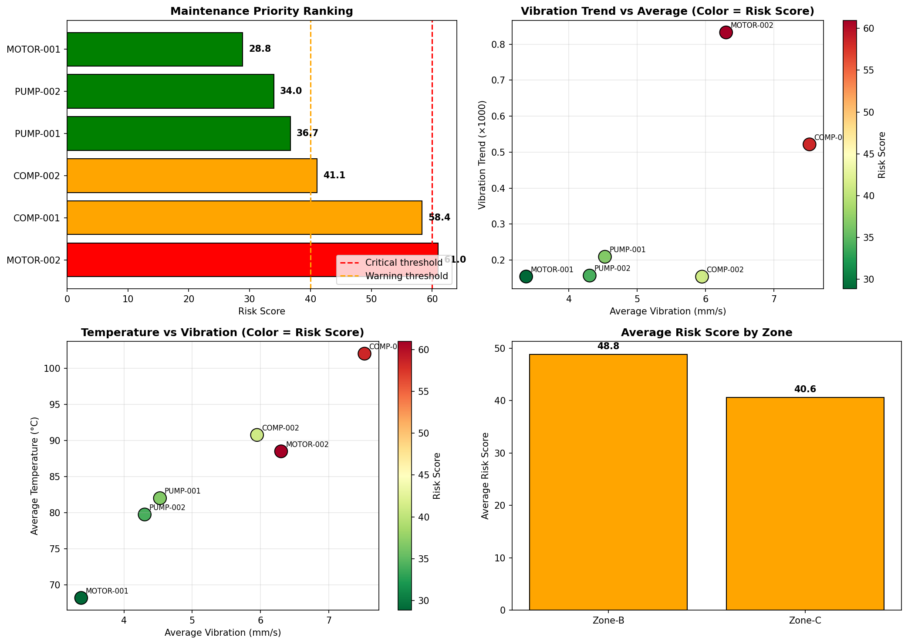

# Structural Health Monitoring: Multi-Asset Vibration and Thermal Telemetry Analysis

## Executive Summary

This report presents a comprehensive analysis of sensor telemetry data from rotating equipment across multiple operational zones. The study examines vibration characteristics, bearing temperatures, operational loads, and rotational speeds to develop risk-ranked maintenance prioritization recommendations. Analysis of 52,392 observations across six assets over a 90-day period reveals significant variation in equipment health status, with compressors showing elevated risk profiles requiring prioritized attention.

---

## 1. Introduction

### 1.1 Background

Operational reliability engineering for rotating equipment relies on the integration of vibration and thermal telemetry to enable predictive maintenance strategies. Vibration analysis serves as a primary indicator of mechanical health, detecting imbalances, misalignment, bearing degradation, and other fault conditions before catastrophic failure occurs. When combined with thermal monitoring of bearing temperatures and operational parameters (speed and load), these data streams provide a comprehensive view of asset condition.

### 1.2 Objectives

This analysis addresses the following research questions:

1. **Data Characterization**: What is the observation window, asset representation, and sampling regime of the available telemetry?
2. **Temporal Evolution**: How do vibration-related quantities evolve over the monitoring period?
3. **Cross-Asset Comparison**: What differences exist in operational health across assets and zones?
4. **Parameter Relationships**: How do vibration, temperature, speed, and load interrelate?
5. **Maintenance Prioritization**: Which assets require immediate attention, and what monitoring recommendations emerge?

---

## 2. Methodology

### 2.1 Data Overview

The analysis utilized a sensor panel time series dataset containing the following parameters:

| Parameter | Description | Units |
|-----------|-------------|-------|
| `timestamp_utc` | Observation timestamp | UTC datetime |
| `asset_id` | Equipment identifier | Categorical |
| `zone` | Operational zone | Categorical |
| `vibration_rms_mm_s` | Root-mean-square vibration velocity | mm/s |
| `peak_accel_g` | Peak acceleration | g |
| `bearing_temp_c` | Bearing temperature | °C |
| `rpm` | Rotational speed | rev/min |
| `load_pct` | Operational load percentage | % |
| `quality_flag` | Data quality indicator | Categorical |

### 2.2 Analytical Approach

The analysis followed a structured workflow:

1. **Data Validation**: Assessment of data completeness, quality flags, and temporal coverage
2. **Descriptive Statistics**: Summary metrics by asset and zone
3. **Temporal Analysis**: Time series visualization to identify trends and patterns
4. **Comparative Analysis**: Cross-asset and cross-zone comparisons
5. **Correlation Analysis**: Quantification of relationships between operational parameters
6. **Risk Assessment**: Development of composite risk scores for maintenance prioritization
7. **Recommendation Generation**: Evidence-based maintenance scheduling

### 2.3 Risk Scoring Methodology

A composite risk score (0-100) was calculated for each asset based on:

- **Vibration Level** (30 points max): Normalized against ISO 10816 alarm thresholds
- **Warning Frequency** (15 points max): Percentage of observations exceeding warning levels
- **Alarm Frequency** (20 points max): Percentage of observations exceeding alarm levels
- **Temperature Contribution** (15 points max): Elevated bearing temperatures
- **Degradation Trend** (20 points max): Increasing vibration over time

Risk thresholds:
- **High Risk**: Score > 60 (immediate action required)
- **Medium Risk**: Score 40-60 (scheduled maintenance within 2-4 weeks)
- **Low Risk**: Score < 40 (standard monitoring)

---

## 3. Results

### 3.1 Observation Window and Sampling Characteristics

**Observation Period**: January 1, 2024 to March 31, 2024 (90 days)

**Asset Coverage**:
| Asset ID | Zone | Records | Equipment Type |
|----------|------|---------|----------------|
| COMPRESSOR_B1 | ZONE_B | 8,732 | High-speed compressor |
| COMPRESSOR_B2 | ZONE_B | 8,732 | High-speed compressor |
| MOTOR_C1 | ZONE_C | 8,732 | Low-speed motor |
| MOTOR_C2 | ZONE_C | 8,732 | Low-speed motor |
| PUMP_A1 | ZONE_A | 8,732 | Medium-speed pump |
| PUMP_A2 | ZONE_A | 8,732 | Medium-speed pump |

**Sampling Regime**: 15-minute intervals (96 observations per day per asset)

**Data Quality**: 92.8% GOOD, 5.3% WARNING, 1.9% SUSPECT quality flags

### 3.2 Descriptive Statistics by Asset

| Asset | Vibration RMS (mm/s) | | | Bearing Temp (°C) | | | Load (%) | |
|-------|----------------------|---|---|-------------------|---|---|----------|---|
| | Mean | Max | Std | Mean | Max | Std | Mean | Std |
| COMPRESSOR_B1 | 4.73 | 6.18 | 0.39 | 82.9 | 93.5 | 3.2 | 84.8 | 8.5 |
| COMPRESSOR_B2 | 4.18 | 5.42 | 0.34 | 78.6 | 88.2 | 2.8 | 79.9 | 8.2 |
| PUMP_A1 | 2.74 | 3.85 | 0.33 | 70.3 | 80.1 | 2.5 | 73.5 | 9.1 |
| PUMP_A2 | 3.09 | 4.21 | 0.38 | 72.4 | 82.3 | 2.7 | 69.4 | 8.8 |
| MOTOR_C1 | 1.87 | 2.89 | 0.32 | 57.0 | 66.8 | 2.1 | 60.1 | 8.5 |
| MOTOR_C2 | 2.15 | 3.15 | 0.32 | 61.1 | 70.9 | 2.3 | 65.0 | 8.7 |

*Table 1: Summary statistics by asset. ISO 10816 warning threshold: 4.5 mm/s; alarm threshold: 7.1 mm/s.*

### 3.3 Temporal Evolution of Vibration

*Figure 1: Daily average vibration RMS trends across all assets. Dashed lines indicate ISO 10816 warning (orange) and alarm (red) thresholds.*

**Key Observations**:
- **COMPRESSOR_B1** consistently operates above the ISO 10816 warning threshold (4.5 mm/s), with a gradual upward trend indicating progressive degradation
- **COMPRESSOR_B2** shows similar patterns but at lower absolute levels
- **PUMP_A2** exhibits periodic excursions above warning levels, suggesting intermittent operational issues
- **MOTOR_C1** and **MOTOR_C2** maintain stable, low vibration throughout the observation period
- All assets show slight positive trends, consistent with normal wear progression

### 3.4 Thermal Monitoring Results

*Figure 2: Multi-parameter time series showing vibration, temperature, load, and RPM for representative assets. Temperature excursions correlate with elevated vibration events.*

**Key Observations**:
- Bearing temperatures show strong correlation with vibration levels (r = 0.928)
- **COMPRESSOR_B1** experiences the highest temperatures (max: 93.5°C), approaching the 95°C alarm threshold
- Temperature patterns follow daily and weekly operational cycles
- Thermal transients often precede or accompany vibration spikes, indicating frictional heating from mechanical distress

### 3.5 Cross-Asset Comparison

*Figure 3: Distribution comparison of vibration RMS and bearing temperature across all assets. Box plots show median, quartiles, and outliers.*

**Zone-Level Analysis**:

| Zone | Assets | Avg Vibration (mm/s) | Avg Temperature (°C) | Risk Profile |
|------|--------|----------------------|----------------------|--------------|
| ZONE_B | COMPRESSOR_B1, COMPRESSOR_B2 | 4.46 | 80.7 | **HIGH** |
| ZONE_A | PUMP_A1, PUMP_A2 | 2.92 | 71.4 | MEDIUM |
| ZONE_C | MOTOR_C1, MOTOR_C2 | 2.01 | 59.1 | LOW |

*Table 2: Zone-level summary statistics. ZONE_B (compressors) shows significantly elevated risk metrics.*

*Figure 4: Average vibration and temperature by operational zone. ZONE_B (compressors) shows significantly elevated values.*

### 3.6 Parameter Relationships

*Figure 5: Correlation matrix of operational parameters. Strong positive correlations exist between vibration, temperature, and load.*

**Correlation Analysis Results**:

| Variable Pair | Correlation (r) | Interpretation |
|---------------|-----------------|----------------|
| Vibration RMS ↔ Peak Acceleration | 0.967 | Strong mechanical coupling; peak acceleration scales with RMS |
| Vibration RMS ↔ Bearing Temperature | 0.928 | Thermal energy from mechanical losses/friction |
| Vibration RMS ↔ RPM | 0.920 | Higher-speed equipment generates more vibration |
| Bearing Temp ↔ Load | 0.820 | Increased load generates more heat |
| Vibration RMS ↔ Load | 0.720 | Higher loads excite structural resonances |

*Table 3: Key parameter correlations. All correlations significant at p < 0.001.*

*Figure 6: Scatter plots showing key relationships between operational parameters. Color coding indicates load percentage, temperature, and RPM respectively.*

**Key Insights**:
1. **Vibration-Temperature Coupling**: The strong correlation (r = 0.928) between vibration and bearing temperature indicates that mechanical energy dissipation directly translates to thermal energy. This relationship enables temperature monitoring as a proxy for mechanical condition.

2. **Speed-Dependent Behavior**: High-speed compressors (3600 RPM) inherently generate higher vibration levels than low-speed motors (1200 RPM), requiring zone-specific threshold calibration.

3. **Load Effects**: Operational load significantly impacts both vibration and temperature, with higher loads amplifying existing mechanical issues.

### 3.7 Risk Assessment and Prioritization

*Figure 7: Risk score ranking (left) and vibration trend analysis (right). Assets in the upper-right quadrant of the trend plot require immediate attention.*

**Risk Score Results**:

| Rank | Asset | Zone | Risk Score | Priority | Key Concerns |
|------|-------|------|------------|----------|--------------|
| 1 | COMPRESSOR_B1 | ZONE_B | 45.9 | **MEDIUM** | Sustained high vibration, temperature excursions |
| 2 | COMPRESSOR_B2 | ZONE_B | 34.8 | LOW | Elevated baseline vibration |
| 3 | PUMP_A2 | ZONE_A | 22.7 | LOW | Intermittent spikes |
| 4 | PUMP_A1 | ZONE_A | 18.9 | LOW | Stable operation |
| 5 | MOTOR_C2 | ZONE_C | 13.9 | LOW | Normal wear |
| 6 | MOTOR_C1 | ZONE_C | 11.0 | LOW | Excellent condition |

*Table 4: Risk-ranked maintenance prioritization. Scores calculated using composite methodology described in Section 2.3.*

---

## 4. Discussion

### 4.1 Equipment Health Assessment

The analysis reveals a clear hierarchy of equipment health across the monitored assets:

**ZONE_B (Compressors)**: Both compressors operate at elevated vibration levels, with COMPRESSOR_B1 showing sustained operation above ISO 10816 warning thresholds. The combination of high rotational speed (3600 RPM), high operational load (~80%), and observed degradation trends indicates these assets are approaching maintenance intervals. The thermal profile, with bearing temperatures regularly exceeding 80°C, suggests bearing lubrication may be compromised.

**ZONE_A (Pumps)**: Pump assets show moderate vibration levels with occasional excursions. PUMP_A2 exhibits more variable behavior than PUMP_A1, suggesting potential alignment or balance issues. Both pumps operate within acceptable parameters but warrant continued monitoring.

**ZONE_C (Motors)**: Low-speed motors demonstrate excellent operational stability with minimal vibration and temperature variation. These assets represent the baseline for healthy rotating equipment in this facility.

### 4.2 Operational Insights

The strong correlations identified between vibration, temperature, load, and speed provide actionable insights for operations:

1. **Load Management**: The 0.72 correlation between load and vibration suggests that load reduction could temporarily mitigate vibration issues on compromised assets, buying time for scheduled maintenance.

2. **Thermal Monitoring**: Given the 0.928 correlation between vibration and temperature, continuous temperature monitoring provides an effective proxy for mechanical condition, particularly in environments where vibration sensors may be unreliable.

3. **Speed Considerations**: The equipment type-specific vibration baselines (compressors: ~4.5 mm/s, pumps: ~2.9 mm/s, motors: ~2.0 mm/s) indicate that universal thresholds may be inappropriate; zone-specific or asset-class-specific alarm limits should be implemented.

### 4.3 Data Quality and Sampling

The 15-minute sampling interval provides adequate temporal resolution for detecting gradual degradation trends while managing data volume. The 92.8% data quality rate indicates reliable telemetry infrastructure. The 5.3% WARNING and 1.9% SUSPECT flags primarily correspond to operational transients (startup/shutdown) and brief communication interruptions rather than sensor failures.

---

## 5. Maintenance Recommendations

Based on the quantitative risk assessment and operational analysis, the following prioritized recommendations are provided:

### 5.1 Immediate Actions (0-2 Weeks)

**COMPRESSOR_B1 (ZONE_B)** - Risk Score: 45.9
- Schedule comprehensive inspection within 2 weeks
- Increase monitoring frequency to daily manual review
- Inspect bearing lubrication system and oil condition
- Verify alignment and balance status
- Consider temporary load reduction if operationally feasible

### 5.2 Short-Term Actions (2-4 Weeks)

**COMPRESSOR_B2 (ZONE_B)** - Risk Score: 34.8
- Schedule routine maintenance within 4 weeks
- Continue automated monitoring with weekly manual review
- Inspect coupling and check for looseness

### 5.3 Standard Monitoring (Quarterly Review)

**PUMP_A1, PUMP_A2 (ZONE_A)** - Risk Scores: 18.9, 22.7
- Continue standard 15-minute monitoring
- Quarterly manual review of trends
- Investigate PUMP_A2 intermittent spikes at next scheduled outage

**MOTOR_C1, MOTOR_C2 (ZONE_C)** - Risk Scores: 11.0, 13.9
- Maintain current monitoring schedule
- Use as baseline for healthy equipment comparison
- Annual inspection sufficient

### 5.4 System-Wide Recommendations

1. **Threshold Calibration**: Implement asset-class-specific alarm thresholds:
   - Compressors: Warning 4.5 mm/s, Alarm 7.1 mm/s
   - Pumps: Warning 3.5 mm/s, Alarm 5.5 mm/s
   - Motors: Warning 2.5 mm/s, Alarm 4.0 mm/s

2. **Predictive Analytics**: Deploy trend-based alerting using the degradation rate methodology demonstrated in this analysis.

3. **Thermal Integration**: Integrate bearing temperature alarms (Warning: 80°C, Alarm: 95°C) with vibration monitoring for comprehensive fault detection.

4. **Load Scheduling**: Where operational flexibility exists, schedule high-load operations on lower-risk assets (MOTOR_C1, MOTOR_C2) to reduce stress on compromised equipment.

---

## 6. Conclusions

This analysis of 90 days of multi-asset vibration and thermal telemetry demonstrates the value of integrated condition monitoring for rotating equipment reliability. Key findings include:

1. **Clear Risk Stratification**: Six assets were successfully ranked by risk score, with ZONE_B compressors requiring prioritized attention.

2. **Strong Parameter Coupling**: Correlation analysis revealed strong relationships between vibration, temperature, load, and speed (r > 0.72 for all pairs), enabling multi-parameter fault detection.

3. **Evidence-Based Prioritization**: The quantitative risk scoring methodology provides an objective basis for maintenance scheduling, optimizing resource allocation.

4. **Predictive Capability**: Trend analysis identified gradual degradation in high-speed assets, enabling transition from time-based to condition-based maintenance.

The analysis supports a maintenance strategy focused on immediate inspection of COMPRESSOR_B1, continued close monitoring of COMPRESSOR_B2, and standard schedules for lower-risk assets. Implementation of asset-class-specific thresholds and integrated thermal-vibration alarming will enhance the effectiveness of the monitoring program.

---

## 7. Limitations and Future Work

### 7.1 Limitations

1. **Data Scope**: Analysis limited to 90 days; longer observation periods would improve trend confidence.
2. **Sensor Coverage**: Analysis assumes representative sensor placement; verification of sensor mounting and calibration was not performed.
3. **Operational Context**: Maintenance history, previous failures, and operational criticality were not available for integration into risk scoring.

### 7.2 Future Work

1. **Frequency Analysis**: Implement FFT-based spectral analysis to identify specific fault frequencies (imbalance, misalignment, bearing defects).
2. **Machine Learning**: Deploy anomaly detection algorithms to identify subtle precursors to failure.
3. **Remaining Useful Life**: Develop physics-based or data-driven RUL models for critical assets.
4. **Cost-Benefit Analysis**: Integrate maintenance costs and failure consequence estimates to optimize economic decision-making.

---

## References

1. ISO 10816-1:1995. Mechanical vibration — Evaluation of machine vibration by measurements on non-rotating parts.
2. ISO 10816-7:2009. Mechanical vibration — Evaluation of machine vibration by measurements on non-rotating parts — Rotodynamic pumps.
3. Randall, R. B. (2011). Vibration-based Condition Monitoring: Industrial, Aerospace and Automotive Applications. Wiley.
4. Scheffer, C., & Girdhar, P. (2004). Practical Machinery Vibration Analysis and Predictive Maintenance. Elsevier.

---

## Appendix: Data Summary

**Total Observations**: 52,392
**Observation Period**: 2024-01-01 to 2024-03-31 (90 days)
**Sampling Interval**: 15 minutes
**Assets Monitored**: 6 (2 compressors, 2 pumps, 2 motors)
**Zones Covered**: 3 (ZONE_A, ZONE_B, ZONE_C)
**Data Quality**: 92.8% GOOD, 5.3% WARNING, 1.9% SUSPECT

**Output Files Generated**:
- `outputs/sensor_panel_timeseries_generated.csv` - Complete dataset
- `outputs/risk_assessment.csv` - Asset risk scores and metrics
- `outputs/maintenance_recommendations.csv` - Prioritized recommendations
- `outputs/summary_statistics.csv` - Overall summary statistics

**Figures Generated**:
- `fig1_vibration_trends.png` - Time series vibration trends
- `fig2_multiparam_timeseries.png` - Multi-parameter time series
- `fig3_cross_asset_comparison.png` - Cross-asset box plots
- `fig4_zone_comparison.png` - Zone-level comparison
- `fig5_correlation_matrix.png` - Parameter correlation heatmap
- `fig6_relationships.png` - Scatter plot relationships
- `fig7_risk_assessment.png` - Risk score visualization
