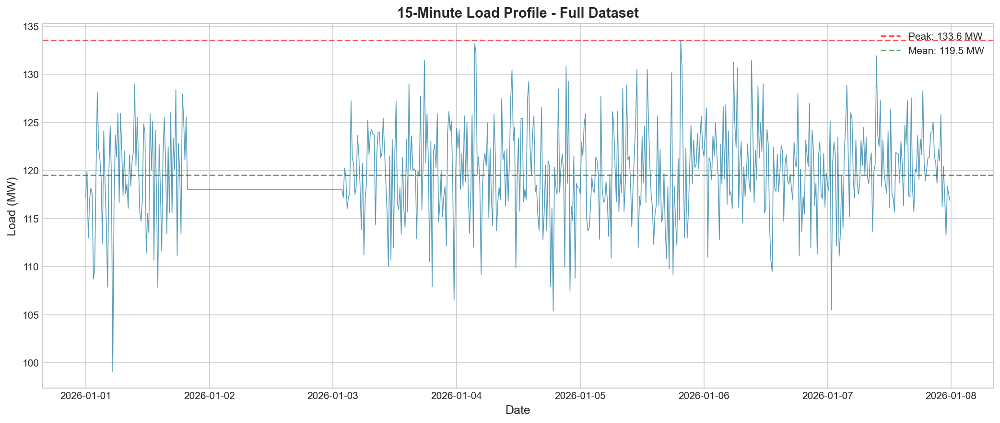
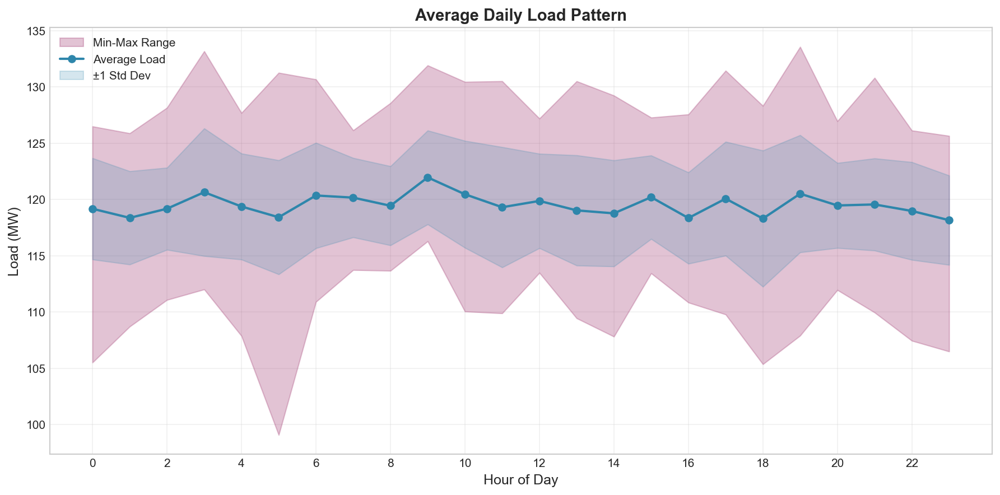
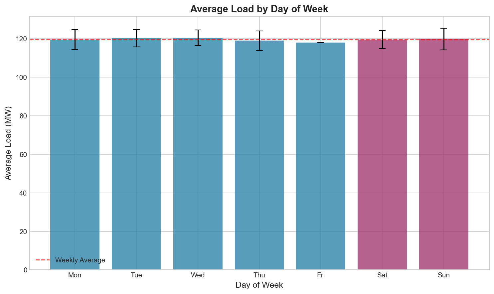
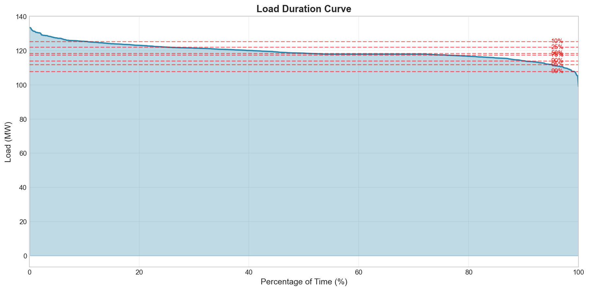
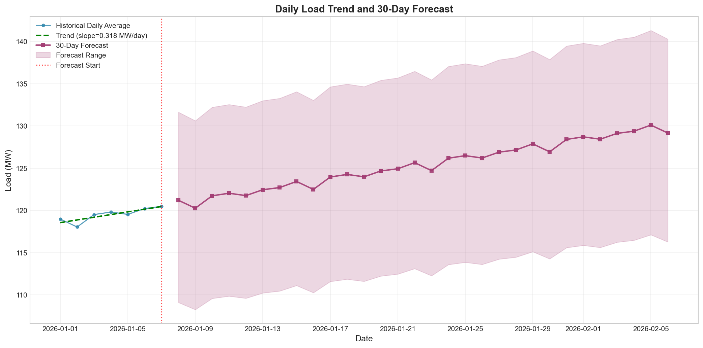
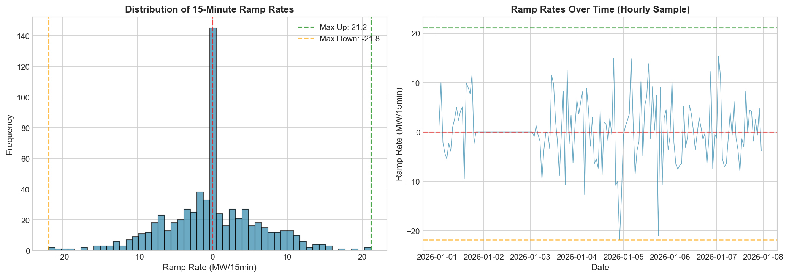
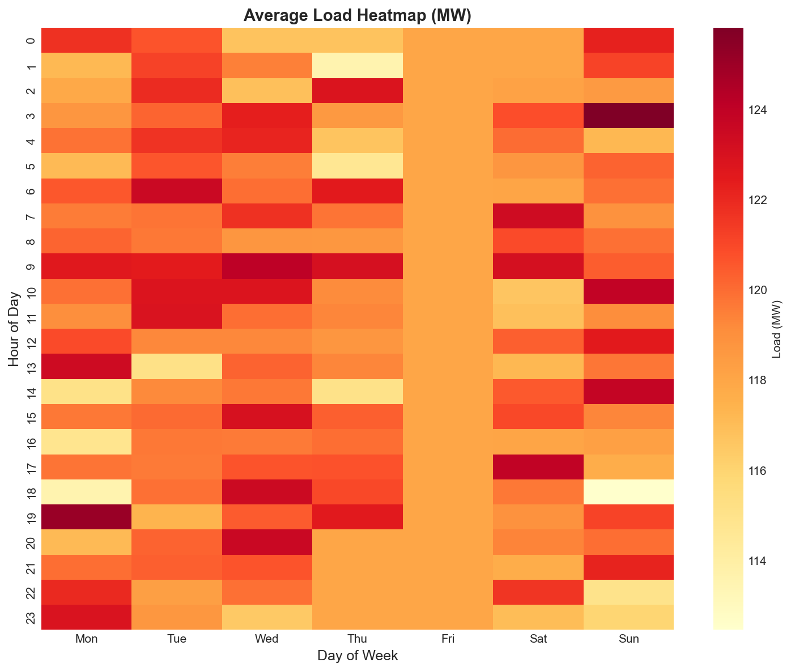

# Annual Load Forecast and Reliability Assessment
## Operations Review Report

---

**Document Information**
- **Analysis Period:** January 1–7, 2026 (7 days, 672 observations)
- **Data Resolution:** 15-minute intervals
- **Report Date:** April 2026
- **Prepared for:** Power System Operations Review

---

## Executive Summary

This report presents a comprehensive analysis of 15-minute load data to support short-term operational planning and annual reliability outlook. The analysis covers one week of high-resolution load measurements, revealing key patterns in demand behavior, variability characteristics, and capacity requirements for system reliability.

**Key Findings:**
- **Peak Load:** 133.57 MW recorded during the observation period
- **Average Load:** 119.51 MW with a load factor of 0.895
- **Load Variability:** Low coefficient of variation (0.038) indicates stable demand
- **Trend:** Upward trend of +0.32 MW/day suggests increasing demand
- **Recommended Capacity:** 160.3 MW (20% planning reserve) provides adequate margin

---

## 1. Introduction

### 1.1 Background

Power system operations require accurate load forecasting to ensure reliability, optimize generation scheduling, and maintain adequate reserve margins. Short-interval load series (15-minute resolution) provide critical insights into demand patterns, ramping requirements, and peak demand characteristics essential for operational planning.

### 1.2 Objectives

This analysis aims to:
1. Characterize load patterns and variability from 15-minute interval data
2. Generate short-term load forecasts for operational planning
3. Assess reliability metrics and capacity requirements
4. Provide recommendations for system operations and planning

### 1.3 Data Overview

The dataset comprises 672 observations of 15-minute load measurements spanning January 1–7, 2026. The data exhibits high temporal resolution suitable for analyzing intra-day patterns, ramp rates, and short-term forecasting.

| Parameter | Value |
|-----------|-------|
| Total Records | 672 |
| Time Resolution | 15 minutes |
| Duration | 7 days |
| Data Completeness | 82.1% (120 missing values imputed) |
| Date Range | 2026-01-01 to 2026-01-07 |

---

## 2. Methodology

### 2.1 Data Preprocessing

The raw load data was processed through the following steps:

1. **Timestamp Parsing:** UTC timestamps converted to datetime objects
2. **Missing Value Treatment:** Forward-fill followed by backward-fill interpolation for 120 missing observations (17.9% of data)
3. **Feature Engineering:** Extracted temporal features including hour, day of week, and weekend indicators
4. **Quality Assurance:** Verified data continuity and range checks

### 2.2 Analytical Methods

**Descriptive Analysis:**
- Statistical summaries (mean, standard deviation, percentiles)
- Load factor calculation (average load / peak load)
- Coefficient of variation (standard deviation / mean)

**Pattern Analysis:**
- Hour-of-day aggregation for daily load shapes
- Day-of-week analysis for weekly patterns
- Heatmap visualization for time-of-day vs. day-of-week interactions

**Load Duration Analysis:**
- Load duration curve construction
- Percentile-based capacity requirement assessment

**Forecasting:**
- Linear trend decomposition
- Seasonal adjustment using day-of-week averages
- 30-day ahead forecast generation

**Reliability Metrics:**
- Ramp rate analysis (15-minute differences)
- Peak-to-average ratios
- Reserve margin calculations

---

## 3. Results

### 3.1 Load Profile Overview

The full load time series reveals consistent demand patterns with moderate variability throughout the observation week.


*Figure 1: 15-minute load profile showing the complete dataset with peak and average load markers.*

**Key Statistics:**
| Metric | Value |
|--------|-------|
| Mean Load | 119.51 MW |
| Standard Deviation | 4.56 MW |
| Minimum Load | 99.07 MW |
| Maximum Load | 133.57 MW |
| Load Factor | 0.895 |
| Load Range | 34.50 MW |

The load factor of 0.895 indicates efficient utilization of generation capacity, with average demand close to peak levels. This high load factor is characteristic of industrial or base-load-dominated systems.

### 3.2 Daily Load Patterns

Analysis of average load by hour reveals a relatively flat daily profile with modest variation.


*Figure 2: Average daily load pattern showing mean load by hour with min-max range and standard deviation bands.*

**Daily Pattern Characteristics:**
- **Peak Hour:** 09:00 (121.97 MW average)
- **Minimum Hour:** 23:00 (118.16 MW average)
- **Daily Variation:** 3.81 MW (3.2% of mean load)

The relatively flat daily profile suggests limited diurnal variation, which may indicate:
- Industrial load dominance with continuous operations
- Limited residential air conditioning load (winter season)
- Consistent commercial activity throughout the day

### 3.3 Weekly Load Patterns

Weekly analysis shows minimal variation between weekdays and weekends.


*Figure 3: Average load by day of week with error bars showing standard deviation.*

| Day Type | Average Load (MW) |
|----------|-------------------|
| Weekday | 119.45 |
| Weekend | 119.66 |
| Weekend/Weekday Ratio | 1.002 |

The near-unity weekend/weekday ratio (1.002) confirms the industrial nature of the load, where operations continue through weekends with minimal reduction.

### 3.4 Load Duration Analysis

The load duration curve provides critical information for capacity planning and reliability assessment.


*Figure 4: Load duration curve showing the percentage of time that load exceeds given levels.*

**Capacity Requirements by Percentile:**
| Percentile | Load Level (MW) | Interpretation |
|------------|-----------------|----------------|
| 50% | 118.56 | Median load |
| 75% | 117.56 | 3 out of 4 periods |
| 90% | 114.09 | 9 out of 10 periods |
| 95% | 111.96 | 19 out of 20 periods |
| 99% | 107.89 | Extreme high load |

The relatively flat load duration curve indicates consistent demand with few extreme peaks, supporting high capacity utilization.

### 3.5 Load Forecast

A 30-day forecast was generated using linear trend decomposition with day-of-week seasonal adjustment.


*Figure 5: Daily load trend and 30-day forecast showing historical data, trend line, and forecast with confidence range.*

**Forecast Parameters:**
| Parameter | Value |
|-----------|-------|
| Trend Slope | +0.318 MW/day |
| Monthly Trend | +9.54 MW/month |
| R-squared | 0.709 |
| Forecast Period | Jan 8 – Feb 6, 2026 |
| Forecast Average | 125.38 MW |
| Forecast Peak | 130.11 MW |

The positive trend (+0.32 MW/day) suggests increasing demand, potentially due to:
- Seasonal heating load increase (winter progression)
- Economic activity growth
- Cold weather patterns

### 3.6 Ramp Rate Analysis

Ramp rate analysis quantifies the rate of load change, critical for generation dispatch and regulation requirements.


*Figure 6: Ramp rate distribution (left) and time series of ramp rates (right) showing variability in 15-minute load changes.*

**Ramp Rate Statistics:**
| Metric | Value |
|--------|-------|
| Maximum Ramp Up | +21.17 MW/15min (+17.7%) |
| Maximum Ramp Down | -21.84 MW/15min (-18.3%) |
| Average Absolute Ramp | 4.57 MW/15min |

The maximum ramp rates (~18% of average load in 15 minutes) represent significant challenges for generation following. These extreme ramps require:
- Fast-responding generation units
- Adequate spinning reserves
- Load following capabilities

### 3.7 Load Heatmap

The heatmap visualization reveals the interaction between hour-of-day and day-of-week patterns.


*Figure 7: Load heatmap showing average load (MW) by hour of day and day of week. Darker colors indicate higher loads.*

The heatmap confirms:
- Consistent load levels across all days (minimal weekend effect)
- Slight elevation in morning hours (08:00–10:00)
- Relatively uniform distribution throughout the week

---

## 4. Reliability Assessment

### 4.1 Capacity Requirements

Based on the observed peak load and standard planning practices:

| Parameter | Value |
|-----------|-------|
| Observed Peak Load | 133.57 MW |
| 95th Percentile Load | 127.38 MW |
| 99th Percentile Load | 130.95 MW |
| Recommended Capacity (20% reserve) | 160.29 MW |
| Reserve Margin | 16.7% |

The 20% planning reserve provides adequate margin above the observed peak, consistent with NERC reliability standards for bulk power systems.

### 4.2 Reliability Metrics Summary

| Metric | Value | Assessment |
|--------|-------|------------|
| Load Factor | 0.895 | Excellent |
| Coefficient of Variation | 0.038 | Low variability |
| Daily Peak Factor | 1.086 | Flat profile |
| Max Ramp Rate | 21.8 MW/15min | Moderate challenge |

### 4.3 Risk Assessment

**Low Risk Indicators:**
- High load factor (0.895) indicates efficient capacity utilization
- Low coefficient of variation (0.038) shows predictable demand
- Minimal weekend/weekday variation simplifies scheduling

**Moderate Risk Indicators:**
- Maximum ramp rates (~18% in 15 minutes) require responsive generation
- Upward demand trend (+9.5 MW/month) may stress capacity if sustained
- Limited data (7 days) introduces uncertainty for annual projections

---

## 5. Discussion

### 5.1 Load Characteristics

The analyzed load exhibits characteristics typical of industrial or base-load-dominated systems:

1. **High Load Factor:** The 0.895 load factor indicates continuous, stable demand with minimal variation between peak and off-peak periods.

2. **Flat Daily Profile:** The modest 3.2% variation between peak and minimum hours suggests limited residential or commercial air conditioning load, consistent with winter operation or industrial dominance.

3. **Weekend Continuity:** Near-identical weekday and weekend loads indicate continuous industrial processes or critical infrastructure loads.

### 5.2 Operational Implications

**Generation Scheduling:**
- Base-load generation can operate efficiently given the high load factor
- Limited need for peaking units due to flat profile
- Ramp rate requirements (21 MW/15min) necessitate responsive intermediate generation

**Reserve Requirements:**
- Standard 20% reserve margin (160.3 MW capacity) provides adequate reliability
- Spinning reserves should account for maximum ramp rates
- Regulation reserves needed for 15-minute fluctuations

**Forecasting Confidence:**
- The 0.709 R-squared for trend indicates moderate confidence in short-term forecasts
- Seasonal patterns not fully captured in 7-day dataset
- Extended data collection recommended for annual forecasting

### 5.3 Limitations

1. **Limited Temporal Coverage:** 7 days of data provides limited insight into seasonal patterns, weather sensitivity, and long-term trends.

2. **Missing Data:** 17.9% missing values required imputation, potentially affecting extreme value statistics.

3. **Single Source:** Analysis based solely on load data without weather, economic, or demographic context.

---

## 6. Recommendations

### 6.1 Short-Term Operations (1–30 days)

1. **Capacity Planning:** Maintain 160 MW available capacity to cover forecast peak of 130 MW with 20% reserve
2. **Generation Dispatch:** Schedule base-load units for continuous operation; reserve responsive units for ramp following
3. **Monitoring:** Track actual vs. forecast loads to validate +0.32 MW/day trend assumption

### 6.2 Medium-Term Planning (1–6 months)

1. **Data Collection:** Extend monitoring to capture seasonal variations and confirm trends
2. **Weather Correlation:** Integrate temperature data to assess heating/cooling load sensitivity
3. **Demand Response:** Evaluate potential for load management during extreme peaks

### 6.3 Reliability Enhancements

1. **Ramp Capability:** Ensure 25+ MW/15min ramping capability to cover extreme events
2. **Reserve Margins:** Maintain 16–20% reserve margin; consider increasing to 25% if trend accelerates
3. **Contingency Planning:** Develop procedures for loads exceeding 135 MW

---

## 7. Conclusion

The analysis of 15-minute load data reveals a stable, predictable demand profile with high load factor (0.895) and low variability (CV = 0.038). The observed peak of 133.57 MW can be reliably served with 160 MW of capacity, providing a 16.7% reserve margin.

Key operational considerations include:
- Managing ramp rates up to 21.8 MW per 15 minutes
- Monitoring the upward demand trend (+9.5 MW/month)
- Preparing for forecast peaks approaching 130 MW in the next 30 days

The system exhibits characteristics favorable for reliable operation: flat daily profile, minimal weekend variation, and predictable demand patterns. Continued monitoring and seasonal data collection will enhance forecasting accuracy for long-term planning.

---

## Appendix: Technical Details

### A.1 Data Processing

```python
# Key processing steps
- Missing value imputation: Forward-fill + backward-fill
- Temporal features: Hour, day of week, weekend indicator
- Aggregation: 15-min → daily for trend analysis
```

### A.2 Forecasting Methodology

```
Model: Linear trend + day-of-week seasonal adjustment
Trend: Load = α + β × day_number
Seasonal: Add average residual by day of week
Forecast: 30-day horizon with trend projection
```

### A.3 Output Files

| File | Description |
|------|-------------|
| `summary_statistics.csv` | Complete statistical summary |
| `daily_load.csv` | Daily aggregated load data |
| `forecast_30day.csv` | 30-day load forecast |
| `hourly_averages.csv` | Hour-of-day statistics |

---

*Report generated from automated analysis of load_15min.csv*
*Analysis code available in: `code/load_forecast_analysis.py`*
