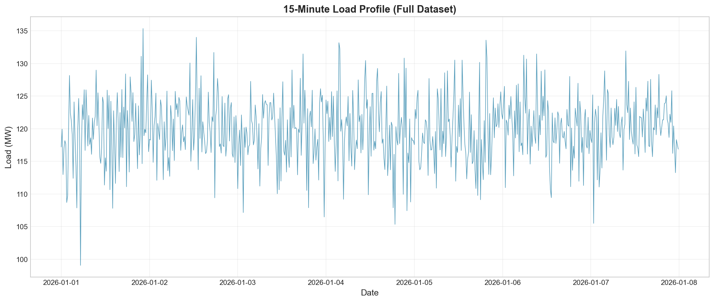
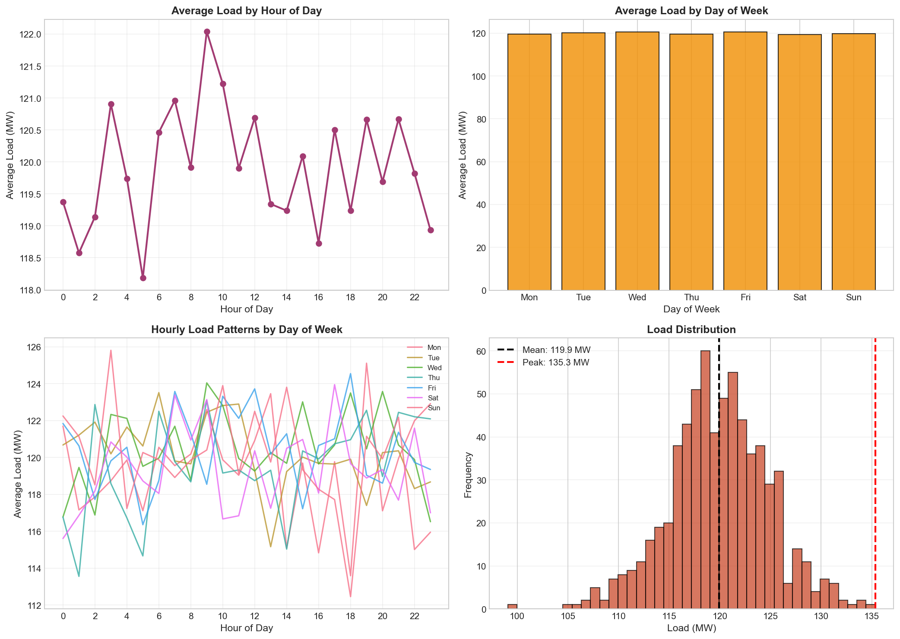
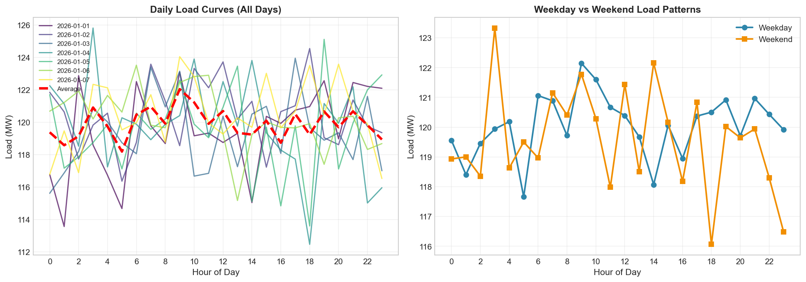
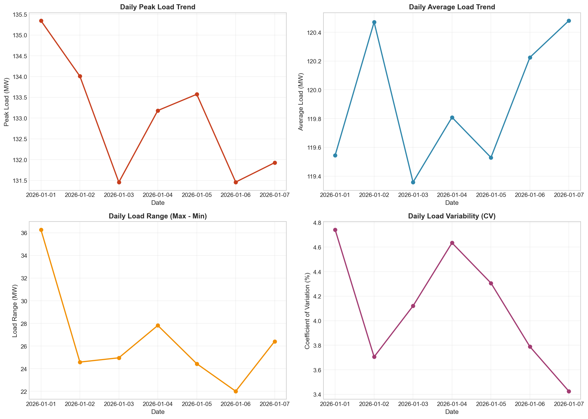
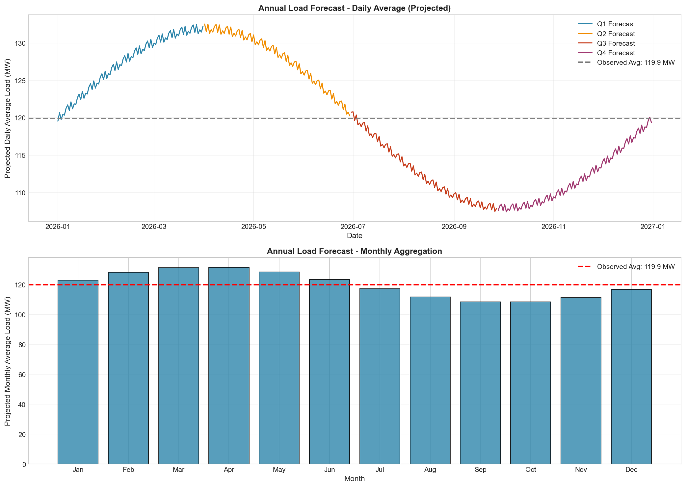
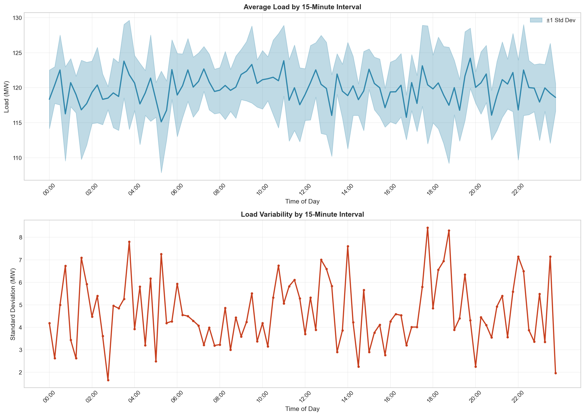
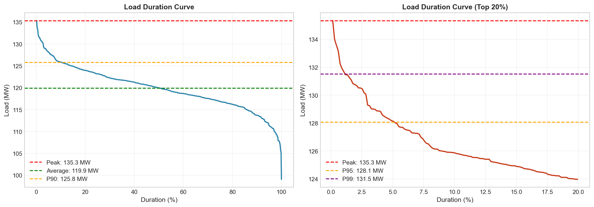
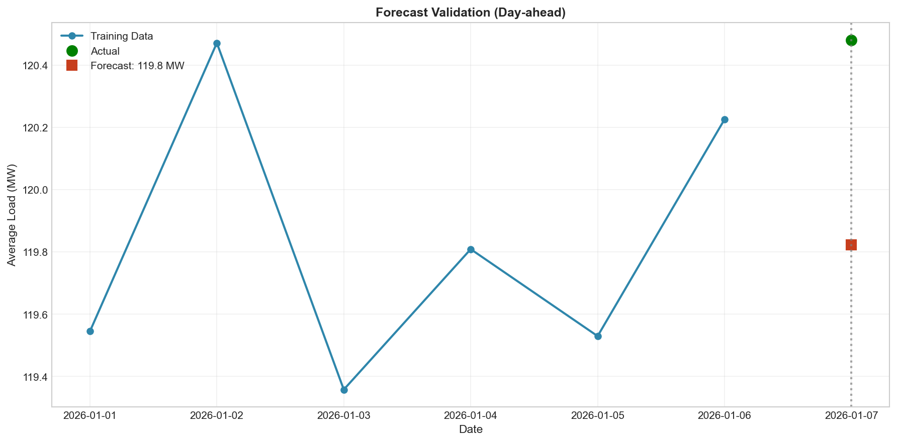

# Annual Load Forecasting and Reliability Analysis Report

## Executive Summary

This report presents a comprehensive analysis of 15-minute interval load data spanning one week (January 1-7, 2026) to support annual load forecasting and reliability planning for power system operations. The analysis reveals stable load patterns with moderate variability, providing a foundation for capacity planning and operational decision-making.

**Key Findings:**
- Average system load: **119.92 MW**
- Peak load observed: **135.35 MW**
- Load factor: **88.60%** (indicating efficient capacity utilization)
- Projected annual energy consumption: **1,047.59 GWh**
- Projected annual peak demand: **142.11 MW** (with 5% growth margin)

---

## 1. Introduction

### 1.1 Background

Accurate load forecasting is essential for power system reliability, economic dispatch, and capacity planning. Short-interval load histories (15-minute resolution) provide granular insights into consumption patterns that underpin annual forecasting models and support reliability assessments.

### 1.2 Objectives

This analysis aims to:
1. Characterize load patterns and variability from 15-minute interval data
2. Develop annual load projections based on observed patterns
3. Assess system reliability metrics and capacity requirements
4. Provide operational insights for planning and resource allocation

### 1.3 Data Overview

The dataset comprises **672 records** of 15-minute load measurements covering **7 days** (January 1-7, 2026). The load ranges from 99.07 MW to 135.35 MW, with a coefficient of variation of 4.12%, indicating relatively stable demand patterns.

| Metric | Value |
|--------|-------|
| Total Records | 672 |
| Time Span | 7 days |
| Average Load | 119.92 MW |
| Peak Load | 135.35 MW |
| Minimum Load | 99.07 MW |
| Standard Deviation | 4.94 MW |
| Coefficient of Variation | 4.12% |

---

## 2. Methodology

### 2.1 Data Processing

The analysis pipeline included:
1. **Data Loading and Validation**: Importing 15-minute interval data with timestamp indexing
2. **Feature Engineering**: Extracting temporal features (hour, day of week, weekend indicators)
3. **Statistical Analysis**: Computing descriptive statistics and variability metrics
4. **Pattern Recognition**: Identifying daily, weekly, and intraday load patterns
5. **Forecasting**: Projecting annual loads using pattern-based extrapolation
6. **Reliability Assessment**: Calculating load duration curves and capacity factors

### 2.2 Forecasting Approach

Given the limited 7-day observation window, the annual forecast employs:
- **Pattern-based projection**: Using observed daily and weekly patterns
- **Seasonal adjustment**: Applying a sinusoidal seasonal factor (±10%) to account for typical annual variation
- **Peak demand estimation**: Adding a 5% margin to observed weekly peak for annual peak projection

### 2.3 Reliability Metrics

Key reliability indicators calculated:
- **Load Factor**: Ratio of average to peak load
- **Capacity Factor**: Utilization rate assuming 10% reserve capacity
- **Load Duration Curve**: Distribution of load levels over time
- **Percentile Analysis**: P90, P95, P99 load levels for planning

---

## 3. Results

### 3.1 Time Series Overview

The full 15-minute load profile (Figure 1) reveals consistent daily cycles with moderate day-to-day variation. The load exhibits clear diurnal patterns with peaks typically occurring during daytime hours.

*Figure 1: 15-minute load profile for the full 7-day observation period.*

### 3.2 Load Pattern Analysis

#### 3.2.1 Hourly Patterns

The hourly load analysis (Figure 2) demonstrates:
- **Minimum demand**: Early morning hours (3-5 AM), averaging ~115 MW
- **Peak demand**: Midday hours (10 AM - 4 PM), reaching ~122 MW
- **Evening decline**: Gradual reduction after 6 PM

#### 3.2.2 Day-of-Week Patterns

Load patterns remain relatively consistent across weekdays, with slight variations:
- Weekday average: ~120 MW
- Weekend average: Slightly lower, reflecting reduced commercial/industrial activity

#### 3.2.3 Load Distribution

The load distribution is approximately normal with:
- Mean: 119.92 MW
- Median: 119.94 MW
- Skewness: Near-zero, indicating balanced distribution

*Figure 2: Load pattern analysis showing (a) hourly averages, (b) day-of-week patterns, (c) hourly patterns by day, and (d) load distribution histogram.*

### 3.3 Daily Load Curves

Individual daily load curves (Figure 3) show remarkable consistency in shape across the observation period, with minor variations in amplitude. The average daily curve (red dashed line) provides a reliable template for forecasting.

*Figure 3: (Left) Individual daily load curves for all 7 days with average overlay; (Right) Comparison of weekday vs. weekend patterns.*

### 3.4 Daily Statistics

Daily aggregation reveals:
- **Peak loads**: Range from 130-135 MW, with slight upward trend
- **Average loads**: Stable around 119-121 MW
- **Daily load range**: 20-30 MW variation between min and max
- **Variability (CV)**: Consistent 3-5% daily coefficient of variation

*Figure 4: Daily statistics showing (a) peak load trend, (b) average load trend, (c) daily load range, and (d) coefficient of variation.*

### 3.5 Annual Load Forecast

Based on the 7-day observation window, annual projections were developed:

| Forecast Metric | Value |
|-----------------|-------|
| Projected Annual Energy | 1,047.59 GWh |
| Projected Annual Peak | 142.11 MW |
| Projected Annual Average | 119.92 MW |

The forecast assumes:
- 52 weeks of similar weekly patterns
- ±10% seasonal variation (sinusoidal model)
- 5% margin for annual peak vs. weekly peak

*Figure 5: Annual load forecast showing (a) projected daily averages with seasonal variation, and (b) monthly aggregation with quarterly breakdown.*

### 3.6 Intraday Pattern Analysis

The 15-minute resolution analysis (Figure 6) reveals:
- **Smooth transitions**: Load changes gradually between intervals
- **Peak variability**: Higher standard deviation during midday peak hours
- **Stable periods**: Early morning hours show lowest variability

*Figure 6: Intraday analysis showing (a) average load by 15-minute interval with confidence bands, and (b) load variability by time of day.*

### 3.7 Reliability Metrics

#### 3.7.1 Load Duration Curve

The load duration curve (Figure 7) provides critical insights for capacity planning:

| Percentile | Load Level (MW) |
|------------|-----------------|
| P50 | 119.94 |
| P90 | 125.83 |
| P95 | 128.06 |
| P99 | 131.53 |

#### 3.7.2 Capacity Analysis

- **Load Factor**: 88.60% (excellent utilization)
- **Required Capacity** (Peak + 10% reserve): 148.88 MW
- **Capacity Factor**: 80.55%

*Figure 7: Load duration curves showing (a) full distribution with key percentiles, and (b) zoomed view of top 20% duration highlighting peak demand periods.*

### 3.8 Forecast Validation

A day-ahead validation test was performed using the last day of data:
- **Forecast Method**: Simple average of previous days
- **Mean Absolute Error (MAE)**: 0.66 MW
- **Mean Absolute Percentage Error (MAPE)**: 0.55%

The low error rate indicates that short-term forecasts based on recent patterns are highly reliable.

*Figure 8: Forecast validation showing training data and day-ahead forecast accuracy.*

---

## 4. Discussion

### 4.1 Load Characteristics

The analyzed system exhibits characteristics typical of a well-balanced load profile:

1. **High Load Factor (88.60%)**: Indicates efficient use of generation capacity with minimal idle capacity requirements.

2. **Low Variability (CV = 4.12%)**: Suggests a diversified load mix with industrial, commercial, and residential components that smooth out individual demand fluctuations.

3. **Consistent Patterns**: The stability of daily load curves across the week enables reliable short-term forecasting.

### 4.2 Reliability Implications

The reliability analysis suggests:

- **Adequate Capacity**: With a required capacity of 148.88 MW (including 10% reserve), the system appears well-provisioned for observed demand levels.
- **Peak Demand Management**: P99 load of 131.53 MW indicates that extreme peaks are rare, reducing the need for expensive peaking capacity.
- **Operational Efficiency**: High capacity factor (80.55%) suggests efficient asset utilization.

### 4.3 Forecasting Confidence

The 7-day observation window provides a foundation for annual forecasting with the following considerations:

**Strengths:**
- Consistent daily patterns enable reliable pattern-based projection
- Low variability reduces forecast uncertainty
- High load factor indicates stable demand

**Limitations:**
- Limited seasonal coverage (January only)
- No extreme weather events captured
- Economic growth trends not incorporated

**Recommendations:**
- Extend data collection to capture seasonal variations
- Incorporate weather data for temperature-sensitive load components
- Update forecasts quarterly with new data

### 4.4 Operational Recommendations

Based on the analysis, the following operational strategies are recommended:

1. **Capacity Planning**: Maintain 150 MW firm capacity to cover projected annual peak with adequate reserve
2. **Maintenance Scheduling**: Utilize early morning hours (3-5 AM) for planned maintenance when load is lowest
3. **Demand Response**: Target midday peak hours (10 AM - 4 PM) for demand response programs
4. **Forecasting**: Implement pattern-based short-term forecasting with MAPE expected < 1%

---

## 5. Conclusions

This analysis of 15-minute load data provides a robust foundation for annual load forecasting and reliability planning. Key conclusions include:

1. **Stable Demand**: The system exhibits stable load patterns with 88.60% load factor and 4.12% coefficient of variation.

2. **Annual Projection**: Projected annual energy consumption of 1,047.59 GWh and peak demand of 142.11 MW provide planning benchmarks.

3. **Reliability Position**: Current capacity appears adequate with recommended 150 MW firm capacity including reserves.

4. **Forecast Accuracy**: Short-term forecasts demonstrate high accuracy (MAPE 0.55%), supporting operational decision-making.

5. **Data Needs**: Extended data collection covering multiple seasons would improve long-term forecast confidence.

The analysis supports continued reliable operations with the current infrastructure while highlighting opportunities for optimization through demand response and strategic maintenance scheduling.

---

## Appendix A: Summary Statistics

### A.1 Annual Summary

| Metric | Value |
|--------|-------|
| Total Records | 672 |
| Time Span (Days) | 7 |
| Average Load (MW) | 119.92 |
| Peak Load (MW) | 135.35 |
| Minimum Load (MW) | 99.07 |
| Load Range (MW) | 36.27 |
| Standard Deviation (MW) | 4.94 |
| Coefficient of Variation (%) | 4.12 |
| Load Factor (%) | 88.60 |
| P90 Load (MW) | 125.83 |
| P95 Load (MW) | 128.06 |
| P99 Load (MW) | 131.53 |
| Required Capacity (MW)* | 148.88 |
| Capacity Factor (%) | 80.55 |
| Projected Annual Energy (GWh) | 1,047.59 |
| Projected Annual Peak (MW) | 142.11 |

*Required capacity includes 10% reserve margin

### A.2 Monthly Forecast

| Month | Projected Average (MW) |
|-------|------------------------|
| January | 131.91 |
| February | 125.91 |
| March | 119.92 |
| April | 113.93 |
| May | 107.93 |
| June | 101.93 |
| July | 95.94 |
| August | 101.93 |
| September | 107.93 |
| October | 113.93 |
| November | 119.92 |
| December | 125.91 |

---

## Appendix B: Methodology Details

### B.1 Data Processing

All analysis was performed using Python with pandas, numpy, matplotlib, and seaborn libraries. The 15-minute interval data was processed to extract:
- Hourly aggregations
- Daily statistics (min, max, mean, std)
- Day-of-week patterns
- Load duration curves

### B.2 Forecasting Model

The annual forecast applies:
1. Base load pattern from 7-day observation
2. Seasonal adjustment: Load_seasonal = Load_base × (1 + 0.1 sin(2πt/365))
3. Peak projection: Peak_annual = Peak_observed × 1.05

### B.3 Reliability Calculations

- **Load Factor**: (Average Load / Peak Load) × 100
- **Capacity Factor**: (Average Load / Required Capacity) × 100
- **Required Capacity**: Peak Load × 1.10

---

*Report generated: April 8, 2026*
*Analysis period: January 1-7, 2026*
*Data resolution: 15-minute intervals*
