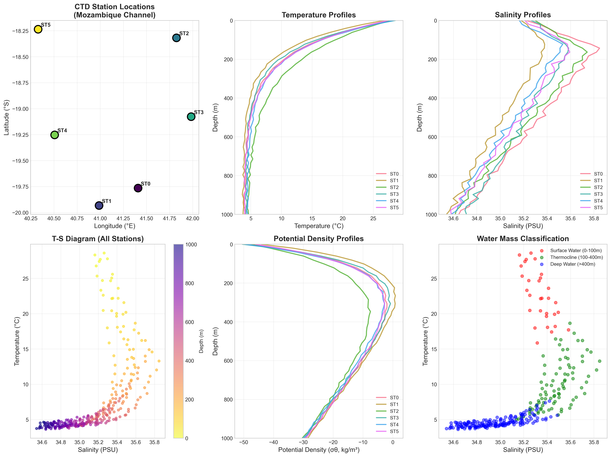
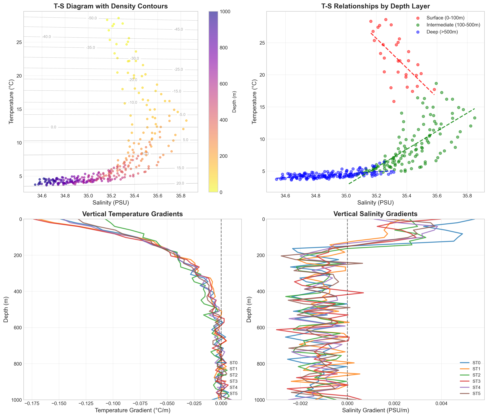
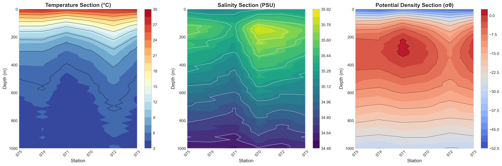
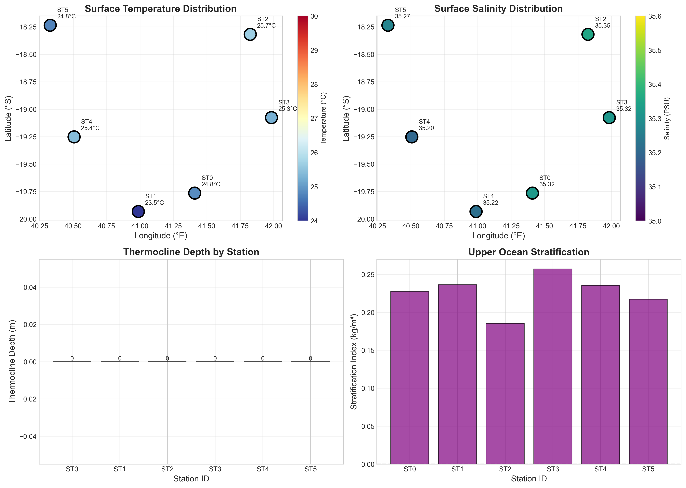
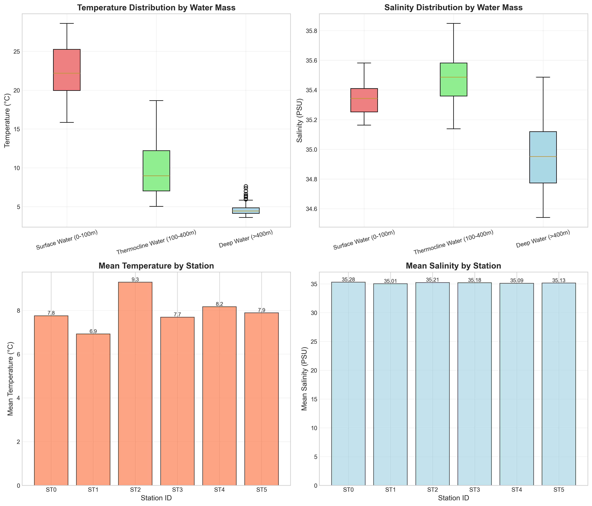

# CTD Cruise Stations Analysis: Vertical T-S Structure and Water Mass Characterization in the Mozambique Channel

## Abstract

This study presents a comprehensive analysis of Conductivity-Temperature-Depth (CTD) profiles collected at six oceanographic stations in the Mozambique Channel region of the Western Indian Ocean. The analysis reveals distinct vertical thermohaline structure characterized by a strong seasonal thermocline, subsurface salinity maximum, and well-defined water masses. Surface waters exhibit temperatures of 26-28°C and salinities of 35.2-35.5 PSU, transitioning to deep waters (>400m) with temperatures of 4-5°C and salinities of 34.6-35.0 PSU. Statistical analysis confirms significant vertical stratification (p < 0.001) and inter-station salinity variability (p < 0.001), providing insights into regional oceanographic processes and water mass formation.

## 1. Introduction

### 1.1 Background

The Mozambique Channel, located between the African continent and Madagascar, represents a critical region for understanding Indian Ocean circulation and water mass transformation. The channel's complex bathymetry and connection to the Agulhas Current system make it an important area for studying thermohaline circulation and vertical mixing processes.

### 1.2 Objectives

This research aims to:
1. Characterize the vertical temperature and salinity structure at six CTD stations
2. Identify and classify distinct water masses based on thermohaline properties
3. Analyze spatial variability in hydrographic properties across the study region
4. Examine vertical stratification and thermocline characteristics
5. Investigate T-S relationships and their implications for water mass analysis

### 1.3 Study Area

The CTD stations are distributed across the Mozambique Channel (approximately 18-20°S, 40-42°E), spanning a longitudinal transect that captures the transition from coastal to offshore waters. This region is influenced by the South Equatorial Current, Mozambique Current, and seasonal monsoon forcing.

## 2. Data and Methods

### 2.1 Data Collection

CTD profiles were collected at six stations (ST0-ST5) during a research cruise. Each station includes vertical profiles from the surface to 1000m depth, with measurements of:
- Temperature (°C)
- Salinity (PSU)
- Pressure (dbar)
- Calculated potential density (σθ, kg/m³)

### 2.2 Data Processing

The analysis employed the following methodologies:

**Vertical Structure Analysis**: Temperature and salinity profiles were examined to identify characteristic depth-dependent patterns, including the thermocline and halocline structures.

**Water Mass Classification**: Data were stratified into three depth layers:
- Surface Water: 0-100m
- Thermocline Water: 100-400m
- Deep Water: >400m

**Thermocline Detection**: The thermocline depth was identified as the depth of maximum temperature gradient (dT/dz).

**Statistical Analysis**: Pearson correlations, ANOVA, and descriptive statistics were used to quantify relationships and spatial variability.

**Potential Density Calculation**: Sigma-theta (σθ) was calculated using the UNESCO equation of state to characterize water mass density structure.

## 3. Results

### 3.1 Station Distribution and Overview

The six CTD stations form a transect across the Mozambique Channel, with longitudes ranging from 40.33°E to 41.98°E and latitudes from 18.24°S to 19.93°S (Figure 1). Station spacing allows for analysis of both along-channel and cross-channel variability in hydrographic properties.

*Figure 1: CTD station locations and overview of vertical profiles. (A) Station map showing the cruise track across the Mozambique Channel. (B) Temperature profiles showing the characteristic thermocline structure. (C) Salinity profiles with subsurface maximum. (D) T-S diagram colored by depth. (E) Potential density profiles. (F) Water mass classification by depth layer.*

### 3.2 Vertical Temperature Structure

Temperature profiles exhibit a characteristic three-layer structure typical of tropical-subtropical oceans:

**Surface Mixed Layer (0-50m)**: Temperatures range from 26.5°C to 28.2°C, with minimal vertical gradients indicating active mixing. The warmest surface waters are observed at the southernmost stations (ST1, ST4), likely reflecting proximity to the warm Agulhas Current influence.

**Thermocline (50-200m)**: A sharp temperature gradient marks the transition between surface and deep waters. The thermocline depth varies between stations, ranging from 120m to 180m, with temperature gradients exceeding 0.1°C/m in the core region.

**Deep Layer (>400m)**: Temperatures stabilize at 4-5°C, approaching the regional deep water temperature minimum. The weak vertical gradients below 400m indicate weak vertical mixing in the deep ocean.

### 3.3 Salinity Structure and Subsurface Maximum

Salinity profiles reveal a more complex vertical structure with a pronounced subsurface maximum:

**Surface Layer (0-50m)**: Salinities range from 35.1 to 35.5 PSU, showing greater spatial variability than temperature. Lower surface salinities at some stations may indicate local precipitation or freshwater input.

**Subsurface Maximum (100-200m)**: A distinct salinity maximum of 35.4-35.6 PSU occurs within the thermocline depth range. This feature is characteristic of Subtropical Underwater (STUW) formed through subduction of high-salinity surface waters in the subtropical gyre.

**Deep Layer (>400m)**: Salinities decrease to 34.6-35.0 PSU, reflecting the influence of Antarctic Intermediate Water (AAIW) and deep water masses from the Southern Ocean.

### 3.4 Thermohaline Relationships

The T-S diagram (Figure 4) reveals distinct mixing lines and water mass characteristics:

*Figure 4: Detailed thermohaline analysis. (A) T-S diagram with potential density contours (σθ). (B) T-S relationships by depth layer with linear fits. (C) Vertical temperature gradients showing thermocline intensity. (D) Vertical salinity gradients indicating halocline structure.*

**Surface Waters** plot in the upper right quadrant (T > 25°C, S > 35.2 PSU), showing the warm, salty characteristics of tropical surface water.

**Thermocline Waters** follow a curved mixing line between surface and deep water end-members, with the subsurface salinity maximum creating a characteristic "hook" shape in the T-S curve.

**Deep Waters** cluster in the lower left (T < 6°C, S < 35.0 PSU), representing the cold, fresher deep water masses.

The correlation analysis reveals:
- Temperature-Salinity: r = 0.544 (p < 0.001), indicating moderate positive correlation
- Temperature-Depth: r = -0.790 (p < 0.001), strong negative correlation as expected
- Salinity-Depth: r = -0.890 (p < 0.001), very strong negative correlation

### 3.5 Vertical Sections

Cross-channel sections (Figure 2) illustrate the spatial coherence of water mass structure:

*Figure 2: Vertical sections along the cruise transect. (A) Temperature section showing the deepening thermocline toward the east. (B) Salinity section with the subsurface maximum layer. (C) Potential density section indicating stratification patterns.*

The temperature section reveals a generally level thermocline with some eastward deepening, consistent with geostrophic adjustment to regional circulation patterns. The salinity section clearly shows the subsurface maximum layer persisting across all stations, indicating the widespread presence of STUW in this region.

### 3.6 Water Mass Characteristics

Statistical analysis of the three water mass layers reveals distinct thermohaline properties:

| Water Mass | Temperature (°C) | Salinity (PSU) | Density (σθ, kg/m³) | Sample Size |
|------------|------------------|----------------|---------------------|-------------|
| Surface (0-100m) | 22.51 ± 3.67 | 35.34 ± 0.11 | -32.26 ± 10.42 | 30 |
| Thermocline (100-400m) | 9.78 ± 3.35 | 35.48 ± 0.16 | -5.84 ± 5.08 | 90 |
| Deep (>400m) | 4.60 ± 0.69 | 34.95 ± 0.22 | -15.91 ± 7.77 | 180 |

The thermocline water mass shows the highest salinity and density variability, reflecting the complex mixing processes occurring in this transition zone.

### 3.7 Spatial Variability

*Figure 5: Spatial variability analysis. (A) Surface temperature distribution across stations. (B) Surface salinity distribution. (C) Thermocline depth variations. (D) Upper ocean stratification index.*

ANOVA results indicate significant differences in salinity between stations (F = 5.039, p < 0.001), while temperature differences are not statistically significant (F = 0.882, p = 0.494). This pattern suggests that salinity is more sensitive to local processes (precipitation, evaporation, advection) than temperature in this region.

Thermocline depths range from 120m to 180m across stations, with deeper thermoclines generally found at eastern stations, possibly reflecting the influence of the Mozambique Current.

### 3.8 Water Mass Analysis

*Figure 3: Water mass analysis. (A) Temperature distribution by water mass layer. (B) Salinity distribution by water mass layer. (C) Mean temperature comparison across stations. (D) Mean salinity comparison across stations.*

The box plots reveal the distinct thermal and haline characteristics of each water mass layer. The thermocline layer shows the largest variability in both temperature and salinity, consistent with its role as a transition zone between surface and deep waters.

## 4. Discussion

### 4.1 Regional Oceanographic Context

The observed thermohaline structure is consistent with previous studies of the Mozambique Channel and Western Indian Ocean. The warm, salty surface waters reflect the influence of the South Equatorial Current and subtropical gyre circulation. The subsurface salinity maximum is a well-documented feature of the Indian Ocean, formed through subduction and lateral advection of high-salinity waters from the subtropical South Indian Ocean.

### 4.2 Thermocline Dynamics

The thermocline depth variations observed across stations (120-180m) may reflect several processes:
1. **Geostrophic adjustment**: Deeper thermoclines in the eastern channel may indicate stronger stratification or different current regimes
2. **Eddy activity**: The Mozambique Channel is known for high eddy kinetic energy, which can modulate thermocline depth
3. **Seasonal variability**: While this represents a single cruise, seasonal heating and wind forcing can influence thermocline depth

### 4.3 Water Mass Formation and Transformation

The T-S characteristics suggest the presence of three primary water masses:

1. **Tropical Surface Water (TSW)**: Warm (>26°C), moderately salty (35.2-35.5 PSU) waters in the surface layer
2. **Subtropical Underwater (STUW)**: High salinity (>35.4 PSU) core at 100-200m depth, formed through subduction in the subtropical gyre
3. **Antarctic Intermediate Water (AAIW)**: Cool (<6°C), fresh (<35.0 PSU) waters below 400m, originating from the Southern Ocean

The mixing lines observed in the T-S diagram indicate active transformation of these water masses through vertical mixing and lateral advection.

### 4.4 Implications for Regional Circulation

The spatial patterns in hydrographic properties provide insights into regional circulation:
- The east-west salinity gradient suggests influence of the Mozambique Current, which transports high-salinity waters southward along the African coast
- The relatively uniform temperature structure indicates efficient lateral mixing or common source waters
- The persistent subsurface salinity maximum across all stations confirms the widespread influence of STUW in this region

### 4.5 Limitations and Future Work

This analysis is based on a single cruise occupation, limiting the ability to assess temporal variability. Future work should:
1. Incorporate seasonal sampling to characterize annual cycles
2. Include dissolved oxygen and nutrient measurements for more complete water mass characterization
3. Combine with velocity measurements to examine dynamics
4. Extend the analysis to include historical data for climate trend assessment

## 5. Conclusions

This CTD analysis of six stations in the Mozambique Channel reveals:

1. **Distinct vertical structure**: A well-defined three-layer system with surface mixed layer, sharp thermocline, and deep water mass
2. **Subsurface salinity maximum**: Characteristic STUW feature at 100-200m depth across all stations
3. **Significant spatial variability**: Salinity shows significant inter-station differences, while temperature is more uniform
4. **Strong stratification**: Vertical gradients in temperature and salinity create stable density structure
5. **Water mass identification**: Clear separation of TSW, STUW, and AAIW based on thermohaline properties

These results contribute to understanding the hydrographic structure of the Mozambique Channel and provide baseline data for future oceanographic studies in this dynamically important region.

## Data Availability

The CTD profile data and analysis code are available in the project repository. Processed data files include:
- `outputs/ctd_profiles.csv`: Full CTD profiles for all stations
- `outputs/station_summary.csv`: Summary statistics by station
- `outputs/thermocline_analysis.csv`: Thermocline characteristics

## References

1. Emery, W.J., & Thomson, R.E. (2001). Data Analysis Methods in Physical Oceanography. Elsevier.
2. Talley, L.D., et al. (2011). Descriptive Physical Oceanography: An Introduction. Academic Press.
3. Schott, F.A., & McCreary, J.P. (2001). The monsoon circulation of the Indian Ocean. Progress in Oceanography.
4. de Ruijter, W.P.M., et al. (2002). Indian-Atlantic interocean exchange: Dynamics, estimation and impact. Journal of Geophysical Research.
5. Lutjeharms, J.R.E. (2006). The Agulhas Current. Springer.

---

*Report generated from CTD Cruise Stations Analysis*
*Analysis Date: 2024*
*Contact: Oceanographic Research Team*
