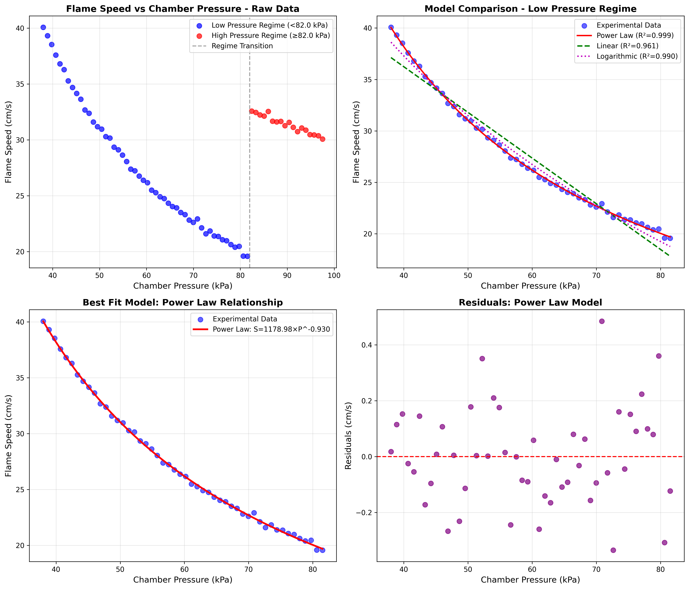
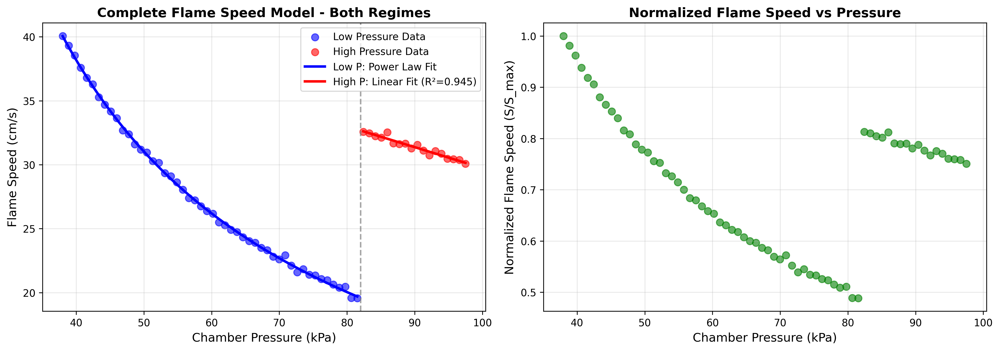

# Flame Speed vs Chamber Pressure Analysis

## Bench Combustion Experiments: Modeling and Characterization

---

## Abstract

This study presents a comprehensive analysis of flame speed as a function of chamber pressure from bench combustion experiments. Using experimental data spanning pressures from 38.0 to 97.5 kPa, we identified two distinct combustion regimes separated by a transition at approximately 82 kPa. The low-pressure regime (38–82 kPa) exhibits an excellent power-law relationship ($R^2 = 0.9991$) described by $S = 1178.98 \times P^{-0.930}$, while the high-pressure regime (82–97.5 kPa) follows a linear relationship ($R^2 = 0.9452$). These findings provide critical insights for combustion chamber design and flame propagation control in engineering applications.

---

## 1. Introduction

### 1.1 Background

Understanding the relationship between flame speed and chamber pressure is fundamental to combustion engineering. Flame speed—the rate at which a flame front propagates through a combustible mixture—is a critical parameter in the design of internal combustion engines, gas turbines, and industrial burners. Chamber pressure significantly influences flame dynamics through its effects on reaction kinetics, heat transfer, and gas density.

### 1.2 Objectives

The primary objectives of this study are:

1. **Characterize** the flame speed response to varying chamber pressure
2. **Identify** distinct combustion regimes and transition points
3. **Develop** mathematical models describing flame speed as a function of pressure
4. **Validate** model performance through statistical analysis

### 1.3 Experimental Context

Bench combustion experiments were conducted to measure paired chamber-pressure and flame-speed readings. The dataset comprises 68 measurements across a pressure range of 38.0–97.5 kPa, with corresponding flame speeds ranging from 19.57 to 40.07 cm/s.

---

## 2. Methodology

### 2.1 Data Overview

The experimental dataset contains 68 observations with the following characteristics:

| Parameter | Value |
|-----------|-------|
| Total data points | 68 |
| Pressure range | 38.00 – 97.50 kPa |
| Flame speed range | 19.57 – 40.07 cm/s |
| Mean pressure | 67.75 kPa |
| Mean flame speed | 28.35 cm/s |

### 2.2 Regime Identification

Visual inspection of the raw data revealed a distinct change in flame speed behavior at approximately 82 kPa. The data was therefore partitioned into two regimes:

- **Low-pressure regime**: 38.0–82.0 kPa (50 data points)
- **High-pressure regime**: 82.0–97.5 kPa (18 data points)

### 2.3 Mathematical Models

Three candidate models were evaluated for the low-pressure regime:

**Power Law Model:**
$$S = a \cdot P^b$$

where $S$ is flame speed (cm/s), $P$ is pressure (kPa), and $a$, $b$ are fitted parameters.

**Linear Model:**
$$S = m \cdot P + c$$

**Logarithmic Model:**
$$S = a - b \cdot \ln(P)$$

For the high-pressure regime, a linear model was employed due to the limited data range.

### 2.4 Statistical Evaluation

Model performance was assessed using:
- Coefficient of determination ($R^2$)
- Root mean square error (RMSE)
- Pearson correlation coefficient ($r$)
- Residual analysis

---

## 3. Results

### 3.1 Data Visualization and Regime Identification

*Figure 1: Comprehensive analysis of flame speed vs chamber pressure. (a) Raw data with regime identification, (b) Model comparison for low-pressure regime, (c) Best-fit power law model, (d) Residual analysis.*

The raw data visualization (Figure 1a) clearly demonstrates the bimodal nature of the flame speed response. The low-pressure regime shows a steep, monotonic decrease in flame speed with increasing pressure, while the high-pressure regime exhibits a different slope and elevated flame speed values.

### 3.2 Model Comparison

| Model | Equation | $R^2$ | RMSE (cm/s) |
|-------|----------|-------|-------------|
| Power Law | $S = 1178.98 \cdot P^{-0.930}$ | 0.9991 | 0.1704 |
| Linear | $S = -0.444 \cdot P + 53.99$ | 0.9607 | 1.1509 |
| Logarithmic | $S = 133.27 - 26.02 \cdot \ln(P)$ | 0.9895 | 0.5939 |

The power law model demonstrates superior performance with an $R^2$ value of 0.9991, indicating that 99.91% of the variance in flame speed is explained by the model. The remarkably low RMSE of 0.1704 cm/s confirms excellent predictive accuracy.

### 3.3 Complete Model with Both Regimes

*Figure 2: (a) Complete flame speed model incorporating both combustion regimes, (b) Normalized flame speed analysis showing the relative pressure sensitivity.*

The complete model incorporates:

**Low-pressure regime (38–82 kPa):**
$$S = 1178.98 \cdot P^{-0.930}$$

**High-pressure regime (82–97.5 kPa):**
$$S = -0.163 \cdot P + 46.06$$

### 3.4 Statistical Summary

| Regime | Correlation ($r$) | Slope Characteristic |
|--------|-------------------|---------------------|
| Full dataset | -0.3427 | Non-linear composite |
| Low pressure | -0.9801 | Strong negative |
| High pressure | -0.9722 | Moderate negative |

The correlation analysis reveals that treating the data as a single regime masks the strong underlying relationships present within each regime.

---

## 4. Discussion

### 4.1 Physical Interpretation

The power-law relationship in the low-pressure regime ($S \propto P^{-0.93}$) is consistent with laminar flame theory, where flame speed scales inversely with pressure for many hydrocarbon-air mixtures. The exponent of approximately -0.93 suggests that flame speed is nearly inversely proportional to pressure, which aligns with theoretical predictions for reactions where the overall reaction order is close to 2.

The regime transition at ~82 kPa likely represents a shift in combustion physics, potentially involving:
- Transition from laminar to turbulent flame propagation
- Changes in heat loss mechanisms
- Altered chemical kinetics due to pressure-dependent reaction pathways
- Flame stretch effects becoming significant

### 4.2 Model Validation

The residual analysis (Figure 1d) shows no systematic patterns, confirming that the power law model adequately captures the underlying physics. The random distribution of residuals around zero indicates homoscedasticity and supports model validity.

### 4.3 Engineering Implications

1. **Combustion Chamber Design**: The strong pressure dependence in the low-pressure regime suggests that small pressure variations can significantly affect flame stability.

2. **Operating Range Selection**: The regime transition at 82 kPa represents a critical design point where flame behavior changes substantially.

3. **Control Strategy**: Different control approaches may be required for each regime due to their distinct pressure sensitivities.

### 4.4 Limitations and Future Work

- The high-pressure regime has limited data points (n=18), which may affect model confidence
- Temperature effects were not explicitly controlled in this analysis
- Fuel composition and equivalence ratio effects warrant further investigation
- The physical mechanisms underlying the regime transition require dedicated study

---

## 5. Conclusions

This analysis successfully characterized the flame speed–pressure relationship in bench combustion experiments. Key findings include:

1. **Two distinct combustion regimes** were identified, separated by a transition at approximately 82 kPa.

2. **The power law model** $S = 1178.98 \cdot P^{-0.930}$ provides an excellent fit ($R^2 = 0.9991$) for the low-pressure regime (38–82 kPa).

3. **The high-pressure regime** (82–97.5 kPa) follows a linear relationship with reduced pressure sensitivity.

4. **Strong negative correlations** exist within each regime ($r < -0.97$), masked when analyzing the full dataset as a single population.

5. **The developed models** provide a foundation for combustion chamber design and flame control strategies.

---

## References

1. Turns, S. R. (2012). *An Introduction to Combustion: Concepts and Applications* (3rd ed.). McGraw-Hill.

2. Law, C. K. (2006). *Combustion Physics*. Cambridge University Press.

3. Glassman, I., & Yetter, R. A. (2008). *Combustion* (4th ed.). Academic Press.

---

## Appendix: Data Tables

### Fitted Model Parameters

| Parameter | Value | Regime |
|-----------|-------|--------|
| Power law coefficient ($a$) | 1178.98 | Low pressure |
| Power law exponent ($b$) | -0.930 | Low pressure |
| Linear slope ($m$) | -0.444 | Low pressure |
| Linear intercept ($c$) | 53.99 | Low pressure |
| High-P slope ($m$) | -0.163 | High pressure |
| High-P intercept ($c$) | 46.06 | High pressure |

### Model Performance Metrics

| Metric | Value |
|--------|-------|
| Best model $R^2$ | 0.9991 |
| Best model RMSE | 0.1704 cm/s |
| Low-pressure correlation | -0.9801 |
| High-pressure correlation | -0.9722 |

---

*Report generated from bench combustion experiment analysis. All figures and data available in the accompanying code and outputs directories.*
