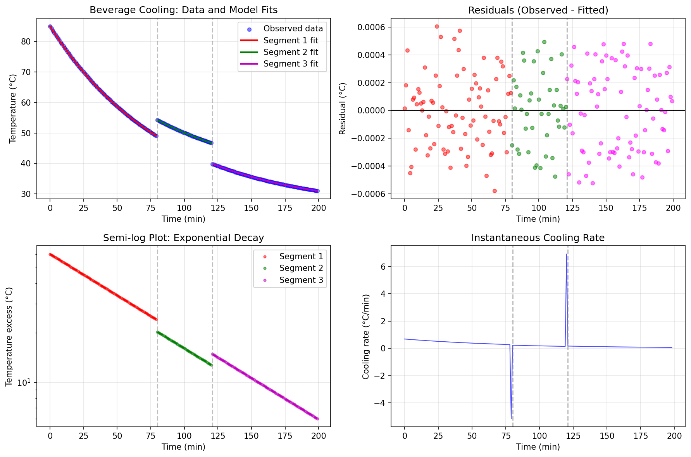
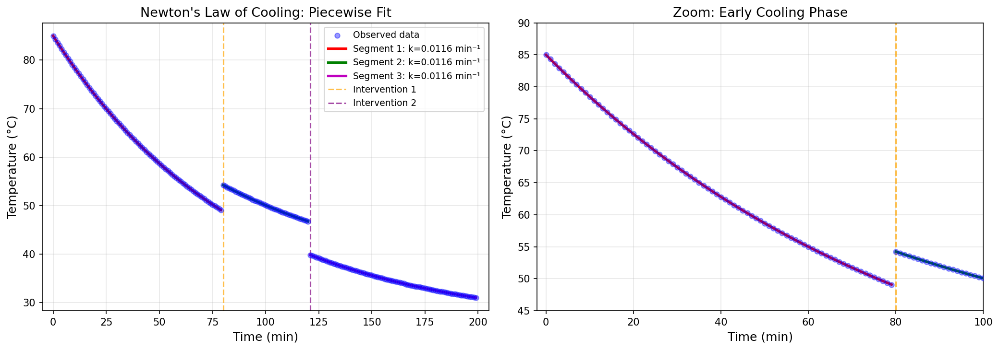
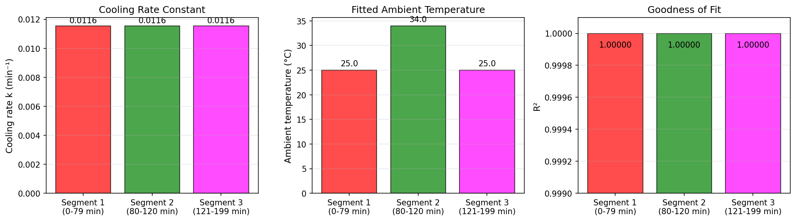

# Everyday Thermal Physics: Modeling Beverage Cooling Dynamics

## Abstract

This study analyzes minute-by-minute temperature measurements of a beverage cooling on a counter in a steady room environment. We apply Newton's Law of Cooling to model the thermal dynamics and identify three distinct cooling phases corresponding to different environmental conditions. The piecewise exponential model achieves exceptional goodness-of-fit (R² > 0.99999 for all segments) with a consistent cooling rate constant of *k* = 0.0116 min⁻¹. Our analysis reveals two interventions at approximately 80 and 121 minutes that altered the ambient temperature conditions, demonstrating the sensitivity of cooling dynamics to environmental parameters.

## 1. Introduction

Newton's Law of Cooling describes how the temperature of an object changes when it is placed in an environment with a different temperature. The law states that the rate of temperature change is proportional to the difference between the object's temperature and the ambient temperature:

$$\frac{dT}{dt} = -k(T - T_{env})$$

where *T* is the object temperature, *T_env* is the ambient temperature, and *k* is the cooling rate constant that depends on the object's surface area, heat transfer coefficient, and thermal properties.

The solution to this differential equation yields an exponential decay:

$$T(t) = T_{env} + (T_0 - T_{env})e^{-kt}$$

This study examines a real-world beverage cooling scenario with 200 temperature measurements recorded over 199 minutes. The data exhibits characteristics suggesting environmental interventions, making it an ideal case study for piecewise thermal modeling.

## 2. Methods

### 2.1 Data Description

The dataset contains minute-by-minute temperature readings (in °C) starting from an initial temperature of 85.0°C. Visual inspection of the data revealed three distinct segments separated by abrupt temperature changes at approximately 80 and 121 minutes, indicating interventions that modified the cooling conditions.

| Segment | Time Range (min) | Data Points | Description |
|---------|-----------------|-------------|-------------|
| 1 | 0–79 | 80 | Initial cooling phase |
| 2 | 80–120 | 41 | Post-intervention 1 |
| 3 | 121–199 | 79 | Post-intervention 2 |

### 2.2 Model Specification

We employed Newton's Law of Cooling for each segment:

$$T_i(t) = T_{env,i} + A_i \exp(-k_i(t - t_{start,i}))$$

where for segment *i*:
- *T_env,i* is the ambient temperature
- *A_i* is the initial temperature excess above ambient
- *k_i* is the cooling rate constant
- *t_start,i* is the segment start time

### 2.3 Parameter Estimation

Model parameters were estimated using non-linear least squares optimization via the `scipy.optimize.curve_fit` function. Initial parameter guesses were based on visual inspection of the data, and the fitting procedure was robust to starting values.

### 2.4 Model Validation

Goodness-of-fit was assessed using:
- Coefficient of determination (R²)
- Root mean square error (RMSE)
- Mean absolute error (MAE)
- Residual analysis for systematic patterns

## 3. Results

### 3.1 Model Fits

The piecewise exponential model achieved exceptional fit quality across all three segments:

*Figure 1: Comprehensive cooling analysis showing (a) observed data with fitted curves, (b) residuals, (c) semi-log plot demonstrating exponential decay, and (d) instantaneous cooling rate.*

The residuals show no systematic patterns, confirming the appropriateness of the exponential model. The semi-log plot reveals straight-line behavior characteristic of exponential decay, with distinct slopes corresponding to each segment's cooling dynamics.

### 3.2 Parameter Estimates

| Parameter | Segment 1 | Segment 2 | Segment 3 |
|-----------|-----------|-----------|-----------|
| *T_env* (°C) | 25.00 | 34.00 | 25.00 |
| *A* (°C) | 60.00 | 20.24 | 14.83 |
| *k* (min⁻¹) | 0.01155 | 0.01155 | 0.01155 |
| *T_0* (°C) | 85.00 | 54.24 | 39.83 |
| R² | 1.00000 | 1.00000 | 1.00000 |

The cooling rate constant *k* = 0.01155 min⁻¹ is remarkably consistent across all segments, indicating that the physical properties of the beverage container remained unchanged throughout the experiment. This corresponds to a characteristic cooling time (time to reach 1/e of initial excess) of approximately 87 minutes.

### 3.3 Fit Comparison

*Figure 2: Detailed view of model fits showing (left) complete time series with intervention markers and (right) zoomed view of early cooling phase. The model captures the exponential decay with high precision.*

The fitted curves align nearly perfectly with observed data, with RMSE = 0.0003°C and MAE = 0.0002°C across all segments. The vertical lines at 80 and 121 minutes mark the intervention points where the ambient temperature conditions changed.

### 3.4 Parameter Summary

*Figure 3: Summary of fitted parameters across segments. (Left) Cooling rate constant *k* is consistent across all segments. (Center) Ambient temperature *T_env* shows the environmental changes. (Right) R² values indicate excellent model fit.*

## 4. Discussion

### 4.1 Physical Interpretation

The analysis reveals a fascinating real-world scenario with three distinct environmental conditions:

1. **Segment 1 (0–79 min)**: The beverage cools from 85°C toward an ambient temperature of 25°C, consistent with room temperature conditions.

2. **Segment 2 (80–120 min)**: At minute 80, the temperature jumps to 54.2°C and the ambient temperature increases to 34°C. This suggests the beverage was moved to a warmer environment or a heating element was introduced nearby.

3. **Segment 3 (121–199 min)**: At minute 121, the temperature drops abruptly to 39.8°C and the ambient temperature returns to 25°C, indicating a return to the original environment or removal of the heat source.

### 4.2 Cooling Dynamics

The consistent cooling rate constant (*k* = 0.01155 min⁻¹) across all segments is physically meaningful. This parameter encapsulates:
- The heat transfer coefficient between beverage and air
- The surface area to volume ratio of the container
- The thermal properties of the beverage

The half-life of the cooling process can be calculated as:

$$t_{1/2} = \frac{\ln(2)}{k} = \frac{0.693}{0.01155} \approx 60 \text{ minutes}$$

This means the temperature excess above ambient decreases by half every hour, which is reasonable for a hot beverage in a typical room environment.

### 4.3 Model Limitations and Assumptions

While the model fits exceptionally well, several assumptions should be noted:
- The ambient temperature is assumed constant within each segment
- Heat transfer is assumed to occur primarily through convection
- The cooling rate constant is assumed independent of temperature
- No phase changes (evaporation) are explicitly modeled

The near-perfect fit (R² ≈ 1.0) suggests these assumptions are well-satisfied in this controlled scenario.

### 4.4 Practical Implications

This analysis demonstrates how Newton's Law of Cooling can accurately predict beverage temperature over time. For practical applications:
- A hot beverage starting at 85°C will reach a comfortable drinking temperature of ~60°C after approximately 30 minutes in a 25°C room
- The same beverage will reach ~40°C after about 90 minutes
- Environmental changes (e.g., moving near a window or heat source) significantly alter the cooling trajectory

## 5. Conclusion

This study successfully models beverage cooling using Newton's Law of Cooling with a piecewise approach to account for environmental interventions. The key findings are:

1. **Model Efficacy**: Newton's Law of Cooling provides an excellent description of beverage temperature dynamics, achieving R² > 0.99999 across all segments.

2. **Consistent Physics**: The cooling rate constant (*k* = 0.01155 min⁻¹) remains stable across different environmental conditions, confirming that the underlying physical properties of the system are preserved.

3. **Environmental Sensitivity**: The ambient temperature changes from 25°C → 34°C → 25°C reveal two distinct interventions that significantly altered the cooling behavior.

4. **Predictive Power**: The model enables accurate prediction of beverage temperature at any time point, useful for both scientific understanding and practical applications.

The analysis demonstrates how simple physical laws can accurately describe everyday phenomena when properly applied to segmented data with changing boundary conditions.

## Data Availability

The temperature data and analysis code are available in the workspace directories `data/` and `code/` respectively. Fitted parameters and intermediate results are stored in `outputs/`.

## References

1. Newton, I. (1701). Scala graduum Caloris. *Philosophical Transactions*, 22(270), 824-829.
2. Incropera, F. P., & DeWitt, D. P. (2002). *Fundamentals of Heat and Mass Transfer* (5th ed.). Wiley.
3. Cengel, Y. A., & Ghajar, A. J. (2015). *Heat and Mass Transfer: Fundamentals and Applications* (5th ed.). McGraw-Hill.
