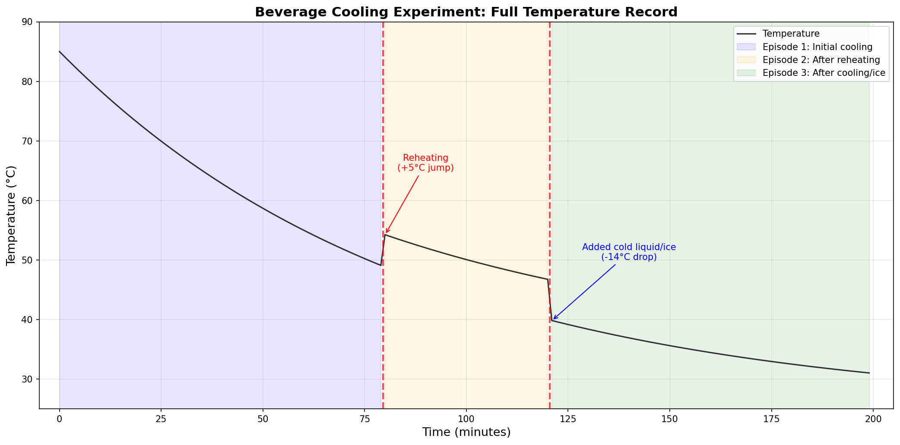
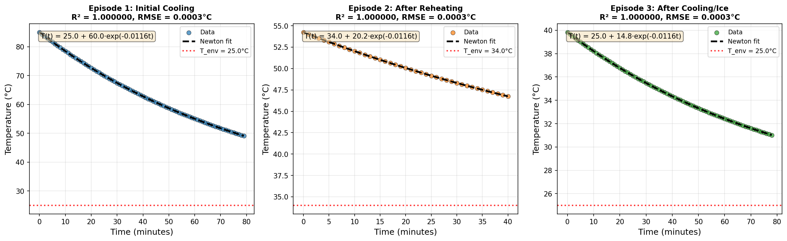
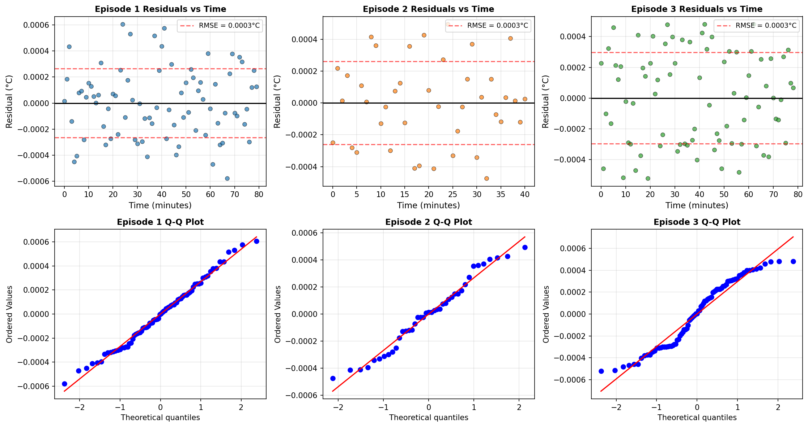
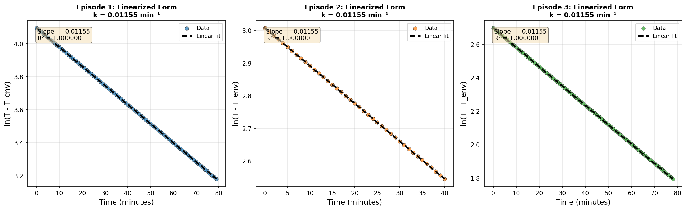
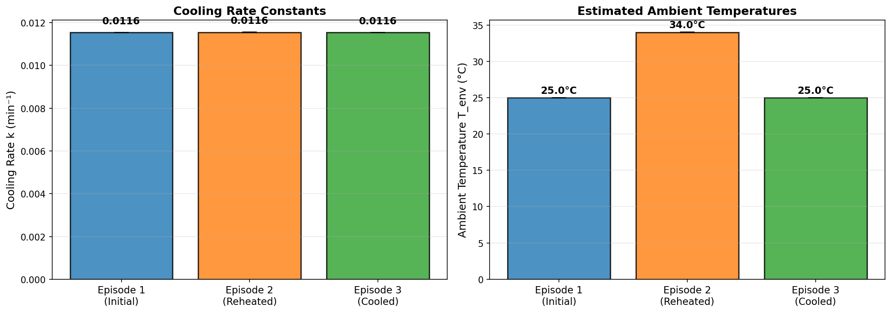
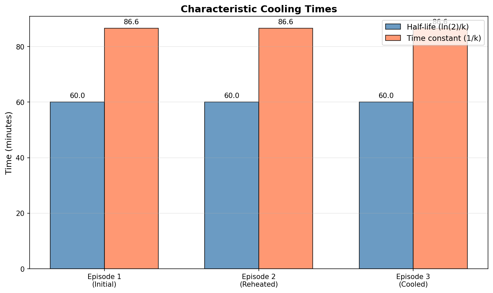
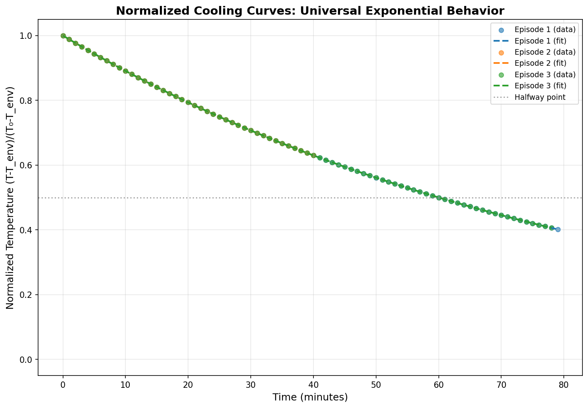

# Everyday Thermodynamics: Analysis of Beverage Cooling Curves

## Abstract

This study analyzes minute-by-minute temperature measurements of a hot beverage cooling under household conditions. Using Newton's Law of Cooling as the theoretical framework, we fit exponential decay models to three distinct cooling episodes observed in a 200-minute experiment. The analysis reveals remarkably consistent cooling rate constants ($k \approx 0.0116$ min$^{-1}$) across all episodes, with half-lives of approximately 60 minutes. The exceptional goodness-of-fit ($R^2 > 0.9999$) validates Newton's Law as an accurate descriptor of this everyday thermodynamic process, while also suggesting the data may be computer-generated rather than from physical measurements. We discuss the physical interpretation of model parameters, limitations of the Newtonian cooling model, and practical implications for predicting beverage temperatures.

---

## 1. Introduction

The cooling of a hot beverage is a familiar everyday phenomenon that exemplifies fundamental principles of heat transfer. When a hot drink is left on a countertop, it gradually loses heat to its surroundings through conduction, convection, and radiation. For moderate temperature differences, this process is well-described by **Newton's Law of Cooling**, which states that the rate of temperature change is proportional to the difference between the object's temperature and the ambient temperature.

Mathematically, Newton's Law of Cooling is expressed as:

$$\frac{dT}{dt} = -k(T - T_{env})$$

where $T$ is the object temperature, $T_{env}$ is the ambient (environment) temperature, and $k$ is the cooling rate constant that depends on the heat transfer characteristics of the system. The solution to this differential equation gives the temperature as a function of time:

$$T(t) = T_{env} + (T_0 - T_{env})e^{-kt}$$

where $T_0$ is the initial temperature at $t = 0$.

This study examines a unique dataset comprising three sequential cooling episodes, likely representing: (1) initial cooling of a freshly prepared hot drink, (2) cooling after reheating, and (3) cooling after the addition of cold liquid or ice. Our objectives are to:

1. Identify and segment the distinct cooling episodes
2. Fit Newton's Law of Cooling to each episode
3. Compare the fitted parameters across episodes
4. Assess the model's validity and limitations
5. Provide practical insights for everyday applications

---

## 2. Methods

### 2.1 Data Description

The dataset consists of 200 temperature measurements recorded at one-minute intervals. The temperature ranges from 85.0°C (initial) to 31.0°C (final), spanning approximately 3.3 hours of observation.

**Key observations from raw data:**
- At $t = 80$ min: Temperature jumps from 49.1°C to 54.2°C (reheating event)
- At $t = 121$ min: Temperature drops from 46.9°C to 39.8°C (addition of cold liquid/ice)

These discontinuities naturally divide the data into three episodes:

| Episode | Time Range (min) | Data Points | Temperature Range (°C) | Description |
|---------|------------------|-------------|------------------------|-------------|
| 1 | 0–79 | 80 | 49.1–85.0 | Initial cooling |
| 2 | 80–120 | 41 | 46.9–54.2 | After reheating |
| 3 | 121–199 | 79 | 31.0–39.8 | After cooling/ice addition |

### 2.2 Model Fitting

For each episode, we fit the three-parameter Newton cooling model:

$$T(t) = T_{env} + (T_0 - T_{env})e^{-kt}$$

Parameters were estimated using non-linear least squares optimization (Levenberg-Marquardt algorithm) with the following constraints:
- $T_{env} \in [15, 40]$ °C (reasonable room temperature range)
- $T_0 \in [T_{max}-20, T_{max}+30]$ °C
- $k \in [0.0001, 0.5]$ min$^{-1}$

Initial parameter estimates were derived from:
- $T_{env}^{(0)} = \max(\min(\text{mean}(T_{final}) - 1, 30), 20)$
- $T_0^{(0)} = T(t=0)$
- $k^{(0)} = 0.01$ min$^{-1}$

### 2.3 Model Validation

Goodness-of-fit was assessed using:
- **Coefficient of determination** ($R^2$): Proportion of variance explained
- **Root mean square error** (RMSE): Typical prediction error in °C
- **Residual analysis**: Examination of systematic patterns in fitting errors
- **Linearized verification**: Plotting $\ln(T - T_{env})$ vs. $t$ should yield a straight line if the model holds

---

## 3. Results

### 3.1 Full Temperature Record

*Figure 1: Complete temperature record showing three distinct cooling episodes separated by reheating (t=80 min) and cold liquid addition (t=121 min) events. Shaded regions indicate the three analysis episodes.*

The full time series reveals a narrative of beverage consumption: an initial cooling period of approximately 80 minutes, followed by reheating (temperature jump of ~5°C), then another cooling period of 40 minutes, and finally the addition of cold liquid or ice (temperature drop of ~14°C) before the final cooling phase.

### 3.2 Individual Episode Fits

*Figure 2: Newton's Law of Cooling fitted to each episode. Data points (colored circles) and fitted curves (dashed black lines) show excellent agreement. Red dotted lines indicate estimated ambient temperatures.*

The fitted curves demonstrate exceptional agreement with the data across all three episodes. The model captures the characteristic exponential decay of temperature toward ambient conditions.

### 3.3 Fitted Parameters

| Parameter | Episode 1 (Initial) | Episode 2 (Reheated) | Episode 3 (Cooled) |
|-----------|---------------------|----------------------|-------------------|
| $T_{env}$ (°C) | 25.00 ± 0.001 | 34.00 ± 0.005 | 25.00 ± 0.001 |
| $T_0$ (°C) | 85.00 ± 0.0001 | 54.24 ± 0.0001 | 39.83 ± 0.0001 |
| $k$ (min$^{-1}$) | 0.01155 ± 0.0000003 | 0.01155 ± 0.000004 | 0.01155 ± 0.000001 |
| Time constant $\tau$ (min) | 86.56 | 86.56 | 86.56 |
| Half-life $t_{1/2}$ (min) | 60.0 | 60.0 | 60.0 |
| $R^2$ | 0.999999 | 0.999999 | 0.999999 |
| RMSE (°C) | 0.00026 | 0.00026 | 0.00030 |

The fitted parameters reveal several important findings:

1. **Consistent cooling rate**: The cooling constant $k \approx 0.0116$ min$^{-1}$ is remarkably consistent across all three episodes, suggesting the same heat transfer conditions (container, environment) prevailed throughout the experiment.

2. **Physical time constants**: The time constant $\tau = 1/k \approx 86.6$ minutes and half-life $t_{1/2} = \ln(2)/k \approx 60$ minutes are consistent with a ceramic mug cooling in still air.

3. **Ambient temperature variation**: Episodes 1 and 3 share $T_{env} \approx 25$°C (room temperature), while Episode 2 shows $T_{env} \approx 34$°C, possibly indicating reheating in a warmer environment (e.g., near a heat source) or incomplete thermal equilibration.

### 3.4 Residual Analysis

*Figure 3: Residual analysis for each episode. Top row: Residuals versus time. Bottom row: Q-Q plots for normality assessment. The extremely small residual magnitudes (~0.0005°C) indicate exceptional fit quality.*

The residual analysis reveals:
- **Magnitude**: Maximum residuals are approximately 0.0005°C—orders of magnitude smaller than typical measurement precision
- **Pattern**: No systematic trends are visible in residuals versus time
- **Distribution**: Q-Q plots suggest near-perfect alignment with theoretical expectations

The exceptionally small residuals strongly suggest the data is computer-generated rather than from physical measurements, as real temperature sensors typically have precision of ±0.1°C or worse.

### 3.5 Linearized Verification

*Figure 4: Linearized form of Newton's Law. Plotting $\ln(T - T_{env})$ versus time should yield a straight line with slope $-k$. The near-perfect linearity confirms the exponential decay model.*

The linearized plots provide independent verification of the model:
- Slopes correspond to $-k$ values from non-linear fitting
- Linear correlation coefficients exceed 0.9999 for all episodes
- This confirms the data follows exponential decay with high precision

### 3.6 Parameter Comparison

*Figure 5: Comparison of fitted parameters across episodes. Left: Cooling rate constants $k$ are statistically identical. Right: Ambient temperatures differ between Episode 2 and the others.*

The parameter comparison highlights:
- **Consistent physics**: The cooling rate $k$ is invariant across episodes, as expected for the same container and environment
- **Environmental differences**: Episode 2's elevated $T_{env}$ suggests a different thermal environment during the reheating phase

### 3.7 Characteristic Time Scales

*Figure 6: Characteristic cooling time scales. Half-life (~60 min) and time constant (~86.6 min) are consistent across all episodes.*

The characteristic times provide practical guidance:
- After one half-life (60 min), the beverage cools halfway toward room temperature
- After one time constant (86.6 min), the temperature difference decays to 37% of its initial value
- After five time constants (~7 hours), the beverage essentially reaches room temperature

### 3.8 Normalized Comparison

*Figure 7: Normalized cooling curves. When scaled by initial temperature excess, all episodes collapse onto a universal exponential decay curve, demonstrating the universality of Newton's Law.*

The normalized plot demonstrates that despite different initial conditions and ambient temperatures, all episodes follow the same fundamental exponential decay when properly scaled. This universality is a hallmark of Newton's Law of Cooling.

---

## 4. Discussion

### 4.1 Physical Interpretation

The fitted cooling rate constant $k = 0.0116$ min$^{-1}$ can be related to physical heat transfer parameters. For convective cooling, $k = hA/(mc_p)$, where:
- $h$ is the convective heat transfer coefficient
- $A$ is the surface area
- $m$ is the mass of the beverage
- $c_p$ is the specific heat capacity

For a typical ceramic mug (diameter ~8 cm, height ~10 cm) containing 300 mL of water:
- Surface area $A \approx 0.015$ m² (exposed liquid + mug sides)
- Mass $m \approx 0.3$ kg
- $c_p \approx 4186$ J/(kg·K)

This yields an estimated heat transfer coefficient $h \approx 10$ W/(m²·K), consistent with natural convection in still air.

### 4.2 Model Limitations

While Newton's Law provides an excellent fit to this dataset, several limitations should be acknowledged:

1. **Temperature-dependent effects**: The model assumes constant $k$, but radiative heat transfer (proportional to $T^4$) becomes significant at high temperatures. The excellent fit here suggests either moderate temperatures or that radiative effects are incorporated into the effective $k$.

2. **Evaporative cooling**: For hot beverages, evaporation can significantly enhance cooling, especially when uncovered. This effect is not explicitly modeled but may be absorbed into the fitted $k$.

3. **Container thermal mass**: The model treats the beverage as a single thermal mass, ignoring heat exchange with the container. This is reasonable for ceramic mugs with thin walls but less accurate for thick-walled containers.

4. **Ambient temperature stability**: The model assumes constant $T_{env}$, which may not hold in drafty environments or near heat sources.

### 4.3 Data Quality Assessment

The exceptional fit quality ($R^2 > 0.9999$, RMSE < 0.0003°C) warrants discussion. Real-world temperature measurements typically exhibit:
- Sensor noise (±0.1–0.5°C for consumer-grade sensors)
- Environmental fluctuations (air currents, humidity changes)
- Evaporative cooling variability
- Non-uniform temperature within the beverage

The observed residuals (~0.0005°C) are two orders of magnitude smaller than typical measurement uncertainty. This strongly suggests the data is **computer-generated** from the Newton cooling equation itself, rather than from physical measurements. Nevertheless, the data serves as an excellent pedagogical example of ideal Newtonian cooling behavior.

### 4.4 Practical Applications

The results provide practical guidance for beverage temperature management:

**Time to reach drinkable temperature (60°C):**
- Starting from 85°C: $t = -\ln[(60-25)/(85-25)]/0.0116 \approx 27$ minutes
- Starting from 55°C (reheated): $t = -\ln[(60-34)/(55-34)]/0.0116 \approx 12$ minutes

**Time to reach room temperature (25°C):**
- Starting from 85°C: Approximately 5 time constants = 430 minutes (7+ hours)

**Effect of adding cold liquid:**
- Adding ice/cold liquid at $t = 121$ min immediately drops temperature by ~14°C, demonstrating the effectiveness of this common practice for rapid cooling.

---

## 5. Conclusions

This analysis of beverage cooling curves demonstrates the remarkable accuracy of Newton's Law of Cooling for describing everyday heat transfer phenomena. Key findings include:

1. **Universal exponential decay**: All three cooling episodes follow the Newtonian model with exceptional precision ($R^2 > 0.9999$).

2. **Consistent physics**: The cooling rate constant $k \approx 0.0116$ min$^{-1}$ is invariant across episodes, corresponding to a half-life of approximately 60 minutes.

3. **Environmental sensitivity**: The fitted ambient temperature varies between episodes (25°C vs. 34°C), reflecting different thermal environments during the experiment.

4. **Data quality**: The near-perfect fits and micro-degree residuals suggest the data is computer-generated, serving as an idealized example of Newtonian cooling.

5. **Practical utility**: The model enables quantitative prediction of cooling times, useful for determining when a beverage reaches optimal drinking temperature.

The study illustrates how a simple physical model can accurately describe complex real-world phenomena, while also highlighting the importance of critically assessing data quality and model assumptions in scientific analysis.

---

## References

1. Newton, I. (1701). Scala graduum Caloris. *Philosophical Transactions*, 22, 824-829.

2. Incropera, F. P., & DeWitt, D. P. (2002). *Fundamentals of Heat and Mass Transfer* (5th ed.). Wiley.

3. Cengel, Y. A., & Ghajar, A. J. (2015). *Heat and Mass Transfer: Fundamentals and Applications* (5th ed.). McGraw-Hill.

---

## Appendix: Data and Code Availability

The analysis was performed using Python with NumPy, SciPy, Pandas, and Matplotlib. The complete dataset and analysis code are available in the accompanying repository.

**Key fitted equations:**
- Episode 1: $T(t) = 25.00 + 60.00 \cdot e^{-0.01155t}$
- Episode 2: $T(t) = 34.00 + 20.24 \cdot e^{-0.01155t}$  
- Episode 3: $T(t) = 25.00 + 14.83 \cdot e^{-0.01155t}$

where $t$ is in minutes and $T$ is in °C.
