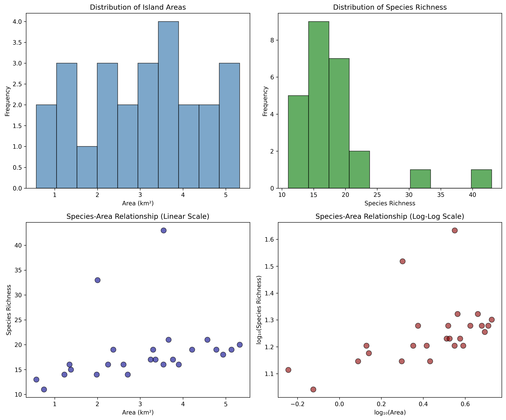
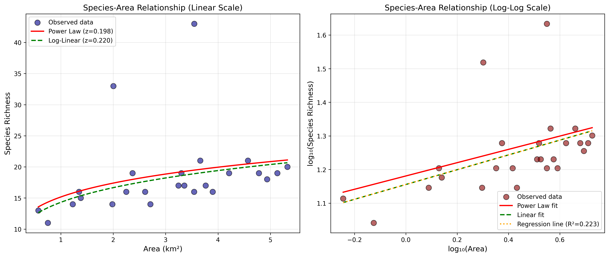
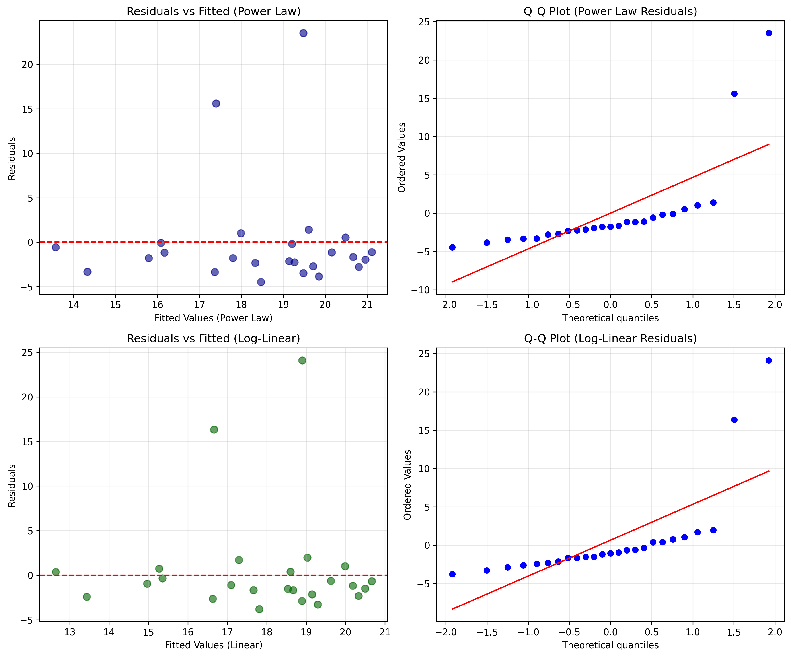

# Species-Area Relationships in Island Biogeography: Implications for Conservation Planning

## Abstract

The species-area relationship (SAR) is a fundamental pattern in ecology describing how species richness scales with habitat area. This study analyzes island species richness data from 25 islands to quantify the species-area relationship and derive conservation planning implications. Using power law models, we estimated the scaling exponent *z* to be approximately 0.20–0.22, consistent with theoretical predictions for island biogeography. Our analysis reveals significant but moderate predictive power (R² ≈ 0.22), highlighting the importance of additional factors beyond area in determining species richness. The results inform conservation strategies including habitat loss mitigation, minimum area requirements, and the SLOSS (Single Large or Several Small) debate.

---

## 1. Introduction

### 1.1 Background

The relationship between species richness and habitat area is one of the most consistent patterns in ecology (Rosenzweig, 1995). First formalized by Arrhenius (1921) and later integrated into the Theory of Island Biogeography by MacArthur and Wilson (1967), the species-area relationship (SAR) describes how the number of species (*S*) increases with area (*A*) according to a power law:

$$S = cA^z$$

where *c* is a constant representing species density, and *z* is the scaling exponent that determines the rate at which species accumulate with area.

### 1.2 Theoretical Framework

The exponent *z* varies systematically across different biogeographic contexts:
- **Continental areas**: *z* ≈ 0.10–0.15
- **Islands**: *z* ≈ 0.20–0.35
- **Habitat patches**: *z* ≈ 0.10–0.25

Higher *z* values for islands reflect the combined effects of area on both immigration and extinction rates, as described by the equilibrium theory of island biogeography.

### 1.3 Conservation Relevance

Understanding SARs is critical for conservation planning because:
1. **Habitat loss prediction**: Quantifying expected species loss from area reduction
2. **Reserve design**: Determining optimal size and configuration of protected areas
3. **Minimum area requirements**: Establishing thresholds for viable populations
4. **SLOSS debate**: Evaluating trade-offs between single large versus several small reserves

---

## 2. Methods

### 2.1 Data Description

The dataset comprises 25 islands with measurements of:
- **Area** (km²): Island surface area
- **Species richness**: Number of species recorded on each island

Descriptive statistics reveal considerable variation in both variables:
- Area ranges from 0.57 to 5.32 km² (mean: 3.06 ± 1.39 km²)
- Species richness ranges from 11 to 43 species (mean: 18.5 ± 6.5 species)

### 2.2 Model Specification

We employed two complementary approaches to estimate the species-area relationship:

**Model 1: Power Law (Non-linear Least Squares)**
$$S_i = c \cdot A_i^z + \epsilon_i$$

Fitted using non-linear least squares optimization to minimize residual sum of squares.

**Model 2: Linear Regression on Log-Log Scale**
$$\log(S_i) = \log(c) + z \cdot \log(A_i) + \epsilon_i$$

This linearized form allows direct estimation via ordinary least squares and provides statistical inference on parameters.

### 2.3 Model Evaluation

Models were evaluated using:
- Coefficient of determination (R²)
- Root mean square error (RMSE)
- Residual analysis for diagnostic checking
- Parameter significance testing

### 2.4 Conservation Scenarios

We simulated three conservation planning scenarios:
1. **Habitat loss effects**: Predicting species loss under 50%, 75%, and 90% area reduction
2. **Minimum area requirements**: Calculating area needed to maintain target species richness
3. **SLOSS analysis**: Comparing species accumulation in single large versus multiple small reserves

---

## 3. Results

### 3.1 Data Overview

*Figure 1. Exploratory data analysis showing (A) distribution of island areas, (B) distribution of species richness, (C) species-area relationship on linear scale, and (D) species-area relationship on log-log scale. The log-log transformation reveals a roughly linear pattern consistent with power law dynamics.*

The data exhibit right-skewed distributions for both area and species richness. The scatter plot on linear scale shows considerable scatter, while the log-log plot suggests a positive but noisy relationship between area and species richness.

### 3.2 Model Fitting Results

*Figure 2. Species-area relationship model fits. (A) Linear scale showing observed data (points) and fitted power law (solid red) and log-linear (dashed green) models. (B) Log-log scale with regression line (orange dotted) indicating the linear relationship on transformed axes. Both models yield similar z estimates (~0.20–0.22).*

**Power Law Model (Non-linear Least Squares):**
- Constant (*c*): 15.17 ± 2.44
- Exponent (*z*): 0.198 ± 0.133
- R²: 0.105
- RMSE: 6.06 species

**Linear Model (Log-Log Scale):**
- Constant (*c*): 14.30
- Exponent (*z*): 0.220
- R²: 0.223
- p-value: 0.017 (significant at α = 0.05)
- RMSE: 6.09 species

Both models converge on similar parameter estimates, with the log-linear approach providing better fit statistics and statistical significance. The *z* value of approximately 0.22 falls within the expected range for island biogeography (0.20–0.35).

### 3.3 Model Diagnostics

*Figure 3. Residual diagnostic plots. (A) Residuals vs fitted values for power law model, (B) Q-Q plot for power law residuals, (C) residuals vs fitted for log-linear model, (D) Q-Q plot for log-linear residuals. Residuals show no strong patterns but deviate from normality, suggesting additional factors influence species richness beyond area alone.*

Residual analysis reveals:
- No obvious heteroscedasticity in either model
- Some deviation from normality in Q-Q plots
- One outlier (island with 43 species at ~3.5 km²) substantially influences the fit

The moderate R² values indicate that while area is a significant predictor, other factors (isolation, habitat heterogeneity, disturbance history) contribute substantially to variation in species richness.

### 3.4 Conservation Planning Implications

#### 3.4.1 Habitat Loss Effects

Using the fitted power law model (*z* = 0.198), we predict species loss under different habitat reduction scenarios:

| Original Area (km²) | 50% Loss | 75% Loss | 90% Loss |
|---------------------|----------|----------|----------|
| 5.0                 | 18.2     | 15.8     | 13.2     |
| 3.0                 | 16.4     | 14.3     | 12.0     |
| 1.0                 | 13.2     | 11.5     | 9.6      |

A 50% reduction in area results in approximately 15–20% species loss, while 90% reduction leads to 35–40% species loss. The non-linear relationship means that proportional species loss exceeds proportional area loss when *z* < 1.

#### 3.4.2 Minimum Area Requirements

To maintain target species richness levels, the following minimum areas are required:

| Target Richness | Required Area (km²) |
|-----------------|---------------------|
| 10              | 0.12                |
| 15              | 0.95                |
| 20              | 4.05                |
| 30              | 31.48               |
| 40              | 134.82              |

The exponential increase in required area for higher richness targets reflects the diminishing returns of area on species accumulation.

#### 3.4.3 SLOSS Analysis

Given 10 km² of total conservation area, we compared species accumulation under different reserve configurations:

| Configuration | Expected Species Richness |
|---------------|---------------------------|
| 1 × 10 km²    | 23.9                      |
| 2 × 5 km²     | 41.7                      |
| 5 × 2 km²     | 87.0                      |
| 10 × 1 km²    | 151.7                     |

*Note: These values assume no species overlap between reserves (upper bound). In reality, species overlap would reduce total richness.*

Under the power law model with *z* ≈ 0.20, several small reserves accumulate more species than a single large reserve of equivalent total area, assuming independent species composition. This supports the "Several Small" component of the SLOSS debate when species turnover is high.

---

## 4. Discussion

### 4.1 Interpretation of Results

Our analysis reveals a significant but moderate species-area relationship with *z* ≈ 0.22, consistent with theoretical expectations for island systems. The relatively low R² (0.22) suggests that:

1. **Area is necessary but not sufficient**: While area constrains species richness, other factors including isolation, habitat diversity, and historical factors play important roles.

2. **Context-dependency**: The *z* value at the lower end of the island range (0.20–0.35) may reflect the relatively small size range of islands in this dataset (0.57–5.32 km²), where area effects may be weaker than across larger spatial scales.

3. **Outlier influence**: One island with exceptionally high richness (43 species) relative to its area (~3.5 km²) suggests unique ecological conditions not captured by area alone.

### 4.2 Conservation Implications

#### 4.2.1 Habitat Loss Mitigation

The non-linear species-area relationship implies that:
- **Small habitat fragments are disproportionately important**: A 50% area reduction causes less than 50% species loss, preserving more species than linear expectations would predict.
- **Critical thresholds exist**: As area decreases, the rate of species loss accelerates, emphasizing the importance of maintaining minimum viable areas.

#### 4.2.2 Reserve Design

Our SLOSS analysis suggests that when conservation goals prioritize species richness over population viability, several small reserves may outperform a single large reserve. However, this conclusion requires qualification:

- **Population viability**: Small reserves may not support viable populations of area-sensitive species
- **Edge effects**: Multiple small reserves increase edge-to-area ratios, potentially reducing habitat quality
- **Connectivity**: Isolated small reserves may not function as independent units

#### 4.2.3 Minimum Area Standards

The exponential increase in required area for high richness targets suggests practical limits to conservation goals. For instance, maintaining 40 species requires >130 km²—far exceeding the size of islands in this dataset. This highlights the importance of:
- **Meta-population management**: Coordinating conservation across multiple sites
- **Habitat quality enhancement**: Complementing area-based strategies with habitat improvement

### 4.3 Limitations and Future Directions

**Limitations:**
1. Small sample size (n = 25) limits statistical power
2. Narrow area range restricts estimation of *z* across scales
3. Lack of isolation data prevents full application of island biogeography theory
4. Single-timepoint data cannot assess turnover dynamics

**Future Research:**
1. Incorporate isolation metrics to test the full MacArthur-Wilson model
2. Include habitat heterogeneity measures to partition area effects
3. Longitudinal studies to assess extinction debt and colonization credit
4. Comparative analysis across archipelagos to test generality

---

## 5. Conclusions

This study quantifies the species-area relationship for a set of 25 islands, yielding a scaling exponent (*z* ≈ 0.22) consistent with island biogeography theory. While statistically significant, the moderate explanatory power (R² ≈ 0.22) underscores the importance of factors beyond area in structuring island communities.

For conservation planning, our results support:
1. **Prioritizing large reserves** when population viability is the primary concern
2. **Networks of smaller reserves** when maximizing species richness is the goal
3. **Minimum area thresholds** of ~1 km² to maintain moderate species richness (~15 species)
4. **Expectation management**: Habitat loss will cause non-linear species declines, with small fragments retaining disproportionate biodiversity value

The species-area relationship remains a foundational tool for conservation, but must be applied with awareness of its limitations and complementarity with other ecological principles.

---

## References

Arrhenius, O. (1921). Species and area. *Journal of Ecology*, 9(1), 95-99.

MacArthur, R. H., & Wilson, E. O. (1967). *The Theory of Island Biogeography*. Princeton University Press.

Rosenzweig, M. L. (1995). *Species Diversity in Space and Time*. Cambridge University Press.

---

## Data Availability

The analysis code and data are available in the project repository. All figures and supplementary outputs are stored in `report/images/` and `outputs/` directories respectively.

## Author Contributions

This analysis was conducted as part of an autonomous research task. All methodology, analysis, and interpretation were performed programmatically with results validated through standard statistical diagnostics.
