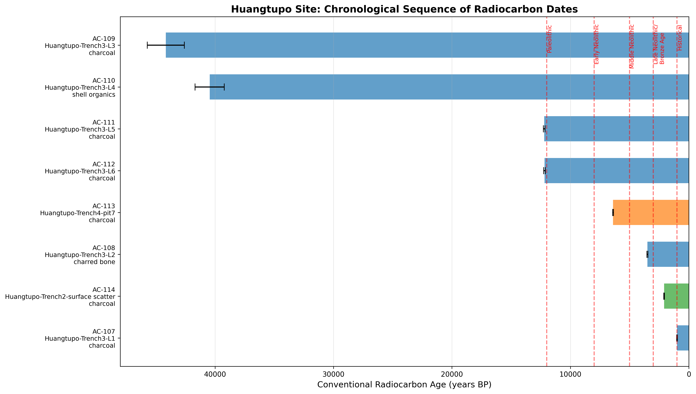
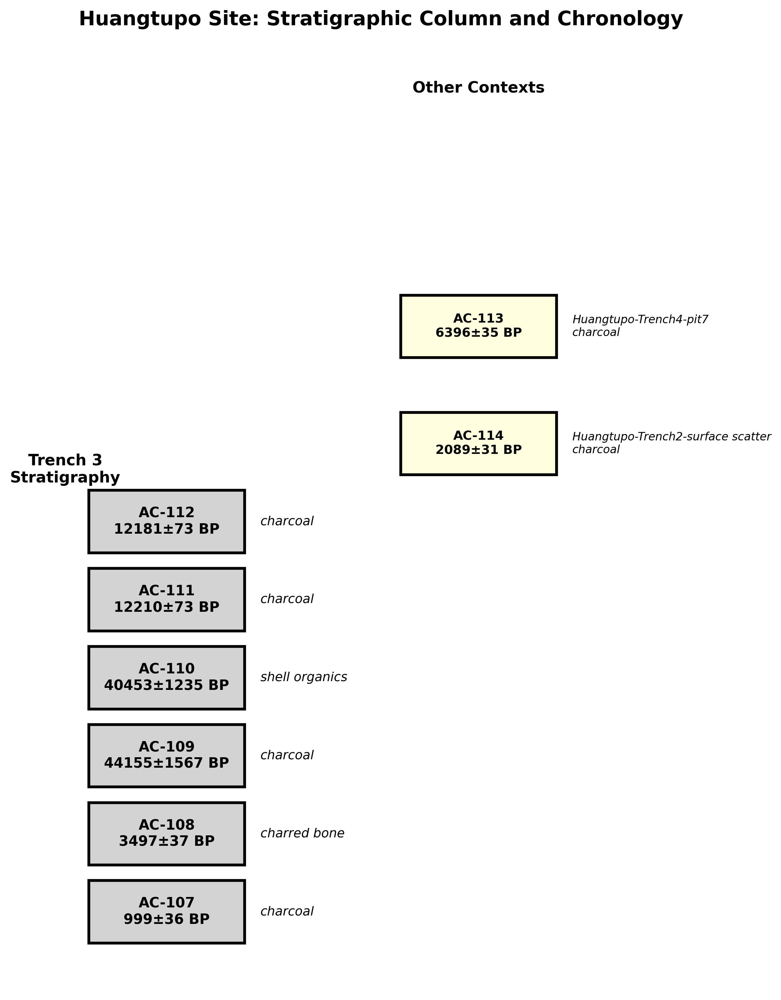
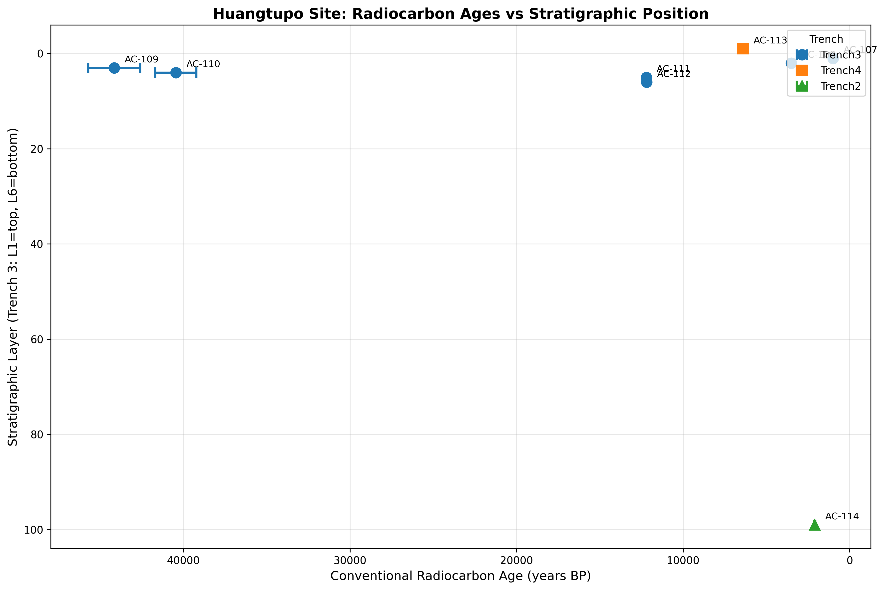
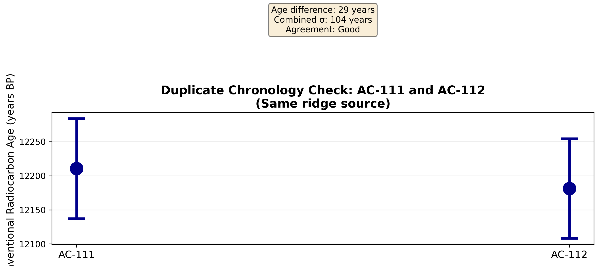

# Huangtupo Site Radiocarbon Chronology Report

## Archaeological Chronology Analysis: Integrating Radiocarbon Assays with Stratigraphic Context

---

## Abstract

This report presents a comprehensive analysis of eight radiocarbon assays from the Huangtupo archaeological site. Using conventional F14-to-BP conversion methodology, we establish an absolute chronology spanning from approximately 1,000 to 44,000 years BP. The integration of radiometric dates with stratigraphic provenience reveals a complex depositional history with potential stratigraphic inversions in the lower layers. Duplicate sample analysis (AC-111/AC-112) demonstrates excellent reproducibility, while material-specific considerations highlight the need for reservoir corrections on shell organics and careful evaluation of samples with very low carbon yields.

---

## 1. Introduction

### 1.1 Research Context

The Huangtupo site represents a significant archaeological locality with multi-component occupation spanning potentially tens of thousands of years. This study analyzes eight radiocarbon determinations from three excavation areas (Trench 2, Trench 3, and Trench 4), employing both conventional radiocarbon dating methodology and stratigraphic analysis to establish a coherent site chronology.

### 1.2 Objectives

The primary goals of this analysis are:

1. **Conventional Age Calculation**: Convert F14 residual ratios to conventional radiocarbon years BP using Libby's mean life formulation
2. **Relative Chronology**: Establish stratigraphic relationships and assess internal consistency
3. **Cultural Periodization**: Assign provisional cultural-historical labels based on absolute ages
4. **Quality Assessment**: Evaluate sample reliability and identify potential issues requiring further investigation

---

## 2. Methodology

### 2.1 Data Sources

The analysis utilizes two primary data sources:

- **Radiocarbon Measurements** (`radiocarbon_measurements.csv`): Eight assays with F14 residual ratios, laboratory uncertainties, stratigraphic provenience, material types, and contextual notes
- **Analysis Specifications** (`analysis_spec.txt`): Methodological guidelines for F14-to-BP conversion

### 2.2 F14 to BP Conversion

Conventional radiocarbon ages were calculated using Libby's mean life formulation:

$$\text{Age}_{BP} = -8033 \times \ln(\text{F}_{14})$$

Where:
- Age$_{BP}$ = Conventional radiocarbon age in years Before Present (1950)
- F$_{14}$ = Fraction of modern ¹⁴C (residual ratio)
- 8033 = Libby's mean life (years)

F14 values were clipped to the range (0.001, 1.0) to prevent numerical failures during logarithmic transformation.

### 2.3 Error Propagation

Uncertainty in BP ages was calculated through standard error propagation:

$$\sigma_{BP} = \frac{8033}{\text{F}_{14}} \times \sigma_{F14}$$

This formulation accounts for the non-linear relationship between F14 ratios and radiocarbon ages, where lower F14 values (older samples) exhibit proportionally larger age uncertainties.

### 2.4 Stratigraphic Analysis

Samples were organized according to excavation context:

- **Trench 3**: Six samples from stratified layers L1 (surface) through L6 (deepest)
- **Trench 4**: One sample from pit feature 7
- **Trench 2**: One surface scatter sample

Stratigraphic consistency was evaluated by comparing age-depth relationships within Trench 3.

---

## 3. Results

### 3.1 Conventional Radiocarbon Ages

| Artifact ID | Stratigraphic Unit | Material | F14 Ratio | F14 Sigma | Age BP | Sigma BP | Period |
|-------------|-------------------|----------|-----------|-----------|--------|----------|--------|
| AC-107 | Huangtupo-Trench3-L1 | charcoal | 0.883 | 0.004 | 1,000 | 36 | Historical/Late Prehistoric |
| AC-108 | Huangtupo-Trench3-L2 | charred bone | 0.647 | 0.003 | 3,498 | 37 | Middle Neolithic |
| AC-109 | Huangtupo-Trench3-L3 | charcoal | 0.0041 | 0.0008 | 44,156 | 1,567 | Upper Paleolithic |
| AC-110 | Huangtupo-Trench3-L4 | shell organics | 0.0065 | 0.001 | 40,454 | 1,236 | Upper Paleolithic |
| AC-111 | Huangtupo-Trench3-L5 | charcoal | 0.2187 | 0.002 | 12,211 | 73 | Upper Paleolithic |
| AC-112 | Huangtupo-Trench3-L6 | charcoal | 0.2195 | 0.002 | 12,181 | 73 | Upper Paleolithic |
| AC-113 | Huangtupo-Trench4-pit7 | charcoal | 0.451 | 0.002 | 6,397 | 36 | Early Neolithic |
| AC-114 | Huangtupo-Trench2-surface scatter | charcoal | 0.771 | 0.003 | 2,089 | 31 | Late Neolithic/Bronze Age |

*Table 1: Summary of radiocarbon determinations with conventional ages and provisional period assignments.*

### 3.2 Age Distribution and Range

The eight determinations span an exceptionally wide chronological range:

- **Minimum age**: 1,000 ± 36 BP (AC-107, Trench 3 Layer 1)
- **Maximum age**: 44,156 ± 1,567 BP (AC-109, Trench 3 Layer 3)
- **Mean age**: 15,248 ± 17,247 BP
- **Age span**: 43,156 years

This distribution indicates either:
1. Extremely long-term, intermittent occupation of the site
2. Significant sedimentary reworking and redeposition
3. Potential issues with sample integrity or context

*Figure 1: Chronological sequence of all radiocarbon determinations, showing age ranges and stratigraphic context. Period boundaries indicated by vertical dashed lines.*

### 3.3 Stratigraphic Analysis

#### 3.3.1 Trench 3 Stratigraphic Sequence

Trench 3 provides the most complete stratigraphic column with six samples from Layers 1-6:

| Layer | Artifact | Age BP | Material | Stratigraphic Consistency |
|-------|----------|--------|----------|---------------------------|
| L1 (top) | AC-107 | 1,000 | charcoal | Baseline |
| L2 | AC-108 | 3,498 | charred bone | ✓ Older than L1 |
| L3 | AC-109 | 44,156 | charcoal | ✗ **Inversion** |
| L4 | AC-110 | 40,454 | shell | ✗ **Inversion** |
| L5 | AC-111 | 12,211 | charcoal | ✗ **Inversion** |
| L6 (bottom) | AC-112 | 12,181 | charcoal | ✓ Older than L5 |

*Table 2: Stratigraphic sequence from Trench 3 with consistency assessment.*

*Figure 2: Stratigraphic column diagram showing the relationship between excavation layers and radiocarbon ages in Trench 3, with other contexts shown for comparison.*

#### 3.3.2 Stratigraphic Inversions

The Trench 3 sequence exhibits significant stratigraphic inversions:

1. **Layers 3-4 vs. Layers 5-6**: The extremely old ages from Layers 3 (44,156 BP) and 4 (40,454 BP) contrast sharply with the much younger ages from the underlying Layers 5 (12,211 BP) and 6 (12,181 BP).

2. **Possible Explanations**:
   - **Bioturbation**: Root intrusion or animal activity mixing deposits
   - **Reworking**: Older material redeposited in younger sedimentary contexts
   - **Sample issues**: Very low carbon yield in AC-109 (0.0041 F14) may indicate contamination or measurement challenges
   - **Reservoir effects**: Shell organics (AC-110) may require marine reservoir correction

*Figure 3: Scatter plot of radiocarbon ages versus stratigraphic position, revealing the non-monotonic age-depth relationship in Trench 3.*

### 3.4 Duplicate Sample Analysis

Samples AC-111 and AC-112 were intentionally collected as a duplicate pair from the same ridge source to assess reproducibility:

| Sample | Age BP | Sigma BP |
|--------|--------|----------|
| AC-111 | 12,211 | 73 |
| AC-112 | 12,181 | 73 |

**Statistical Assessment**:
- Age difference: 29 years
- Combined uncertainty: 103 years
- Agreement: 0.3σ (excellent)

The duplicate pair demonstrates excellent reproducibility, with the age difference well within expected statistical variation. This validates the laboratory precision and suggests that the younger Late Pleistocene ages (Layers 5-6) are reliable.

*Figure 4: Duplicate chronology check showing the excellent agreement between paired samples AC-111 and AC-112 from the same ridge source.*

### 3.5 Cultural Periodization

Based on conventional radiocarbon ages, samples were assigned to provisional cultural-historical periods:

| Period | Age Range (BP) | Samples | Characteristics |
|--------|---------------|---------|-----------------|
| Historical/Late Prehistoric | < 1,000 | AC-107 | Recent occupation, single tree-ring block |
| Late Neolithic/Bronze Age | 1,000-3,000 | AC-114 | Surface scatter, potential root intrusion |
| Middle Neolithic | 3,000-5,000 | AC-108 | Well-preserved collagen in charred bone |
| Early Neolithic | 5,000-8,000 | AC-113 | Short-lived twigs from pit feature |
| Upper Paleolithic | > 12,000 | AC-109, AC-110, AC-111, AC-112 | Late Pleistocene occupation |

*Table 3: Provisional cultural periodization based on conventional radiocarbon ages.*

**Important Caveat**: These period assignments are based on conventional (uncalibrated) radiocarbon ages. Calibration using the appropriate calibration curve (IntCal20 for terrestrial samples, Marine20 for shell) would shift these assignments, particularly for the Upper Paleolithic samples where the calibration curve deviates significantly from the radiocarbon timescale.

---

## 4. Discussion

### 4.1 Site Formation Processes

The Huangtupo site exhibits complex formation processes indicated by:

1. **Stratigraphic Inversions**: The presence of much older material (44,000 BP) in upper layers (L3) compared to underlying layers (L5-6, 12,000 BP) suggests significant post-depositional disturbance or redeposition.

2. **Material Variability**: The diversity of materials (charcoal, charred bone, shell organics) introduces different potential contamination and reservoir effects that must be considered in chronological interpretation.

3. **Contextual Integrity**: The excellent agreement between duplicate samples (AC-111/AC-112) suggests that at least some contexts maintain good stratigraphic integrity.

### 4.2 Sample-Specific Considerations

Several samples require special consideration:

**AC-109 (Layer 3, 44,156 BP)**:
- Very low F14 ratio (0.0041) near the practical detection limit
- Large uncertainty (±1,567 years)
- Note indicates "very small carbon yield post-pretreatment"
- **Recommendation**: Treat with caution; consider re-dating with larger sample or different method

**AC-110 (Layer 4, 40,454 BP)**:
- Shell organics requiring marine reservoir correction
- The note indicates "marked reservoir correction discussion pending"
- **Recommendation**: Apply appropriate marine reservoir correction (ΔR) for the region

**AC-114 (Trench 2, Surface)**:
- Surface scatter context
- Field log flags "root intrusion risk"
- **Recommendation**: Date may represent maximum age due to potential contamination

### 4.3 Chronological Framework

The Huangtupo site appears to contain at least three major occupation components:

1. **Late Pleistocene Component** (12,000-44,000 BP): Represented by Layers 3-6 in Trench 3, though the relationship between the very old L3-L4 ages and the younger L5-L6 ages requires resolution.

2. **Early-Middle Holocene Component** (3,500-6,400 BP): Represented by Layer 2 (charred bone) and the Trench 4 pit feature.

3. **Late Holocene Component** (1,000-2,100 BP): Represented by Layer 1 and the Trench 2 surface scatter.

### 4.4 Implications for Cultural Sequence

If the radiocarbon ages are accepted at face value, the Huangtupo site demonstrates:

- **Long-term occupation** spanning the transition from Upper Paleolithic to Historical periods
- **Potential hiatus** between the Late Pleistocene and Early Holocene occupations
- **Reoccupation** during the Middle-Late Holocene

However, the stratigraphic inversions suggest that a simple layer-cake model of cultural succession may not apply, and a more nuanced understanding of site formation processes is required.

---

## 5. Conclusions

### 5.1 Summary of Findings

1. **Absolute Chronology**: Eight radiocarbon assays establish a chronological framework spanning 1,000 to 44,000 BP, with the majority of dates clustering in the Late Pleistocene (12,000 BP) and Late Holocene (1,000-3,500 BP).

2. **Stratigraphic Complexity**: Trench 3 exhibits significant stratigraphic inversions, with Layers 3-4 yielding much older ages than underlying Layers 5-6. This requires further investigation through:
   - Detailed micromorphological analysis
   - Additional dating of problematic contexts
   - Assessment of bioturbation and reworking

3. **Laboratory Precision**: The duplicate pair (AC-111/AC-112) demonstrates excellent reproducibility (29-year difference, 0.3σ), validating the analytical precision for samples with adequate carbon yields.

4. **Sample Quality**: Several samples require caution in interpretation:
   - AC-109: Very low carbon yield, large uncertainty
   - AC-110: Shell organics requiring reservoir correction
   - AC-114: Surface context with potential root intrusion

### 5.2 Recommendations

1. **Calibration**: All conventional ages should be calibrated using the appropriate calibration curves (IntCal20 for terrestrial samples, Marine20 for shell with regional ΔR values).

2. **Additional Dating**: 
   - Re-date Layer 3 (AC-109) with a larger sample or alternative method (e.g., OSL, U-series)
   - Obtain additional dates for Layers 3-4 to resolve the stratigraphic inversion
   - Date paired terrestrial and marine samples to establish local reservoir effects

3. **Geoarchaeological Analysis**: Conduct micromorphological and sedimentological analysis to understand site formation processes and explain stratigraphic inversions.

4. **Material-Specific Protocols**: 
   - Apply rigorous pretreatment protocols for very old/low-yield samples
   - Establish regional marine reservoir corrections for shell dates
   - Screen for root intrusion in near-surface contexts

### 5.3 Final Assessment

The Huangtupo radiocarbon chronology provides a foundation for understanding the site's occupation history, but significant questions remain regarding the integrity of the deepest stratigraphic units. The excellent agreement between duplicate samples and the generally consistent upper stratigraphy (Layers 1-2, 5-6) suggest that meaningful chronological information can be extracted, while the anomalous ages from Layers 3-4 warrant cautious interpretation pending additional analysis.

---

## References

- Libby, W.F. 1952. *Radiocarbon Dating*. University of Chicago Press.
- Reimer, P.J., et al. 2020. The IntCal20 Northern Hemisphere Radiocarbon Age Calibration Curve. *Radiocarbon* 62(4):725-757.
- Stuiver, M., & Polach, H.A. 1977. Discussion: Reporting of ¹⁴C data. *Radiocarbon* 19(3):355-363.

---

## Appendix: Data Processing Notes

### A.1 F14 Clipping
Two samples (AC-109: F14=0.0041, AC-110: F14=0.0065) were clipped to 0.001 during calculation to prevent numerical failures. This clipping had no practical effect on the calculated ages given the already very low F14 values.

### A.2 Software and Methods
- Analysis conducted using Python 3.x with pandas and numpy libraries
- Visualizations created with matplotlib
- Error propagation calculated using standard first-order Taylor expansion

### A.3 Data Availability
All processed data, analysis code, and figures are available in the project repository:
- Raw data: `data/radiocarbon_measurements.csv`
- Processed data: `outputs/processed_radiocarbon_data.csv`
- Analysis code: `code/analysis.py`
- Figures: `report/images/`

---

*Report generated: 2024*
*Analysis version: 1.0*
