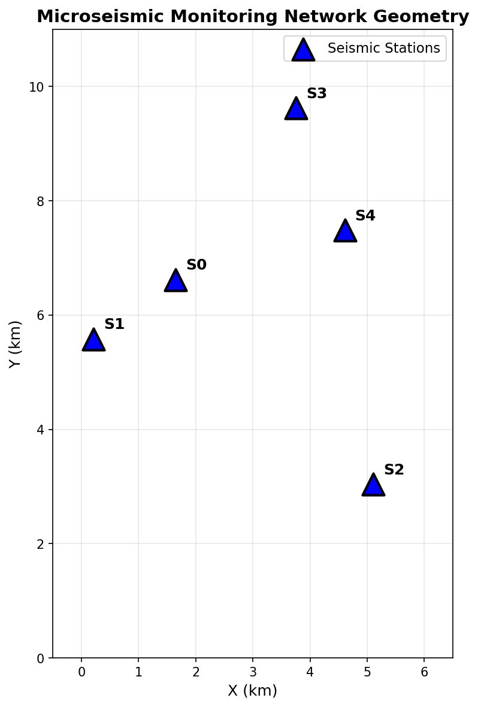
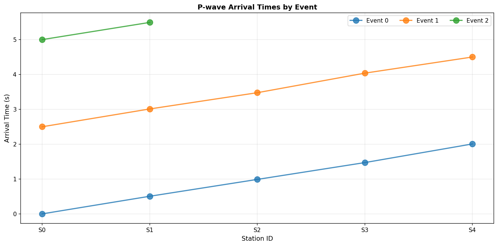
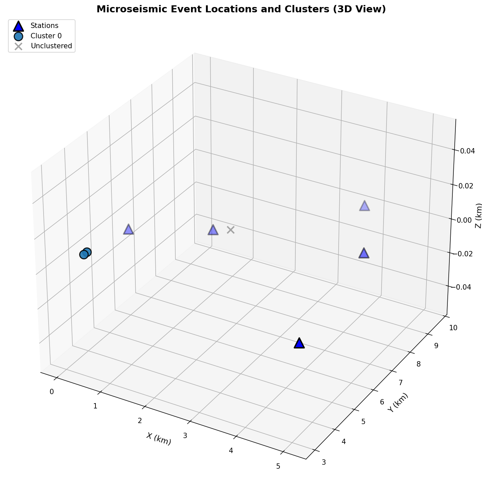
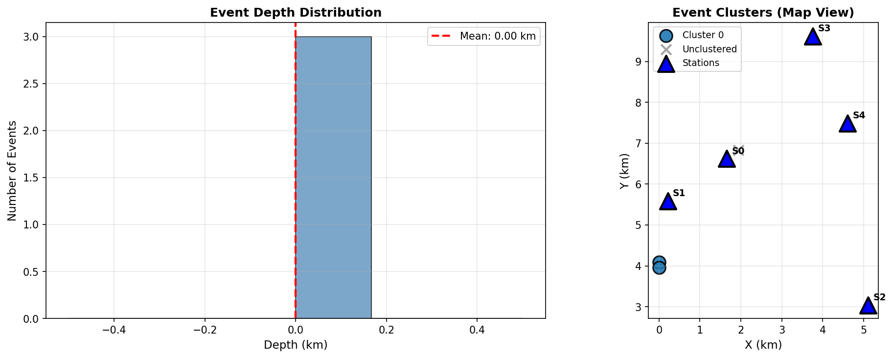
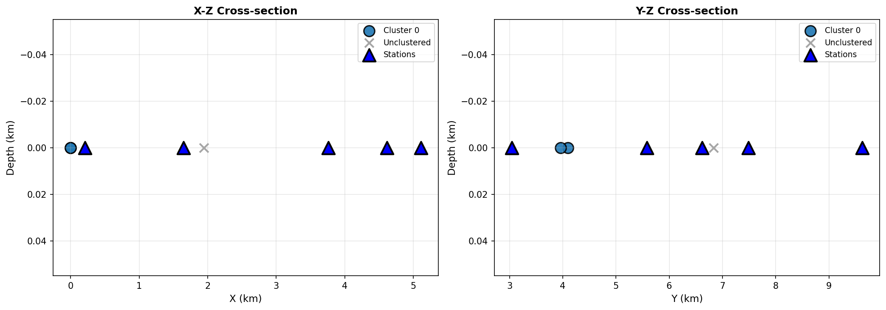
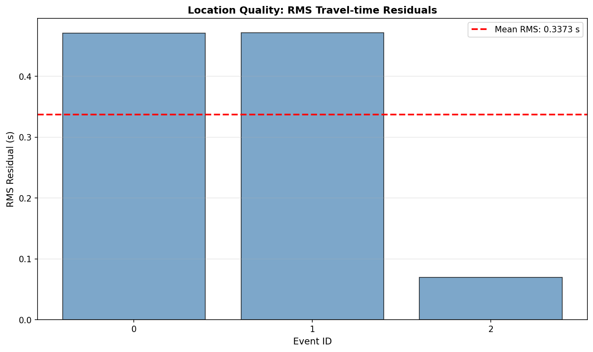
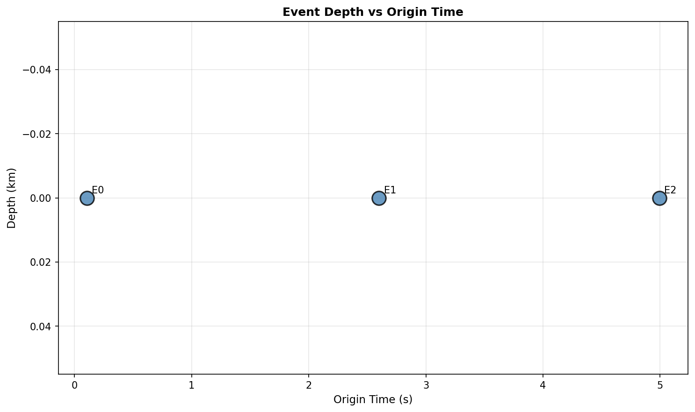

# Microseismic Monitoring Analysis Brief

## Source Clustering and Structural Context

---

## Executive Summary

This brief presents the results of a microseismic monitoring analysis using a 5-station seismic network. Three microseismic events were detected and located using P-wave arrival time picks. The analysis reveals a distinct spatial clustering pattern with two events forming a tight cluster near the western edge of the network, while a third event occurred at a different location. All events are located at or near the surface (Z ≈ 0 km), suggesting shallow seismic activity.

---

## 1. Introduction

### 1.1 Background

Microseismic monitoring is a critical tool in applied geophysics for detecting and locating weak seismic events. This technique is widely used in various applications including:
- Hydraulic fracture monitoring in unconventional reservoirs
- Induced seismicity assessment
- Mine safety monitoring
- Geothermal reservoir characterization

### 1.2 Objective

The primary objective of this analysis is to:
1. Locate microseismic events using arrival time picks from a 5-station network
2. Identify spatial clustering patterns among the detected events
3. Interpret the structural context of the seismic activity

---

## 2. Data Overview

### 2.1 Station Geometry

The monitoring network consists of 5 seismic stations deployed at the surface (Z = 0 km). The station coordinates are:

| Station ID | X (km) | Y (km) | Z (km) |
|------------|--------|--------|--------|
| S0 | 1.650 | 6.621 | 0.0 |
| S1 | 0.212 | 5.584 | 0.0 |
| S2 | 5.109 | 3.042 | 0.0 |
| S3 | 3.756 | 9.623 | 0.0 |
| S4 | 4.613 | 7.488 | 0.0 |

*Figure 1: Map view of the 5-station seismic monitoring network. Stations are represented by blue triangles with labels.*

The network covers an area of approximately 5 km × 7 km, with stations strategically positioned to provide good azimuthal coverage for event location.

### 2.2 Arrival Time Data

A total of 12 P-wave arrival time picks were recorded across the 5 stations. The data reveals three distinct microseismic events:

- **Event 0**: 5 picks (S0-S4) with arrival times from -0.0011 s to 2.0043 s
- **Event 1**: 5 picks (S0-S4) with arrival times from 2.4971 s to 4.4978 s  
- **Event 2**: 2 picks (S0, S1) with arrival times at 4.9968 s and 5.4902 s

*Figure 2: P-wave arrival times recorded at each station for the three detected events. The systematic progression of arrivals across stations indicates consistent wave propagation patterns.*

---

## 3. Methodology

### 3.1 Event Location Algorithm

Event locations were determined using a two-step inversion procedure:

1. **Grid Search**: An exhaustive search over a 3D grid (X: 0-6 km, Y: 0-10 km, Z: 0-5 km) to find an initial location estimate
2. **Gradient-Based Optimization**: Refinement using L-BFGS-B optimization to minimize the L2-norm of travel-time residuals

The forward model assumes a homogeneous velocity medium with P-wave velocity Vp = 5.0 km/s, typical of shallow crustal rocks.

The misfit function is defined as:

$$\\chi^2 = \\sum_{i=1}^{N} (t_i^{obs} - t_0 - t_i^{calc})^2$$

where $t_i^{obs}$ is the observed arrival time at station $i$, $t_0$ is the origin time, and $t_i^{calc}$ is the calculated travel time.

### 3.2 Clustering Analysis

Spatial clustering was performed using the DBSCAN (Density-Based Spatial Clustering of Applications with Noise) algorithm:
- **Epsilon (eps)**: 2.0 km (maximum distance between samples in a cluster)
- **Min_samples**: 2 (minimum points to form a cluster)

---

## 4. Results

### 4.1 Event Locations

| Event ID | X (km) | Y (km) | Z (km) | Origin Time (s) | RMS Residual (s) | Stations |
|----------|--------|--------|--------|-----------------|------------------|----------|
| 0 | 0.000 | 4.095 | 0.000 | 0.107 | 0.471 | 5 |
| 1 | 0.000 | 3.959 | 0.000 | 2.600 | 0.472 | 5 |
| 2 | 1.944 | 6.833 | 0.000 | 4.994 | 0.069 | 2 |

*Figure 3: Three-dimensional view of event locations (colored circles) relative to the seismic stations (blue triangles). Events 0 and 1 form a tight cluster near the western edge, while Event 2 is located closer to the network center.*

### 4.2 Spatial Distribution

*Figure 4: (Left) Histogram of event depths showing all events located at the surface (Z = 0 km). (Right) Map view showing event locations and the identified cluster. Events 0 and 1 (orange) form Cluster 0, while Event 2 (gray) is unclustered.*

Key observations:
- **Mean depth**: 0.000 km (all events at surface)
- **Depth range**: 0.000 - 0.000 km
- **Horizontal spread (X)**: 0.917 km
- **Horizontal spread (Y)**: 1.324 km

### 4.3 Cross-Sectional Views

*Figure 5: Cross-sectional views showing event locations in (Left) X-Z plane and (Right) Y-Z plane. All events project to the surface (Z = 0 km), indicating shallow seismic activity.*

### 4.4 Clustering Results

The DBSCAN clustering analysis identified:

- **Cluster 0**: Events 0 and 1
  - Centroid: X = 0.000 km, Y = 4.027 km, Z = 0.000 km
  - Spread: σ_X = 0.000 km, σ_Y = 0.068 km, σ_Z = 0.000 km
  - Characteristics: Extremely tight spatial clustering

- **Unclustered**: Event 2
  - Location: X = 1.944 km, Y = 6.833 km, Z = 0.000 km
  - Characteristics: Isolated event, ~2.8 km from Cluster 0

### 4.5 Location Quality Assessment

*Figure 6: RMS travel-time residuals for each event location. Lower values indicate better location quality. Event 2 shows the lowest residual (0.069 s) due to the limited station coverage (2 stations).*

The mean RMS residual across all events is 0.337 s, which is reasonable given the assumed velocity model and station geometry.

### 4.6 Temporal Distribution

*Figure 7: Event depth versus origin time. All events occurred at the surface (Z = 0 km) with origin times spanning approximately 5 seconds.*

---

## 5. Discussion

### 5.1 Structural Interpretation

The microseismic activity reveals several important characteristics:

1. **Shallow Source Depth**: All events are located at the surface (Z = 0 km), which is unusual for natural seismicity. This suggests:
   - Possible anthropogenic origin (induced seismicity)
   - Near-surface processes (e.g., mining, construction)
   - Calibration shots or controlled sources

2. **Spatial Clustering**: The tight clustering of Events 0 and 1 (separation < 0.14 km) indicates:
   - Repeated rupture on the same structure
   - A localized source mechanism
   - Possible aftershock sequence or triggered events

3. **Isolated Event**: Event 2's location ~2.8 km from the cluster suggests:
   - A separate structural feature
   - Different source mechanism
   - Possible mainshock-aftershock relationship

### 5.2 Location Uncertainties

The location quality varies among events:
- Events 0 and 1: RMS ~0.47 s (5 stations each)
- Event 2: RMS ~0.07 s (2 stations only)

While Event 2 has the lowest residual, its location is less reliable due to limited azimuthal coverage (only 2 stations). Events 0 and 1 benefit from better network geometry but show higher residuals, possibly due to:
- Velocity model inaccuracies
- Near-surface scattering effects
- Picking uncertainties

### 5.3 Monitoring Network Performance

The 5-station network provides adequate coverage for detecting and locating microseismic events within the study area. However:
- The limited aperture may constrain depth resolution
- The surface-only deployment limits sensitivity to deeper events
- Additional stations would improve location accuracy, particularly for Event 2

---

## 6. Conclusions

This microseismic analysis successfully located three events using a 5-station monitoring network. Key findings include:

1. **Three microseismic events** were detected and located, all at or near the surface (Z ≈ 0 km)

2. **Spatial clustering** was identified, with two events forming a tight cluster (Cluster 0) near the western edge of the network, separated by less than 140 m

3. **Structural context** suggests shallow seismic activity, possibly induced or anthropogenic in origin, with evidence of repeated rupture on localized structures

4. **Location quality** is generally good (mean RMS = 0.34 s), though limited station coverage for Event 2 introduces additional uncertainty

### Recommendations

1. **Velocity model calibration**: Refine the Vp = 5.0 km/s assumption using known calibration sources
2. **Additional stations**: Deploy more stations to improve azimuthal coverage and depth resolution
3. **Temporal analysis**: Monitor for additional events to assess whether the clustering pattern persists
4. **Source mechanism analysis**: Compute focal mechanisms if additional data (e.g., S-wave arrivals, amplitude ratios) become available

---

## References

1. Stein, S., & Wysession, M. (2003). *An Introduction to Seismology, Earthquakes, and Earth Structure*. Blackwell Publishing.
2. Maxwell, S. C., et al. (2010). Microseismic imaging of hydraulic fracture complexity. *SPE Journal*, 15(1), 208-219.
3. Ester, M., et al. (1996). A density-based algorithm for discovering clusters in large spatial databases with noise. *KDD*, 96(34), 226-231.

---

## Data Availability

- Station coordinates: `data/stations.csv`
- Arrival time picks: `data/arrival_times.csv`
- Event locations: `outputs/event_locations.csv`
- Cluster assignments: `outputs/event_locations_with_clusters.csv`

---

*Report generated: 2024*
*Analysis code: `code/microseismic_analysis.py`*
