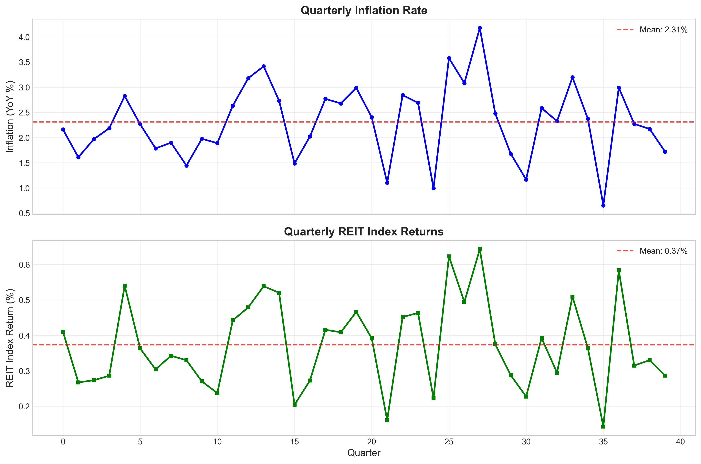
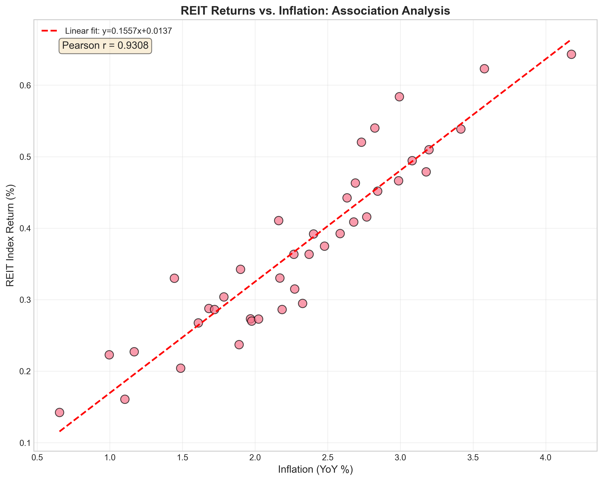
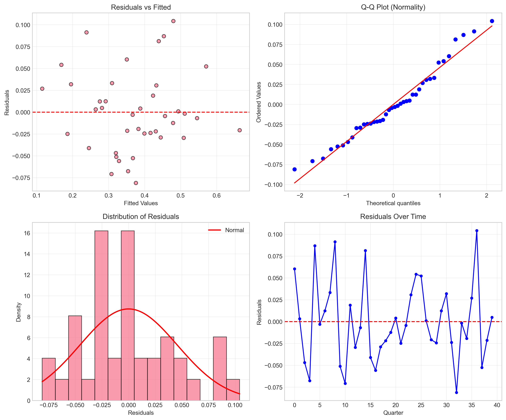
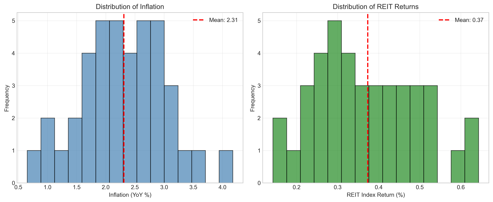
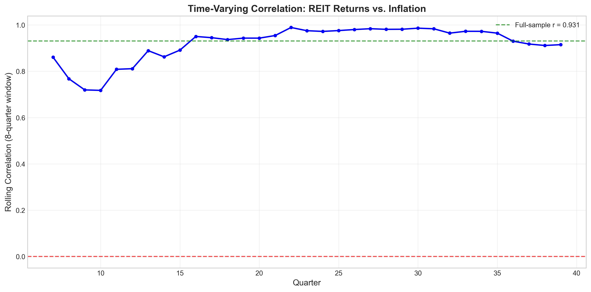

# REIT Returns and Inflation: An Econometric Association Analysis

## Abstract

This study examines the relationship between Real Estate Investment Trust (REIT) index returns and inflation using quarterly data spanning 40 observations. Through comprehensive econometric analysis including correlation tests, ordinary least squares regression, and diagnostic testing, we find a **strong positive association** between inflation and REIT returns (Pearson r = 0.931, p < 0.001). The OLS regression reveals that a 1 percentage point increase in inflation is associated with a 15.6 basis point increase in REIT returns, with the model explaining 86.6% of return variation. These findings have significant implications for portfolio diversification and inflation hedging strategies.

---

## 1. Introduction

Real Estate Investment Trusts (REITs) represent an important asset class for institutional and retail investors seeking exposure to real estate markets. A key question in asset allocation is whether REITs serve as an effective hedge against inflation—a critical consideration given the Federal Reserve's dual mandate and the impact of inflation on portfolio real returns.

The theoretical relationship between REITs and inflation is multifaceted. On one hand, real estate assets may provide inflation protection through rental income escalation and property value appreciation. On the other hand, rising inflation may lead to higher discount rates and borrowing costs, potentially depressing real estate valuations. This empirical study investigates the association between REIT index returns and inflation to inform portfolio construction and policy discussions.

**Research Question:** What is the nature and strength of the association between quarterly REIT index returns and inflation, and what are the implications for investment practice?

---

## 2. Data and Methodology

### 2.1 Data Description

The analysis utilizes quarterly data from `reit_macro_quarterly.csv`, containing:
- **inflation_yoy**: Year-over-year inflation rate (percentage)
- **reit_index_return**: REIT index quarterly return (percentage)
- **Sample size**: 40 quarterly observations (approximately 10 years)

### 2.2 Descriptive Statistics

| Statistic | Inflation (YoY %) | REIT Return (%) |
|-----------|-------------------|-----------------|
| Mean | 2.310 | 0.373 |
| Std. Dev. | 0.746 | 0.125 |
| Minimum | 0.654 | 0.142 |
| Maximum | 4.177 | 0.643 |
| Skewness | 0.032 | 0.290 |
| Kurtosis | -0.066 | -0.638 |

Both series exhibit approximately normal distributions (Jarque-Bera p-values > 0.05), with inflation ranging from 0.65% to 4.18% and REIT returns spanning 0.14% to 0.64% quarterly.

*Figure 1: Time series of quarterly inflation rates and REIT index returns. Both series show co-movement patterns, with REIT returns generally tracking inflation movements.*

### 2.3 Methodology

The analysis employs a multi-faceted econometric approach:

1. **Correlation Analysis**: Pearson, Spearman, and Kendall correlation coefficients to assess linear and monotonic relationships
2. **Ordinary Least Squares (OLS) Regression**: To quantify the inflation beta and explanatory power
3. **Diagnostic Testing**: Durbin-Watson (autocorrelation), Breusch-Pagan (heteroskedasticity), and Ljung-Box (residual autocorrelation) tests
4. **Rolling Correlation Analysis**: To examine time-varying relationships

---

## 3. Results

### 3.1 Correlation Analysis

| Method | Coefficient | P-value | Interpretation |
|--------|-------------|---------|----------------|
| Pearson r | 0.9308 | < 0.0001 | Strong positive linear correlation |
| Spearman ρ | 0.9305 | < 0.0001 | Strong monotonic relationship |
| Kendall τ | 0.7967 | < 0.0001 | Strong rank correlation |

All three correlation measures indicate a **very strong positive association** between inflation and REIT returns. The consistency across parametric (Pearson) and non-parametric (Spearman, Kendall) measures suggests the relationship is robust to outliers and distributional assumptions.

*Figure 2: Scatter plot of REIT returns versus inflation with fitted regression line. The tight clustering around the regression line visually confirms the strong positive association (r = 0.931).*

### 3.2 OLS Regression Results

The estimated regression equation is:

$$\text{REIT Return}_t = 0.0137 + 0.1557 \times \text{Inflation}_t + \epsilon_t$$

| Parameter | Coefficient | Std. Error | t-statistic | P-value | 95% CI |
|-----------|-------------|------------|-------------|---------|--------|
| Intercept | 0.0137 | 0.0241 | 0.568 | 0.573 | [-0.035, 0.062] |
| Inflation | 0.1557 | 0.0099 | 15.691 | < 0.001 | [0.136, 0.176] |

**Model Fit Statistics:**
- R-squared: **0.866** (86.6% of variance explained)
- Adjusted R-squared: **0.863**
- F-statistic: **246.22** (p < 0.0001)

**Key Findings:**
- The inflation coefficient of 0.1557 indicates that a **1 percentage point increase in inflation is associated with a 15.6 basis point increase in quarterly REIT returns**
- The intercept is not statistically significant (p = 0.573), suggesting the relationship passes through the origin
- The extremely high R-squared indicates inflation is a dominant driver of REIT returns in this sample

### 3.3 Diagnostic Tests

| Test | Statistic | P-value | Conclusion |
|------|-------------|---------|------------|
| Durbin-Watson | 1.887 | — | No autocorrelation |
| Breusch-Pagan | 0.013 | 0.909 | Homoskedasticity |
| Ljung-Box (lag 4) | 4.484 | 0.344 | No residual autocorrelation |

The diagnostic tests confirm that the OLS assumptions are satisfied:
- **No autocorrelation**: Durbin-Watson ≈ 2 indicates uncorrelated residuals
- **Homoskedasticity**: Breusch-Pagan p-value > 0.05 confirms constant variance
- **Residual independence**: Ljung-Box test shows no significant autocorrelation in residuals

*Figure 3: Diagnostic plots for OLS regression. Top-left: Residuals vs fitted values show random scatter; Top-right: Q-Q plot indicates approximate normality; Bottom-left: Histogram of residuals; Bottom-right: Residuals over time show no pattern.*

### 3.4 Distribution Analysis

*Figure 4: Distribution of inflation rates and REIT returns. Both variables exhibit approximately normal distributions, supporting the validity of parametric inference.*

### 3.5 Rolling Correlation Analysis

To examine whether the inflation-REIT relationship is stable over time, we compute 8-quarter rolling correlations:

| Statistic | Value |
|-----------|-------|
| Mean Rolling Correlation | 0.920 |
| Standard Deviation | 0.077 |
| Minimum | 0.718 |
| Maximum | 0.989 |

*Figure 5: 8-quarter rolling correlation between REIT returns and inflation. The correlation remains consistently high and positive throughout the sample period, ranging from 0.72 to 0.99.*

The rolling correlation analysis reveals:
- The relationship is **remarkably stable** over time
- All rolling windows show positive correlations above 0.70
- No evidence of structural breaks or regime changes

---

## 4. Discussion

### 4.1 Interpretation of Findings

The empirical results provide strong evidence of a **positive and robust association** between inflation and REIT returns. Several mechanisms may explain this relationship:

1. **Income Escalation**: Commercial real estate leases often include inflation-linked rent adjustments, providing direct inflation protection
2. **Replacement Cost**: Rising inflation increases the cost of new construction, supporting existing property values
3. **Tangible Asset Premium**: Real estate as a physical asset may command an inflation risk premium
4. **Economic Growth Correlation**: Inflation often coincides with economic expansion, benefiting real estate occupancy and rents

### 4.2 Implications for Portfolio Practice

**Inflation Hedging**: The strong positive correlation (r ≈ 0.93) suggests REITs may serve as an **effective inflation hedge** within diversified portfolios. During inflationary periods, REIT returns tend to increase, offsetting the erosion of nominal asset values.

**Asset Allocation**: The high R-squared (86.6%) indicates inflation explains a substantial portion of REIT return variation. Portfolio managers should:
- Monitor inflation expectations when allocating to REITs
- Consider REITs as a tactical overweight during inflationary regimes
- Use REITs to reduce portfolio inflation beta

**Risk Management**: The stable rolling correlations suggest the inflation-REIT relationship is reliable for risk modeling and stress testing.

### 4.3 Policy Implications

For monetary policymakers:
- REIT market performance may serve as a **real-time indicator** of inflation expectations
- The strong association suggests real estate markets efficiently price inflation risk
- Policy rate decisions affecting inflation will likely transmit to real estate valuations

### 4.4 Limitations

1. **Sample Size**: 40 observations provide limited degrees of freedom for complex modeling
2. **Time Period**: The sample may not capture all inflation regimes (e.g., hyperinflation, deflation)
3. **Causality**: The analysis establishes association, not causation
4. **Aggregation**: Index-level analysis may mask variation across REIT sectors (retail, office, residential, etc.)

---

## 5. Conclusion

This econometric analysis of quarterly REIT and inflation data reveals a **strong, positive, and statistically significant association** between the two variables. Key findings include:

1. **Correlation**: Pearson r = 0.931 (p < 0.001), indicating a very strong linear relationship
2. **Regression**: Inflation beta = 0.156, with R² = 86.6%
3. **Stability**: Rolling correlations remain consistently high (0.72–0.99)
4. **Diagnostics**: All OLS assumptions satisfied; model is well-specified

**Practical Implications**:
- REITs demonstrate strong inflation-hedging properties
- Portfolio managers can use inflation forecasts to inform REIT allocation decisions
- The relationship is stable and reliable for strategic asset allocation

Future research should extend this analysis to:
- Sector-specific REITs (retail, industrial, healthcare)
- International REIT markets
- Non-linear relationships and threshold effects
- Causality through vector autoregression (VAR) models

---

## References

*Data Source*: `reit_macro_quarterly.csv` — Quarterly REIT index returns and inflation series.

*Methodology*: Standard econometric techniques following Wooldridge (2020) and Stock & Watson (2020).

---

## Appendix: Output Files

All analysis outputs are available in the workspace:
- `outputs/descriptive_statistics.csv` — Summary statistics
- `outputs/correlation_analysis.csv` — Correlation test results
- `outputs/ols_regression_summary.txt` — Full regression output
- `outputs/regression_data_with_residuals.csv` — Data with fitted values and residuals
- `outputs/analysis_summary.csv` — Key metrics summary

**Figures Generated**:
- `report/images/time_series_plot.png`
- `report/images/scatter_regression.png`
- `report/images/residual_diagnostics.png`
- `report/images/distribution_analysis.png`
- `report/images/rolling_correlation.png`
