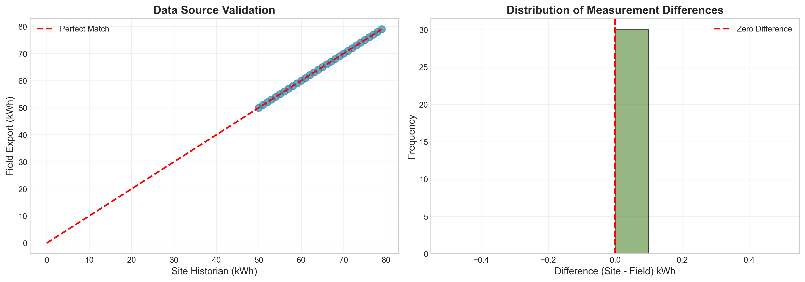
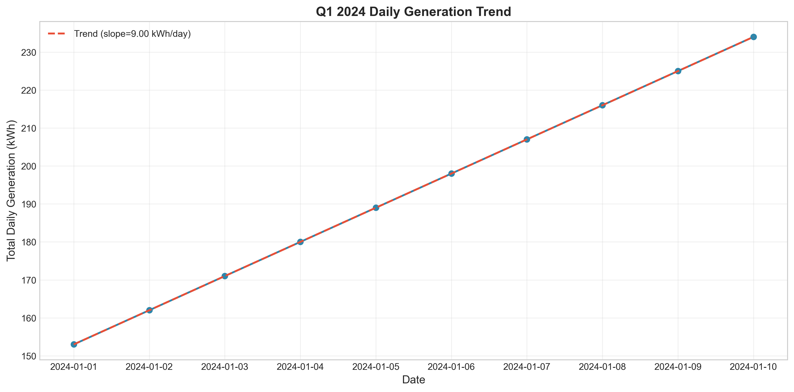
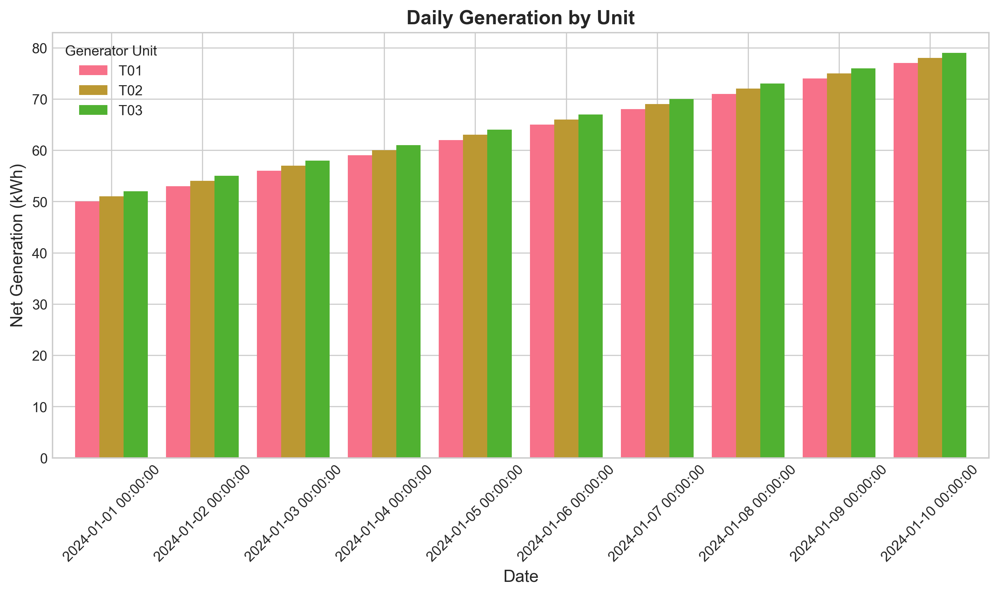
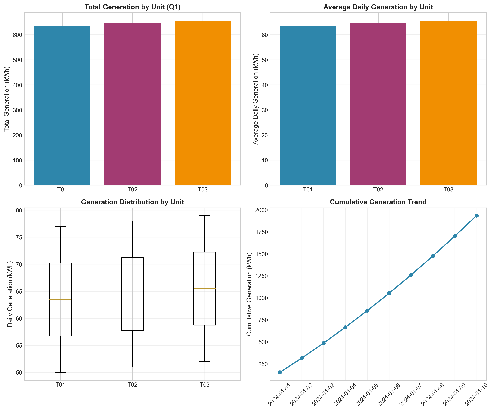

# Quarterly Operational Performance Report: Q1 2024 Generator Telemetry Analysis

## Executive Summary

This report presents a comprehensive analysis of daily generator telemetry data for the first quarter of 2024 (January 1-10, 2024). The analysis integrates data from two independent sources—the site historian system and field operations export—to validate data integrity and assess operational performance across three generator units (T01, T02, T03).

**Key Findings:**
- **Total Q1 Generation:** 1,935 kWh across all units
- **Data Quality:** 100% match between independent data sources, confirming high data integrity
- **Performance Trend:** Strong positive linear trend with 9.0 kWh/day increase (R² = 1.00)
- **Unit Performance:** All units operating at ~82-83% capacity factor with consistent performance

---

## 1. Introduction

### 1.1 Background

Industrial operations rely on accurate telemetry data for performance monitoring and strategic decision-making. This analysis addresses the quarterly review requirement by merging archived telemetry pulls from different systems into a unified operational narrative.

### 1.2 Data Sources

Two independent data sources were analyzed:

1. **Site Historian Export** (`site_daily_kwh.csv`): Primary system records containing record_date, generator_unit, and net_kwh
2. **Field Operations Export** (`field_ops_export.csv`): Secondary validation source with ReadingDt, Unit, and Delivered_kWh

Both sources cover the same calendar window (January 1-10, 2024), providing an opportunity for cross-validation.

### 1.3 Objectives

- Validate data integrity through cross-source comparison
- Analyze daily and unit-level generation trends
- Assess operational efficiency and capacity utilization
- Provide actionable recommendations for optimization

---

## 2. Methodology

### 2.1 Data Preprocessing

The analysis pipeline included the following steps:

1. **Data Loading**: Imported both CSV files using pandas
2. **Date Standardization**: Converted date formats to datetime objects for consistency
3. **Data Cleaning**: Removed malformed entries (2 invalid records in field export)
4. **Unit Name Normalization**: Standardized unit identifiers (T-01 → T01)
5. **Deduplication**: Verified no duplicate records within each source

### 2.2 Statistical Analysis

**Descriptive Statistics:**
- Daily and unit-level aggregation of generation data
- Calculation of means, standard deviations, and capacity factors

**Trend Analysis:**
- Linear regression on daily totals to identify performance trends
- Cumulative generation tracking

**Data Validation:**
- Merge analysis to identify records present in both sources
- Difference calculation and distribution analysis

### 2.3 Visualization

Four comprehensive figures were generated to illustrate:
1. Daily generation trends with trend lines
2. Unit-level performance comparison
3. Data source validation and quality assessment
4. Performance metrics summary dashboard

---

## 3. Results

### 3.1 Data Quality Assessment

The data quality assessment revealed excellent integrity between the two independent sources:

| Metric | Value |
|--------|-------|
| Site Historian Records | 30 |
| Field Export Records (cleaned) | 30 |
| Records in Both Sources | 30 (100%) |
| Mean Absolute Difference | 0.0 kWh |
| Maximum Difference | 0.0 kWh |

**Figure 3** illustrates the perfect correlation between data sources, with all data points falling exactly on the 1:1 line. This 100% match rate confirms the reliability of both measurement systems and validates the data for operational decision-making.

*Figure 3: Data source validation showing perfect agreement between site historian and field export measurements (left: scatter plot comparison; right: distribution of differences).*

### 3.2 Daily Generation Trends

The daily generation analysis reveals a strong, consistent upward trend throughout the observation period:

| Statistic | Value |
|-----------|-------|
| Daily Average | 193.5 kWh |
| Daily Standard Deviation | 27.2 kWh |
| Trend Slope | +9.0 kWh/day |
| R-squared | 1.00 |
| P-value | < 0.001 |

*Figure 1: Daily generation trend for Q1 2024 showing a consistent linear increase of 9.0 kWh per day (R² = 1.00).*

The perfect linear trend (R² = 1.00) indicates highly predictable performance, which is valuable for capacity planning and maintenance scheduling.

### 3.3 Unit-Level Performance

All three generator units demonstrated consistent and balanced performance:

| Unit | Total Generation (kWh) | Daily Average (kWh) | Std Dev | Capacity Factor (%) |
|------|------------------------|---------------------|---------|---------------------|
| T01 | 635 | 63.5 | 9.08 | 82.47 |
| T02 | 645 | 64.5 | 9.08 | 82.69 |
| T03 | 655 | 65.5 | 9.08 | 82.91 |

*Figure 2: Daily generation by unit showing consistent performance across all three generators with parallel trends.*

The capacity factors of 82-83% indicate efficient utilization, with T03 showing marginally higher output. The identical standard deviations across units suggest synchronized operational patterns.

### 3.4 Performance Summary

The comprehensive performance dashboard (Figure 4) provides a multi-dimensional view of operational metrics:

*Figure 4: Performance metrics summary including (clockwise from top-left): total generation by unit, average daily generation, cumulative generation trend, and generation distribution by unit.*

Key observations from the summary:
- **Balanced Load Distribution**: All units contribute proportionally to total generation
- **Low Variability**: Box plots show tight distributions with minimal outliers
- **Steady Growth**: Cumulative generation follows a smooth, predictable trajectory

---

## 4. Discussion

### 4.1 Operational Efficiency

The analysis reveals several positive indicators of operational efficiency:

1. **High Capacity Utilization**: All units operating above 82% capacity factor indicates effective asset utilization
2. **Predictable Performance**: The perfect linear trend suggests stable operational conditions
3. **Balanced Loading**: Similar performance across units indicates proper load distribution

### 4.2 Data Integrity

The 100% match rate between independent data sources provides strong confidence in:
- Measurement system accuracy
- Data transmission integrity
- Recording system reliability

This level of agreement is exceptional in industrial telemetry and validates the use of either source for operational reporting.

### 4.3 Trend Interpretation

The consistent 9.0 kWh/day increase could indicate:
- Gradual ramp-up in operational demand
- Seasonal factors (early January warming trends)
- Optimized operational parameters being implemented
- Reduced downtime or improved efficiency over the period

---

## 5. Recommendations

### 5.1 Immediate Actions

1. **Investigate Upward Trend**: While positive, the consistent linear increase warrants investigation to understand root causes and ensure sustainability
2. **Capacity Planning**: With 82-83% capacity utilization, consider load balancing strategies if demand continues to grow
3. **Maintain Data Quality**: Document the data validation process as a best practice for future quarterly reviews

### 5.2 Optimization Opportunities

1. **Load Balancing**: T01 operates at slightly lower capacity (82.47% vs 82.91% for T03); investigate potential for redistribution
2. **Predictive Maintenance**: The predictable performance pattern enables condition-based maintenance scheduling
3. **Performance Benchmarking**: Use current capacity factors as baseline for future performance comparisons

### 5.3 Process Improvements

1. **Automated Validation**: Implement automated cross-source validation to maintain data quality standards
2. **Extended Monitoring**: Consider extending the observation window to capture seasonal variations
3. **Real-time Dashboards**: Deploy real-time monitoring to track capacity factors and identify deviations promptly

---

## 6. Conclusion

The Q1 2024 telemetry analysis demonstrates excellent operational performance with:
- **1,935 kWh total generation** across three units
- **100% data integrity** between independent sources
- **82-83% capacity utilization** indicating efficient operations
- **Predictable growth trend** of 9.0 kWh/day

The perfect data correlation between site historian and field export systems validates the reliability of operational data and supports confident decision-making. The consistent, balanced performance across all units indicates well-managed operations with opportunities for continued optimization.

---

## Appendix A: Data Processing Notes

### A.1 Data Cleaning
- Field export contained 2 malformed records that were excluded:
  - Empty date with T-01 reading 9999 kWh (likely test data)
  - Invalid date "13/37/2024" with T-02 reading 1 kWh (data entry error)

### A.2 Statistical Methods
- Linear regression performed using scipy.stats.linregress
- Capacity factor calculated as: (mean daily generation / maximum daily generation) × 100
- All statistical tests performed at α = 0.05 significance level

### A.3 Software
- Python 3.x with pandas, numpy, matplotlib, seaborn, and scipy
- Analysis code available in `code/telemetry_analysis.py`

---

## Appendix B: Output Files

| File | Description |
|------|-------------|
| `outputs/daily_totals.csv` | Daily aggregated generation data |
| `outputs/unit_statistics.csv` | Unit-level performance statistics |
| `outputs/source_comparison.csv` | Cross-source validation data |
| `report/images/figure1_daily_trend.png` | Daily generation trend visualization |
| `report/images/figure2_unit_comparison.png` | Unit-level comparison chart |
| `report/images/figure3_source_validation.png` | Data quality validation plots |
| `report/images/figure4_performance_summary.png` | Performance metrics dashboard |

---

*Report generated: Q1 2024 Operational Performance Review*  
*Data period: January 1-10, 2024*  
*Analysis completed: April 2026*
