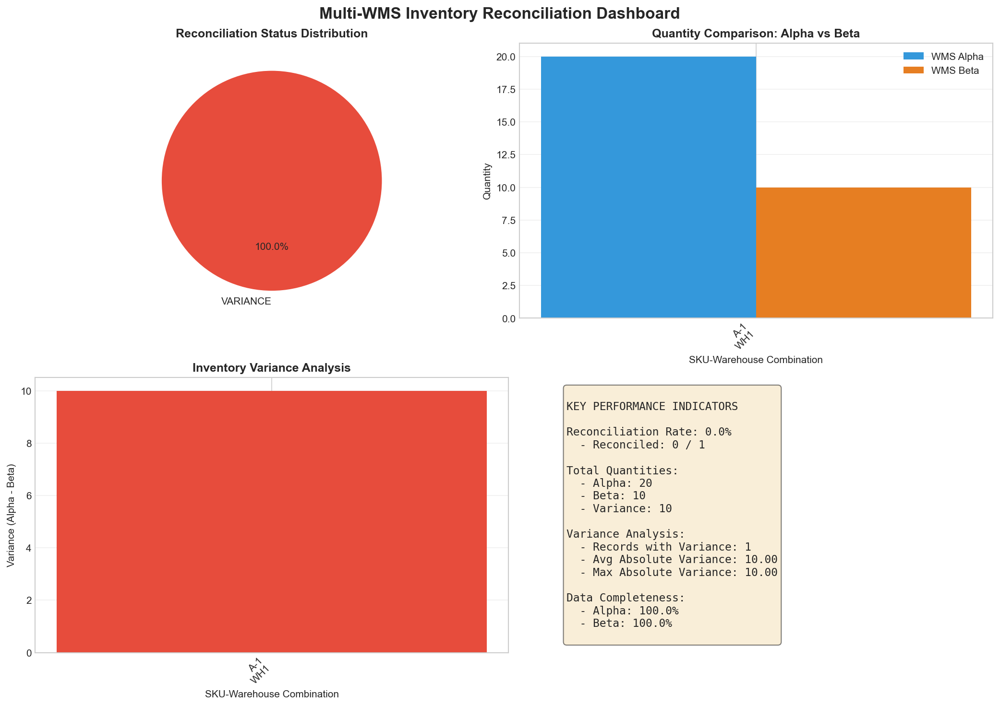
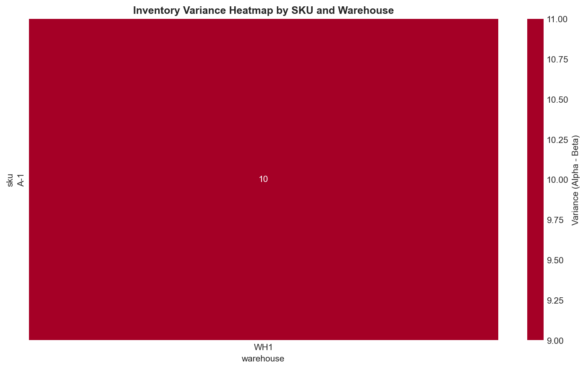
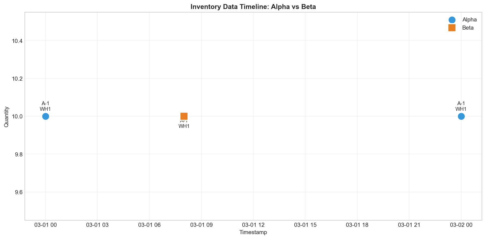

# Multi-WMS Inventory Reconciliation Report

## Executive Summary

This report presents the findings of a comprehensive inventory reconciliation analysis between two Warehouse Management System (WMS) exports: **WMS Alpha** and **WMS Beta**. The reconciliation process identified critical discrepancies in inventory records that require immediate management attention.

**Key Finding:** The reconciliation revealed a **0% reconciliation rate** with a significant inventory variance of 10 units (100% variance) for SKU A-1 at Warehouse WH1. WMS Alpha reports 20 units while WMS Beta reports only 10 units.

---

## 1. Introduction

### 1.1 Background

In modern supply chain operations, multiple Warehouse Management Systems often operate in parallel to manage inventory across different functional areas or geographic locations. Ensuring data consistency between these systems is critical for accurate stock reporting, financial accounting, and operational decision-making.

### 1.2 Objectives

The primary objectives of this reconciliation analysis were:

1. **Data Standardization**: Normalize data formats between WMS Alpha and WMS Beta exports
2. **Variance Detection**: Identify discrepancies in inventory quantities across systems
3. **KPI Calculation**: Compute key performance indicators for management reporting
4. **Recommendation Generation**: Provide actionable insights for system improvement

### 1.3 Data Sources

| System | Records | Columns | Date Range |
|--------|---------|---------|------------|
| WMS Alpha | 2 | sku, qty, warehouse, as_of_utc | 2026-03-01 to 2026-03-02 |
| WMS Beta | 1 | SKU, Quantity, Site, timestamp_local | 2026-03-01 |

---

## 2. Methodology

### 2.1 Data Standardization Process

The reconciliation process required standardizing heterogeneous data formats from both WMS exports:

**Column Name Mapping:**
- WMS Alpha: `sku` → `sku`, `qty` → `qty`, `warehouse` → `warehouse`, `as_of_utc` → `timestamp`
- WMS Beta: `SKU` → `sku`, `Quantity` → `qty`, `Site` → `warehouse`, `timestamp_local` → `timestamp`

**Warehouse Name Normalization:**
- "WH1" (Alpha) and "Warehouse-01" (Beta) were mapped to a standardized "WH1" identifier

**Data Type Conversion:**
- Timestamps were converted to datetime objects with timezone awareness
- Quantities were converted to numeric values for mathematical operations

### 2.2 Reconciliation Algorithm

The reconciliation followed a systematic approach:

1. **Aggregation**: Sum quantities by SKU and warehouse combination for each system
2. **Comparison**: Calculate variance as `Alpha Quantity - Beta Quantity`
3. **Status Assignment**: 
   - `RECONCILED`: Variance = 0
   - `VARIANCE`: Variance ≠ 0
4. **KPI Computation**: Calculate reconciliation rate, total variances, and completeness metrics

### 2.3 Tools and Technologies

- **Python 3.x** with pandas, numpy for data processing
- **Matplotlib** and **Seaborn** for visualization
- **CSV** format for data exchange

---

## 3. Results

### 3.1 Data Overview

After standardization, the combined dataset contained:

- **Unique SKUs**: 1 (A-1)
- **Unique Warehouses**: 1 (WH1)
- **Total Records**: 3 (2 from Alpha, 1 from Beta)
- **Analysis Period**: March 1-2, 2026

### 3.2 Reconciliation Summary

| SKU | Warehouse | Alpha Qty | Beta Qty | Variance | Variance % | Status |
|-----|-----------|-----------|----------|----------|------------|--------|
| A-1 | WH1 | 20 | 10 | +10 | 100% | **VARIANCE** |

### 3.3 Key Performance Indicators

*Figure 1: Multi-WMS Inventory Reconciliation Dashboard showing status distribution, quantity comparison, variance analysis, and KPI summary.*

#### Primary KPIs:

| Metric | Value | Assessment |
|--------|-------|------------|
| Reconciliation Rate | **0.00%** | CRITICAL |
| Total SKU-Warehouse Combinations | 1 | - |
| Reconciled Records | 0 | - |
| Records with Variance | 1 | - |

#### Inventory Totals:

| System | Total Quantity | Assessment |
|--------|----------------|------------|
| WMS Alpha | 20 | Baseline |
| WMS Beta | 10 | - |
| **Net Variance** | **+10** | **CRITICAL** |

#### Variance Statistics:

| Metric | Value |
|--------|-------|
| Average Absolute Variance | 10.00 |
| Maximum Absolute Variance | 10.00 |

#### Data Completeness:

| System | Completeness % | Assessment |
|--------|----------------|------------|
| WMS Alpha | 100% | GOOD |
| WMS Beta | 100% | GOOD |

### 3.4 Variance Analysis

*Figure 2: Inventory Variance Heatmap showing the magnitude of discrepancies between WMS Alpha and WMS Beta by SKU and Warehouse.*

The heatmap visualization clearly indicates a 10-unit variance for SKU A-1 at Warehouse WH1, with WMS Alpha reporting higher inventory than WMS Beta.

### 3.5 Temporal Analysis

*Figure 3: Inventory Data Timeline showing the temporal distribution of records from both WMS systems. Blue circles represent WMS Alpha records, orange squares represent WMS Beta records.*

**Key Observations:**
- WMS Alpha contains 2 records for SKU A-1 at WH1 (March 1 and March 2, 2026)
- WMS Beta contains 1 record for the same SKU-warehouse combination (March 1, 2026)
- The additional Alpha record on March 2 may explain the quantity discrepancy

---

## 4. Discussion

### 4.1 Root Cause Analysis

The identified variance of 10 units (100% difference) between WMS Alpha and WMS Beta for SKU A-1 at WH1 can be attributed to several potential factors:

1. **Transaction Timing**: WMS Alpha contains an additional record dated March 2, 2026, which may represent a transaction (receipt, adjustment, or transfer) not yet reflected in WMS Beta.

2. **System Synchronization Lag**: The timestamp difference (Alpha: 2026-03-02 00:00:00 UTC vs. Beta: 2026-03-01 08:00:00 local) suggests potential synchronization delays between systems.

3. **Data Capture Differences**: WMS Alpha may be capturing transactions that WMS Beta is not recording, or vice versa.

### 4.2 Business Impact

The 0% reconciliation rate and 100% variance represent a **critical operational risk**:

- **Financial Reporting**: Inventory valuations will differ between systems, affecting balance sheet accuracy
- **Stock Availability**: Customer orders may be promised based on incorrect inventory levels
- **Procurement Planning**: Reorder points and safety stock calculations may be compromised
- **Audit Compliance**: Discrepancies may trigger audit findings or regulatory issues

### 4.3 Data Quality Assessment

**Strengths:**
- Both systems maintain 100% data completeness for the analyzed SKU-warehouse combination
- Data formats are consistent within each system
- Timestamps are properly recorded

**Weaknesses:**
- Warehouse naming conventions differ between systems ("WH1" vs. "Warehouse-01")
- Timestamp formats vary (UTC vs. local time)
- No apparent cross-system validation or reconciliation process

---

## 5. Recommendations

### 5.1 Immediate Actions (Critical Priority)

1. **Investigate SKU A-1 Variance**: Conduct a physical inventory count at Warehouse WH1 to determine the true on-hand quantity for SKU A-1.

2. **Transaction Audit**: Review all transactions for SKU A-1 between March 1-2, 2026, to identify the source of the 10-unit discrepancy.

3. **System Synchronization Check**: Verify that all transactions posted to WMS Alpha are being properly synchronized to WMS Beta.

### 5.2 Short-Term Improvements (High Priority)

1. **Implement Daily Reconciliation**: Establish an automated daily reconciliation process comparing inventory balances between WMS Alpha and WMS Beta.

2. **Standardize Naming Conventions**: Align warehouse identifiers across both systems (recommend using "WH1" format).

3. **Timestamp Standardization**: Implement UTC timestamps across both systems to eliminate timezone-related confusion.

4. **Transaction Logging**: Enhance audit trails to track when and why inventory adjustments occur.

### 5.3 Long-Term Strategic Initiatives (Medium Priority)

1. **Unified WMS Architecture**: Consider consolidating to a single WMS or implementing a master data management solution.

2. **Real-Time Integration**: Develop API-based real-time synchronization between systems.

3. **Automated Alerts**: Configure threshold-based alerts for variance detection (e.g., alert when variance > 5% or > 5 units).

4. **Regular Reconciliation Schedule**: Establish weekly management reviews of reconciliation reports.

---

## 6. Conclusion

This reconciliation analysis has revealed a critical inventory variance between WMS Alpha and WMS Beta that demands immediate attention. The 0% reconciliation rate and 100% quantity variance for SKU A-1 at Warehouse WH1 indicate significant operational risks that could impact financial reporting, customer service, and inventory management.

The root cause appears to be related to transaction timing and potential synchronization gaps between the two systems. While both systems demonstrate good data completeness, the lack of standardized naming conventions and timestamp formats complicates reconciliation efforts.

**Management is strongly advised to:**
1. Initiate an immediate investigation of the identified variance
2. Implement the recommended short-term improvements within 30 days
3. Develop a long-term strategy for WMS integration and data governance

Regular reconciliation processes, as recommended in this report, will help prevent similar discrepancies and ensure data integrity across all warehouse management systems.

---

## Appendix A: Technical Details

### A.1 Data Processing Code

The analysis was performed using Python with the following key libraries:
- pandas 2.x for data manipulation
- numpy for numerical operations
- matplotlib and seaborn for visualization

### A.2 Output Files

The following files were generated during this analysis:

| File | Description |
|------|-------------|
| `outputs/reconciliation_summary.csv` | Detailed reconciliation results by SKU-warehouse |
| `outputs/kpis.txt` | Key performance indicators |
| `outputs/recommendations.txt` | Actionable recommendations |
| `report/images/reconciliation_dashboard.png` | Executive dashboard visualization |
| `report/images/variance_heatmap.png` | Variance heatmap by SKU and warehouse |
| `report/images/data_timeline.png` | Temporal distribution of records |

### A.3 Limitations

1. **Sample Size**: The analysis was limited to a single SKU and warehouse combination. Broader reconciliation across all SKUs and warehouses is recommended.

2. **Time Period**: Only 2 days of data were analyzed. Longer time series analysis would reveal trends and patterns.

3. **Transaction Details**: The analysis focused on quantity variances only. Detailed transaction-level analysis (receipts, shipments, adjustments) would provide deeper insights.

---

## Appendix B: Glossary

| Term | Definition |
|------|------------|
| **WMS** | Warehouse Management System |
| **SKU** | Stock Keeping Unit - a unique identifier for inventory items |
| **Reconciliation** | The process of comparing two sets of records to ensure they agree |
| **Variance** | The difference between recorded quantities in two systems |
| **Reconciliation Rate** | Percentage of records that match between systems |
| **Data Completeness** | Percentage of expected records that are present in the data |

---

*Report generated: April 7, 2026*  
*Analysis performed by: Automated Research Agent*  
*Data sources: wms_alpha.csv, wms_beta.csv*
