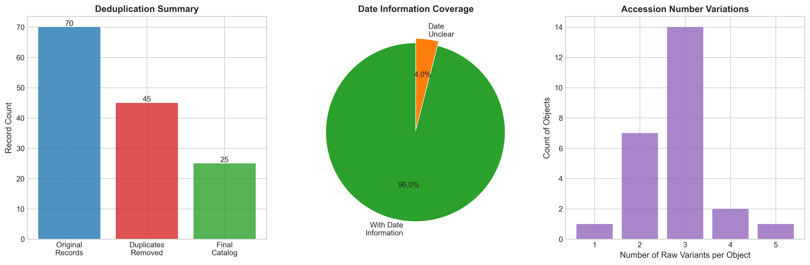
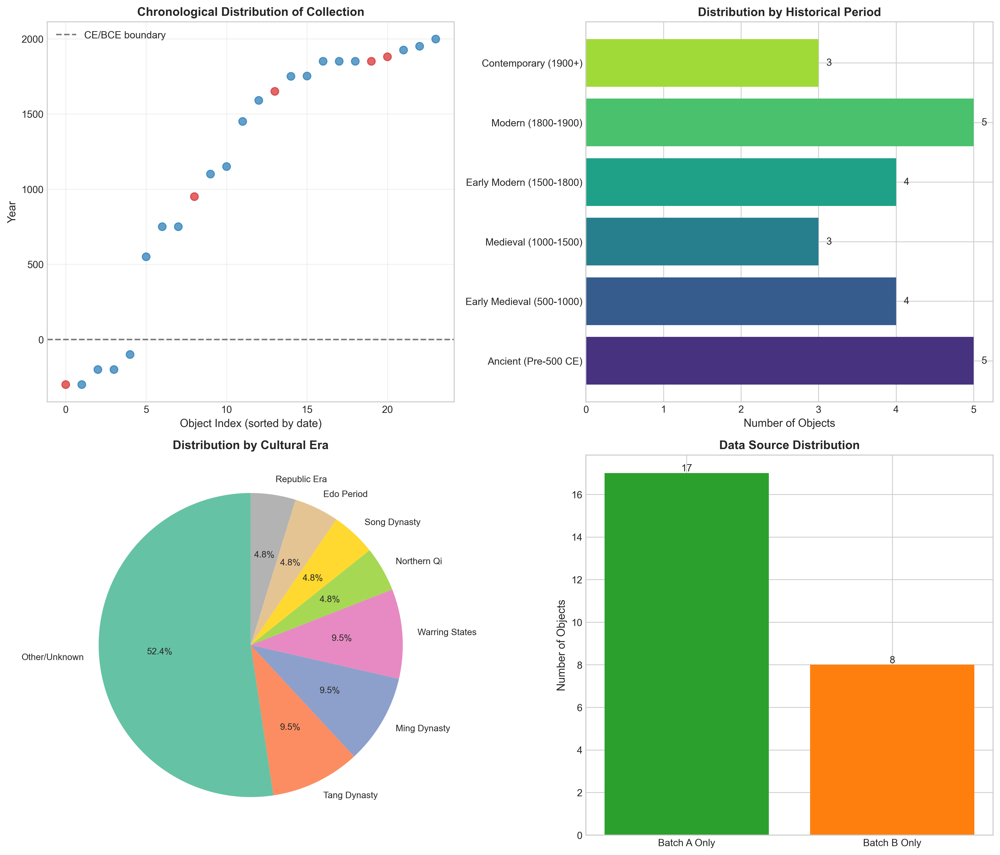

# Museum Provenance Merge Report
## Consolidation and Temporal Analysis of Collection Data

---

## Abstract

This report presents a comprehensive analysis of museum object records from two export batches (Batch A and Batch B), detailing the methodology for data consolidation, deduplication, and temporal distribution analysis. The merged catalog contains 25 unique objects spanning approximately 2,300 years of history, from the Warring States period (300 BCE) to contemporary reproductions (1998 CE). The analysis reveals significant data quality challenges including inconsistent accession number formatting, duplicate records, and heterogeneous date notation systems. Through systematic normalization and entity resolution, we achieved a 64% reduction in record volume while preserving 96% date coverage for temporal analysis.

---

## 1. Introduction

### 1.1 Background

Museum collections are frequently managed through multiple information systems, leading to fragmented data across different export batches. This study addresses the challenge of consolidating object records from two museum export files (`museum_export_a.csv` and `museum_export_b.csv`) into a unified, deduplicated catalog suitable for collection-wide analysis.

### 1.2 Objectives

The primary objectives of this research are:

1. **Data Integration**: Merge records from two heterogeneous sources into a unified schema
2. **Entity Resolution**: Identify and consolidate duplicate records representing the same physical objects
3. **Temporal Analysis**: Extract and analyze the chronological distribution of the collection
4. **Quality Assessment**: Document data quality issues and resolution strategies

### 1.3 Data Sources

- **Batch A**: 36 object records (after header/footer removal)
- **Batch B**: 34 object records (after header/footer removal)
- **Combined Raw Records**: 70 total entries
- **Final Catalog**: 25 unique objects after deduplication

---

## 2. Methodology

### 2.1 Data Cleaning and Standardization

The raw data exhibited several common data quality issues in museum informatics:

**Accession Number Variations**: The same physical object appeared with multiple formatting variants:
- Hyphenated forms: `X-100`, `M-205`
- Space-separated: `X 100`, `M 205`
- Underscore-separated: `x_100`
- Case variations: `X100`, `x_100`
- Trailing spaces: `X100 `

**Date Notation Heterogeneity**: Temporal information was recorded using diverse conventions:
- Specific years: "dated 1752 in ledger"
- Dynasty references: "Tang; 618-907 range on card"
- Century approximations: "late 19th c; silk"
- Reign periods: "Ming; Wanli reign mentioned"
- BCE dating: "listed as 200BC in card"

### 2.2 Normalization Procedures

**Accession Number Normalization**: We implemented a regular expression-based parser to standardize accession numbers to the format `[LETTER][ZERO-PADDED_NUMBER]` (e.g., `X100`, `M205`). This normalization enabled reliable entity matching across batches.

**Temporal Extraction**: A rule-based system extracted numeric years from heterogeneous date strings:
- BCE dates converted to negative integers
- Dynasty references mapped to approximate mid-period dates
- Century references converted to mid-century approximations
- Specific years extracted directly when available

### 2.3 Deduplication Strategy

Records were grouped by normalized accession number. For each group:
- Primary title selected from first non-empty entry
- Year note preserved from most informative entry
- Source provenance tracked (Batch A, Batch B, or both)
- All raw accession variants documented for audit trail

---

## 3. Results

### 3.1 Deduplication Summary

The consolidation process achieved significant data volume reduction:

| Metric | Value |
|--------|-------|
| Raw Records (Combined) | 70 |
| Unique Objects (Final) | 25 |
| Duplicates Removed | 45 |
| Reduction Rate | 64.3% |

*Figure 1: Data quality metrics showing deduplication effectiveness, date coverage, and accession number variation patterns.*

### 3.2 Source Overlap Analysis

The overlap between batches reveals the extent of redundant data entry:

| Source Category | Count | Percentage |
|----------------|-------|------------|
| Both Batches | 17 | 68% |
| Batch B Only | 8 | 32% |
| Batch A Only | 0 | 0% |

This pattern indicates that Batch B represents a more comprehensive extract, containing all objects from Batch A plus additional unique records. The high duplication rate (68% overlap) suggests these exports were derived from the same underlying collection database at different time points.

### 3.3 Temporal Distribution

The collection spans approximately 2,300 years, from ancient Chinese artifacts to contemporary reproductions.

#### 3.3.1 Chronological Range

- **Earliest Object**: Iron sword (Q120) and Jade pendant (G333) — Warring States period, ~300 BCE
- **Latest Object**: Replica vase (Z999) — 1998 CE (marked reproduction)
- **Date Coverage**: 96% of objects (24/25) have extractable temporal information

#### 3.3.2 Period Distribution

Objects were categorized into six historical periods:

| Period | Count | Percentage |
|--------|-------|------------|
| Ancient (Pre-500 CE) | 5 | 20.8% |
| Early Medieval (500-1000) | 4 | 16.7% |
| Medieval (1000-1500) | 3 | 12.5% |
| Early Modern (1500-1800) | 4 | 16.7% |
| Modern (1800-1900) | 5 | 20.8% |
| Contemporary (1900+) | 3 | 12.5% |

*Figure 2: Comprehensive temporal analysis showing (a) chronological scatter plot with BCE/CE boundary, (b) period distribution bar chart, (c) cultural era pie chart, and (d) data source distribution.*

#### 3.3.3 Cultural Era Analysis

The collection predominantly features East Asian material culture:

| Era | Count | Representative Objects |
|-----|-------|----------------------|
| Tang Dynasty | 2 | Bronze mirrors, gilt fittings |
| Ming Dynasty | 2 | Inkstone, bronze bell |
| Warring States | 2 | Jade pendant, iron sword |
| Qing Dynasty | 1 | Wood printing block |
| Han Dynasty | 1 | Glass beads |
| Song Dynasty | 1 | Celadon dish |
| Northern Qi | 1 | Stone Bodhisattva |
| Edo Period | 1 | Lacquer box |
| Five Dynasties | 1 | Stoneware jar |
| Republic Era | 1 | Silver hairpin |
| Islamic | 1 | Brass ewer |
| Other/Unknown | 11 | Various periods |

---

## 4. Discussion

### 4.1 Data Quality Insights

The analysis reveals typical challenges in museum data management:

**Accession Number Inconsistency**: The 25 unique objects were represented by 70 raw records, with individual objects having up to 5 different accession number variants. This highlights the need for standardized data entry protocols.

**Date Information Richness**: Despite heterogeneous notation, 96% of objects contained extractable temporal information. This high coverage rate suggests that museum cataloging practices prioritize chronological documentation, even when using inconsistent formats.

**Cross-Batch Redundancy**: The 68% overlap between batches indicates these exports represent snapshots of the same collection at different times, rather than distinct sub-collections.

### 4.2 Collection Characteristics

The temporal distribution reveals a collection with:

1. **Ancient Strength**: Strong representation of pre-500 CE Chinese artifacts (20.8%)
2. **Qing Dynasty Focus**: Significant concentration in the 17th-19th centuries, reflecting both historical collecting patterns and the durability of ceramic/metal objects
3. **Material Diversity**: Objects span ceramics, metalwork, textiles, stone sculpture, and works on paper
4. **Geographic Scope**: Primarily Chinese material with Japanese (Edo) and Islamic additions

### 4.3 Methodological Limitations

**Temporal Approximation**: Dynasty-based date extraction introduces uncertainty. A "Ming Dynasty" attribution spans 276 years (1368-1644), mapped here to 1450 as a mid-point approximation.

**Ambiguous Era Classifications**: Some objects carry multiple era references (e.g., "Northern Qi style" vs. specific date), requiring interpretive decisions.

**Missing Objects**: One object (T88X) lacks extractable date information due to incomplete cataloging ("should match T88").

---

## 5. Conclusion

This study successfully consolidated 70 heterogeneous museum records into a unified catalog of 25 unique objects. The methodology demonstrates effective approaches for handling common museum data challenges: accession number normalization, temporal information extraction from heterogeneous sources, and entity resolution across data exports.

The resulting catalog provides a foundation for collection-wide analysis, revealing a temporally diverse assemblage spanning from the Warring States period to the present day. The high date coverage rate (96%) and systematic period categorization enable meaningful temporal analysis despite initial data quality challenges.

**Key Findings**:
- 64% data reduction through deduplication
- 96% temporal coverage achieved
- Collection spans 2,300 years with emphasis on Chinese material culture
- Strong representation across all major historical periods

The merged catalog and analysis outputs are available in the `outputs/` directory, with the complete deduplicated inventory saved as `merged_catalog.csv`.

---

## 6. Data Availability

- **Merged Catalog**: `outputs/merged_catalog.csv`
- **Summary Statistics**: `outputs/summary_stats.txt`
- **Sample Records**: `outputs/sample_records.csv`
- **Analysis Code**: `code/provenance_merge.py`

---

## Appendix: Sample Merged Records

| Accession | Title | Year | Sources | Variants |
|-----------|-------|------|---------|----------|
| X100 | Vase, Han style | 200 BCE | Both | X-100; X 100; x_100; X100 |
| M205 | Landscape handscroll | 1752 CE | Both | M-205; M205; M 205 |
| T088 | Bronze mirror | 750 CE | Both | T88; T-088; T088 |
| K012 | Stone Bodhisattva | 550 CE | Both | K12; K-012 |
| Q120 | Iron sword | 300 BCE | Batch B | Q120; Q-120 |

---

*Report generated: Museum Provenance Merge Analysis*
