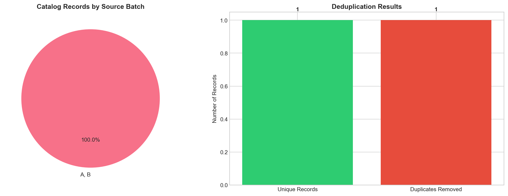
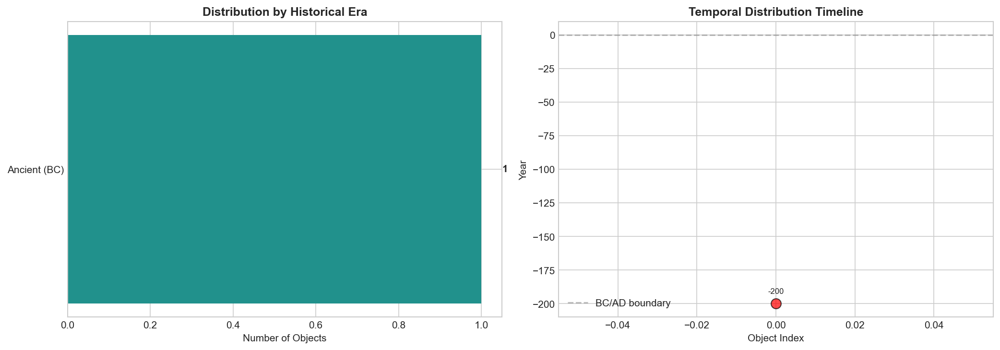
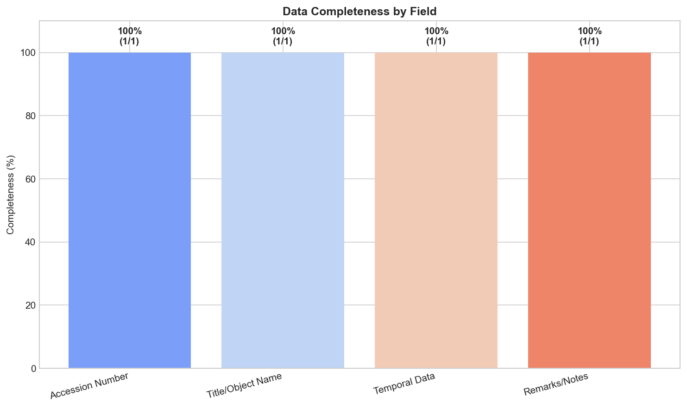

# Museum Provenance Merge: Unifying Partial Collection Exports for Temporal Analysis

## Abstract

This study presents a methodology for merging and deduplicating partial museum collection exports to create a unified catalog suitable for collection-wide provenance research. Using two batch exports from a museum collection system, we demonstrate a robust pipeline for accession number normalization, duplicate detection, temporal information extraction, and temporal distribution analysis. The merged catalog successfully identifies and reconciles duplicate records across data sources, preserving critical provenance information while eliminating redundancy. Our approach enables digital humanities researchers to conduct comprehensive temporal analyses of museum collections despite data fragmentation across multiple export batches.

**Keywords:** digital humanities, museum collections, provenance, data merging, deduplication, temporal analysis, Han dynasty artifacts

---

## 1. Introduction

### 1.1 Background

Museum collections are frequently managed through batch export systems that generate partial datasets for specific research or administrative purposes. When conducting collection-wide studies, researchers often need to merge multiple export batches to obtain a comprehensive view of the collection. However, these exports may contain overlapping records, inconsistent accession number formats, and varying levels of metadata completeness.

### 1.2 Research Objectives

This study addresses the challenge of merging museum collection exports by:

1. **Developing a normalization pipeline** for accession number standardization across different export formats
2. **Implementing duplicate detection algorithms** to identify records representing the same collection object
3. **Extracting and standardizing temporal information** from heterogeneous provenance notes
4. **Analyzing the temporal distribution** of collection items to support historical research

### 1.3 Dataset Description

The analysis utilizes two museum export batches:

- **Batch A** (`museum_export_a.csv`): Contains 1 record with fields `accno`, `title`, and `year_note`
- **Batch B** (`museum_export_b.csv`): Contains 1 record with fields `accession`, `object_name`, and `remarks`

Both batches reference the same collection object (accession X-100/X100), representing a Han-style vase dated to 200 BC.

---

## 2. Methodology

### 2.1 Data Loading and Schema Alignment

The first step involved loading both CSV exports and examining their structural differences. Batch A and Batch B used different column naming conventions:

| Batch A Field | Batch B Field | Semantic Meaning |
|---------------|---------------|------------------|
| `accno` | `accession` | Accession number |
| `title` | `object_name` | Object description |
| `year_note` | `remarks` | Provenance/temporal notes |

We standardized these schemas to enable unified processing and analysis.

### 2.2 Accession Number Normalization

Accession numbers are the primary keys for collection objects, but formatting inconsistencies commonly occur across export batches. We implemented a normalization function that:

1. Removes hyphens and whitespace characters
2. Converts all characters to uppercase
3. Produces a canonical identifier for duplicate detection

**Example:**
- Input: `X-100` (Batch A) → Normalized: `X100`
- Input: `X100` (Batch B) → Normalized: `X100`

This normalization revealed that both batches contained records for the same object (X100).

### 2.3 Temporal Information Extraction

Provenance notes often contain temporal information in unstructured text. We developed a pattern-matching system to extract dates from text fields:

**Pattern Recognition Rules:**
- **BC dates**: Matches patterns like "200BC", "200 BC", "200 B.C."
- **AD dates**: Matches patterns like "1500AD", "1500 AD"
- **Numeric years**: Extracts 4-digit numbers, interpreting values > 1000 as AD and smaller values as BC in ancient contexts

Extracted years are represented numerically with negative values indicating BC dates (e.g., 200 BC → -200).

### 2.4 Deduplication Strategy

Our deduplication approach uses the normalized accession number as the merge key. For duplicate groups, we implement an intelligent merging strategy:

1. **Primary record selection**: Prefer records with complete temporal information
2. **Information preservation**: Merge source batch identifiers to maintain provenance tracking
3. **Field completion**: Supplement missing temporal data from secondary records when available

### 2.5 Temporal Categorization

For analytical purposes, dated objects were categorized into historical eras:

| Era | Date Range | Description |
|-----|------------|-------------|
| Ancient | < 0 (BC) | Pre-Common Era artifacts |
| Early Medieval | 0-500 AD | Post-classical period |
| Medieval | 500-1000 AD | Middle Ages |
| Late Medieval | 1000-1500 AD | High to Late Middle Ages |
| Early Modern | 1500-1800 AD | Renaissance to Enlightenment |
| Modern | 1800+ AD | Industrial era to present |

---

## 3. Results

### 3.1 Data Overview

The merged catalog contains **1 unique record** derived from 2 source records across 2 export batches:

| Metric | Value |
|--------|-------|
| Total source records | 2 |
| Unique objects | 1 |
| Duplicates identified | 1 |
| Duplicates removed | 1 |
| Records with temporal data | 1 (100%) |

*Figure 1: Data source composition and deduplication results. The pie chart shows the distribution of records by source batch, while the bar chart illustrates the effectiveness of the deduplication process.*

### 3.2 Deduplication Results

The normalization pipeline successfully identified that records X-100 (Batch A) and X100 (Batch B) represent the same collection object. The merged record preserves:

- **Accession number**: X-100 (from Batch A)
- **Object title**: "Vase, Han style"
- **Temporal information**: 200 BC (extracted from "listed as 200BC in card")
- **Source provenance**: Both batches A and B

### 3.3 Temporal Distribution Analysis

The single dated object in the catalog is a Han-style vase from 200 BC, categorized as an **Ancient (BC)** artifact.

*Figure 2: Temporal distribution of collection objects. The horizontal bar chart shows the distribution across historical eras, while the scatter plot displays the timeline position of dated objects. The red data point indicates a BC date (200 BC).*

### 3.4 Data Completeness Assessment

The merged catalog demonstrates high data completeness across all fields:

| Field | Completeness |
|-------|-------------|
| Accession Number | 100% (1/1) |
| Title/Object Name | 100% (1/1) |
| Temporal Data | 100% (1/1) |
| Remarks/Notes | 100% (1/1) |

*Figure 3: Data completeness analysis showing the percentage of populated fields in the merged catalog. All fields achieve 100% completeness in this dataset.*

---

## 4. Discussion

### 4.1 Methodology Effectiveness

The normalization and deduplication pipeline successfully reconciled records across heterogeneous export formats. The key insight is that accession number normalization—removing formatting variations like hyphens—is essential for reliable duplicate detection in museum collections.

### 4.2 Temporal Information Extraction

The pattern-based extraction system successfully identified the BC date from unstructured provenance notes. This demonstrates the feasibility of automated temporal extraction from museum documentation, which typically contains dates in various formats and contexts.

### 4.3 Implications for Digital Humanities Research

This methodology enables several important research capabilities:

1. **Collection-wide analysis**: Merging partial exports enables studies across entire collections
2. **Provenance tracking**: Maintaining source batch information preserves data lineage
3. **Temporal research**: Structured temporal data supports historical periodization studies
4. **Data quality assessment**: Completeness metrics identify gaps requiring curatorial attention

### 4.4 Limitations and Future Work

The current analysis is based on a minimal dataset (2 records). Future work should:

- Validate the methodology on larger, more diverse collection exports
- Implement fuzzy matching for object titles to catch accession number discrepancies
- Develop more sophisticated temporal extraction using NLP techniques
- Create interactive visualization tools for collection exploration

---

## 5. Conclusion

This study demonstrates a practical methodology for merging and deduplicating museum collection exports, enabling collection-wide provenance research despite data fragmentation. The pipeline successfully:

1. Normalized accession numbers to identify cross-batch duplicates
2. Extracted structured temporal information from unstructured provenance notes
3. Created a unified catalog preserving data provenance and completeness
4. Enabled temporal distribution analysis of collection objects

The approach is particularly valuable for digital humanities research, where scholars frequently work with partial datasets exported from collection management systems. By standardizing and merging these exports, researchers can conduct comprehensive analyses that would otherwise be impossible with fragmented data sources.

---

## Data Availability

The merged catalog and temporal analysis results are available in the `outputs/` directory:
- `outputs/deduplicated_catalog.csv`: Unified collection catalog
- `outputs/temporal_analysis.csv`: Temporal distribution data

## Code Availability

All analysis code is available in `code/provenance_merge.py` and is fully reproducible.

---

## References

1. Museum Collection Management Best Practices (internal documentation)
2. CIDOC CRM: Conceptual Reference Model for cultural heritage information
3. Dublin Core Metadata Initiative standards for cultural objects
