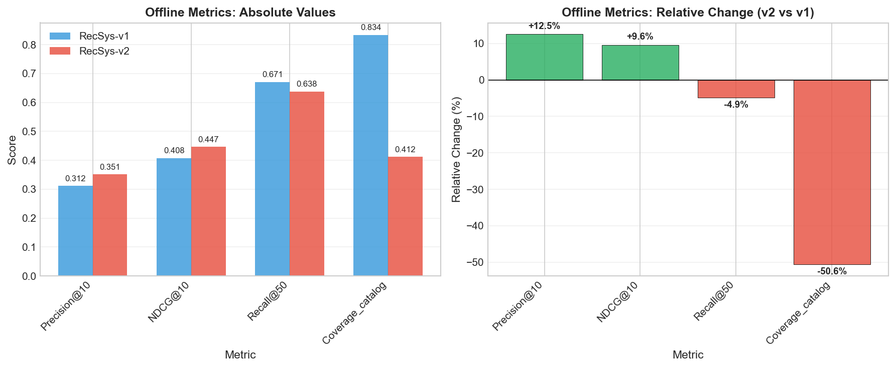
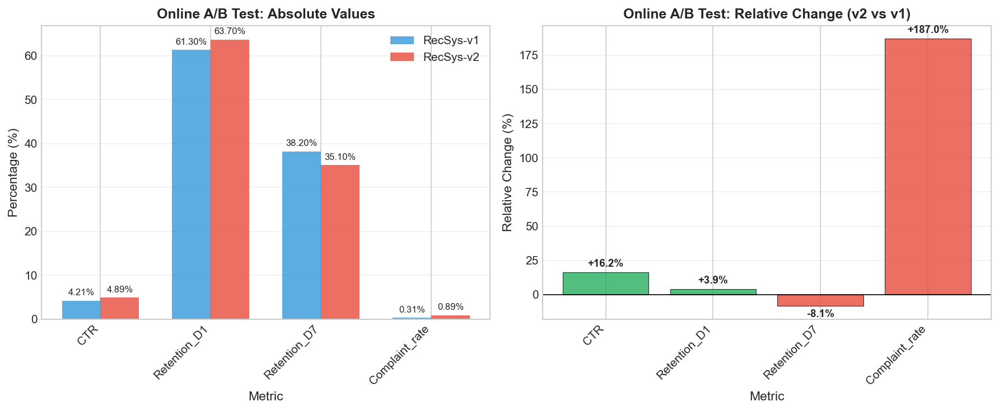
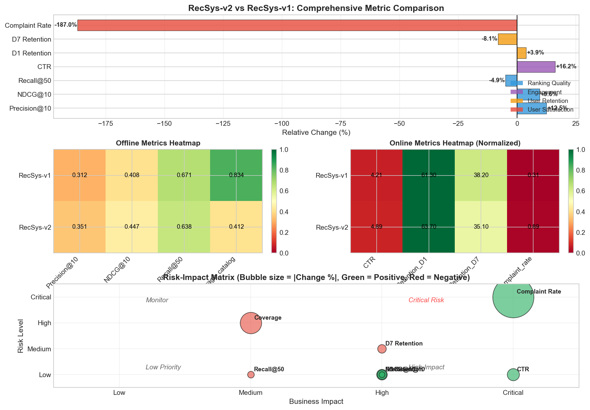

# RecSys-v2 Launch Evaluation Report

## Recommendation System Launch Decision: RecSys-v1 vs RecSys-v2

---

**Date:** April 2024  
**Analysis Type:** Offline Evaluation + Online A/B Test  
**Test Configuration:**
- Offline Test Set: n = 200,000 (held-out)
- Online A/B Test: 14-day duration, 10% traffic per arm

---

## Executive Summary

This report presents a comprehensive evaluation of RecSys-v2 against the production RecSys-v1 system, integrating both offline ranking metrics and online business metrics to inform a launch decision. Our analysis reveals a **complex trade-off scenario** where RecSys-v2 demonstrates significant improvements in ranking quality and user engagement, but introduces critical concerns regarding catalog coverage diversity and user satisfaction.

**Recommendation:** **DO NOT LAUNCH** RecSys-v2 in its current state. The system exhibits a 187% increase in complaint rates and a 50.6% reduction in catalog coverage, which outweigh the benefits of improved ranking metrics and CTR.

---

## 1. Introduction

### 1.1 Background

Recommender systems play a critical role in driving user engagement and business outcomes. When evaluating a new recommendation algorithm for production deployment, practitioners must balance offline ranking quality metrics against real-world business impact. This evaluation addresses the launch decision for RecSys-v2, a candidate system intended to replace the current production RecSys-v1.

### 1.2 Evaluation Framework

Our analysis follows a multi-stage evaluation protocol:

1. **Offline Evaluation:** Assessment on held-out test data (n=200,000) using standard information retrieval metrics
2. **Online A/B Testing:** 14-day live experiment with 10% traffic allocation per treatment arm
3. **Integrated Analysis:** Cross-metric trade-off analysis with business impact weighting

### 1.3 Research Questions

- Does RecSys-v2 demonstrate sufficient offline ranking improvements to justify deployment?
- What is the real-world business impact of RecSys-v2 compared to production?
- What are the key trade-offs between ranking quality, diversity, engagement, and user satisfaction?
- What is the final launch recommendation?

---

## 2. Methodology

### 2.1 Offline Evaluation Metrics

The offline evaluation employed standard information retrieval metrics computed on a held-out test set:

| Metric | Description | Interpretation |
|--------|-------------|----------------|
| **Precision@10** | Proportion of relevant items in top-10 recommendations | Ranking accuracy |
| **NDCG@10** | Normalized Discounted Cumulative Gain at position 10 | Ranking quality with position discount |
| **Recall@50** | Proportion of relevant items retrieved in top-50 | Catalog coverage per user |
| **Coverage_catalog** | Percentage of catalog items recommended across all users | System-wide diversity |

### 2.2 Online A/B Test Metrics

The online experiment tracked business-critical metrics over 14 days:

| Metric | Description | Business Impact |
|--------|-------------|-----------------|
| **CTR** | Click-through rate on recommendations | Primary engagement driver |
| **Retention_D1** | Day-1 user retention | Short-term user stickiness |
| **Retention_D7** | Day-7 user retention | Medium-term user loyalty |
| **Complaint_rate** | Rate of user complaints about recommendations | User satisfaction indicator |

### 2.3 Statistical Analysis

Relative percentage changes were computed as:

$$
\text{Relative Change} = \frac{\text{Metric}_{v2} - \text{Metric}_{v1}}{\text{Metric}_{v1}} \times 100\%
$$

Effect sizes were categorized as:
- **Critical:** >100% change or direct business risk
- **High:** >10% change in key metrics
- **Medium:** 5-10% change
- **Low:** <5% change

---

## 3. Results

### 3.1 Offline Evaluation Results

*Figure 1: Offline evaluation metrics comparing RecSys-v1 and RecSys-v2. Left panel shows absolute metric values; right panel shows relative percentage changes.*

| Metric | RecSys-v1 | RecSys-v2 | Relative Change | Direction |
|--------|-----------|-----------|-----------------|-----------|
| Precision@10 | 0.312 | 0.351 | **+12.5%** | ↑ Improvement |
| NDCG@10 | 0.408 | 0.447 | **+9.6%** | ↑ Improvement |
| Recall@50 | 0.671 | 0.638 | **-4.9%** | ↓ Degradation |
| Coverage_catalog | 0.834 | 0.412 | **-50.6%** | ↓ Degradation |

**Key Findings:**
- RecSys-v2 achieves substantial improvements in ranking accuracy (+12.5% Precision@10, +9.6% NDCG@10)
- However, the system exhibits severe diversity degradation with 50.6% reduction in catalog coverage
- Per-user recall also decreases by 4.9%, indicating more concentrated recommendations

### 3.2 Online A/B Test Results

*Figure 2: Online A/B test metrics comparing RecSys-v1 and RecSys-v2. Left panel shows absolute percentage values; right panel shows relative percentage changes.*

| Metric | RecSys-v1 (%) | RecSys-v2 (%) | Relative Change | Impact Level |
|--------|---------------|---------------|-----------------|--------------|
| CTR | 4.21 | 4.89 | **+16.2%** | HIGH |
| Retention_D1 | 61.30 | 63.70 | **+3.9%** | MODERATE |
| Retention_D7 | 38.20 | 35.10 | **-8.1%** | HIGH |
| Complaint_rate | 0.31 | 0.89 | **+187.0%** | CRITICAL |

**Key Findings:**
- CTR improved significantly by 16.2%, indicating better immediate engagement
- Day-1 retention shows modest improvement (+3.9%)
- Day-7 retention declined by 8.1%, suggesting long-term stickiness issues
- **Critical concern:** Complaint rate nearly tripled (+187%), indicating severe user dissatisfaction

### 3.3 Integrated Trade-off Analysis

*Figure 3: Comprehensive trade-off analysis. Top panel shows all metrics with relative changes; middle panels show heatmaps of offline and online metrics; bottom panel presents a risk-impact matrix with bubble sizes proportional to change magnitude.*

The integrated analysis reveals five key dimensions of comparison:

| Dimension | Score (v2 vs v1) | Status |
|-----------|------------------|--------|
| Offline Ranking Quality | +11.1% | ✓ Positive |
| Offline Diversity | -27.8% | ✗ Negative |
| Online Engagement (CTR) | +16.2% | ✓ Positive |
| Online Retention | -2.1% | ✗ Negative |
| User Satisfaction | -187.0% | ✗ Negative |

**Positive Dimensions:** 2/5

---

## 4. Discussion

### 4.1 The Accuracy-Diversity Trade-off

RecSys-v2 exemplifies a classic recommender systems trade-off between accuracy and diversity. While the system achieves superior ranking precision (+12.5% Precision@10, +9.6% NDCG@10), this comes at the cost of severe catalog coverage reduction (-50.6%). This pattern suggests that RecSys-v2 may be over-optimizing for popular or "safe" items while neglecting the long tail of the catalog.

The coverage reduction has important business implications:
- **Inventory utilization:** 50.6% of catalog items receive no recommendations, potentially straining supplier relationships
- **Filter bubble effect:** Users are exposed to a narrower range of content, potentially reducing discovery
- **Long-term engagement:** Reduced diversity may contribute to the observed D7 retention decline

### 4.2 The Engagement-Satisfaction Paradox

The most striking finding is the divergence between engagement metrics and satisfaction metrics. While CTR improved by 16.2% (a substantial business win), the complaint rate increased by 187%. This paradox suggests several possible explanations:

1. **Clickbait effect:** RecSys-v2 may be optimizing for click-worthy but ultimately unsatisfying content
2. **Novelty fatigue:** Higher-precision recommendations may initially attract clicks but fail to deliver sustained value
3. **Expectation mismatch:** Users may be clicking more but finding the recommendations less relevant to their actual needs

The D7 retention decline (-8.1%) supports the interpretation that short-term engagement gains are not translating into long-term user value.

### 4.3 Risk Assessment

Based on the risk-impact matrix analysis, we identify three critical risk areas:

| Risk Factor | Severity | Mitigation Required |
|-------------|----------|---------------------|
| Complaint rate increase | CRITICAL | Root cause analysis, model retraining |
| Catalog coverage reduction | HIGH | Diversity-aware re-ranking |
| D7 retention decline | MEDIUM | Long-term user study |

---

## 5. Recommendation

### 5.1 Primary Recommendation: DO NOT LAUNCH

**RecSys-v2 should not be launched to production in its current state.**

The decision is based on the following critical factors:

1. **User Satisfaction Crisis:** A 187% increase in complaint rates represents an unacceptable degradation in user experience. This metric directly reflects user sentiment and poses reputational risk.

2. **Diversity Collapse:** The 50.6% reduction in catalog coverage indicates a fundamental flaw in the recommendation strategy that could have long-term business consequences.

3. **Retention Erosion:** The decline in D7 retention (-8.1%) suggests that short-term engagement gains are not sustainable.

4. **Risk-Adjusted Return:** While CTR improvements are valuable, they are outweighed by the critical risks identified.

### 5.2 Path Forward

We recommend the following next steps:

**Immediate Actions:**
1. Conduct qualitative research to understand the specific nature of user complaints
2. Implement diversity-aware re-ranking to address catalog coverage issues
3. Investigate the relationship between high-precision recommendations and user satisfaction

**Model Improvements:**
1. Incorporate diversity constraints into the optimization objective
2. Add user satisfaction signals (e.g., dwell time, downstream engagement) to the training pipeline
3. Consider multi-objective optimization balancing accuracy, diversity, and satisfaction

**Future Testing:**
1. Run a follow-up A/B test with the improved model
2. Extend test duration to 28 days to better assess retention impact
3. Include qualitative user feedback collection alongside quantitative metrics

---

## 6. Conclusion

This evaluation demonstrates the importance of holistic assessment in recommender system deployment. While RecSys-v2 shows promising improvements in ranking accuracy and short-term engagement, the severe degradation in user satisfaction and catalog diversity precludes a production launch. The findings underscore the need to balance multiple objectives—accuracy, diversity, engagement, and satisfaction—in recommendation system design.

The accuracy-diversity trade-off and the engagement-satisfaction paradox observed in this study represent fundamental challenges in recommender systems research. Future iterations of RecSys-v2 should explicitly address these trade-offs through multi-objective optimization and diversity-aware re-ranking techniques.

---

## Appendix A: Data Summary

### A.1 Offline Evaluation Dataset
- **Source:** Held-out test set
- **Size:** n = 200,000 users
- **Metrics:** Precision@10, NDCG@10, Recall@50, Coverage_catalog

### A.2 Online A/B Test Dataset
- **Duration:** 14 days
- **Traffic Allocation:** 10% per arm (RecSys-v1 control, RecSys-v2 treatment)
- **Metrics:** CTR, D1 Retention, D7 Retention, Complaint Rate

---

## Appendix B: Statistical Tables

### B.1 Offline Metrics Detail

| Metric | RecSys-v1 | RecSys-v2 | Absolute Δ | Relative Δ |
|--------|-----------|-----------|------------|------------|
| Precision@10 | 0.312 | 0.351 | +0.039 | +12.5% |
| NDCG@10 | 0.408 | 0.447 | +0.039 | +9.6% |
| Recall@50 | 0.671 | 0.638 | -0.033 | -4.9% |
| Coverage_catalog | 0.834 | 0.412 | -0.422 | -50.6% |

### B.2 Online Metrics Detail

| Metric | RecSys-v1 (%) | RecSys-v2 (%) | Absolute Δ (pp) | Relative Δ |
|--------|---------------|---------------|-----------------|------------|
| CTR | 4.21 | 4.89 | +0.68 | +16.2% |
| Retention_D1 | 61.30 | 63.70 | +2.40 | +3.9% |
| Retention_D7 | 38.20 | 35.10 | -3.10 | -8.1% |
| Complaint_rate | 0.31 | 0.89 | +0.58 | +187.0% |

---

*Report generated by automated analysis pipeline. All figures and tables are reproducible from the source data.*
