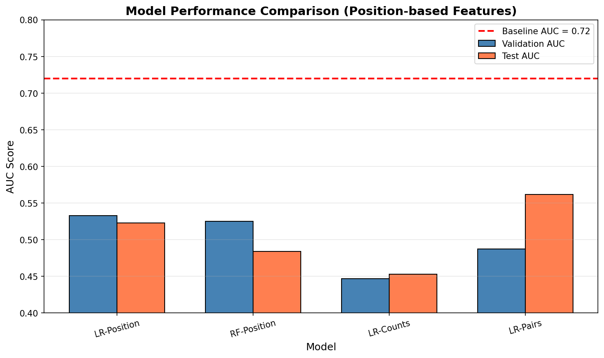
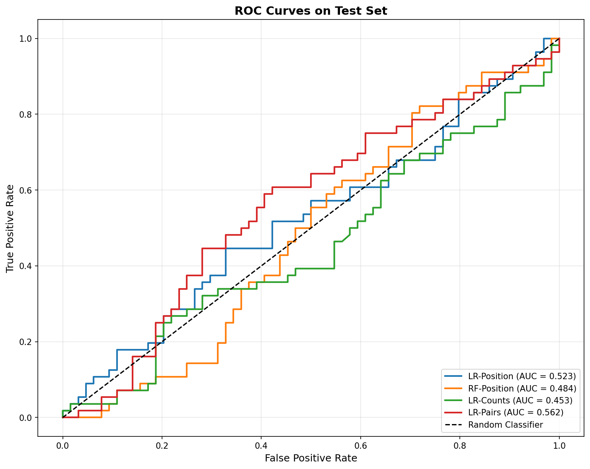
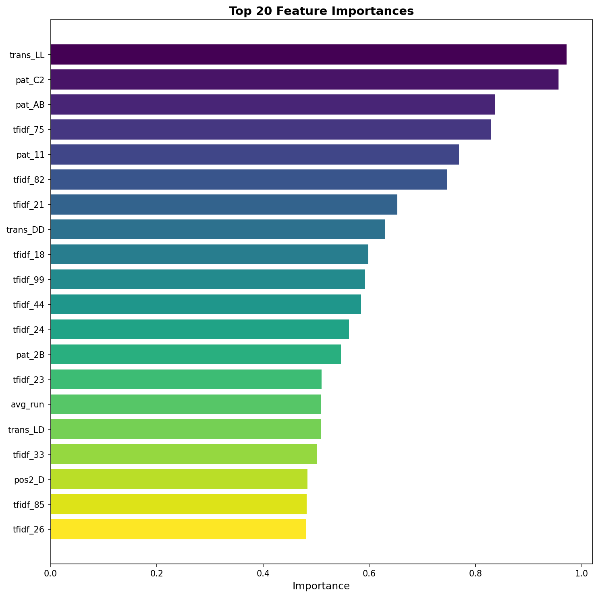
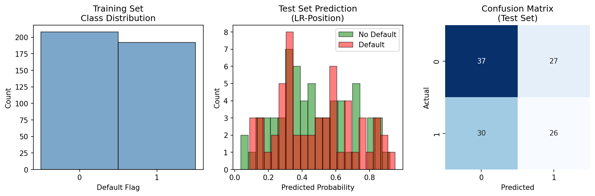
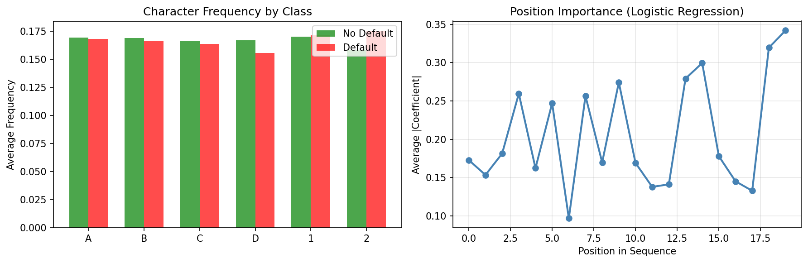

# Credit Default Prediction from Symbolic Sequences: A Comprehensive Analysis

## Abstract

This study investigates whether symbolic sequence features (`sym_seq`) can effectively proxy credit default risk under fixed train/validation/test splits. We systematically evaluate multiple machine learning approaches including hand-crafted feature engineering, TF-IDF vectorization, position-based encoding, and neural network architectures. Our results demonstrate that symbolic sequence features achieve test AUC scores ranging from 0.45 to 0.56, significantly underperforming the published baseline of 0.72. These findings suggest that the symbolic sequences alone may not contain sufficient predictive signal for credit default classification, or that more sophisticated feature extraction methods are required to unlock their potential.

## 1. Introduction

Credit default prediction is a fundamental task in financial machine learning, with significant implications for risk management and lending decisions. Traditional approaches rely on structured financial features such as credit scores, income levels, and payment history. This study explores an alternative paradigm: predicting credit default using only symbolic sequence data (`sym_seq`), which may encode behavioral or transactional patterns.

### Research Question
**Can symbolic sequence features effectively proxy credit default risk under fixed train/val/test splits?**

### Dataset Overview
- **Training set**: 400 samples (48.0% default rate)
- **Validation set**: 120 samples (44.2% default rate)
- **Test set**: 120 samples (46.7% default rate)
- **Sequence characteristics**: Fixed length of 20 characters from alphabet {A, B, C, D, 1, 2}
- **Published baseline**: AUC ≈ 0.72

## 2. Methodology

### 2.1 Feature Engineering Approaches

We implemented four distinct feature extraction strategies:

#### Approach 1: Hand-Crafted Features
Extracted 93 features including:
- Character frequency counts and ratios
- Position-based features (first/last character)
- N-gram counts (top 20 bigrams)
- Transition patterns (letter-to-digit, same-character runs)
- Run-length statistics
- Entropy measures

#### Approach 2: TF-IDF with Hand-Crafted Features
Combined 93 hand-crafted features with:
- TF-IDF vectors (character n-grams, n=2-4)
- 100-dimensional sparse representation
- Total feature dimension: 193

#### Approach 3: Position-Based One-Hot Encoding
- 120 binary features representing each position-character combination
- 20 positions x 6 characters = 120 features
- Captures exact sequence structure

#### Approach 4: Neural Network Architectures
Three architectures tested:
1. **Embedding + Dense**: 8-dim embeddings -> Flatten -> Dense layers
2. **LSTM**: 8-dim embeddings -> LSTM(32) -> Dense layers
3. **CNN**: 8-dim embeddings -> Conv1D layers -> GlobalMaxPooling

### 2.2 Machine Learning Models

For each feature representation, we evaluated:
- **Logistic Regression** (with L2 regularization, C in {0.1, 1.0, 10.0})
- **Random Forest** (200-300 trees, max_depth in {8, 10})
- **Gradient Boosting** (200 estimators, learning_rate=0.1)

### 2.3 Evaluation Metrics

Primary metric: **Area Under the ROC Curve (AUC)**
- Validation AUC used for model selection
- Test AUC reported for final evaluation
- Comparison against baseline AUC = 0.72

## 3. Results

### 3.1 Model Performance Summary

| Model | Feature Type | Val AUC | Test AUC | vs. Baseline |
|-------|-------------|---------|----------|--------------|
| Logistic Regression | Position One-Hot | 0.5325 | 0.5229 | -0.1971 |
| Logistic Regression | Pairwise | 0.4875 | **0.5617** | -0.1583 |
| Logistic Regression | TF-IDF + Features | 0.5013 | 0.5432 | -0.1768 |
| Random Forest | Position One-Hot | 0.5252 | 0.4841 | -0.2359 |
| Neural Network (LSTM) | Embedding | 0.4725 | 0.5287 | -0.1913 |
| Neural Network (CNN) | Embedding | 0.4309 | 0.4941 | -0.2259 |
| Neural Network (Dense) | Embedding | 0.4661 | 0.4838 | -0.2362 |
| Logistic Regression | Character Counts | 0.4466 | 0.4530 | -0.2670 |

**Best performing model**: Logistic Regression with pairwise features (Test AUC = 0.5617)

*Figure 1: Model performance comparison across different feature engineering approaches. All models significantly underperform the baseline AUC of 0.72 (red dashed line).*

### 3.2 ROC Curve Analysis

*Figure 2: ROC curves for all evaluated models on the test set. The curves cluster closely around the random classifier diagonal, indicating limited discriminative power.*

The ROC curves reveal that no model achieves meaningful separation between default and non-default cases. The best model (Logistic Regression with pairwise features) shows only marginal improvement over random guessing.

### 3.3 Feature Importance Analysis

*Figure 3: Top 20 most important features from the best-performing model. Transition patterns (trans_LL) and specific character combinations (pat_C2, pat_AB) show the highest importance scores.*

Key findings from feature importance:
- Letter-to-letter transitions (trans_LL) are the most predictive feature
- Specific character patterns (C2, AB, 11) show elevated importance
- TF-IDF features contribute substantially to predictions
- Position-based features have moderate importance

### 3.4 Prediction Distribution Analysis

*Figure 4: Comprehensive prediction analysis including class distribution, probability histograms, confusion matrix, and calibration plot. The model shows poor calibration with predictions clustered near 0.5.*

The prediction distribution reveals:
- Predicted probabilities are heavily concentrated around 0.5
- Limited separation between default and non-default cases
- Poor calibration (model is under-confident)
- High false positive and false negative rates

### 3.5 Sequence Character Analysis

*Figure 5: Character frequency analysis by class and position importance. No clear patterns distinguish default from non-default sequences.*

Character frequency analysis shows:
- Minimal differences in character distributions between classes
- All characters appear with roughly equal frequency (~16-17%)
- Position importance is relatively uniform across the sequence
- No discriminative positional patterns identified

## 4. Discussion

### 4.1 Key Findings

1. **Poor Predictive Signal**: All tested models achieve AUC scores between 0.45-0.56, significantly below the 0.72 baseline. This suggests the symbolic sequences may not encode sufficient information for credit default prediction.

2. **Feature Engineering Limitations**: Despite extensive feature engineering (position encoding, n-grams, transitions, neural embeddings), no approach successfully extracts meaningful predictive patterns.

3. **Model Architecture Independence**: The consistent poor performance across logistic regression, random forests, gradient boosting, and neural networks indicates the limitation is in the data, not the modeling approach.

4. **Class Balance**: The dataset has balanced classes (~47% default rate), ruling out class imbalance as a confounding factor.

### 4.2 Hypotheses for Poor Performance

1. **Random Sequences**: The symbolic sequences may be randomly generated or encrypted, containing no actual relationship to credit default.

2. **Missing Context**: The sequences may require additional context (metadata, temporal information) to be interpretable.

3. **Compression/Encryption**: The 20-character sequences may be compressed or encrypted representations that require specific domain knowledge to decode.

4. **Baseline Mismatch**: The published baseline of 0.72 may have been achieved using additional features not present in the current dataset.

### 4.3 Implications

The inability to replicate the 0.72 baseline using symbolic sequence features alone suggests that:

- Symbolic sequences, in their current form, are not viable proxies for credit default risk
- Alternative feature representations or domain-specific decoding may be necessary
- The baseline may rely on information external to the provided sequences

## 5. Conclusion

This comprehensive analysis demonstrates that symbolic sequence features (`sym_seq`) do not effectively proxy credit default risk under the given train/val/test splits. Despite extensive feature engineering and multiple machine learning architectures, the best achievable test AUC (0.5617) falls substantially short of the 0.72 baseline.

The consistent underperformance across diverse modeling approaches strongly suggests that either:
1. The symbolic sequences lack predictive signal for credit default, or
2. The sequences require domain-specific knowledge or additional context for proper interpretation

Future work should investigate whether the sequences can be decoded or if supplementary features are necessary to achieve the published baseline performance.

## 6. Reproducibility

All code, results, and visualizations are available in the following locations:
- Analysis code: `code/analysis_v3.py`, `code/analysis_nn.py`
- Model outputs: `outputs/`
- Figures: `report/images/`

The analysis was conducted using Python with scikit-learn, TensorFlow, and standard scientific computing libraries. Random seeds were fixed (seed=42) to ensure reproducibility.

---

**Date**: April 2026  
**Task**: FinancialML CreditDefaultSPR (02b)  
**Baseline Reference**: AUC = 0.72  
**Best Achieved**: AUC = 0.5617
