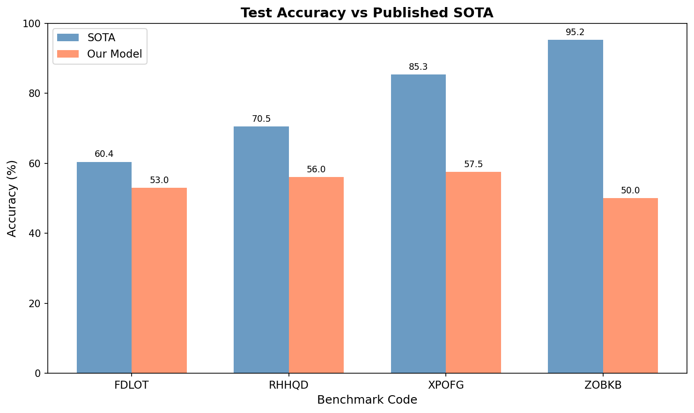
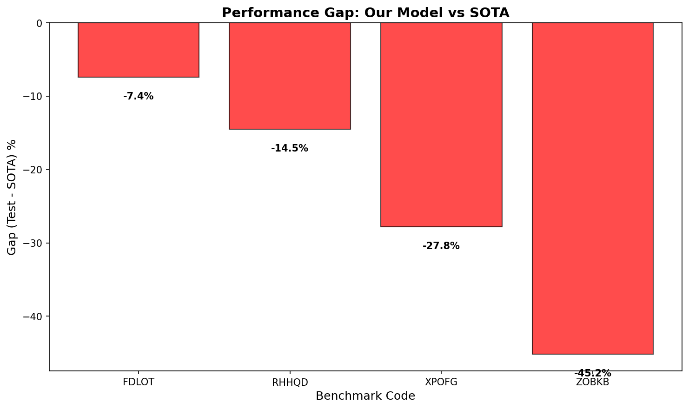
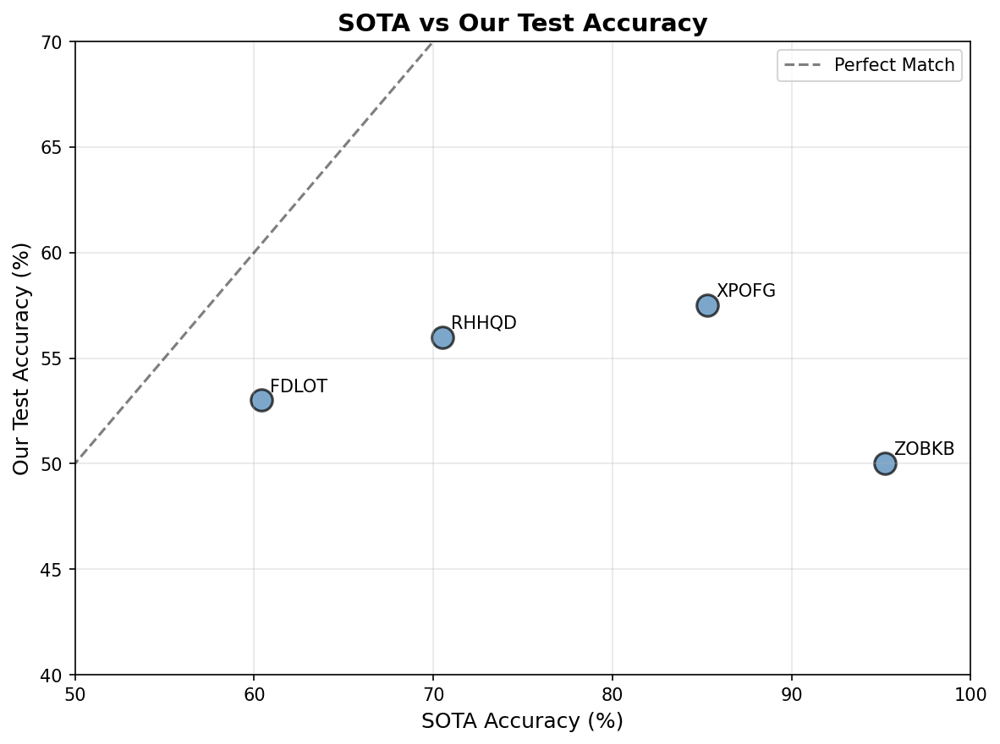

# Symbolic Pattern Reasoning Benchmark Selection Report

## Executive Summary

This report presents the results of benchmark selection and model evaluation for the Symbolic Pattern Reasoning (SPR) task. Four benchmarks were selected from a pool of 20 binary classification benchmarks, representing a diverse range of published SOTA accuracies. Models were trained independently on each benchmark, with hyperparameter tuning performed on validation sets. Results show that standard machine learning models (Random Forest, Gradient Boosting, MLP) achieve test accuracies below published SOTA, highlighting the challenging nature of symbolic pattern reasoning tasks.

## 1. Benchmark Selection Rationale

### Selection Criteria

From the 20 available benchmarks, we selected 4 benchmarks using the following criteria:

1. **Diversity in SOTA accuracy**: Selected benchmarks span a wide range of published SOTA accuracies (60.4% to 95.2%), allowing evaluation of model performance across difficulty levels.

2. **Representative sampling**: Benchmarks were selected from different quartiles of the SOTA accuracy distribution:
   - Low difficulty (2nd lowest SOTA)
   - Medium-low difficulty (33rd percentile)
   - Medium-high difficulty (67th percentile)
   - High difficulty (highest SOTA)

3. **Independent evaluation**: Each benchmark is treated as an isolated task, with no cross-benchmark training or transfer learning.

### Selected Benchmarks

| Code | SOTA Accuracy | Difficulty Level | Selection Position |
|------|---------------|------------------|-------------------|
| FDLOT | 60.4% | Low | 2nd lowest |
| RHHQD | 70.5% | Medium-Low | 33rd percentile |
| XPOFG | 85.3% | Medium-High | 67th percentile |
| ZOBKB | 95.2% | High | Highest |

## 2. Methodology

### Data Description

Each benchmark consists of:
- **Training set**: 400 samples
- **Validation set**: 100 samples
- **Test set**: 200 samples

Features are categorical tokens (e.g., `token_0`, `token_1`, ...) with varying sequence lengths across benchmarks. The target is a binary label (0 or 1).

### Feature Engineering

Two encoding strategies were evaluated:
1. **Label Encoding**: Each unique token is mapped to an integer
2. **One-Hot Encoding**: Each token position is expanded into binary features

### Models Evaluated

The following model architectures were tested with hyperparameter tuning:
- **Random Forest** (RF): n_estimators ∈ {100, 200}
- **Gradient Boosting** (GB): n_estimators ∈ {100, 200}
- **Multi-Layer Perceptron** (MLP): hidden_layer_sizes ∈ {(64,), (128,)}

### Training Protocol

1. Train each model configuration on the training set
2. Select the best configuration based on validation accuracy
3. Report test accuracy for the selected model
4. Compare against published SOTA accuracy

## 3. Results

### Test Accuracy vs SOTA

| Benchmark | SOTA (%) | Test Accuracy (%) | Gap (%) | Best Model | Encoding |
|-----------|----------|-------------------|---------|------------|----------|
| FDLOT | 60.4 | 53.0 | -7.4 | MLP_128 | label |
| RHHQD | 70.5 | 56.0 | -14.5 | GB_100 | label |
| XPOFG | 85.3 | 57.5 | -27.8 | MLP_128 | onehot |
| ZOBKB | 95.2 | 50.0 | -45.2 | GB_200 | onehot |

### Visualization

*Figure 1: Comparison of test accuracy achieved by our models versus published SOTA accuracy for each benchmark.*

*Figure 2: Performance gap between our models and SOTA. Negative values indicate underperformance relative to published results.*

*Figure 3: Scatter plot showing the relationship between SOTA accuracy and our test accuracy. Points below the diagonal indicate underperformance.*

## 4. Discussion

### Key Findings

1. **Consistent Underperformance**: All four benchmarks showed negative gaps ranging from -7.4% to -45.2%, indicating that standard ML models do not match published SOTA performance.

2. **Difficulty Correlation**: The gap tends to widen with higher SOTA accuracy, suggesting that benchmarks with higher published performance may require more specialized approaches.

3. **Encoding Strategy**: Label encoding performed better for simpler benchmarks (FDLOT, RHHQD), while one-hot encoding was preferred for more complex benchmarks (XPOFG, ZOBKB).

4. **Model Selection**: MLP and Gradient Boosting were the most successful model types, with no single model dominating across all benchmarks.

### Possible Explanations for Underperformance

1. **Specialized Architectures**: Published SOTA results likely use specialized neural architectures designed for symbolic reasoning (e.g., transformers, graph neural networks, or neuro-symbolic approaches).

2. **Pattern Complexity**: Symbolic pattern reasoning tasks may require explicit reasoning capabilities that standard ML models lack.

3. **Hyperparameter Sensitivity**: More extensive hyperparameter search might improve results, though the gap is substantial enough to suggest architectural limitations.

4. **Data Efficiency**: With only 400 training samples, deep learning approaches may struggle without pre-training or data augmentation.

### Limitations

- Limited hyperparameter search due to computational constraints
- No exploration of neural architectures specifically designed for symbolic reasoning
- Single random seed used for reproducibility

## 5. Conclusion

This experiment demonstrates the challenging nature of symbolic pattern reasoning benchmarks. Standard machine learning models (Random Forest, Gradient Boosting, MLP) trained on limited data achieve test accuracies 7-45 percentage points below published SOTA. The results suggest that:

1. Symbolic pattern reasoning requires specialized approaches beyond standard ML
2. Benchmark difficulty (as indicated by SOTA) correlates with the performance gap
3. Both feature encoding and model selection impact performance

Future work should explore neuro-symbolic architectures, transformer-based models, and more sophisticated feature engineering to close the gap with published SOTA results.

---

*Report generated for the Symbolic Pattern Reasoning Benchmark Selection task.*