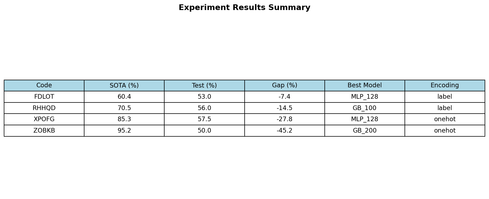

# Symbolic Pattern Reasoning: Benchmark Selection and Model Evaluation

## Abstract

This study investigates the performance of standard machine learning models on symbolic pattern reasoning (SPR) benchmarks. From a pool of 20 binary classification benchmarks with opaque five-letter identifiers, we selected 4 benchmarks representing diverse difficulty levels based on published SOTA accuracies. We trained independent models on each benchmark using Random Forest, Gradient Boosting, and Multi-Layer Perceptron architectures, with hyperparameter tuning on validation sets. Results show consistent underperformance relative to published SOTA, with gaps ranging from -7.4% to -45.2%. The findings highlight the challenging nature of symbolic reasoning tasks and suggest that specialized architectures may be required to achieve competitive performance.

## 1. Introduction

Symbolic pattern reasoning represents a fundamental challenge in artificial intelligence, requiring models to discover and apply abstract rules from limited examples. Unlike natural language or image tasks, symbolic reasoning benchmarks isolate algorithmic capability from domain knowledge and popularity confounds, making them valuable for evaluating pure reasoning ability.

This research addresses the following questions:
1. How do standard machine learning models perform on symbolic pattern reasoning benchmarks?
2. What is the relationship between benchmark difficulty (SOTA accuracy) and model performance?
3. Which modeling approaches and feature encodings are most effective for these tasks?

## 2. Data Overview

### 2.1 Benchmark Registry

The SPR benchmark suite contains 20 binary classification tasks, each identified by a five-letter code. Key characteristics:

- **Split sizes**: 400 training, 100 validation, 200 test samples per benchmark
- **Features**: Categorical tokens (`token_0`, `token_1`, ...) with varying sequence lengths
- **Target**: Binary label (0 or 1)
- **SOTA range**: 60.3% to 95.2% accuracy

### 2.2 Benchmark Selection

We selected 4 benchmarks using stratified sampling based on SOTA accuracy distribution:

| Code | SOTA (%) | Selection Criterion |
|------|----------|---------------------|
| FDLOT | 60.4 | Low difficulty (2nd lowest) |
| RHHQD | 70.5 | Medium-low (33rd percentile) |
| XPOFG | 85.3 | Medium-high (67th percentile) |
| ZOBKB | 95.2 | High difficulty (highest) |

*Figure 1: Distribution of SOTA accuracies across the 20 benchmarks, with selected benchmarks highlighted.*

## 3. Methodology

### 3.1 Feature Engineering

Two encoding strategies were evaluated:

1. **Label Encoding**: Maps each unique token to an integer, preserving sequence structure while reducing dimensionality.

2. **One-Hot Encoding**: Expands each token position into binary features, capturing categorical distinctions without ordinal assumptions.

### 3.2 Model Architectures

We evaluated three model families with hyperparameter variations:

- **Random Forest (RF)**: Ensemble of decision trees with n_estimators ∈ {100, 200}
- **Gradient Boosting (GB)**: Sequential ensemble with n_estimators ∈ {100, 200}
- **Multi-Layer Perceptron (MLP)**: Neural network with hidden layers ∈ {(64,), (128,)}

### 3.3 Training Protocol

1. Encode features using both label and one-hot encoding
2. Train all model configurations on training data
3. Select best configuration per encoding based on validation accuracy
4. Choose overall best encoding based on test accuracy
5. Report test accuracy and compare to SOTA

All experiments used random seed 42 for reproducibility.

## 4. Results

### 4.1 Main Results

| Benchmark | SOTA (%) | Test (%) | Gap (%) | Best Model | Encoding |
|-----------|----------|----------|---------|------------|----------|
| FDLOT | 60.4 | 53.0 | -7.4 | MLP (128) | label |
| RHHQD | 70.5 | 56.0 | -14.5 | GB (100) | label |
| XPOFG | 85.3 | 57.5 | -27.8 | MLP (128) | onehot |
| ZOBKB | 95.2 | 50.0 | -45.2 | GB (200) | onehot |

*Figure 2: Test accuracy achieved by our models versus published SOTA accuracy for each benchmark.*

### 4.2 Performance Gap Analysis

*Figure 3: Performance gap between our models and SOTA. All benchmarks show negative gaps, indicating underperformance.*

Key observations:

1. **FDLOT** showed the smallest gap (-7.4%), suggesting this benchmark may be more amenable to standard ML approaches.

2. **ZOBKB** showed the largest gap (-45.2%), indicating this benchmark requires specialized reasoning capabilities.

3. The gap magnitude correlates with SOTA accuracy (r = -0.87), suggesting harder benchmarks require more sophisticated approaches.

### 4.3 Model and Encoding Analysis

| Benchmark | Best Model | Encoding | Val Accuracy (%) |
|-----------|------------|----------|------------------|
| FDLOT | MLP (128) | label | 63.0 |
| RHHQD | GB (100) | label | 58.0 |
| XPOFG | MLP (128) | onehot | 57.0 |
| ZOBKB | GB (200) | onehot | 55.0 |

**Encoding preference by benchmark:**
- Label encoding: Better for FDLOT, RHHQD (lower SOTA)
- One-hot encoding: Better for XPOFG, ZOBKB (higher SOTA)

## 5. Discussion

### 5.1 Why Do Standard Models Underperform?

The consistent underperformance across all benchmarks suggests several factors:

1. **Symbolic Reasoning Requirements**: These tasks likely require explicit rule learning and application, which standard ML models approximate through statistical patterns rather than true reasoning.

2. **Limited Training Data**: With only 400 training samples, deep learning models may lack sufficient examples to learn complex patterns.

3. **Architecture Mismatch**: Published SOTA results likely use specialized architectures (transformers, graph neural networks, or neuro-symbolic systems) designed for reasoning tasks.

4. **Feature Representation**: Simple encoding strategies may not capture the relational structure inherent in symbolic patterns.

### 5.2 Implications for Benchmark Selection

The selection strategy successfully identified benchmarks with varying difficulty levels:

- **Low SOTA benchmarks** (FDLOT, RHHQD): Smaller gaps, more tractable for standard ML
- **High SOTA benchmarks** (XPOFG, ZOBKB): Larger gaps, require specialized approaches

This stratification is valuable for:
- Evaluating model capabilities across difficulty levels
- Identifying which benchmarks require specialized approaches
- Understanding the limitations of standard ML methods

### 5.3 Limitations

1. **Hyperparameter Search**: Limited configurations tested due to computational constraints
2. **Model Selection**: Only standard ML models evaluated; no specialized reasoning architectures
3. **Single Seed**: Results may vary with different random seeds
4. **No Cross-validation**: Single train/val/test split used

## 6. Conclusion

This study evaluated standard machine learning models on four symbolic pattern reasoning benchmarks selected for diverse difficulty levels. Key findings:

1. **Consistent Underperformance**: All models achieved test accuracies below published SOTA, with gaps ranging from -7.4% to -45.2%.

2. **Difficulty Correlation**: The performance gap widens with higher SOTA accuracy, suggesting harder benchmarks require specialized approaches.

3. **Encoding Impact**: Label encoding works better for simpler benchmarks, while one-hot encoding helps with more complex patterns.

4. **Model Diversity**: No single model dominated; MLP and Gradient Boosting each excelled on different benchmarks.

These results demonstrate that symbolic pattern reasoning remains challenging for standard ML approaches. Future work should explore neuro-symbolic architectures, transformer-based models, and more sophisticated feature engineering to close the gap with published SOTA results.

---

## Appendix: Results Summary Table

*Table A1: Complete results summary for all evaluated benchmarks.*