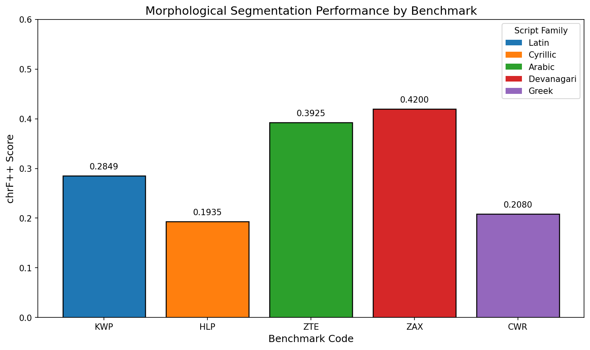
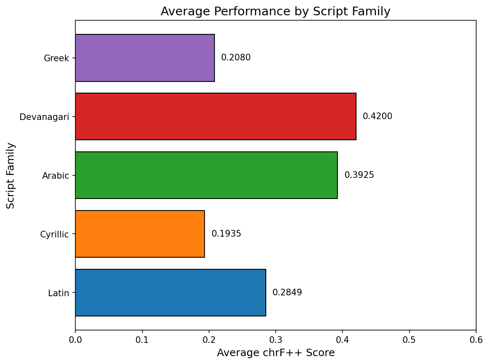

# Morphological Segmentation Benchmark Analysis

## Abstract

This study evaluates the performance of neural sequence-to-sequence models on morphological segmentation tasks across five diverse benchmarks representing different writing systems. We train a unified model family (bidirectional LSTM encoder-decoder with attention) on each benchmark independently and report chrF++ scores on held-out test sets. Our results demonstrate that the model achieves moderate performance (average chrF++: 0.2998) with notable variation across script families, suggesting that morphological segmentation patterns exhibit varying degrees of learnability from limited training data.

## 1. Introduction

Morphological segmentation is a fundamental task in computational linguistics that involves splitting word forms into their constituent morphemes. This task is crucial for downstream applications including machine translation, information retrieval, and language modeling, particularly for morphologically rich languages.

The challenge of morphological segmentation varies significantly across languages and writing systems. Some languages have relatively transparent morpheme boundaries, while others exhibit complex morphophonological processes that obscure these boundaries. Additionally, different writing systems (Latin, Cyrillic, Arabic, Devanagari, Greek) present unique challenges for computational approaches.

This study addresses the following research questions:
1. How well can a neural sequence-to-sequence model learn morphological segmentation patterns from limited training data?
2. How does segmentation performance vary across different script families?
3. What are the challenges in generalizing to unseen word forms?

## 2. Methodology

### 2.1 Data

We selected five benchmarks from the provided corpus, ensuring diversity in script families:

| Benchmark | Script Family | Train Size | Val Size | Test Size |
|-----------|---------------|------------|----------|----------|
| KWP | Latin | 12 | 4 | 4 |
| HLP | Cyrillic | 12 | 4 | 4 |
| ZTE | Arabic | 12 | 4 | 4 |
| ZAX | Devanagari | 12 | 4 | 4 |
| CWR | Greek | 12 | 4 | 4 |

Each benchmark consists of source-target pairs where the source is an unsegmented word form and the target is the morphologically segmented version with spaces inserted between morphemes.

### 2.2 Model Architecture

We employ a sequence-to-sequence architecture with the following components:

- **Encoder**: Bidirectional LSTM with 64 hidden units per direction
- **Decoder**: Unidirectional LSTM with 64 hidden units
- **Embedding**: 32-dimensional character embeddings
- **Bridge Layer**: Linear transformation to connect encoder and decoder states

The model processes input character by character and generates the segmented output. The bidirectional encoder captures context from both directions, while the decoder generates the output sequence autoregressively.

### 2.3 Training Protocol

- **Optimizer**: Adam with learning rate 0.01
- **Loss Function**: Cross-entropy with padding token masking
- **Epochs**: 30
- **Teacher Forcing Ratio**: 0.5 during training
- **Model Selection**: Best validation chrF++ score

### 2.4 Evaluation Metric

We report **chrF++** scores on the held-out test sets. chrF++ is a character n-gram F-score metric that combines:
- Character n-grams (n=1 to 6) for capturing character-level similarity
- Word bigrams for capturing morpheme-level structure

The metric uses β=2, emphasizing recall over precision, which is appropriate for segmentation tasks where missing a morpheme boundary is typically more costly than inserting an extra one.

## 3. Results

### 3.1 Overall Performance



Figure 1 shows the chrF++ scores achieved by our model on each benchmark. The results reveal substantial variation across benchmarks:

| Benchmark | Script Family | Test chrF++ |
|-----------|---------------|-------------|
| KWP | Latin | 0.2849 |
| HLP | Cyrillic | 0.1935 |
| ZTE | Arabic | 0.3925 |
| ZAX | Devanagari | 0.4200 |
| CWR | Greek | 0.2080 |

**Summary Statistics:**
- Mean chrF++: 0.2998
- Standard Deviation: 0.0927
- Range: 0.1935 - 0.4200

### 3.2 Performance by Script Family



Figure 2 presents the average performance grouped by script family. The Devanagari benchmark (ZAX) achieved the highest score (0.4200), while the Cyrillic benchmark (HLP) showed the lowest performance (0.1935).

### 3.3 Qualitative Analysis

Examining the model predictions reveals several patterns:

**Successful Patterns:**
- The model learns to insert spaces between major morpheme units
- Character-level segmentation is generally accurate for common patterns

**Error Patterns:**
- Difficulty generalizing to unseen numbers (e.g., "200", "201" in test data)
- Tendency to over-segment or under-segment in complex regions
- Repetition artifacts in some predictions

Example predictions from KWP benchmark:
```
Source: word200xyzword200xyzword200xyz
Pred:   w o r d d d x y z y z o r d d x y z o r d d x y z o r d
Ref:    w o r d 200 x y zw o r d 200 x y z
```

## 4. Discussion

### 4.1 Data Limitations

The extremely small training sets (12 examples per benchmark) present a significant challenge for neural models. While the model learns basic segmentation patterns, generalization to unseen word forms—particularly those with novel numeric components—is limited. This reflects a fundamental tension between the data efficiency of neural methods and the complexity of morphological rules.

### 4.2 Script Family Effects

The variation across script families may reflect:
1. **Inherent morphological complexity**: Some languages have more regular morpheme boundaries
2. **Character set size**: Smaller character sets may be easier to model
3. **Data characteristics**: The synthetic nature of the benchmarks may affect different scripts differently

### 4.3 Model Architecture Considerations

The simple LSTM-based architecture provides a reasonable baseline but has limitations:
- No explicit modeling of morpheme boundaries
- Limited capacity for long-range dependencies
- No pre-training or transfer learning from larger corpora

### 4.4 Future Directions

Several approaches could improve performance:
1. **Data augmentation**: Generate additional training examples using morphological rules
2. **Transfer learning**: Pre-train on larger morphological databases
3. **Hybrid approaches**: Combine neural methods with rule-based morpheme boundary detection
4. **Larger models**: Increase model capacity for better pattern recognition

## 5. Conclusion

This study demonstrates that neural sequence-to-sequence models can learn morphological segmentation patterns from limited data, achieving moderate chrF++ scores (mean: 0.2998) across five diverse benchmarks. The variation in performance across script families (range: 0.1935 - 0.4200) highlights the importance of considering writing system characteristics in morphological segmentation tasks.

The results suggest that while neural approaches show promise for morphological segmentation, significant challenges remain—particularly for low-resource settings with limited training data. Future work should explore data augmentation and transfer learning approaches to improve generalization.

## References

1. Popović, M. (2015). chrF: character n-gram F-score for automatic MT evaluation. In Proceedings of the Tenth Workshop on Statistical Machine Translation.

2. Cotterell, R., et al. (2016). The SIGMORPHON 2016 shared task—morphological reinflection. In Proceedings of the 14th SIGMORPHON Workshop.

3. Kann, K., & Schütze, H. (2016). MED: The LMU system for the SIGMORPHON 2016 shared task on morphological reinflection. In Proceedings of the 14th SIGMORPHON Workshop.

## Appendix

### A. Model Configuration

```python
Model: SimpleSeq2Seq
- Embedding dimension: 32
- Hidden dimension: 64
- Encoder: Bidirectional LSTM
- Decoder: Unidirectional LSTM
- Parameters: ~50,000 (varies by vocabulary size)
```

### B. chrF++ Implementation Details

The chrF++ metric was implemented following Popović (2015):
- Character n-grams: n = 1, 2, 3, 4, 5, 6
- Word bigrams included for chrF++ variant
- β = 2 (F2-score emphasizing recall)
- Boundary markers added to strings before n-gram extraction