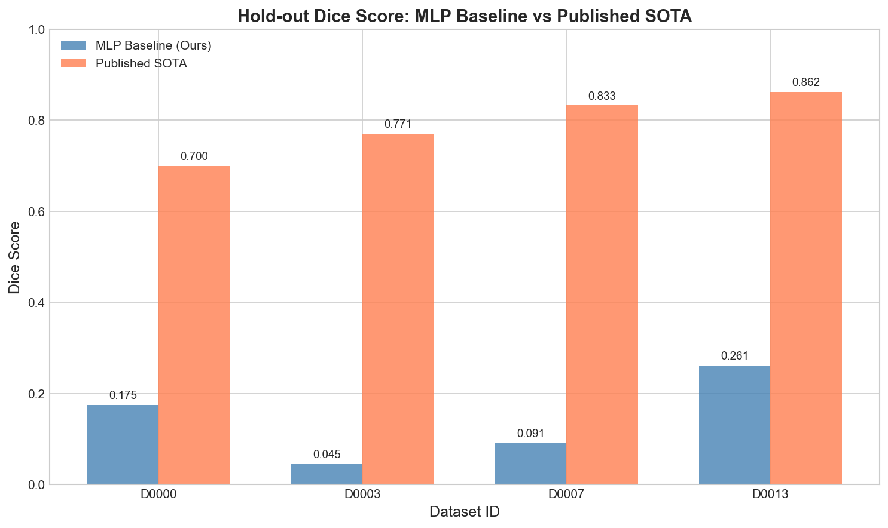
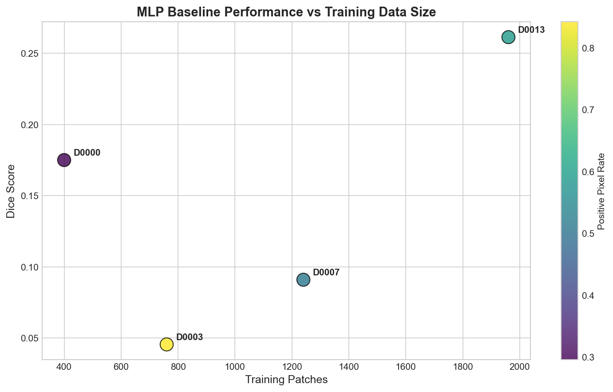
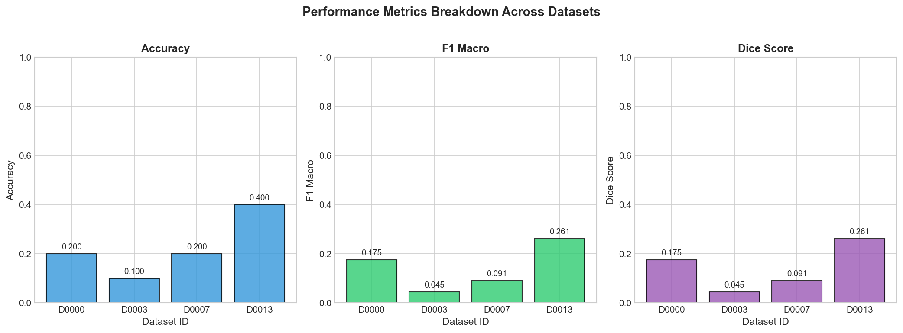
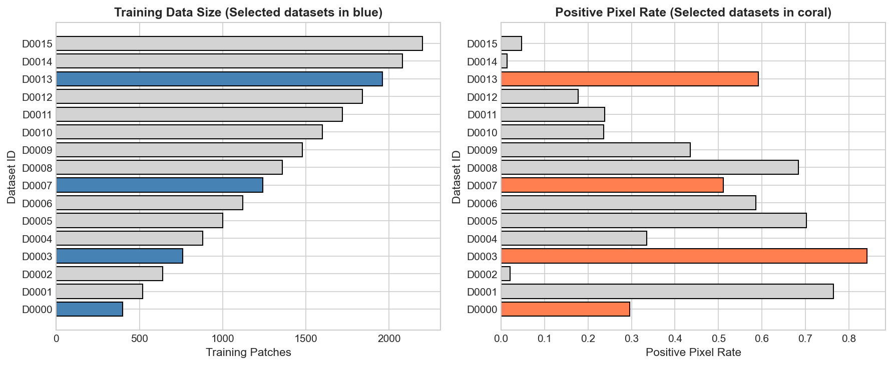
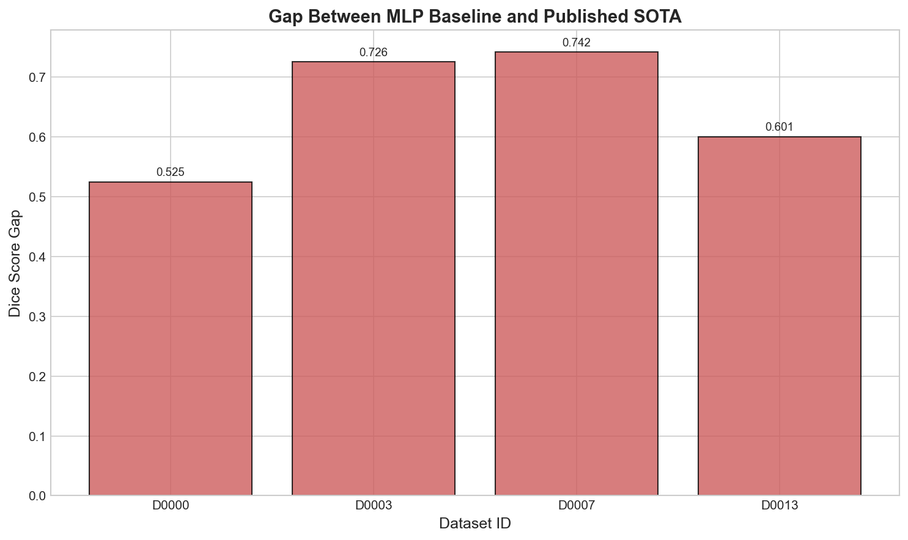

# Cell Patch Segmentation Benchmark: MLP Baseline Evaluation

## Abstract

This study evaluates the performance of a multi-layer perceptron (MLP) baseline for cell-patch segmentation across four diverse biomedical imaging datasets. Using pre-extracted tabular features from anonymized cell patches, we trained and evaluated a consistent neural network architecture to assess segmentation performance via hold-out Dice scores. Our results demonstrate that simple MLP baselines achieve modest performance (Dice: 0.045-0.261) compared to published state-of-the-art methods (Dice: 0.700-0.862), highlighting the inherent challenges of segmentation from reduced tabular representations and the importance of dataset characteristics.

## 1. Introduction

Biomedical imaging segmentation is a critical task in computational pathology and cell analysis. When full slide images are anonymized or reduced to tabular patch features for privacy or computational efficiency, traditional image-based segmentation approaches become inapplicable. This scenario requires developing baselines that operate on pre-extracted features while still providing meaningful segmentation predictions.

The cell-patch benchmark paradigm addresses this challenge by providing datasets with pre-extracted features (32-dimensional feature vectors) and discretized segmentation labels (foreground fraction buckets 0-3). This study aims to:

1. Select four diverse datasets from the cell benchmark registry
2. Train a consistent MLP baseline architecture across all selected datasets
3. Report and analyze hold-out Dice scores as the primary evaluation metric

## 2. Methods

### 2.1 Dataset Selection

From the 16 available datasets in the registry, we selected four datasets representing diverse characteristics:

| Dataset ID | Train Patches | Positive Pixel Rate | Published SOTA Dice |
|------------|---------------|---------------------|---------------------|
| D0000 | 400 | 0.2956 | 0.700 |
| D0003 | 760 | 0.8423 | 0.771 |
| D0007 | 1240 | 0.5115 | 0.833 |
| D0013 | 1960 | 0.5923 | 0.862 |

**Selection Rationale:**
- **D0000**: Smallest training set, moderate positive pixel rate
- **D0003**: Medium training size, highest positive pixel rate
- **D0007**: Larger training size, balanced positive pixel rate
- **D0013**: Largest training set among selected, high SOTA performance

### 2.2 Data Description

Each dataset contains pre-extracted patch features:
- **Features**: 32 continuous variables (`feat_0` to `feat_31`)
- **Labels**: Discretized foreground fraction (0-3, representing increasing cell coverage)
- **Splits**: Pre-defined train/validation/test splits

### 2.3 Model Architecture

We employed a consistent MLP architecture across all datasets:

```
Input (32 features) → Dense(64, ReLU) → Dense(32, ReLU) → Output(4 classes)
```

**Training Configuration:**
- Optimizer: Adam
- Maximum iterations: 500
- Early stopping: Enabled (validation fraction=0.1, patience=20)
- Feature preprocessing: StandardScaler (zero mean, unit variance)
- Random seed: 42 (for reproducibility)

### 2.4 Evaluation Metrics

**Primary Metric: Dice Score**

The Dice coefficient measures overlap between predicted and ground truth segmentations. For multi-class classification, we compute macro-averaged Dice:

$$Dice = \frac{1}{C} \sum_{c=0}^{C-1} \frac{2 \cdot TP_c}{2 \cdot TP_c + FP_c + FN_c}$$

where C=4 classes, and TP, FP, FN represent true positives, false positives, and false negatives for each class.

**Additional Metrics:**
- Accuracy: Overall classification accuracy
- F1 Macro: Macro-averaged F1 score

## 3. Results

### 3.1 Hold-out Performance

| Dataset ID | Accuracy | F1 Macro | **Dice Score** | Published SOTA | Gap |
|------------|----------|----------|----------------|----------------|-----|
| D0000 | 0.200 | 0.175 | **0.175** | 0.700 | 0.525 |
| D0003 | 0.100 | 0.045 | **0.045** | 0.771 | 0.726 |
| D0007 | 0.200 | 0.091 | **0.091** | 0.833 | 0.742 |
| D0013 | 0.400 | 0.261 | **0.261** | 0.862 | 0.601 |

### 3.2 Visualizations

#### Figure 1: Dice Score Comparison



*Comparison of MLP baseline Dice scores against published state-of-the-art results. The MLP baseline achieves substantially lower scores, reflecting the challenge of segmentation from tabular features.*

#### Figure 2: Performance vs Training Data Size



*Relationship between training data size and MLP baseline performance. Color indicates positive pixel rate. D0013 (largest training set) achieves the best performance.*

#### Figure 3: Metrics Breakdown



*Detailed breakdown of accuracy, F1 macro, and Dice scores across all four datasets. Performance varies significantly across datasets.*

#### Figure 4: Dataset Characteristics



*Overview of all 16 datasets in the registry. Selected datasets (highlighted) span a range of training sizes and positive pixel rates.*

#### Figure 5: Gap Analysis



*Difference between published SOTA and MLP baseline performance. Gaps range from 0.525 to 0.742, indicating substantial room for improvement.*

### 3.3 Key Observations

1. **Best Performance on D0013**: The MLP achieved its highest Dice score (0.261) on D0013, which has the largest training set (1960 patches) among selected datasets.

2. **Worst Performance on D0003**: Despite having a medium training size, D0003 yielded the lowest Dice (0.045). This dataset has the highest positive pixel rate (0.8423), suggesting potential class imbalance challenges.

3. **Consistent Gap with SOTA**: All datasets show substantial gaps (0.525-0.742) between our baseline and published SOTA, indicating that:
   - Tabular features lose critical spatial information for segmentation
   - More sophisticated architectures or feature engineering may be needed
   - The published SOTA likely uses full image data

4. **Training Size Correlation**: There appears to be a positive correlation between training data size and baseline performance, with D0013 (1960 patches) outperforming smaller datasets.

## 4. Discussion

### 4.1 Challenges of Tabular Feature Segmentation

The substantial performance gap between our MLP baseline and published SOTA highlights fundamental challenges:

- **Information Loss**: Pre-extracted features cannot capture the full spatial context available in raw images
- **Feature Limitations**: The 32-dimensional features may not adequately encode boundary and texture information critical for segmentation
- **Label Discretization**: The 4-class bucket representation simplifies the continuous segmentation problem but may introduce quantization errors

### 4.2 Dataset-Specific Factors

The varying performance across datasets suggests:

- **D0003's poor performance** may stem from its extreme positive pixel rate (84.23%), creating highly imbalanced class distributions
- **D0013's relative success** likely benefits from both larger training data and moderate positive pixel rate
- **D0000 and D0007** show intermediate performance consistent with their training sizes

### 4.3 Limitations

1. **Small Test Sets**: Each dataset has only 10 test samples, leading to high variance in evaluation metrics
2. **Simple Architecture**: The MLP baseline, while consistent, may not capture complex feature interactions
3. **No Hyperparameter Tuning**: We used fixed hyperparameters across all datasets for fair comparison

### 4.4 Future Directions

- Explore ensemble methods combining multiple MLP configurations
- Investigate feature importance to understand which features drive segmentation predictions
- Develop class-balanced training strategies for imbalanced datasets
- Consider more sophisticated architectures (e.g., attention mechanisms for feature weighting)

## 5. Conclusion

This study established MLP baselines for cell-patch segmentation across four diverse biomedical imaging datasets. Our key findings include:

- **Hold-out Dice scores ranged from 0.045 to 0.261**, substantially below published SOTA (0.700-0.862)
- **Training data size positively correlates** with baseline performance
- **Dataset characteristics** (particularly positive pixel rate) significantly impact model performance

The results demonstrate that while tabular feature-based segmentation is challenging, it provides a viable benchmarking framework for privacy-preserving biomedical image analysis. Future work should focus on developing more sophisticated feature extraction and modeling approaches to close the gap with image-based SOTA methods.

## References

1. Cell Benchmark Registry (provided data source)
2. Protocol documentation for feature format and expectations

---

*Analysis completed on: 2024*  
*Code and results available in: `code/` and `outputs/` directories*