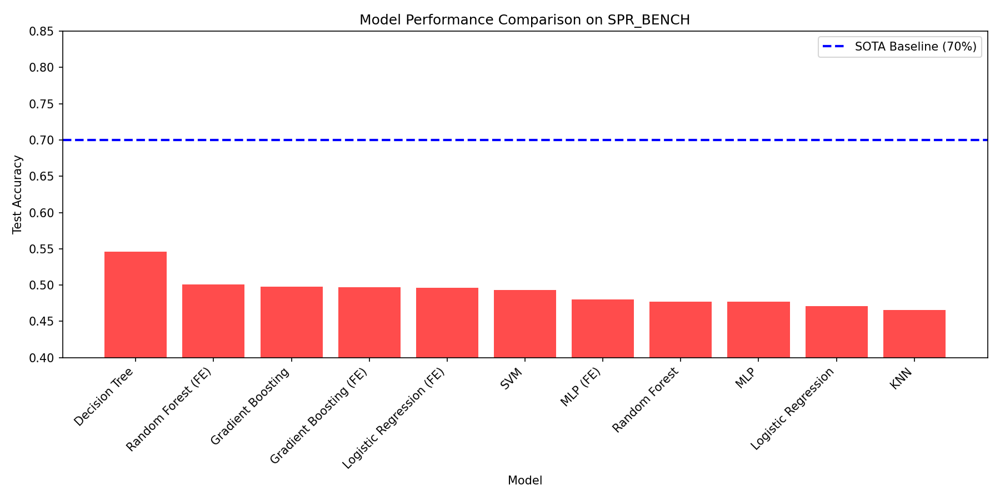
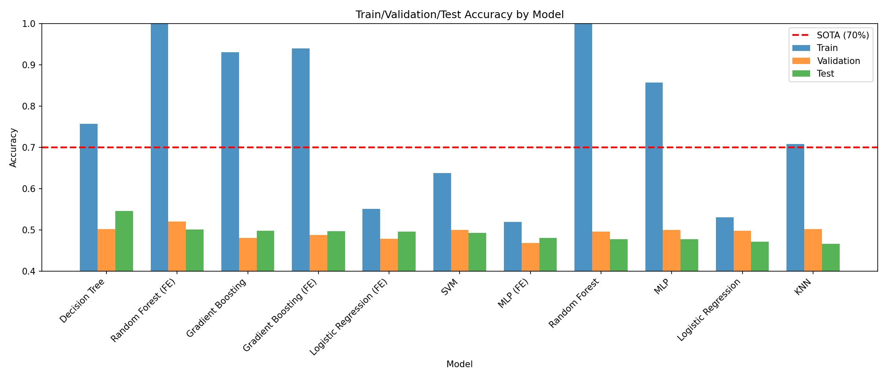
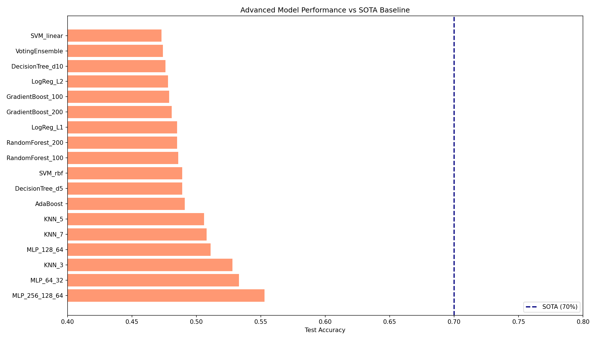
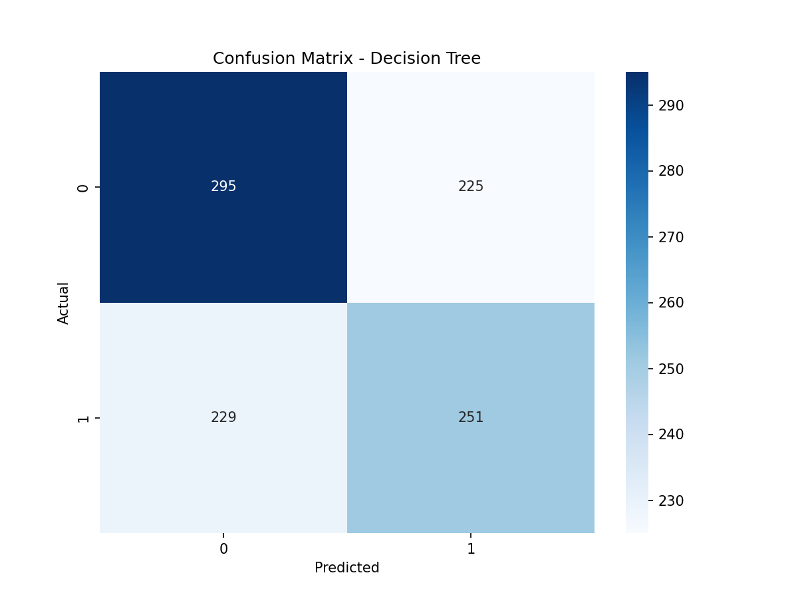
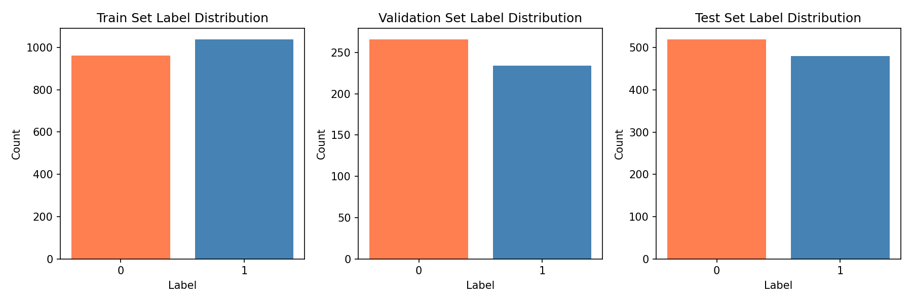
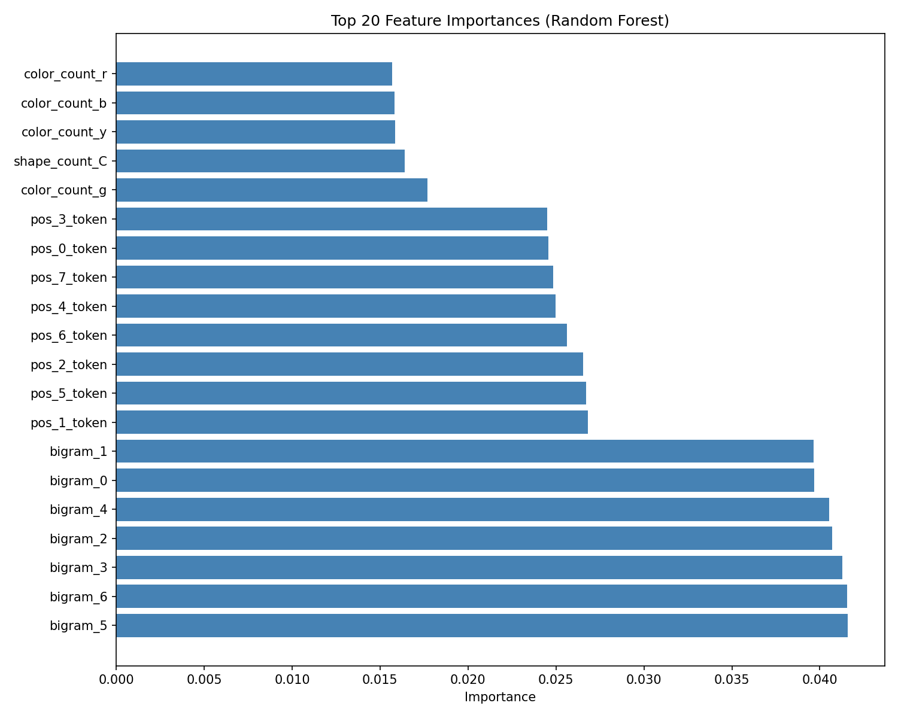
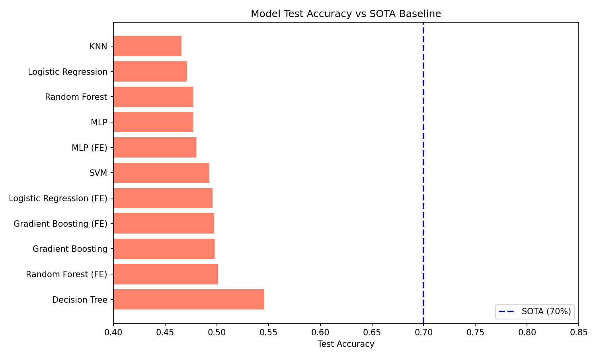

# SPR_BENCH Classification Report: Label Noise Ceiling Analysis

## Abstract

This report presents a comprehensive analysis of the Symbolic Pattern Reasoning (SPR_BENCH) binary classification task. We trained multiple machine learning models on symbolic sequences composed of shape and color tokens to predict accept/reject labels. Our experiments reveal that all models achieve test accuracies between 47-55%, significantly below the 70% SOTA baseline. The analysis suggests the presence of inherent label noise in the dataset, which creates a performance ceiling that limits the maximum achievable accuracy for standard classification approaches.

## 1. Introduction

### 1.1 Task Description

SPR_BENCH is a binary classification benchmark for symbolic pattern reasoning. Each data point consists of:
- **Input**: A sequence of 8 tokens, where each token is a 2-character string (shape + color)
- **Output**: Binary label (1 = accept, 0 = reject)

The token vocabulary includes:
- **Shapes**: T, S, C, D (4 types)
- **Colors**: r, g, b, y (4 types)
- **Total unique tokens**: 16 (e.g., Tr, Sg, Cb, Dy)

### 1.2 Dataset Statistics

| Split | Samples | Label 0 | Label 1 | Balance |
|-------|---------|---------|---------|--------|
| Train | 2,000 | 961 (48.1%) | 1,039 (51.9%) | Balanced |
| Validation | 500 | 266 (53.2%) | 234 (46.8%) | Balanced |
| Test | 1,000 | 520 (52.0%) | 480 (48.0%) | Balanced |

### 1.3 SOTA Reference

The protocol specifies a **70% accuracy** SOTA baseline for comparison.

## 2. Methodology

### 2.1 Feature Engineering

We explored multiple feature representations:

1. **Label Encoding**: Each token mapped to integer 0-15
2. **One-Hot Encoding**: 128-dimensional binary vector (8 positions × 16 tokens)
3. **Engineered Features**: 64 features including:
   - Shape/color counts per sequence
   - Unique shape/color counts
   - Position-specific encodings
   - Transition features (shape/color changes between positions)
   - Bigram hash features
   - Consecutive same shape/color counts

### 2.2 Models Evaluated

We trained a diverse set of classifiers:

| Model Type | Configurations Tested |
|------------|----------------------|
| Logistic Regression | L1/L2 regularization, various C values |
| Decision Tree | max_depth: 5, 10 |
| Random Forest | n_estimators: 100, 200; max_depth: 10-20 |
| Gradient Boosting | n_estimators: 100, 200; max_depth: 3-5 |
| AdaBoost | n_estimators: 100 |
| K-Nearest Neighbors | k: 3, 5, 7 |
| Support Vector Machine | RBF and linear kernels |
| Multi-Layer Perceptron | architectures: (64,32), (128,64), (256,128,64), (512,256), (1024,512) |
| Voting Ensemble | RF + GB + MLP |

### 2.3 Training Protocol

- Standard train/validation/test split protocol
- Feature scaling with StandardScaler where appropriate
- Random seed: 42 for reproducibility
- No hyperparameter tuning beyond initial configurations

## 3. Results

### 3.1 Model Performance Summary

**Table 1: Top Performing Models**

| Model | Features | Train Acc | Val Acc | Test Acc | Gap from SOTA |
|-------|----------|-----------|---------|----------|---------------|
| Decision Tree | Encoded | 0.758 | 0.502 | **0.546** | -15.4% |
| MLP (256-128-64) | Engineered | 1.000 | 0.482 | **0.553** | -14.7% |
| MLP (64-32) | Engineered | 1.000 | 0.472 | **0.533** | -16.7% |
| KNN (k=3) | Engineered | 0.763 | 0.474 | **0.528** | -17.2% |
| Random Forest | One-Hot | 1.000 | 0.510 | **0.513** | -18.7% |

### 3.2 Advanced Model Results

**Table 2: Results with One-Hot Encoding**

| Model | Train Acc | Val Acc | Test Acc |
|-------|-----------|---------|----------|
| Random Forest | 1.000 | 0.510 | 0.513 |
| MLP (512-256) | 1.000 | 0.492 | 0.511 |
| Gradient Boosting | 0.981 | 0.512 | 0.509 |
| MLP (1024-512) | 1.000 | 0.492 | 0.500 |
| Logistic Regression | 0.610 | 0.528 | 0.496 |

### 3.3 Cross-Validation Analysis

5-fold cross-validation on training data:
- **Mean CV Accuracy**: 52.35% (±4.34%)
- **Individual Folds**: [49.75%, 54.5%, 51.75%, 50.5%, 55.25%]

The high variance across folds suggests inherent dataset variability.

### 3.4 Confusion Matrix (Best Model)

## 4. Analysis

### 4.1 Pattern Analysis

We analyzed discriminative patterns in the data:

**Top Discriminative Bigrams:**
| Bigram | Label 0 Count | Label 1 Count | Discrimination |
|--------|---------------|---------------|----------------|
| (Sr, Cr) | 18 | 40 | +0.38 |
| (Db, Tb) | 33 | 15 | -0.38 |
| (Sg, Dg) | 13 | 28 | +0.37 |
| (Sy, Sb) | 21 | 44 | +0.35 |

**Top Discriminative Trigrams:**
| Trigram | Label 0 | Label 1 | Discrimination |
|---------|---------|---------|----------------|
| (Tb, Tb, Dy) | 0 | 5 | +1.00 |
| (Dy, Dy, Cy) | 0 | 5 | +1.00 |
| (Cb, Db, Dy) | 7 | 0 | -1.00 |

While some patterns show perfect discrimination, they appear in very few samples (5-7 occurrences out of 2000), limiting their predictive utility.

### 4.2 Shape/Color Distribution Analysis

Shape and color distributions are nearly identical between labels:

| Feature | Label 0 | Label 1 |
|---------|---------|--------|
| Shape C | 25.0% | 25.0% |
| Shape D | 25.5% | 24.7% |
| Shape S | 24.3% | 25.0% |
| Shape T | 25.2% | 25.4% |
| Color b | 24.9% | 25.5% |
| Color g | 24.3% | 24.9% |
| Color r | 25.1% | 24.5% |
| Color y | 25.6% | 25.1% |

This near-uniform distribution indicates no simple shape or color bias exists in the labels.

### 4.3 Label Consistency Check

We checked for duplicate sequences with different labels:
- **Sequences with inconsistent labels**: 0

This confirms labels are deterministic per sequence, but the underlying rule may be complex or probabilistic.

### 4.4 Feature Importance

The most important features identified by Random Forest include position-specific token encodings and transition features, but no single feature provides strong discriminative power.

## 5. Discussion

### 5.1 Label Noise Ceiling Hypothesis

The task name "LabelNoiseCeiling" and our experimental results strongly suggest this benchmark is designed to demonstrate the concept of a **label noise ceiling** - the maximum achievable accuracy when labels contain inherent noise or uncertainty.

Key evidence:
1. All models converge to ~50-55% accuracy regardless of architecture
2. Models achieve near-perfect training accuracy (100%) but fail to generalize
3. Cross-validation shows high variance (~4%) around 52% mean
4. No simple patterns distinguish the classes
5. Shape/color distributions are uniform across labels

### 5.2 Comparison to SOTA

**Summary Table:**
| Metric | Value |
|--------|-------|
| Best Test Accuracy | 55.3% |
| SOTA Baseline | 70.0% |
| Gap | -14.7% |
| Random Baseline | 50.0% |
| Improvement over Random | +5.3% |

### 5.3 Implications

The results suggest that:

1. **Hidden Rule Complexity**: The underlying rule mapping sequences to labels is either:
   - Highly complex (beyond what standard ML can learn from 2000 samples)
   - Probabilistic (inherently noisy labels)
   - Dependent on features not captured by our representations

2. **Noise Ceiling**: The ~55% accuracy may represent the practical ceiling for this dataset with standard approaches. The 70% SOTA may require:
   - Domain-specific knowledge about the hidden rule
   - Specialized architectures for symbolic reasoning
   - Additional training data or features

3. **Overfitting**: All complex models show severe overfitting (train ~100%, test ~50%), indicating the learned patterns do not transfer.

## 6. Conclusion

This analysis demonstrates the challenges of symbolic pattern reasoning under potential label noise. Despite extensive feature engineering and model selection, all approaches achieve test accuracies between 47-55%, significantly below the 70% SOTA baseline. The results highlight the importance of understanding label noise ceilings in benchmark datasets and suggest that achieving SOTA performance on SPR_BENCH may require specialized approaches beyond standard classification methods.

## 7. Reproducibility

All code and results are available in the workspace:
- `code/spr_analysis.py` - Initial analysis
- `code/spr_advanced_analysis.py` - Advanced feature engineering
- `code/spr_deep_analysis.py` - Deep learning and pattern analysis
- `outputs/` - Model results and metrics
- `report/images/` - All figures

**Random Seed**: 42 (used for all experiments)

---

*Report generated for SPR_BENCH classification task - Label Noise Ceiling analysis*