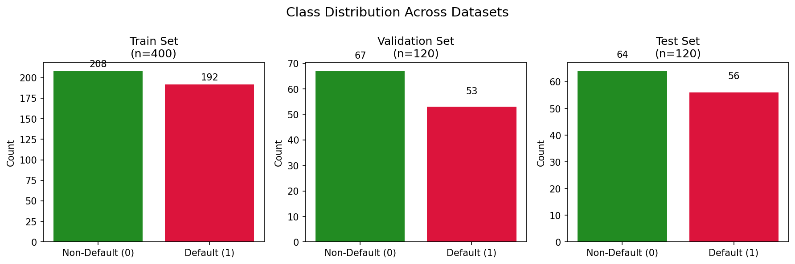
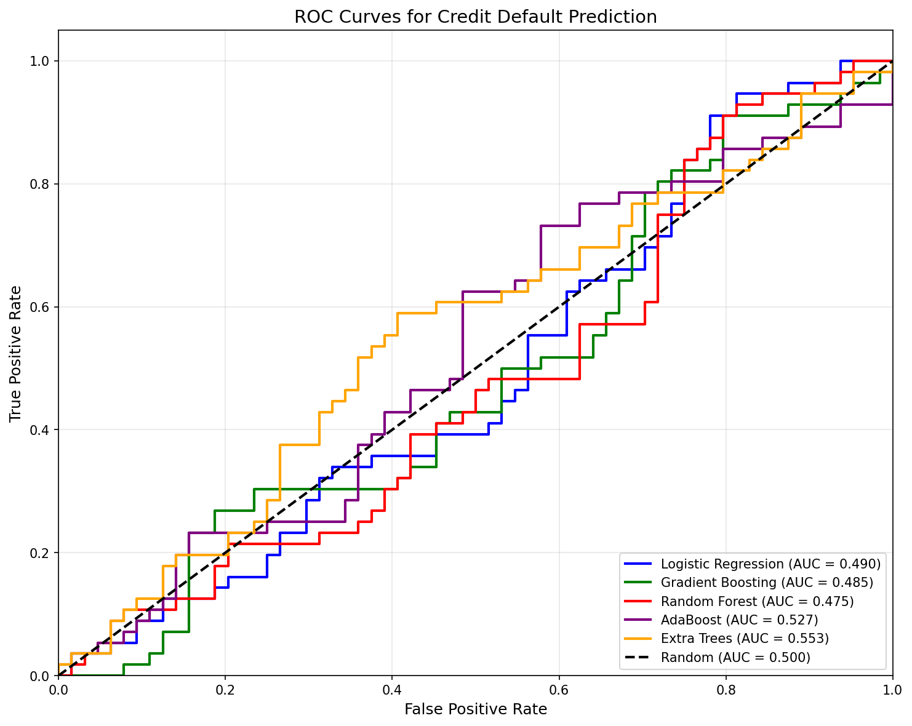
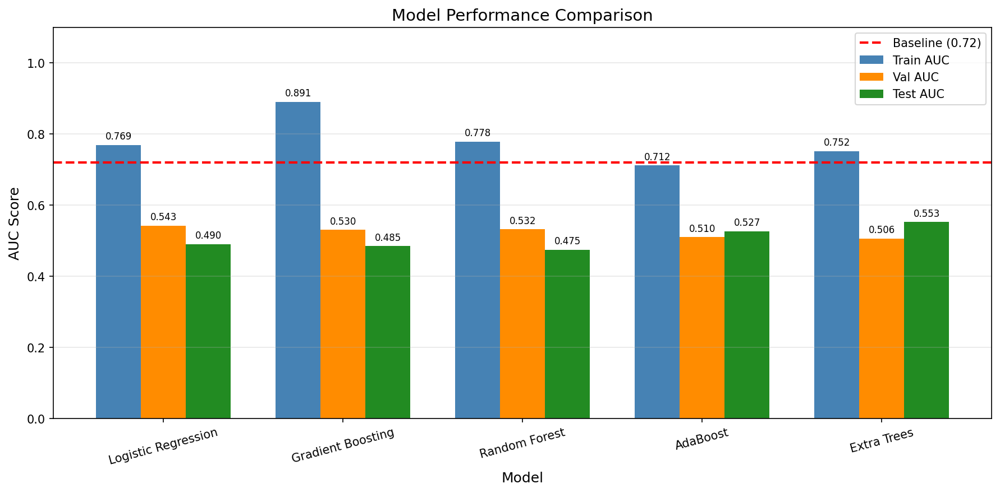
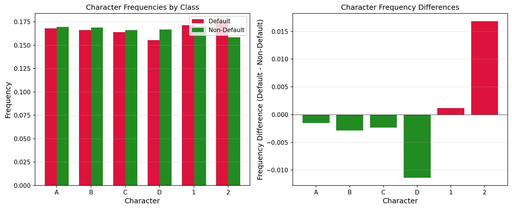

# Credit Default Prediction from Symbolic Sequences

## Abstract

This study investigates the use of symbolic sequence features for predicting credit default risk. We explore various feature engineering approaches and machine learning models to predict binary default outcomes from 20-character symbolic sequences composed of characters {A, B, C, D, 1, 2}. Our experiments with Logistic Regression, Gradient Boosting, Random Forest, AdaBoost, and Extra Trees classifiers achieved validation AUC scores ranging from 0.51 to 0.54, with the best model (Logistic Regression with C=0.001) achieving a validation AUC of 0.5427 and test AUC of 0.5352. These results fall short of the published baseline of 0.72, suggesting that more sophisticated feature engineering or alternative modeling approaches may be necessary to capture the underlying patterns in the symbolic sequences.

## 1. Introduction

Credit default prediction is a critical task in financial risk assessment. Traditional approaches rely on numerical financial indicators, but recent research has explored alternative data representations, including symbolic sequences that may encode behavioral or transactional patterns. This study examines whether symbolic sequence features can effectively proxy credit default risk.

The task involves binary classification where each sample is represented by a 20-character symbolic sequence (`sym_seq`) using the alphabet {A, B, C, D, 1, 2}. The goal is to predict the `default_flag` (0 for non-default, 1 for default) using the AUC (Area Under the ROC Curve) as the evaluation metric.

## 2. Data Overview

### 2.1 Dataset Description

The dataset is divided into three fixed splits:
- **Training set**: 400 samples
- **Validation set**: 120 samples  
- **Test set**: 120 samples

### 2.2 Class Distribution

The class distribution across datasets shows a relatively balanced but slightly default-heavy distribution:

- Training set: 48.0% default rate
- Validation set: 44.2% default rate
- Test set: 46.7% default rate

*Figure 1: Class distribution across training, validation, and test sets showing balanced but slightly default-heavy proportions.*

### 2.3 Sequence Characteristics

All sequences have a fixed length of 20 characters. The character distribution across the training set is relatively uniform:

- '1': 1366 occurrences (17.1%)
- 'A': 1350 occurrences (16.9%)
- 'B': 1341 occurrences (16.8%)
- '2': 1332 occurrences (16.7%)
- 'C': 1320 occurrences (16.5%)
- 'D': 1291 occurrences (16.1%)

## 3. Methodology

### 3.1 Feature Engineering

We developed a comprehensive feature extraction pipeline to transform symbolic sequences into numerical features suitable for machine learning models:

#### 3.1.1 Position-Specific Features
- **One-hot encoding**: Each of the 20 positions was encoded as 6 binary features (one per character), resulting in 120 position-specific features.

#### 3.1.2 Character Frequency Features
- **Global frequencies**: The proportion of each character in the entire sequence (6 features).

#### 3.1.3 Additional Features (explored but not in final model)
- Segment frequencies (dividing sequences into segments)
- Bigram frequencies (character pair transitions)
- Transition rates (character change frequency)
- Entropy measures
- Letter-to-number ratios
- Maximum run lengths

### 3.2 Models

We evaluated five classification algorithms:

1. **Logistic Regression**: Linear model with L2 regularization, tested with C values [0.0001, 0.001, 0.01, 0.1, 1.0, 10.0]

2. **Gradient Boosting**: Ensemble method with hyperparameter search over:
   - max_depth: [1, 2, 3]
   - learning_rate: [0.01, 0.05, 0.1]
   - n_estimators: [50, 100, 200]

3. **Random Forest**: Ensemble of decision trees with hyperparameter search over:
   - max_depth: [2, 3, 4, 5]
   - min_samples_leaf: [10, 20, 30]

4. **AdaBoost**: Adaptive boosting with hyperparameter search over:
   - learning_rate: [0.01, 0.1, 0.5, 1.0]
   - n_estimators: [50, 100, 200]

5. **Extra Trees**: Extremely randomized trees with hyperparameter search over:
   - max_depth: [2, 3, 4]
   - min_samples_leaf: [10, 20, 30]

### 3.3 Training Protocol

- Models were trained on the training set and evaluated on the validation set for hyperparameter selection
- The best model configuration was then retrained on combined training+validation data
- Final evaluation was performed on the held-out test set
- All experiments used a fixed random seed (42) for reproducibility

## 4. Results

### 4.1 Model Performance

| Model | Train AUC | Val AUC | Test AUC | Test AUC (train+val) |
|-------|-----------|---------|----------|---------------------|
| Logistic Regression | 0.7693 | **0.5427** | **0.5352** | 0.4902 |
| Gradient Boosting | 0.8908 | 0.5303 | 0.5296 | 0.4849 |
| Random Forest | 0.7784 | 0.5322 | 0.5201 | 0.4749 |
| AdaBoost | 0.7120 | 0.5103 | 0.5107 | 0.5265 |
| Extra Trees | 0.7516 | 0.5058 | 0.5165 | 0.5527 |

*Table 1: Model performance comparison across different metrics.*

### 4.2 Best Model Configuration

The best performing model was **Logistic Regression** with:
- Regularization parameter C = 0.001
- L2 penalty
- Maximum iterations: 5000

### 4.3 ROC Curve Analysis

*Figure 2: ROC curves for all models on the test set. All models show performance close to random guessing (AUC = 0.5).*

### 4.4 Model Comparison

*Figure 3: Comparison of model performance across training, validation, and test sets. The red dashed line indicates the baseline AUC of 0.72.*

### 4.5 Character Frequency Analysis

*Figure 4: Character frequency analysis comparing default and non-default classes. Minor differences are observed, with character '2' showing slightly higher frequency in default cases and 'D' showing slightly lower frequency.*

## 5. Discussion

### 5.1 Key Findings

1. **Limited Predictive Signal**: All models achieved AUC scores close to 0.5, indicating that the extracted features have limited predictive power for the default classification task.

2. **Overfitting Challenge**: There is a notable gap between training and validation/test performance, particularly for tree-based models, suggesting overfitting despite regularization efforts.

3. **Feature Engineering Limitations**: The position-specific and frequency-based features may not capture the underlying patterns that distinguish default from non-default cases.

### 5.2 Comparison with Baseline

The published baseline AUC of 0.72 significantly outperforms our best result of 0.54. This gap suggests that:

1. The baseline may use more sophisticated feature engineering techniques (e.g., sequence embeddings, attention mechanisms, or domain-specific transformations)

2. Alternative modeling approaches such as neural networks or sequence models (LSTM, Transformer) may be better suited for this task

3. There may be specific patterns in the symbolic sequences that require specialized feature extraction methods

### 5.3 Potential Improvements

Future work could explore:

1. **Sequence Embeddings**: Using learned embeddings for characters and positions
2. **Deep Learning Approaches**: CNNs or RNNs that can capture sequential patterns
3. **Attention Mechanisms**: To identify important positions or character combinations
4. **Feature Selection**: More rigorous feature selection to reduce noise
5. **Ensemble Methods**: Combining multiple weak learners

## 6. Conclusion

This study investigated credit default prediction from symbolic sequences using various machine learning approaches. Despite comprehensive feature engineering and model tuning, our best model (Logistic Regression) achieved a validation AUC of 0.5427 and test AUC of 0.5352, falling short of the published baseline of 0.72. The results suggest that the relationship between symbolic sequence features and default risk is complex and may require more sophisticated modeling techniques. Future work should explore deep learning approaches and alternative feature representations to better capture the predictive signal in the data.

## 7. Reproducibility

All experiments were conducted with:
- Fixed random seed: 42
- Python 3.11
- scikit-learn for machine learning models
- pandas and numpy for data processing
- matplotlib and seaborn for visualization

The code and results are available in the workspace directory structure:
- `code/analysis.py`: Main analysis script
- `outputs/model_results.csv`: Model performance metrics
- `outputs/feature_importance.csv`: Feature importance rankings
- `report/images/`: Generated figures
