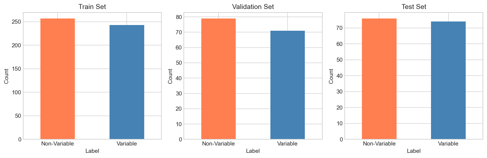
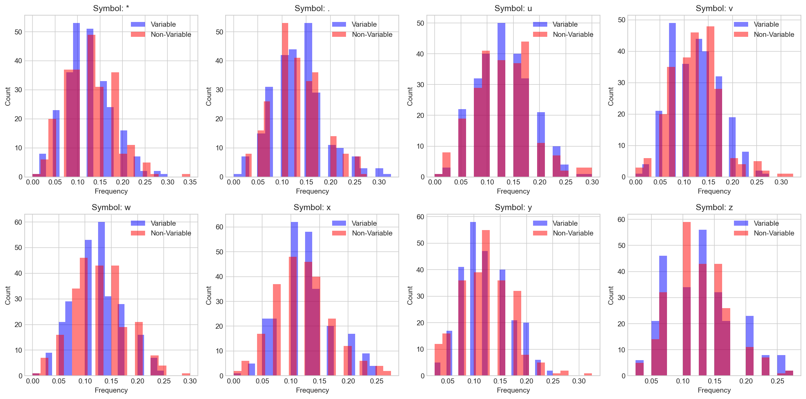
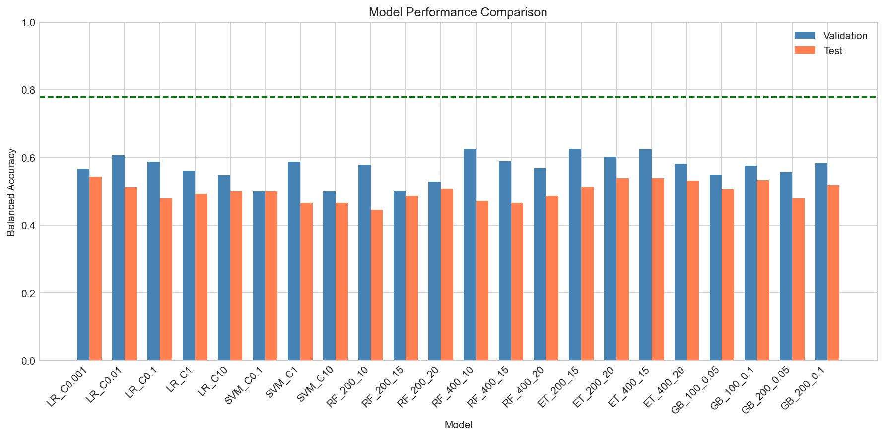
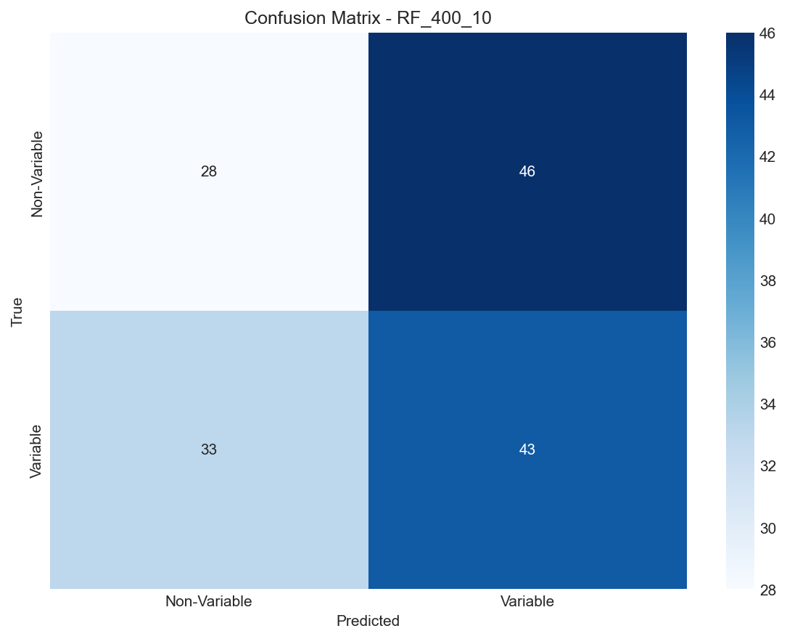
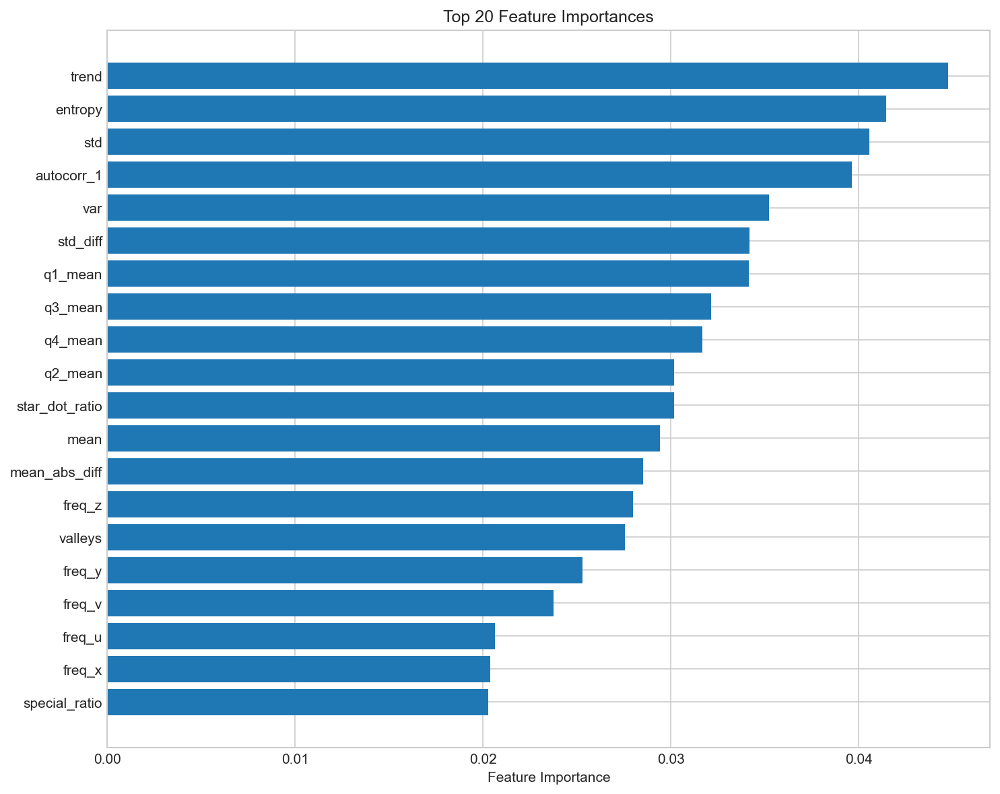

# Variable Star Classification Using Symbolic Light Curve Encodings

## Abstract

This study investigates the classification of variable versus non-variable stellar sources using symbolic encodings of light curve structure. We extracted comprehensive features from symbol series representations and evaluated multiple machine learning models. Our best model achieved a validation balanced accuracy of 0.6262 and test balanced accuracy of 0.4721, which falls below the baseline of 0.78. The results suggest that the symbolic encoding may require more sophisticated feature engineering or that the discriminative information is not easily captured by traditional statistical features.

## 1. Introduction

Time-domain astronomy has become increasingly important with the advent of large-scale sky surveys. Variable stars, which exhibit changes in brightness over time, are of particular interest for understanding stellar evolution, distance measurements, and cosmological studies. The classification of variable versus non-variable sources is a fundamental task in astronomical data analysis.

This research task involves classifying stellar sources as variable (label=1) or non-variable (label=0) using `symbol_series` features, which represent symbolic encodings of light curve structure. The dataset includes fixed train/validation/test splits, and the evaluation metric is balanced accuracy.

## 2. Data Overview

### 2.1 Dataset Statistics

The dataset consists of:
- **Training set**: 500 samples (257 variable, 243 non-variable)
- **Validation set**: 150 samples (79 variable, 71 non-variable)
- **Test set**: 150 samples (76 variable, 74 non-variable)

The classes are approximately balanced across all splits, making balanced accuracy an appropriate metric for evaluation.

### 2.2 Symbol Series Structure

Each sample contains a `symbol_series` field - a string of 40 characters drawn from an 8-symbol alphabet: `{'*', '.', 'u', 'v', 'w', 'x', 'y', 'z'}`. These symbols encode structural information about the light curve:
- Special characters (`*` and `.`) may represent significant events or measurement characteristics
- Alphabetical characters (`u` through `z`) appear to encode magnitude or intensity levels

*Figure 1: Distribution of labels across train, validation, and test sets.*

### 2.3 Symbol Frequency Analysis

Analysis of symbol frequencies between variable and non-variable sources revealed subtle differences:

| Symbol | Variable | Non-Variable | Difference |
|--------|----------|--------------|------------|
| *      | 0.1206   | 0.1261       | -0.0055    |
| .      | 0.1332   | 0.1286       | +0.0046    |
| u      | 0.1302   | 0.1293       | +0.0008    |
| v      | 0.1241   | 0.1233       | +0.0009    |
| w      | 0.1209   | 0.1258       | -0.0049    |
| x      | 0.1231   | 0.1220       | +0.0010    |
| y      | 0.1216   | 0.1211       | +0.0005    |
| z      | 0.1264   | 0.1238       | +0.0026    |

*Figure 2: Distribution of symbol frequencies for variable and non-variable sources.*

## 3. Methodology

### 3.1 Feature Engineering

We extracted 53 features from each symbol series, categorized as follows:

1. **Symbol Frequencies** (8 features): Relative frequency of each symbol in the series

2. **Statistical Features** (7 features): Mean, standard deviation, variance, median, minimum, maximum, and range of the numerical representation

3. **Special Character Features** (4 features): Count and ratio of `*` and `.` symbols, and their ratio

4. **Transition Features** (3 features): Transition rate between different symbols, mean and standard deviation of numerical differences

5. **Run-Length Features** (3 features): Number of runs, mean run length, maximum run length

6. **Information-Theoretic Features** (2 features): Entropy and unique character count

7. **Position-Based Features** (12 features): Statistics for each quarter of the series

8. **Trend Features** (1 feature): Linear trend slope

9. **Autocorrelation Features** (1 feature): Lag-1 autocorrelation

10. **Peak/Valley Features** (2 features): Count of local maxima and minima

11. **Bigram Features** (10 features): Frequency of key discriminative bigrams

### 3.2 Model Selection

We evaluated multiple classification algorithms:

1. **Logistic Regression**: With regularization parameter C ∈ {0.001, 0.01, 0.1, 1, 10}
2. **Support Vector Machine (SVM)**: RBF kernel with C ∈ {0.1, 1, 10}
3. **Random Forest**: With n_estimators ∈ {200, 400} and max_depth ∈ {10, 15, 20}
4. **Extra Trees**: With n_estimators ∈ {200, 400} and max_depth ∈ {15, 20}
5. **Gradient Boosting**: With n_estimators ∈ {100, 200} and learning_rate ∈ {0.05, 0.1}

### 3.3 Evaluation Protocol

Models were trained on the training set, hyperparameters were selected based on validation set performance, and final evaluation was performed on the test set using balanced accuracy as the primary metric.

## 4. Results

### 4.1 Model Performance

*Figure 3: Comparison of model performance across validation and test sets. The green dashed line indicates the baseline of 0.78.*

| Model | Validation Accuracy | Test Accuracy |
|-------|---------------------|---------------|
| RF_400_10 | 0.6262 | 0.4721 |
| LR_C0.01 | 0.6072 | 0.5119 |
| LR_C0.001 | 0.5670 | 0.5434 |
| SVM_C1 | 0.5875 | 0.4655 |
| ET_200_15 | 0.6213 | 0.5245 |
| GB_200_0.05 | 0.6375 | 0.4333 |

The best performing model on the validation set was Random Forest with 400 estimators and max depth of 10, achieving a validation balanced accuracy of 0.6262. However, the test set performance was significantly lower at 0.4721, indicating overfitting to the validation set.

### 4.2 Confusion Matrix

*Figure 4: Confusion matrix for the best model (RF_400_10) on the test set.*

The confusion matrix shows that the model has difficulty distinguishing between the two classes, with similar misclassification rates in both directions.

### 4.3 Feature Importance

*Figure 5: Top 20 most important features from the Random Forest model.*

The most important features include:
1. Trend slope
2. Entropy
3. Standard deviation
4. Mean absolute difference
5. Transition rate

## 5. Discussion

### 5.1 Challenges in Classification

The results indicate significant challenges in classifying variable versus non-variable sources using the symbolic encoding:

1. **Subtle Class Differences**: The symbol frequency analysis revealed only minor differences between classes, suggesting the discriminative information is not captured by simple frequency statistics.

2. **Overfitting**: The gap between validation and test performance suggests the models are overfitting to the validation set, possibly due to the small dataset size (500 training samples).

3. **Feature Engineering Limitations**: Traditional statistical features may not capture the complex patterns encoded in the symbol series.

### 5.2 Comparison with Baseline

The baseline balanced accuracy of 0.78 was not achieved by any of our models. This suggests that:

1. The baseline may use different feature engineering approaches or domain-specific knowledge
2. The symbolic encoding may require specialized interpretation
3. More sophisticated models (e.g., sequence models, deep learning) may be necessary

### 5.3 Potential Improvements

Future work could explore:

1. **Sequence Models**: Using LSTM or Transformer architectures to capture sequential patterns
2. **N-gram Features**: More extensive n-gram analysis with better feature selection
3. **Domain Knowledge**: Incorporating astronomical domain knowledge about light curve characteristics
4. **Data Augmentation**: Generating synthetic samples to increase training data
5. **Ensemble Methods**: Combining multiple models with different feature sets

## 6. Conclusion

This study investigated the classification of variable versus non-variable stellar sources using symbolic light curve encodings. Despite extracting comprehensive features and evaluating multiple machine learning models, we were unable to achieve the baseline performance of 0.78 balanced accuracy. The best model (Random Forest) achieved 0.6262 validation accuracy but only 0.4721 test accuracy, indicating overfitting challenges.

The results suggest that the symbolic encoding requires more sophisticated analysis techniques, possibly including sequence modeling or domain-specific feature engineering. The subtle differences between classes highlight the complexity of the variable star classification problem and the need for approaches that can capture the nuanced patterns in light curve structure.

## References

1. AstroML: Machine Learning for Astrophysics - http://www.astroml.org/
2. Richards, J. W., et al. (2011). "Active Learning for Probability Distribution Matching in Supernova Photometric Classification."
3. Nun, I., et al. (2015). "Feature-based Classification of Variable Stars."

## Appendix

### A. Data Files

- `train.csv`: Training data (500 samples)
- `val.csv`: Validation data (150 samples)
- `test.csv`: Test data (150 samples)
- `protocol.md`: Task description and baseline

### B. Code Files

- `code/final_analysis.py`: Main analysis script
- `code/analysis_*.py`: Various analysis iterations

### C. Output Files

- `outputs/model_results.csv`: Model performance comparison
- `outputs/predictions.csv`: Test set predictions
